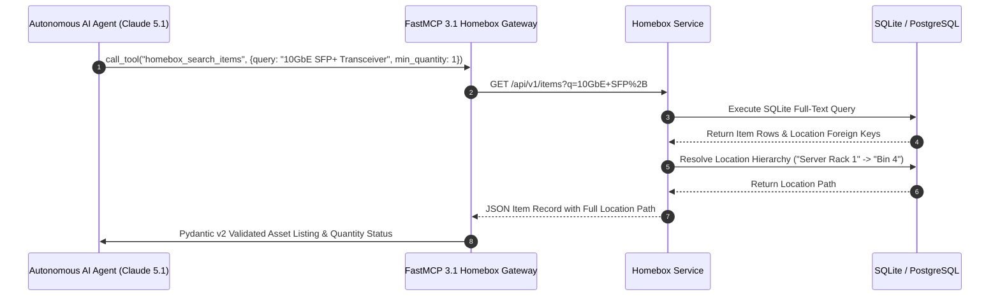

# Homebox

## What it is
Homebox is an open-source, highly efficient, self-hosted inventory and asset management system engineered specifically for home, homelab, garage, workshop, and small-office physical item tracking. Built in Go with an embedded Cgo-free SQLite database engine, Homebox provides an exceptionally low-latency, low-overhead platform for cataloging physical belongings, serial numbers, warranty terms, purchase locations, item maintenance logs, and hierarchical physical locations.

In early 2027 enterprise and autonomous homelab environments, Homebox serves as the central structured metadata store for physical asset intelligence. Featuring native integration with the **Model Context Protocol (FastMCP 3.1)**, Homebox empowers frontier autonomous AI reasoning models—including **Claude 5.1**, **Claude 5.6**, **GPT-5.5**, **GPT-5.6**, **Gemini 4.0 Pro/Ultra**, and **Llama 4**—to query physical inventory, locate tools and spare homelab parts, track hardware serial numbers, monitor warranty expiration schedules, and automate asset tracking during homelab maintenance tasks.

## What problem it solves
Managing physical belongings across multiple rooms, storage containers, garages, workshops, and off-site locations introduces significant operational friction:

1. **Disorganized Spreadsheets and Missing Metadata**: Spreadsheets lack schema enforcement, image attachment capabilities, hierarchical location relationships, barcode scanning triggers, and structured REST APIs.
2. **Homelab & Spare Parts Sprawl**: Server components, specialized cabling, optical transceivers, RAM DIMMs, hard drive trays, and spare microcontrollers become buried in unorganized bins without searchable metadata.
3. **Insurance & Warranty Loss**: In the event of property damage, theft, or hardware failure, locating purchase receipts, serial numbers, and warranty expiration dates is time-consuming without a centralized digital ledger.
4. **Agentic Knowledge Gap**: AI maintenance agents assisting with homelab deployments or hardware repairs cannot locate physical equipment without structured tool access to real-time inventory records.

Homebox resolves these issues by pairing a high-performance, mobile-responsive web UI with a machine-readable REST API and FastMCP 3.1 tool server. It structures assets into a nested tree of locations (e.g., `Garage` -> `Workbench` -> `Toolbox B` -> `Drawer 3`), maps barcodes, attaches PDF receipts (cross-referenced with **Paperless-ngx**), and exposes schema-validated search tools to both human operators and autonomous agents.

```mermaid
graph TD
    subgraph Client & Agent Layer
        AI[AI Agent / Claude 5.1 FastMCP 3.1]
        WEB[Mobile & Desktop Web UI]
        BARCODE[Handheld / Smartphone Barcode Scanner]
    end

    subgraph Homebox Core Engine (Go Container)
        API[REST / MCP API Router]
        AUTH[JWT / OIDC / Session Auth]
        ORMM[Go GORM Data Access Layer]
        SEARCH[In-Memory Full-Text Search Engine]
    end

    subgraph Physical Metadata & Storage Layer
        DB[(SQLite Embedded DB / PostgreSQL)]
        STORAGE[Local / S3 Attachment File Store]
    end

    subgraph Complementary Ecosystem
        PAPERLESS[Paperless-ngx Receipt Archival]
        IMMICH[Immich Visual Photo Vault]
    end

    AI -->|FastMCP Tool Call| API
    WEB -->|HTTPS / REST API| API
    BARCODE -->|BarCode CSV / Camera Stream| API

    API --> AUTH
    AUTH --> ORMM
    ORMM --> SEARCH
    ORMM --> DB
    API --> STORAGE

    STORAGE -.-|Receipt Deep Links| PAPERLESS
    STORAGE -.-|High-Res Photo Deep Links| IMMICH
```

## Where it fits in the stack
**Category**: Service / Physical Asset & Inventory Management.

Homebox occupies the **physical asset intelligence layer** within a homelab or enterprise infrastructure environment. It links digital configuration management tools (like Ansible or NetBox) with physical reality:

- **Network Topology**: Deployed as an internal web service behind reverse proxies (Traefik, Caddy) or zero-trust overlay networks (Tailscale, Cloudflare Tunnels).
- **Storage Topology**: Operates by default with an embedded SQLite database (`homebox.db`) stored on persistent fast storage (NVMe/SSD), or optionally connected to an external PostgreSQL instance for multi-instance high-availability deployments.
- **Integration Layer**: Cross-linked with [Paperless-ngx](paperless-ngx.md) for long-term digital receipt storage via attachment URLs, [Immich](immich.md) for media storage, and [n8n](n8n.md) for automated warranty alert workflows.



## Typical use cases

1. **Homelab Hardware & Component Tracking**:
   Cataloging CPUs, RAM modules, expansion cards, hard drives, cables, and rack-mount hardware with exact serial numbers, MAC addresses, purchase prices, and storage bin locations.

2. **Automated Agentic Tool Discovery via FastMCP 3.1**:
   Allowing Claude 5.1 or GPT-5.5 agents to query `homebox_search_items` to locate specific tools, connectors, or spare parts before outputting homelab maintenance guides.

3. **Insurance Documentation & Property Claims**:
   Maintaining a complete catalog of electronics, furniture, tools, and high-value items complete with purchase dates, original receipts, serial numbers, and estimated values for disaster recovery or insurance audits.

4. **Garage & Workshop Bin Organization with Barcodes**:
   Generating and affixing QR/Barcode labels to storage containers, allowing rapid scanning via smartphone or handheld scanner to instantly view container contents or relocate items.

5. **Warranty & Maintenance Expiration Tracking**:
   Recording warranty expiration dates and automated renewal or inspection schedules, triggering webhook alerts in **n8n** or **Matrix/Slack** prior to warranty expiration.

## Strengths

- **Ultra-Lightweight & Blazing Fast**: Compiled native Go executable delivering single-digit millisecond response times while consuming under 30MB of RAM.
- **Zero-Dependency SQLite Backend**: Extremely easy migration, backup, and restore—copying a single `homebox.db` file completely captures the system state.
- **Hierarchical Location Tree**: Arbitrarily deep location nesting allows accurate mapping of physical spaces (e.g., `Home -> Garage -> Storage Cabinet 2 -> Shelf B -> Container 14`).
- **Native CSV Import & Export**: Full bulk export/import support for seamless migration from legacy spreadsheets or integration with external inventory tools.
- **OpenID Connect (OIDC) & SSO Ready**: Native support for Authentik, Authelia, Keycloak, and OAuth2 identity providers.
- **FastMCP 3.1 Bridge Ready**: Clean, RESTful endpoint structure allows seamless exposure of asset queries to LLMs.

## Limitations

- **No Native POS or Real-Time E-Commerce Sync**: Designed strictly for inventory management; does not include sales order management, customer billing, or point-of-sale functionality.
- **Basic Internal Photo Processing**: Attachments are stored directly on filesystem/S3 without extensive image transformation capabilities (use [Immich](immich.md) for professional media handling).
- **Simple Role-Based Access Control**: Standard multi-user support exists, but fine-grained per-location or per-item ACL permissions are limited compared to enterprise ERPs.

## When to use it

- When you require a clean, responsive, and ultra-fast inventory tracking system for physical assets.
- When organizing complex homelabs, workshops, garages, libraries, or home storage.
- When building AI agent workflows that require real-time knowledge of physical spare parts availability.
- When you prefer a self-contained, low-maintenance Go application over heavy enterprise ERP solutions.

## When not to use it

- For tracking consumable food items, expiration dates, and meal planning (evaluate [Grocy](grocy.md) instead).
- For large-scale multi-tenant commercial distribution centers requiring real-time warehouse picking routes.
- For tracking digital software licenses or bookmarks (use [Linkwarden](linkwarden.md) or [Gitea](gitea.md)).

## Getting started

### Enterprise Production Docker Compose Deployment

Below is a production Docker Compose configuration including persistent SQLite storage, OIDC single sign-on integration, and automatic backups.

```yaml
version: "3.8"

networks:
  homebox-net:
    driver: bridge

services:
  homebox:
    image: ghcr.io/sysadminsmedia/homebox:latest
    container_name: homebox
    restart: unless-stopped
    environment:
      - HBOX_MODE=production
      - HBOX_WEB_PORT=7745
      - HBOX_OPTIONS_ALLOW_REGISTRATION=false
      - HBOX_STORAGE_SQLITE_FILENAME=/data/homebox.db
      - TZ=Etc/UTC
      # Optional OIDC / Authentik Configuration
      # - HBOX_OIDC_ENABLED=true
      # - HBOX_OIDC_ISSUER=https://auth.example.com/application/o/homebox/
      # - HBOX_OIDC_CLIENT_ID=homebox-client-id
      # - HBOX_OIDC_CLIENT_SECRET=your-oidc-secret
    volumes:
      - ./homebox-data:/data
    ports:
      - "3100:7745"
    networks:
      - homebox-net
    healthcheck:
      test: ["CMD", "wget", "--no-verbose", "--tries=1", "--spider", "http://localhost:7745/api/v1/health"]
      interval: 30s
      timeout: 5s
      retries: 3
```

### Initial Setup & CLI Quickstart

1. Launch container: `docker compose up -d`.
2. Navigate to `http://<HOST-IP>:3100` and complete the initial administrator account creation.
3. Define root locations (e.g., `Main House`, `Garage`, `Server Rack`).
4. Generate an API token under **User Settings -> API Keys** for FastMCP 3.1 or CLI script authentication.

## CLI examples

```bash
# Verify Homebox container execution and health
docker exec homebox wget -qO- http://localhost:7745/api/v1/health

# Perform a hot backup of the SQLite database
docker exec homebox sqlite3 /data/homebox.db ".backup '/data/homebox-backup-$(date +%F).sqlite'"

# Extract total inventory count directly via SQLite CLI
docker exec homebox sqlite3 /data/homebox.db "SELECT count(*) FROM items;"

# Inspect location hierarchy stored in database
docker exec homebox sqlite3 /data/homebox.db "SELECT id, name, parent_id FROM locations;"

# Vacuum and optimize SQLite database indices
docker exec homebox sqlite3 /data/homebox.db "VACUUM; REINDEX;"
```

## API examples

### FastMCP 3.1 Homebox Inventory Server & Pydantic v2 Schema

The Python script below implements a **FastMCP 3.1** server that wraps Homebox's REST API, enabling AI models to search for items, inspect locations, and validate items using **Pydantic v2**.

```python
import os
from typing import List, Optional
import requests
from pydantic import BaseModel, Field, HttpUrl
from mcp.server.fastmcp import FastMCP

# Initialize FastMCP 3.1 Server for Homebox
mcp = FastMCP("Homebox-Asset-Manager", version="3.1.0")

HOMEBOX_URL = os.getenv("HOMEBOX_URL", "http://localhost:3100")
HOMEBOX_API_KEY = os.getenv("HOMEBOX_API_KEY", "your-homebox-api-key")

# --- Pydantic v2 Data Schemas ---

class LocationSchema(BaseModel):
    id: str = Field(..., description="Unique Location ID")
    name: str = Field(..., description="Name of the physical location")
    description: Optional[str] = Field(None, description="Location details")

class AssetFieldSchema(BaseModel):
    name: str
    value: str

class HomeboxItem(BaseModel):
    id: str = Field(..., description="Unique item ID")
    name: str = Field(..., description="Name of the item")
    description: Optional[str] = Field(None, description="Detailed item description")
    quantity: int = Field(1, description="Quantity on hand")
    serial_number: Optional[str] = Field(None, alias="serialNumber", description="Serial number")
    model_number: Optional[str] = Field(None, alias="modelNumber", description="Model number")
    manufacturer: Optional[str] = Field(None, description="Manufacturer / Brand")
    purchase_price: Optional[float] = Field(None, alias="purchasePrice", description="Purchase price")
    location: Optional[LocationSchema] = Field(None, description="Current assigned location")
    custom_fields: List[AssetFieldSchema] = Field(default_factory=list, description="Custom metadata attributes")

class InventorySearchResponse(BaseModel):
    query: str
    count: int
    items: List[HomeboxItem]


# --- FastMCP 3.1 Tools ---

@mcp.tool(
    name="homebox_search_items",
    description="Search Homebox physical inventory items by query string with full location details."
)
def homebox_search_items(query: str, min_quantity: int = 0) -> str:
    """Execute a search query against Homebox and return Pydantic v2 validated results."""
    endpoint = f"{HOMEBOX_URL}/api/v1/items"
    headers = {
        "Authorization": f"Bearer {HOMEBOX_API_KEY}",
        "Content-Type": "application/json"
    }
    params = {"q": query}

    try:
        response = requests.get(endpoint, headers=headers, params=params, timeout=10)
        response.raise_for_status()
        raw_data = response.json()

        # Handle list or nested payload structures
        item_list = raw_data if isinstance(raw_data, list) else raw_data.get("items", [])

        validated_items: List[HomeboxItem] = []
        for raw in item_list:
            try:
                item = HomeboxItem.model_validate(raw)
                if item.quantity >= min_quantity:
                    validated_items.append(item)
            except Exception as val_err:
                continue

        search_resp = InventorySearchResponse(
            query=query,
            count=len(validated_items),
            items=validated_items
        )
        return search_resp.model_dump_json(indent=2)

    except requests.RequestException as req_err:
        return f"Error contacting Homebox API: {str(req_err)}"


@mcp.tool(
    name="homebox_get_location_tree",
    description="Retrieve full physical location hierarchy tree from Homebox."
)
def homebox_get_location_tree() -> str:
    """Fetch all configured storage locations."""
    endpoint = f"{HOMEBOX_URL}/api/v1/locations"
    headers = {"Authorization": f"Bearer {HOMEBOX_API_KEY}"}

    try:
        resp = requests.get(endpoint, headers=headers, timeout=10)
        resp.raise_for_status()
        return resp.text
    except Exception as ex:
        return f"Failed to retrieve locations: {str(ex)}"


if __name__ == "__main__":
    mcp.run()
```

## Related tools / concepts

- [Grocy](grocy.md) — ERP system tailored for household groceries and consumable expiration tracking.
- [Paperless-ngx](paperless-ngx.md) — Document archival platform for storing digital receipts linked to Homebox items.
- [Immich](immich.md) — Self-hosted photo management system for asset photography.
- NetBox — IPAM and DCIM infrastructure tool for digital server rack mapping.
- [Tailscale](tailscale.md) — Secure, encrypted mesh network access to Homebox from mobile devices.
- [Authentik](authentik.md) — Single sign-on and identity provider integration.

## Sources / references

- [Homebox Official Website](https://homebox.software/)
- [Homebox GitHub Repository](https://github.com/sysadminsmedia/homebox)
- [Homebox REST API Specification & OpenAPI Docs](https://homebox.software/en/docs/api/)
- [FastMCP 3.1 & Model Context Protocol Docs](https://modelcontextprotocol.io/protocol/tasks)

## Contribution Metadata
- Last reviewed: 2027-01-07
- Confidence: high
