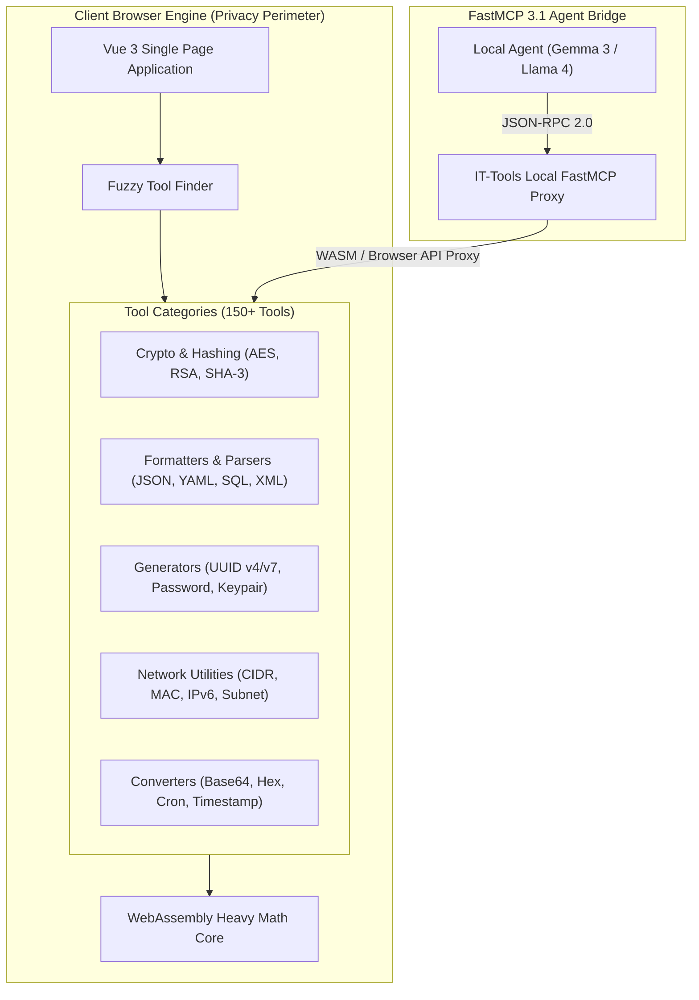

# IT-Tools

A comprehensive suite of web-based developer utilities including formatters, generators, converters, and cryptographic helpers, designed to run entirely in the client's browser as of early January 2027.

## What it is
IT-Tools is an open-source, client-side utility suite for software engineers, systems administrators, and security professionals. As of **early January 2027**, it features over 150 specialized tools, including JWT debuggers, CRON parsers, asymmetric key generators, network CIDR calculators, and advanced cryptographic converters. It is designed to be lightweight, searchable, offline-capable, and privacy-first. With modern **FastMCP 3.1** agent extensions, IT-Tools can serve both as a self-hosted web UI for human operators and as a client-side execution baseline for autonomous developer agents operating under local **Gemma 3** or **Llama 4** models.



## What problem it solves
In software development and operations, engineers constantly need quick utilities to format messy payloads, decode JWT claims, calculate subnet ranges, convert Unix timestamps, or generate test credentials. Relying on public online converter websites introduces major security and compliance risks, as sensitive payloads (API keys, customer PII, internal tokens, or database connection strings) can be logged by third-party servers.

IT-Tools solves this problem by centralizing all utility functions into a single, lightning-fast web interface where 100% of data processing occurs locally within the user's browser runtime. Sensitive data never leaves the client network, eliminating accidental data exposure risks while delivering zero-latency operations even in air-gapped environments.

## Where it fits in the stack
IT-Tools occupies the **Client-Side Utility Service Layer** within a self-hosted homelab, enterprise intranet, or developer workstation environment.

- **Frontend Technology**: Vue 3, Vite, Tailwind CSS, Naive UI.
- **Execution Model**: Single Page Application (SPA) compiled to static assets (HTML, CSS, JS, WASM).
- **Deployment Layer**: Containerized static HTTP server (Nginx/Caddy) deployed via Docker, Kubernetes, or TrueNAS SCALE.
- **Agent Integration**: Exposed to local AI agents via a lightweight FastMCP 3.1 adapter that executes utility logic via NodeJS / WASM headless runtimes.

## Typical use cases

### 1. Secure Token and Credential Inspection
- **JWT Debugging**: Inspecting claims, expiration dates, and signatures of OAuth2/OIDC tokens without transmitting tokens over public HTTP networks.
- **Key Generation**: Generating high-entropy RSA, ECDSA, or Ed25519 keypairs and secure passwords for environment configuration files.

### 2. Payload Formatting and Conversion
- **JSON / SQL / XML Sanitization**: Formatting complex, minified API responses or logs into structured tree views for debugging.
- **Encoding Conversions**: Bidirectional conversion between Base64, Base32, Hex, URL-encoded strings, and binary streams.

### 3. Systems Administration and Networking
- **CRON Schedule Evaluation**: Parsing human-readable execution schedules and predicting upcoming execution windows for system automation.
- **Subnet Calculation**: Calculating IPv4/IPv6 CIDR ranges, network masks, broadcast addresses, and usable host counts during network topology planning.

### 4. Agentic Data Pipeline Cleaning
- **Pre-Processing Inputs**: Local agents utilizing IT-Tools algorithm specifications to validate and format structured JSON before injecting into local vector stores or RAG pipelines.

## Strengths
- **Privacy-First Zero-Trust Architecture**: All processing logic runs inside the client browser. No telemetry or payload transmission occurs.
- **Sub-Millisecond Responsiveness**: Instant fuzzy search and UI reactivity powered by Vue 3 and Vite.
- **Air-Gap Capability**: Once loaded into browser cache or self-hosted locally, functions run without active internet connections.
- **Extensive Tool Coverage**: Over 150 specialized tools in a single unified UI, replacing dozens of single-purpose web bookmarks.
- **Resource Efficiency**: Extremely low host server requirements (<30MB RAM container footprint) as processing is offloaded to the user's client machine.

## Limitations
- **Browser Memory Constraints**: Processing extremely large datasets (e.g., >100MB minified JSON files) can cause client browser tab crashes.
- **Interactive UI Bias**: Out-of-the-box installation is optimized for interactive human use; CLI and API automation require additional wrapper tools or FastMCP server bridges.
- **Client Processing Limits**: Heavy cryptographic ops (e.g., high-iteration PBKDF2 or large key generation) depend directly on the client machine's CPU speed.

## When to use it
- When handling production secrets, API credentials, or PII that must remain within local trust boundaries.
- When working in restricted, air-gapped, or low-bandwidth network environments.
- When looking for a consolidated developer utility dashboard for internal team or enterprise deployment.

## When not to use it
- For batch CLI data transformations at scale (use standard Linux CLI tools like `jq`, `openssl`, or `awk` instead).
- When persistent database storage or team collaborative sharing is required (use [Nextcloud](nextcloud.md) or [Gitea](gitea.md)).
- When real-time system monitoring or log aggregation is needed (use [Grafana Loki](../tools/process_understanding/grafana-loki.md) or [Logfire](../tools/process_understanding/logfire.md)).

## Getting started

### Production Docker Deployment
Deploy IT-Tools as a lightweight Nginx container behind an enterprise reverse proxy (e.g., Traefik or Caddy):

```bash
docker run -d \
  --name it-tools \
  --restart unless-stopped \
  -p 8080:80 \
  --read-only \
  --tmpfs /tmp:rw,noexec,nosuid \
  --tmpfs /var/cache/nginx:rw,noexec,nosuid \
  --tmpfs /var/run:rw,noexec,nosuid \
  corentinth/it-tools:latest
```

### Docker Compose Stack with HTTPS Proxy
```yaml
version: '3.8'

services:
  it-tools:
    image: corentinth/it-tools:latest
    container_name: it-tools
    restart: unless-stopped
    ports:
      - "8080:80"
    environment:
      - NGINX_PORT=80
    security_opt:
      - no-new-privileges:true
    resources:
      limits:
        cpus: '0.50'
        memory: 256M
      reservations:
        cpus: '0.10'
        memory: 64M
```

### TrueNAS SCALE Installation
1. Navigate to **Apps** -> **Discover Apps** -> **Custom App**.
2. Application Name: `it-tools`.
3. Image repository: `corentinth/it-tools`, Tag: `latest`.
4. Port Forwarding: Host Port `30080` -> Container Port `80`.
5. CPU Limit: `0.5 Cores`, Memory Limit: `512 MiB`.

## CLI examples

### Lifecycle Management and Version Auditing
```bash
# Verify running image tag and build metadata
docker inspect --format='Version: {{index .Config.Labels "org.opencontainers.image.version"}}' it-tools

# Perform non-destructive container health probe
curl -sI http://localhost:8080 | head -n 5

# Check Nginx access logs to verify client requests
docker logs --tail 20 it-tools
```

### Scripted Verification of Service Readiness
```bash
#!/usr/bin/env bash
set -euo pipefail

ENDPOINT="http://localhost:8080"
STATUS_CODE=$(curl -s -o /dev/null -w "%{http_code}" "${ENDPOINT}")

if [ "$STATUS_CODE" -eq 200 ]; then
    echo "[OK] IT-Tools static server is healthy (HTTP 200)."
else
    echo "[ERROR] IT-Tools unreachable at ${ENDPOINT} (HTTP ${STATUS_CODE})."
    exit 1
fi
```

## API examples

While IT-Tools itself is a static web application, local agents interact with IT-Tools utilities via a **FastMCP 3.1 Server** wrapper in Python. This pattern enables local LLMs (e.g., Gemma 3 or Llama 4) to invoke offline formatting and cryptographic calculation tools safely.

### FastMCP 3.1 Integration Server: IT-Tools Gateway
The following Python implementation registers IT-Tools utilities as Model Context Protocol 3.1 tools:

```python
import json
import base64
import hashlib
from typing import Dict, Any
from mcp.server.fastmcp import FastMCP
from pydantic import BaseModel, Field, ConfigDict

# Initialize FastMCP 3.1 Server
mcp = FastMCP(
    name="IT-Tools Agent Gateway",
    version="3.1.0",
    description="Exposes local offline developer utility routines for autonomous agents"
)

# Pydantic v2 validation models
class JWTDecodeRequest(BaseModel):
    model_config = ConfigDict(extra="forbid")
    token: str = Field(..., description="Encoded JWT string (header.payload.signature)")

class JWTDecodeResponse(BaseModel):
    header: Dict[str, Any] = Field(..., description="Decoded JWT header")
    payload: Dict[str, Any] = Field(..., description="Decoded JWT claims payload")
    signature_present: bool = Field(..., description="Whether a signature block exists")

class SubnetCalcRequest(BaseModel):
    model_config = ConfigDict(extra="forbid")
    cidr: str = Field(..., description="IPv4 CIDR block (e.g. 192.168.1.0/24)")

class SubnetCalcResponse(BaseModel):
    network_address: str
    netmask: str
    broadcast_address: str
    total_hosts: int

@mcp.tool(
    name="it_tools_jwt_decode",
    description="Decodes JWT tokens locally without external HTTP calls"
)

def jwt_decode_tool(payload: JWTDecodeRequest) -> JWTDecodeResponse:
    parts = payload.token.split(".")
    if len(parts) < 2:
        raise ValueError("Invalid JWT token format. Must contain at least header and payload.")

    def _pad_base64(data: str) -> bytes:
        missing_padding = len(data) % 4
        if missing_padding:
            data += "=" * (4 - missing_padding)
        return base64.urlsafe_bdecode(data)

    header_json = json.loads(_pad_base64(parts[0]).decode("utf-8"))
    payload_json = json.loads(_pad_base64(parts[1]).decode("utf-8"))

    return JWTDecodeResponse(
        header=header_json,
        payload=payload_json,
        signature_present=len(parts) == 3 and len(parts[2]) > 0
    )

@mcp.tool(
    name="it_tools_hash_generator",
    description="Generates SHA-256 and SHA-512 hashes locally for verification"
)
def hash_generator_tool(text: str) -> Dict[str, str]:
    data = text.encode("utf-8")
    return {
        "sha256": hashlib.sha256(data).hexdigest(),
        "sha512": hashlib.sha512(data).hexdigest(),
        "md5": hashlib.md5(data).hexdigest()
    }

if __name__ == "__main__":
    mcp.run()
```

### Pydantic v2 Deployment Configuration Validator
Use this validation script to verify deployment settings before spinning up IT-Tools instances:

```python
from pydantic import BaseModel, HttpUrl, Field, field_validator
from typing import Optional, List

class ITToolsDeploymentSpec(BaseModel):
    service_name: str = Field(default="it-tools", description="Docker container or service identifier")
    endpoint_url: HttpUrl = Field(..., description="Internal reachable URL")
    port: int = Field(default=8080, ge=1, le=65535)
    allowed_cidrs: List[str] = Field(default_factory=lambda: ["127.0.0.1/32", "10.0.0.0/8"])
    enable_wasm: bool = Field(default=True, description="Enable WebAssembly for heavy crypto tasks")

    @field_validator("allowed_cidrs")
    @classmethod
    def validate_cidrs(cls, cidrs: List[str]) -> List[str]:
        for cidr in cidrs:
            if "/" not in cidr:
                raise ValueError(f"Invalid CIDR format: {cidr}")
        return cidrs

# Example Usage
if __name__ == "__main__":
    config = ITToolsDeploymentSpec(
        endpoint_url="http://192.168.1.150:8080",
        port=8080
    )
    print("Deployment specification validated successfully:", config.model_dump_json(indent=2))
```

## Related tools / concepts
- [Omni Tools](omni-tools.md) — Alternative browser-based utility collection with media handling capabilities.
- [SearXNG](searXNG.md) — Privacy-focused meta search engine for self-hosted developer toolchains.
- [Gitea](gitea.md) — Lightweight self-hosted Git service.
- [Authentik](authentik.md) — SSO identity provider for securing access to internal dashboards.
- [Nextcloud](nextcloud.md) — Enterprise storage and file collaboration platform.
- [Paperless-ngx](paperless-ngx.md) — Document archival system for processing formatted records.
- [FastMCP 3.1](../tools/automation_orchestration/mcp.md) — Model Context Protocol implementation for connecting local agents to offline utilities.
- [Gemma 3](../tools/ai_knowledge/local_llms.md) — Lightweight open weights model optimized for local developer workflows.

## Sources / References
- [IT-Tools Official Portal](https://it-tools.tech/)
- [IT-Tools GitHub Repository](https://github.com/CorentinTh/it-tools)
- [Docker Hub Official Image (corentinth/it-tools)](https://hub.docker.com/r/corentinth/it-tools)
- [Model Context Protocol Specification v3.1](https://modelcontextprotocol.org/spec)

## Contribution Metadata
- Last reviewed: 2027-01-07
- Confidence: high
