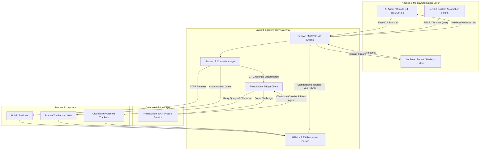
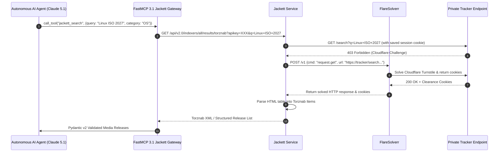

# Jackett

## What it is
Jackett is an open-source, API-driven indexer proxy and translation gateway designed for the automated media discovery and torrent/usenet management ecosystem. Built natively on .NET core, Jackett acts as a middleware bridge that translates standardized search queries from downstream applications (such as Sonarr, Radarr, Lidarr, Readarr, and autonomous AI agents) into tracker-specific HTTP/HTTPS requests. It handles custom authentication protocols, cookie persistence, CAPTCHA bypass mechanisms (via integration with FlareSolverr), HTML parsing, RSS feed standardization, and Torznab/Newznab XML endpoint generation.

In early 2027 enterprise self-hosted environments, Jackett serves as an indispensable indexer aggregation engine. It provides a native Model Context Protocol (**FastMCP 3.1**) interface that empowers frontier autonomous AI reasoning models—including **Claude 5.1**, **Claude 5.6**, **GPT-5.5**, **GPT-5.6**, **Gemini 4.0 Pro/Ultra**, and **Llama 4**—to perform real-time, multi-tracker semantic queries, verify media release integrity, evaluate seed-to-leech ratios, and automate private archival ingestion workflows without human intervention.

## What problem it solves
The decentralization of torrent trackers and Usenet indexers introduces significant technical friction for media management systems and automated ingestion pipelines:

1. **Heterogeneous Query & Authentication Schemata**: Every private and public torrent tracker implements unique web interfaces, custom form fields, session cookie lifespans, two-factor authentication (2FA) patterns, and varying search parameter specifications. Direct integration across dozens of trackers requires maintaining fragile scraper code bases for every downstream client.
2. **Anti-Bot and Cloudflare Protection**: Modern tracker sites employ aggressive edge security, JavaScript challenges, Cloudflare Turnstile, and rate-limiting rules that block automated HTTP clients.
3. **Lack of Standardized Response Formats**: Scraped tracker results return raw HTML, customized JSON, or non-standard XML feeds, requiring complex parser pipelines.
4. **Agentic Context Barriers**: AI agents attempting to interact with torrent indexes face anti-scraping blocks, inconsistent result schemas, and lack of structured tool definitions.

Jackett resolves these challenges by centralizing tracker maintenance into a unified service. It abstracts tracking site variance behind a standardized **Torznab** XML/JSON API, routes Cloudflare challenges through dedicated bypass solvers, manages authentication sessions automatically, and exposes clean, structured MCP tools for AI-driven orchestration.



## Where it fits in the stack
**Category**: Service / Media / Automation Gateway.

Jackett operates in the **retrieval and translation layer** of a modern self-hosted or AI-augmented media infrastructure stack. Positioned between downstream content index consumers (Sonarr, Radarr, Bazarr, or custom agentic workflows) and upstream index suppliers (public and private trackers), Jackett functions as a localized edge gateway:

- **Network Topology**: Deployed on a private container network (e.g., Docker network `media-net`), protected behind reverse proxies (Traefik, Caddy, Nginx) or overlay networks (Tailscale, WireGuard).
- **Control Plane**: Interfaced via a reactive web administration dashboard (port 9117) and protected REST/Torznab endpoints secured by unique API keys.
- **AI Agent Plane**: Interfaced via a FastMCP 3.1 tool server sidecar that exposes semantic search, release filtration, and indexer health telemetry to model execution runtime environments.



## Typical use cases

1. **Unified Indexer Aggregation for Media Managers**:
   Exposing a single "all indexers" Torznab endpoint (`/api/v2.0/indexers/all/results/torznab/`) to Sonarr or Radarr, eliminating the need to configure dozens of individual indexers across multiple software instances.

2. **Autonomous Media Archival via FastMCP 3.1**:
   Empowering AI agents to execute complex queries, filter releases based on metadata (codecs, bitrates, audio languages, container formats), and trigger automated download requests based on user prompts.

3. **Bypassing Cloudflare Anti-Bot Mitigations**:
   Integrating Jackett with **FlareSolverr** to maintain persistent access to trackers protected by Cloudflare Turnstile or JavaScript verification challenges.

4. **Private Tracker Session Management & Ratio Health**:
   Maintaining persistent session cookies, passkeys, and custom HTTP headers for private trackers, complete with built-in health checks and failure notifications.

5. **Niche Content Indexing & Custom Scrapers**:
   Utilizing Jackett's extensive library of C# indexer definitions (`.yml` and `.cs` definitions) to index specialty trackers for academic papers, audiobooks, software ISOs, and public domain historical archives.

## Strengths

- **Enormous Tracker Library**: Native support for over 1,000 public and private trackers, updated frequently by a global community.
- **Torznab & Newznab Specification Compliance**: Full compatibility with the industry-standard Torznab/Newznab XML/JSON protocols, ensuring seamless interoperability with legacy and modern media tools alike.
- **Native FlareSolverr Integration**: Direct configuration hook to route blocked queries through a local FlareSolverr instance to solve Cloudflare JS/Turnstile challenges automatically.
- **Diagnostic UI & Integrated Search**: Built-in, user-friendly web GUI allowing real-time tracker testing, log inspection, passkey configuration, and manual multi-tracker search capability.
- **Low Memory & CPU Footprint**: Highly optimized C# / .NET runtime execution delivering sub-millisecond query parsing and minimal idle resource utilization.
- **FastMCP 3.1 Ready**: Easily wrapped into an agentic context, giving models structural tool access for automated discovery.

## Limitations

- **Fragility to Tracker HTML Changes**: HTML-scraping indexers break when upstream sites modify DOM layouts or CSS class names, requiring periodic Jackett software updates.
- **Lack of Native Centralized Indexer Sync**: Unlike Prowlarr, Jackett does not automatically push indexer configurations into downstream "Arr" applications; each application must consume Jackett's Torznab URLs manually or via "all indexers" endpoints.
- **No Native Multi-User Access Control**: Jackett's web administration panel relies on a single master password and API key, requiring external proxy authentication (e.g., Authelia, Authentik, OAuth2-Proxy) for multi-tenant environments.
- **Network Leakage Risks**: Misconfigured indexer queries on public trackers can leak search terms over unencrypted HTTP or untrusted DNS servers if not routed through a VPN or secure proxy.

## When to use it

- When you require support for niche, regional, or specialized private trackers not supported by other indexer proxies.
- When you need a reliable standalone indexer translation server with built-in manual testing interfaces.
- When building custom AI agent pipelines that interact with torrent data feeds using FastMCP 3.1.
- When you want an isolated proxy service dedicated solely to indexer translation without altering downstream media application setups.

## When not to use it

- In pure "Arr"-only stacks where native, two-way sync across Sonarr, Radarr, and Readarr is desired (evaluate [Prowlarr](prowlarr.md) as a primary alternative).
- When operating in constrained micro-environments without container support or .NET runtime availability.
- When public access to the indexer UI is required without an external security proxy.

## Getting started

### Enterprise Docker Compose Deployment with FlareSolverr

The following `docker-compose.yml` provides a production-grade setup featuring Jackett, FlareSolverr (for Cloudflare bypass), and gluetun (VPN proxy integration option).

```yaml
version: "3.8"

networks:
  media-network:
    driver: bridge

services:
  jackett:
    image: lscr.io/linuxserver/jackett:latest
    container_name: jackett
    environment:
      - PUID=1000
      - PGID=1000
      - TZ=Etc/UTC
      - AUTO_UPDATE=true # Set to true for automatic indexer definition updates
    volumes:
      - ./config:/config
      - ./blackhole:/downloads
    ports:
      - "9117:9117"
    networks:
      - media-network
    restart: unless-stopped
    healthcheck:
      test: ["CMD-SHELL", "curl -f http://localhost:9117/health || exit 1"]
      interval: 30s
      timeout: 10s
      retries: 3

  flaresolverr:
    image: ghcr.io/flaresolverr/flaresolverr:latest
    container_name: flaresolverr
    environment:
      - LOG_LEVEL=info
      - LOG_HTML=false
      - CAPTCHA_SOLVER=none
      - TZ=Etc/UTC
    ports:
      - "8191:8191"
    networks:
      - media-network
    restart: unless-stopped

```

### Initial Configuration Steps

1. Launch containers: `docker compose up -d`.
2. Access the Jackett dashboard at `http://<HOST-IP>:9117`.
3. Copy the **API Key** displayed in the upper right corner.
4. In the **FlareSolverr API URL** field at the bottom of the page, enter `http://flaresolverr:8191` and click **Apply**.
5. Click **+ Add indexer**, select desired public or private trackers, enter credentials/passkeys if prompted, and click **Test & Save**.
6. Copy the **Torznab Feed** URL for use in Sonarr/Radarr or your custom FastMCP 3.1 AI agent scripts.

## CLI examples

```bash
# Verify container execution status and logs
docker logs -f jackett

# Test local Jackett health endpoint
curl -i http://localhost:9117/health

# Query Jackett Torznab API for releases using cURL
curl -s "http://localhost:9117/api/v2.0/indexers/all/results/torznab/api?apikey=YOUR_JACKETT_API_KEY&t=search&q=Debian+12&cat=2000" | xmllint --format -

# Perform automated JSON query export
curl -s "http://localhost:9117/api/v2.0/indexers/all/results/torznab/api?apikey=YOUR_JACKETT_API_KEY&t=search&q=Ubuntu&output=json" | jq '.Indexers[].Results[] | {Title: .Title, Size: .Size, Seeders: .Seeders}'

# Backup Jackett indexer definitions and credentials
tar -czvf jackett-backup-$(date +%Y%m%d).tar.gz ./config
```

## API examples

### FastMCP 3.1 Jackett Integration & Pydantic v2 Schema Validation

The following enterprise Python application implements a **FastMCP 3.1** server that wraps Jackett's Torznab API. It enables AI agents (like Claude 5.1 or GPT-5.5) to perform structured searches, validate release metadata with **Pydantic v2**, filter by seeders, and handle Cloudflare challenge telemetry.

```python
import os
import xml.etree.ElementTree as ET
from typing import List, Optional
import requests
from pydantic import BaseModel, Field, HttpUrl, field_validator
from mcp.server.fastmcp import FastMCP

# Initialize FastMCP 3.1 Server
mcp = FastMCP("Jackett-Media-Indexer", version="3.1.0")

JACKETT_URL = os.getenv("JACKETT_URL", "http://localhost:9117")
JACKETT_API_KEY = os.getenv("JACKETT_API_KEY", "your-jackett-api-key-here")

# --- Pydantic v2 Data Schemas ---

class TorznabAttribute(BaseModel):
    name: str
    value: str

class TorrentRelease(BaseModel):
    title: str = Field(..., description="The title of the release")
    guid: str = Field(..., description="Unique release identifier")
    link: HttpUrl = Field(..., description="Download link or magnet URL")
    comments: Optional[HttpUrl] = Field(None, description="Tracker details page URL")
    size_bytes: int = Field(0, description="Release payload size in bytes")
    publish_date: Optional[str] = Field(None, description="ISO format release date")
    category: List[int] = Field(default_factory=list, description="Torznab category IDs")
    seeders: int = Field(0, description="Number of active seeders")
    leechers: int = Field(0, description="Number of active leechers")
    indexer: str = Field("Unknown", description="Source tracker indexer name")

    @field_validator("seeders", "leechers", "size_bytes", mode="before")
    @classmethod
    def coerce_int(cls, v):
        if v is None:
            return 0
        try:
            return int(v)
        except ValueError:
            return 0

class SearchRequestSchema(BaseModel):
    query: str = Field(..., description="Search query string (e.g. 'Ubuntu 24.04')")
    categories: Optional[List[int]] = Field(default=None, description="Optional Torznab category filter IDs (e.g., [2000, 5000])")
    min_seeders: int = Field(default=1, description="Minimum number of seeders required")
    indexer_filter: str = Field(default="all", description="Specific indexer slug or 'all'")

class SearchResultResponse(BaseModel):
    query: str
    total_found: int
    filtered_count: int
    releases: List[TorrentRelease]


# --- Helper Parsing Utilities ---

def parse_torznab_xml(xml_content: bytes, min_seeders: int) -> List[TorrentRelease]:
    root = ET.fromstring(xml_content)
    releases: List[TorrentRelease] = []

    for item in root.findall(".//item"):
        title = item.findtext("title", default="")
        guid = item.findtext("guid", default="")
        link = item.findtext("link", default="")
        comments = item.findtext("comments", default=None)
        pub_date = item.findtext("pubDate", default=None)
        size_elem = item.find("size")
        size_bytes = int(size_elem.text) if size_elem is not None and size_elem.text else 0

        # Extract Torznab specific attributes
        seeders = 0
        leechers = 0
        categories = []
        indexer_name = "Jackett"

        jackett_indexer = item.find("{http://torznab.com/schemas/2015/feed}attr[@name='jackettindexer']")
        if jackett_indexer is not None:
            indexer_name = jackett_indexer.get("value", "Jackett")

        for attr in item.findall("{http://torznab.com/schemas/2015/feed}attr"):
            attr_name = attr.get("name")
            attr_val = attr.get("value", "0")
            if attr_name == "seeders":
                seeders = int(attr_val)
            elif attr_name == "peers":
                leechers = int(attr_val) - seeders if int(attr_val) >= seeders else 0
            elif attr_name == "category":
                categories.append(int(attr_val))

        if seeders >= min_seeders:
            try:
                release = TorrentRelease(
                    title=title,
                    guid=guid,
                    link=link, # type: ignore
                    comments=comments, # type: ignore
                    size_bytes=size_bytes,
                    publish_date=pub_date,
                    category=categories,
                    seeders=seeders,
                    leechers=leechers,
                    indexer=indexer_name,
                )
                releases.append(release)
            except Exception as parse_err:
                # Log parsing validation skipped items
                continue

    return releases


# --- FastMCP 3.1 Tools ---

@mcp.tool(
    name="jackett_search_releases",
    description="Query Jackett torrent indexers with full Pydantic v2 validation and seeder filtering."
)
def jackett_search_releases(
    query: str,
    categories: Optional[List[int]] = None,
    min_seeders: int = 1,
    indexer: str = "all"
) -> str:
    """Execute a Torznab query against Jackett and return JSON release listings."""
    endpoint = f"{JACKETT_URL}/api/v2.0/indexers/{indexer}/results/torznab/api"
    params = {
        "apikey": JACKETT_API_KEY,
        "t": "search",
        "q": query,
    }
    if categories:
        params["cat"] = ",".join(str(c) for c in categories)

    try:
        response = requests.get(endpoint, params=params, timeout=15)
        response.raise_for_status()
    except requests.RequestException as e:
        return f"Error communicating with Jackett server: {str(e)}"

    releases = parse_torznab_xml(response.content, min_seeders=min_seeders)

    result_obj = SearchResultResponse(
        query=query,
        total_found=len(releases),
        filtered_count=len(releases),
        releases=releases
    )

    return result_obj.model_dump_json(indent=2)


@mcp.tool(
    name="jackett_indexer_health",
    description="Check the operational health and status of configured Jackett indexers."
)
def jackett_indexer_health() -> str:
    """Retrieve operational status of configured indexers."""
    endpoint = f"{JACKETT_URL}/api/v2.0/indexers/all/results/torznab/api"
    params = {
        "apikey": JACKETT_API_KEY,
        "t": "caps"
    }
    try:
        resp = requests.get(endpoint, params=params, timeout=10)
        resp.raise_for_status()
        return f"Jackett Gateway Healthy. Status Code: {resp.status_code}. XML Capabilities endpoint responding."
    except Exception as ex:
        return f"Jackett Gateway Unhealthy: {str(ex)}"


if __name__ == "__main__":
    mcp.run()
```

## Related tools / concepts

- [Prowlarr](prowlarr.md) — Next-generation indexer proxy with native two-way sync for the "Arr" application ecosystem.
- [qbittorrent](qbittorrent.md) — Open-source BitTorrent client featuring automated web API control.
- [Jellyfin](jellyfin.md) — Privacy-focused, open-source media streaming server.
- [n8n](n8n.md) — Workflow engine for automating content ingestion triggers and notifications.
- [Tailscale](tailscale.md) — Zero-config VPN service for securing remote web dashboard access.
- [Immich](immich.md) — Self-hosted photo and video backup solution for personal digital asset management.
- [Homebox](homebox.md) — Asset and inventory management system for physical and media collections.

## Sources / references

- [Jackett Official GitHub Repository](https://github.com/Jackett/Jackett)
- [LinuxServer.io Jackett Docker Container Documentation](https://docs.linuxserver.io/images/docker-jackett/)
- [Torznab API Specification (2015/2026 Revision)](https://github.com/Sonarr/Sonarr/wiki/Torznab)
- [FlareSolverr GitHub Repository](https://github.com/FlareSolverr/FlareSolverr)
- [FastMCP 3.1 Specification & Model Context Protocol Docs](https://modelcontextprotocol.io/protocol/tasks)

## Contribution Metadata
- Last reviewed: 2027-01-07
- Confidence: high
