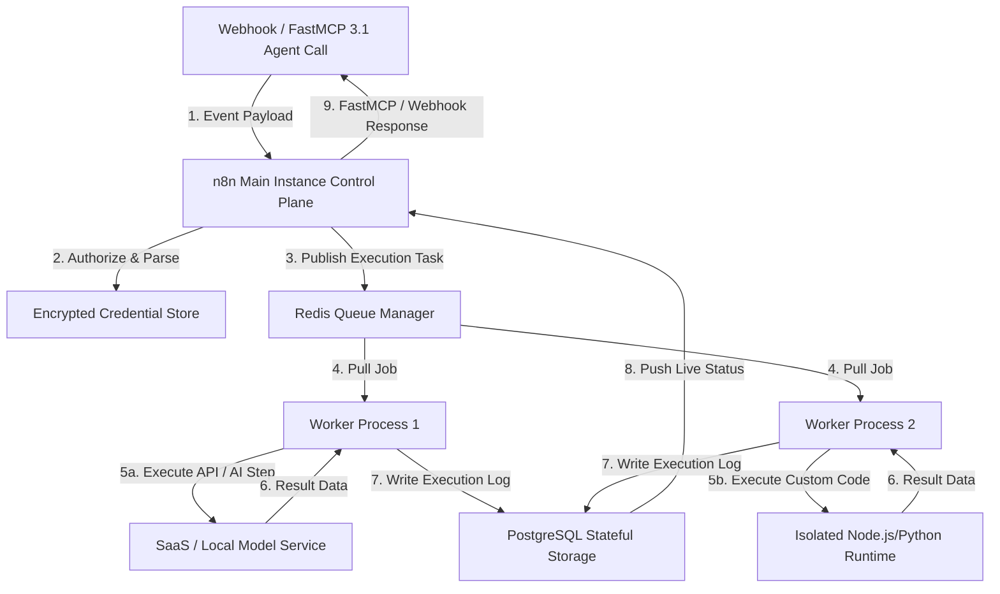

# n8n

## What it is
n8n is an extensible, source-available workflow automation platform that combines an intuitive visual node-based editor with custom JavaScript/Python code execution, scalable queue orchestration, and deep AI agent integration. In early 2027, n8n functions as a premier self-hosted orchestrator for enterprise and home lab environments, featuring native support for **FastMCP 3.1** (Model Context Protocol), dynamic AI Agent nodes, multi-tenant workspace isolation, and native vector store connectors.

By hosting n8n on private infrastructure, organizations retain complete control over sensitive workflow execution data, security policies, and third-party API credentials without relying on third-party SaaS automation vendor locks.

```
+-----------------------------------------------------------------------------------+
|                             n8n System Architecture                               |
+-----------------------------------------------------------------------------------+
|                                                                                   |
|  +-----------------------+                    +--------------------------------+  |
|  | Incoming Triggers     |                    | n8n Main Control Plane Server  |  |
|  | - Webhooks / MCP SSE  | -----------------> |  - Visual Node Engine / UI     |  |
|  | - Cron / Event Streams|                    |  - FastMCP 3.1 Agent Server    |  |
|  +-----------------------+                    |  - Credential Encryption Vault |  |
|                                               +---------------+----------------+  |
|                                                               |                   |
|                                                               v                   |
|                                               +--------------------------------+  |
|                                               | Redis Queue Broker             |  |
|                                               |  - Task Delegation & Queues    |  |
|                                               +---------------+----------------+  |
|                                                               |                   |
|                                       +-----------------------+-----------------------+
|                                       |                                               |
|                                       v                                               v
|                        +------------------------------+                +------------------------------+
|                        | Worker Instance 1            |                | Worker Instance N            |
|                        |  - Node Execution Engine     |                |  - Node Execution Engine     |
|                        |  - JS / Python Code Steps    |                |  - AI Agent Reasoning Loop   |
|                        +--------------+---------------+                +--------------+---------------+
|                                       |                                               |
|                                       +-----------------------+-----------------------+
|                                                               |
|                                                               v
|                                               +--------------------------------+
|                                               | PostgreSQL Persistence Layer   |
|                                               |  - State, Logs, Credentials    |
|                                               +--------------------------------+
|                                                                                   |
+-----------------------------------------------------------------------------------+
```

## What problem it solves
Managing modern software ecosystems requires bridging disparate APIs, databases, message brokers, and AI models. Standard approaches involve writing fragile custom microservices or depending on proprietary cloud automation platforms (like Zapier or Make) that expose sensitive data to third parties and impose strict usage quotas.

n8n addresses these challenges by offering:
1. **Complete Data Sovereignty**: Running entirely within private VPCs, Kubernetes clusters, or local homelabs.
2. **Visual & Programmatic Hybridity**: Allowing non-developers to visually trace workflows while enabling senior engineers to write raw JavaScript or Python code within execution nodes.
3. **Agentic AI Workflow Integration**: Exposing native AI Agent nodes capable of tool discovery, memory retention, vector store querying, and human-in-the-loop approval routing.
4. **FastMCP 3.1 Tool Server Mode**: Converting any n8n workflow into a high-performance Model Context Protocol tool exposed directly to frontier models (Claude 5.6, GPT-5.5, Gemini 4.0 Ultra).

## Where it fits in the stack
**Automation & Orchestration Layer**. n8n serves as the central control plane connecting intake channels (webhooks, email streams, MQTT brokers) with downstream execution endpoints (databases, CRMs, local services like [Paperless-ngx](paperless-ngx.md), or smart home devices via [Home Assistant](home-assistant.md)). It coordinates local LLM inference engines like [Ollama](ollama.md) or cloud APIs (Anthropic, OpenAI, DeepSeek).

## System Architecture & Technical Deep-Dive



### 1. Main Server Control Plane
The n8n main server manages the web UI, user authentication (with OAuth2 or Authentik SSO integration), visual node canvas rendering, workflow scheduling, and API key management. It handles incoming webhook calls and dispatches background jobs to execution workers.

### 2. Redis Queue Mode & Worker Scalability
In enterprise production environments, n8n operates in **Queue Mode**. The main server delegates heavy workflow execution steps to a Redis message queue. A fleet of statless n8n worker nodes pull jobs from Redis, execute the workflow steps concurrently, and write results back to PostgreSQL.

### 3. FastMCP 3.1 Agent Integration
n8n includes native FastMCP 3.1 gateway capabilities. Workflows configured with "MCP Trigger" nodes dynamically advertise their capabilities as JSON-RPC schemas over SSE or STDIO transports. Front-end agents (such as Claude Desktop or custom sub-agent swarms) discover and execute n8n workflows as native tools with automatic schema validation.

### 4. Encrypted Credential & Vault Subsystem
n8n encrypts all stored API keys, OAuth tokens, and database passwords using AES-256 encryption using an `N8N_ENCRYPTION_KEY`. In advanced setups, credentials can be dynamically retrieved at runtime from external secret managers such as HashiCorp Vault or AWS Secrets Manager.

## Typical use cases
- **Autonomous Document Ingestion Pipeline**: Ingesting incoming PDFs from email or webhooks, parsing content via local LLMs or [Instructor](../tools/frameworks/instructor.md), extracting metadata, and filing documents into [Paperless-ngx](paperless-ngx.md).
- **Enterprise IT & Security Triage**: Automatically capturing alert events from PagerDuty or Sentry, summarizing log outputs via Claude 5.6, creating Jira tickets, and alerting engineering channels on Slack or Teams.
- **Agentic Tool Gateway**: Exposing complex, multi-system automations (e.g., searching SQL databases and initiating cloud deployments) as FastMCP tools for frontier AI agents.
- **Smart Home & Homelab Orchestration**: Linking IoT events from [Home Assistant](home-assistant.md) with local notifications, media indexing in [Audiobookshelf](audiobookshelf.md), and offsite backup triggers.

## Strengths
- **Dual Visual/Code Flexibility**: Supports intuitive node connections alongside custom JavaScript and Python script execution.
- **Self-Hosted Privacy**: Ensures credentials, logs, and sensitive payloads remain completely within private network boundaries.
- **High Scalability**: Horizontally scales execution workers using Redis and PostgreSQL.
- **Built-In Error Triggers**: Dedicated error-handling workflows automatically catch, log, and recover from failing nodes.
- **FastMCP 3.1 Support**: First-class integration with modern AI agent tool call specifications.

## Limitations
- **Learning Curve for Advanced Flows**: Complex error handling, data transformation, and conditional loop logic require solid software engineering practices.
- **Resource Overhead in Small Environments**: Running n8n in production Queue Mode with PostgreSQL and Redis requires more RAM (>2GB) than minimalistic microservice containers.
- **Execution Overhead**: Adding visual node wrappers introduces a minor millisecond latency overhead compared to compiled pure code microservices.

## When to use it
- When you need secure, auditable, self-hosted workflow automations across business systems.
- When building AI-assisted pipelines requiring human approval gates and clear execution tracing.
- When constructing multi-step integrations that must expose an MCP tool interface to AI agents.

## When not to use it
- For simple single-line cron jobs or lightweight local scripts with no UI requirement.
- For ultra-low latency real-time microservice invocations where microsecond execution is mandatory.
- When organization policy strictly forbids self-hosting software infrastructure.

## Getting started

### Enterprise Production Docker Compose Configuration
Below is a production-ready `docker-compose.yml` deploying n8n in Queue Mode with PostgreSQL and Redis:

```yaml
version: '3.8'

services:
  postgres:
    image: postgres:16-alpine
    container_name: n8n_postgres
    restart: always
    environment:
      POSTGRES_USER: n8n_user
      POSTGRES_PASSWORD: ${POSTGRES_PASSWORD}
      POSTGRES_DB: n8n_db
    volumes:
      - postgres_storage:/var/lib/postgresql/data
    healthcheck:
      test: ["CMD-SHELL", "pg_isready -U n8n_user -d n8n_db"]
      interval: 5s
      timeout: 5s
      retries: 5

  redis:
    image: redis:7-alpine
    container_name: n8n_redis
    restart: always
    healthcheck:
      test: ["CMD", "redis-cli", "ping"]
      interval: 5s
      timeout: 5s
      retries: 5

  n8n_main:
    image: docker.n8n.io/n8nio/n8n:latest
    container_name: n8n_main
    restart: always
    ports:
      - "5678:5678"
    depends_on:
      postgres:
        condition: service_healthy
      redis:
        condition: service_healthy
    environment:
      - N8N_HOST=n8n.local
      - N8N_PORT=5678
      - N8N_PROTOCOL=http
      - NODE_ENV=production
      - DB_TYPE=postgresdb
      - DB_POSTGRESDB_HOST=postgres
      - DB_POSTGRESDB_DATABASE=n8n_db
      - DB_POSTGRESDB_USER=n8n_user
      - DB_POSTGRESDB_PASSWORD=${POSTGRES_PASSWORD}
      - EXECUTIONS_MODE=queue
      - QUEUE_BULL_REDIS_HOST=redis
      - QUEUE_BULL_REDIS_PORT=6379
      - N8N_ENCRYPTION_KEY=${N8N_ENCRYPTION_KEY}
    volumes:
      - n8n_data:/home/node/.n8n

  n8n_worker:
    image: docker.n8n.io/n8nio/n8n:latest
    container_name: n8n_worker
    restart: always
    command: worker
    depends_on:
      n8n_main:
        condition: service_started
    environment:
      - DB_TYPE=postgresdb
      - DB_POSTGRESDB_HOST=postgres
      - DB_POSTGRESDB_DATABASE=n8n_db
      - DB_POSTGRESDB_USER=n8n_user
      - DB_POSTGRESDB_PASSWORD=${POSTGRES_PASSWORD}
      - EXECUTIONS_MODE=queue
      - QUEUE_BULL_REDIS_HOST=redis
      - QUEUE_BULL_REDIS_PORT=6379
      - N8N_ENCRYPTION_KEY=${N8N_ENCRYPTION_KEY}

volumes:
  postgres_storage:
  n8n_data:
```

## CLI examples

### Workflow Backup & Versioning
Managing n8n workflows as code via terminal CLI execution:

```bash
# Export all active workflows into separate JSON files
docker compose exec n8n_main n8n export:workflow --all --separate --output=/home/node/.n8n/workflows/

# Export all saved credentials (encrypted)
docker compose exec n8n_main n8n export:credentials --all --output=/home/node/.n8n/credentials.json

# Import workflows from backup folder
docker compose exec n8n_main n8n import:workflow --separate --input=/home/node/.n8n/workflows/
```

### Administrative Database Management
Pruning old execution records to optimize PostgreSQL storage:

```bash
# Prune execution records older than 30 days directly via CLI
docker compose exec n8n_main n8n cleanup:executions --days=30
```

## API examples

### FastMCP 3.1 Python Gateway Server for n8n Workflows
The following code demonstrates configuring a FastMCP 3.1 proxy server that exposes an n8n webhook workflow as a type-safe MCP tool:

```python
import os
import requests
from typing import Dict, Any, Optional
from mcp.server.fastmcp import FastMCP
from pydantic import BaseModel, Field

mcp = FastMCP(
    name="n8n FastMCP Gateway",
    instructions="Production gateway exposing self-hosted n8n workflows as agentic MCP tools"
)

class N8NWorkflowTriggerRequest(BaseModel):
    workflow_slug: str = Field(..., description="Target n8n workflow identifier (e.g. document-ingestion)")
    payload: Dict[str, Any] = Field(..., description="Input data payload expected by the n8n webhook trigger")
    priority: str = Field("normal", pattern="^(low|normal|high|critical)$")

class N8NWorkflowTriggerResponse(BaseModel):
    success: bool
    execution_id: str = Field(..., alias="executionId")
    status: str
    message: str

@mcp.tool()

def trigger_n8n_workflow(request_data: Dict[str, Any]) -> Dict[str, Any]:
    """
    Triggers a self-hosted n8n workflow via authenticated webhook.
    """
    try:
        req = N8NWorkflowTriggerRequest.model_validate(request_data)

        n8n_base_url = os.getenv("N8N_WEBHOOK_BASE_URL", "http://n8n.local:5678/webhook")
        webhook_url = f"{n8n_base_url}/{req.workflow_slug}"

        headers = {
            "Content-Type": "application/json",
            "X-N8N-API-KEY": os.getenv("N8N_API_KEY", "default-secret-key"),
            "X-Trigger-Priority": req.priority
        }

        res = requests.post(webhook_url, json=req.payload, headers=headers, timeout=15.0)

        if res.status_code in (200, 201, 202):
            res_json = res.json()
            response_obj = N8NWorkflowTriggerResponse(
                success=True,
                executionId=res_json.get("executionId", "async_triggered"),
                status="running",
                message="Workflow dispatched successfully to n8n worker pool"
            )
            return response_obj.model_dump(by_alias=True)
        else:
            return {
                "success": False,
                "executionId": "none",
                "status": "failed",
                "message": f"n8n returned HTTP status {res.status_code}: {res.text}"
            }

    except Exception as err:
        return {
            "success": False,
            "executionId": "error",
            "status": "exception",
            "message": f"Failed to reach n8n instance: {str(err)}"
        }

if __name__ == "__main__":
    mcp.run()
```

### Advanced Pydantic v2 Workflow Execution Audit Script
This module implements complete verification and validation of n8n execution history records using **Pydantic v2**.

```python
import sys
from typing import List, Optional, Dict, Any
from datetime import datetime
from pydantic import BaseModel, Field, ValidationError

class N8NNodeExecutionData(BaseModel):
    node_name: str = Field(..., alias="nodeName")
    node_type: str = Field(..., alias="nodeType")
    execution_time_ms: int = Field(..., ge=0, alias="executionTimeMs")
    has_error: bool = Field(False, alias="hasError")

class N8NExecutionRecord(BaseModel):
    id: str = Field(..., description="Unique execution ID string")
    workflow_id: str = Field(..., alias="workflowId")
    mode: str = Field(..., pattern="^(webhook|trigger|manual|retry)$")
    status: str = Field(..., pattern="^(success|running|failed|waiting)$")
    started_at: datetime = Field(..., alias="startedAt")
    stopped_at: Optional[datetime] = Field(None, alias="stoppedAt")
    node_exec_summary: List[N8NNodeExecutionData] = Field(default_factory=list, alias="nodeExecSummary")

class N8NAuditReport(BaseModel):
    total_executions: int
    success_rate: float = Field(..., ge=0.0, le=100.0)
    failed_execution_ids: List[str]
    records: List[N8NExecutionRecord]

def audit_n8n_executions(raw_payload: dict) -> Optional[N8NAuditReport]:
    try:
        report = N8NAuditReport.model_validate(raw_payload)
        print(f"n8n Audit Verification Successful for {report.total_executions} executions.")
        print(f"  Success Rate: {report.success_rate}%")
        print(f"  Failed Executions Count: {len(report.failed_execution_ids)}")
        return report
    except ValidationError as ve:
        print(f"Pydantic Validation Error during n8n audit: {ve}", file=sys.stderr)
        return None

if __name__ == "__main__":
    sample_audit_payload = {
        "total_executions": 3,
        "success_rate": 66.67,
        "failed_execution_ids": ["exec_9901"],
        "records": [
            {
                "id": "exec_9900",
                "workflowId": "wf_document_ingest",
                "mode": "webhook",
                "status": "success",
                "startedAt": "2027-01-07T10:00:00Z",
                "stoppedAt": "2027-01-07T10:00:04Z",
                "nodeExecSummary": [
                    {"nodeName": "Webhook Receiver", "nodeType": "n8n-nodes-base.webhook", "executionTimeMs": 12, "hasError": False},
                    {"nodeName": "Paperless Filer", "nodeType": "n8n-nodes-base.httpRequest", "executionTimeMs": 340, "hasError": False}
                ]
            },
            {
                "id": "exec_9901",
                "workflowId": "wf_slack_alert",
                "mode": "trigger",
                "status": "failed",
                "startedAt": "2027-01-07T10:15:00Z",
                "stoppedAt": "2027-01-07T10:15:02Z",
                "nodeExecSummary": [
                    {"nodeName": "Sentry Webhook", "nodeType": "n8n-nodes-base.webhook", "executionTimeMs": 15, "hasError": False},
                    {"nodeName": "Slack Dispatcher", "nodeType": "n8n-nodes-base.slack", "executionTimeMs": 2100, "hasError": True}
                ]
            }
        ]
    }

    audit_n8n_executions(sample_audit_payload)
```

## Related tools / concepts
- [Ollama](ollama.md) — Local LLM serving engine integrated into n8n AI nodes.
- [Paperless-ngx](paperless-ngx.md) — Automated document archiving backend.
- [Home Assistant](home-assistant.md) — IoT and smart home event platform.
- [Zapier](../tools/automation_orchestration/zapier.md) — Cloud automation platform with 9,000+ connectors.
- [Make](../tools/automation_orchestration/make.md) — Visual cloud automation tool.
- [Authentik](authentik.md) — Identity provider for n8n single sign-on (SSO).
- [FastMCP](https://github.com/jlowin/fastmcp) — Python framework for agent tool servers.

## Sources / references
- [Official n8n Website](https://n8n.io/)
- [n8n Documentation](https://docs.n8n.io/)
- [n8n Advanced AI & Agent Nodes](https://docs.n8n.io/advanced-ai/)
- [n8n Queue Mode Deployment Guide](https://docs.n8n.io/hosting/scaling/queue-mode/)

---
## Contribution Metadata
- Last reviewed: 2027-01-07
- Confidence: high
