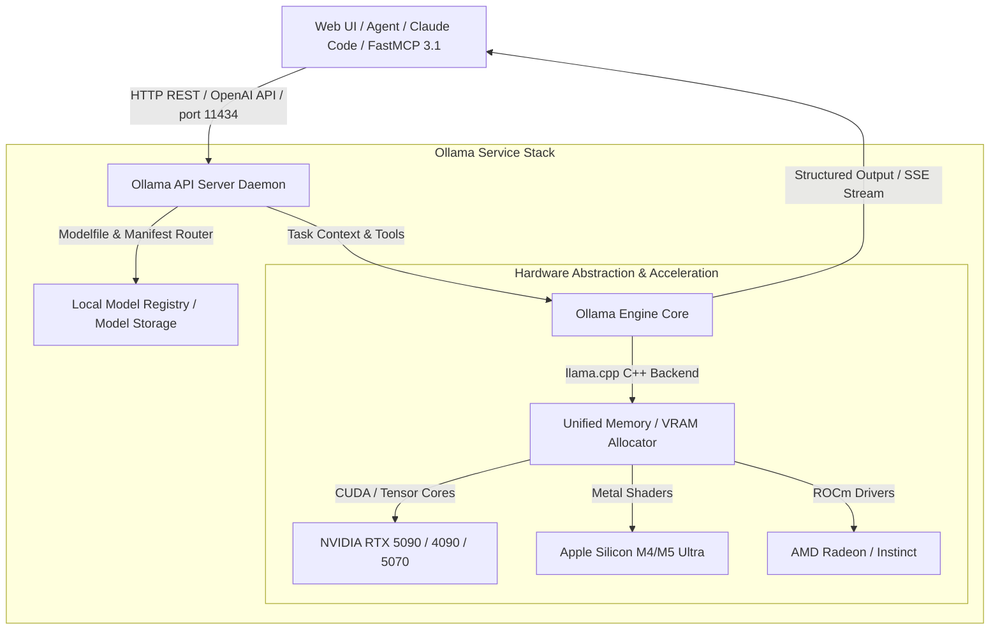

# Ollama

## What it is
Ollama is a lightweight, high-performance open-source framework and local inference server designed to run, manage, and serve Large Language Models (LLMs) and Multi-Modal Vision Language Models (VLMs) directly on local hardware. Created by Jeffrey Morgan and Michael Chiang, Ollama wraps low-level C/C++ inference backends (such as `llama.cpp`) into a developer-friendly CLI tool and REST/OpenAI-compatible HTTP API daemon listening on port `11434`.

In the 2026 and 2027 local AI and homelab ecosystem, Ollama serves as the premier local execution runtime for private inference. It supports one-command model pulling, custom Modelfile configurations, GPU/NPU hardware acceleration (NVIDIA CUDA, AMD ROCm, Apple Silicon Metal, Intel OneAPI), and native tool-calling capabilities. Furthermore, Ollama features native integration with the **FastMCP 3.1** protocol specification and the **MCP 3.0 Task Protocol**, enabling local open-weights models (like Llama 4, DeepSeek-V4, Qwen 3.6 VL, Gemma 4, and Mistral) to operate autonomously as agent reasoning backends without sending telemetry or prompts to third-party cloud services.

## Architecture & System Flow



## What problem it solves
Setting up and serving local large language models previously required compiling complex C++ repositories, manually managing CUDA runtime dependencies, configuring Python virtual environments with PyTorch/vLLM, downloading raw model weights (e.g. multi-gigabyte `.safetensors` or GGUF files), and writing custom REST API wrappers. Furthermore, switching between different quantizations or fine-tuned model variants often broke existing tool bindings and agent scripts.

Ollama eliminates these deployment hurdles through key features:
1. **Containerized Model Management**: Bundles weights, system prompts, template formats, and hyperparameters into a single unified "Modelfile" format, managed via simple Docker-like commands (`ollama pull`, `ollama run`).
2. **Automated Hardware Acceleration**: Automatically detects host hardware (NVIDIA GPUs, Apple M-series Metal, AMD ROCm) and offloads model layers to available VRAM/Unified Memory for maximum throughput without manual compiler flag configuration.
3. **OpenAI & MCP 3.1 Compatibility**: Exposes both a native REST API and an OpenAI-compatible `/v1/chat/completions` endpoint, allowing developer frameworks ([FastAPI](../tools/frameworks/fastapi.md), [LangChain](../tools/ai_knowledge/langchain.md), Open WebUI) and MCP agents to swap cloud models for local ones seamlessly.
4. **Data Sovereignty & Zero API Costs**: Runs entirely offline within private networks, protecting sensitive codebases, financial records, and personal notes while eliminating per-token cloud API billing.
5. **Native Tool Calling**: Native JSON schema parsing and function-calling support in open models allow local agents to invoke FastMCP 3.1 tools accurately.

## Where it fits in the stack
**Local Inference Engine & Service Layer**. Ollama operates as the foundational local reasoning engine in the self-hosted AI and homelab stack. It sits directly above physical hardware or container runtimes ([Docker](../tools/infrastructure/docker.md), TrueNAS SCALE) and serves downstream clients like Open WebUI, Nextcloud, and FastMCP agent routers.

```
+-----------------------------------------------------------------------+
|                    Client Apps & Agent Frameworks                     |
|    (Open WebUI, Nextcloud Assistant, Claude Code, LangChain, Agno)    |
+-----------------------------------------------------------------------+
                                    |
                                    v
+-----------------------------------------------------------------------+
|                       Ollama Service Daemon                           |
|  - REST API Engine (Port 11434) & OpenAI Compatibility Layer          |
|  - Modelfile System Prompt & Template Manager                         |
|  - FastMCP 3.1 Tool Calling & JSON Schema Parser                      |
+-----------------------------------------------------------------------+
                                    |
            +-----------------------+-----------------------+
            |                                               |
            v                                               v
+---------------------------------------+ +-----------------------------------+
|      Hardware Execution (llama.cpp)   | |         Local Storage Store       |
| (NVIDIA CUDA, Apple Metal, AMD ROCm)  | |  (GGUF Weights, Model Registry)   |
+---------------------------------------+ +-----------------------------------+
```

## Typical use cases
- **Private Homelab AI Assistant**: Hosting a centralized, self-hosted LLM backend for family members or home-office users via Open WebUI without data leaving the local network.
- **Offline Code Generation**: Providing local coding completion and refactoring assistance in IDEs (Cursor, VS Code, Aider) using high-speed local models like DeepSeek-V4 or Qwen 3.6.
- **Document & RAG Processing**: Feeding private technical manuals, medical records, and financial PDFs to vector store pipelines without cloud data leakage.
- **Local FastMCP 3.1 Tool Agent Runtime**: Serving as the LLM reasoning core for autonomous agents executing local system administration scripts and Home Assistant triggers.
- **Model Evaluation & Benchmarking**: Running local experiments, fine-tuned model comparisons, and speed benchmarks across varying quantizations (Q4_K_M, Q8_0, FP16).

## Strengths
- **Instant Deployment**: Simple one-line installation and zero-configuration startup across Linux, macOS, and Windows.
- **Optimal Memory Management**: Intelligently splits model layers across system RAM and GPU VRAM when VRAM capacity is limited.
- **Vast Model Library**: Instant access to thousands of pre-converted models on the official Ollama library (Llama 4, DeepSeek-V4, Mistral, Qwen 3.8, Gemma 4, Phi-4).
- **Multi-Modal Vision Support**: Native execution of Vision Language Models (VLMs) like Qwen 3.6 VL and Llama 4 Vision for image parsing and screenshot analysis.
- **High Token Throughput**: Optimized C++ execution engine delivers exceptional generation speeds on Apple Silicon (M4/M5) and NVIDIA GPUs.
- **Active Community Ecosystem**: Supported out of the box by virtually every major open-source AI UI, framework, and agent tool.

## Limitations
- **VRAM Bound**: Generation speeds drop significantly if a model exceeds VRAM and must spill over into CPU system RAM.
- **Large Model Footprint**: Quantized 70B+ parameter models require 40GB+ of VRAM, limiting high-end open models on budget consumer hardware.
- **Concurrent Scaling Limits**: For massive multi-user production spikes, dedicated distributed inference platforms like vLLM or TGI may offer superior batching efficiency.

## When to use it
- When local data privacy, security, and offline functionality are mandatory requirements for your organization or homelab setup.
- To eliminate expensive per-token API costs during heavy iterative software development, automated testing, and agent debugging cycles.
- When running self-hosted AI interfaces like Open WebUI, AnythingLLM, or Nextcloud Assistant in a home office or enterprise homelab.
- When hosting local FastMCP 3.1 tool-calling agents on dedicated consumer or enterprise GPU hardware.

## When not to use it
- When working on lightweight systems lacking dedicated GPU/NPU hardware or sufficient RAM for local model inference.
- When absolute peak frontier model intelligence (e.g., full Claude 5.6 Sonnet or GPT-5.6) is required for complex multi-step reasoning tasks.
- When deploying high-scale enterprise API services requiring multi-node tensor parallel clusters.

## Getting started

### Installation via Docker Compose
To deploy Ollama on Linux with NVIDIA GPU pass-through, create a `docker-compose.yml` file:

```yaml
version: '3.8'
services:
  ollama:
    image: ollama/ollama:latest
    container_name: ollama
    ports:
      - "11434:11434"
    volumes:
      - ./ollama_data:/root/.ollama
    restart: unless-stopped
    deploy:
      resources:
        reservations:
          devices:
            - driver: nvidia
              count: all
              capabilities: [gpu]
```

Launch the service:
```bash
docker compose up -d
```

### Recommended Models Matrix (Early 2027)

| Category | Model Identifier | VRAM / RAM Required | Target Hardware & Performance | Key Use Cases |
| :--- | :--- | :--- | :--- | :--- |
| **General All-Rounder** | `llama4:32b` | ~20 GB VRAM | RTX 4090 / 5090 / Apple M4 Max | General conversation, tool calling, reasoning |
| **Code & Logic** | `deepseek-v4:local` | ~16 GB VRAM | RTX 4080 / 5070 / Apple M4 Pro | Complex code refactoring, bug fixes, SQL generation |
| **Edge & Low-VRAM** | `qwen3.8:4b` | ~3.5 GB VRAM | GTX 1660 / Apple M1/M2 / Edge NPU | Fast inline code completions, simple triage |
| **Vision & Multimodal** | `qwen3.6-vl:8b` | ~7.5 GB VRAM | RTX 3070 / 4060 / Apple M3 | Diagram analysis, UI screenshot parsing |

### CLI Quickstart
```bash
# Pull and execute the Llama 4 8B model locally
ollama run llama4

# Pull a specialized code reasoning model
ollama pull deepseek-v4:local

# List all downloaded local models and sizes
ollama list
```

## CLI examples

```bash
# Run a specific model and execute a single prompt query
ollama run llama4 "Explain the architectural advantages of Model Context Protocol (MCP) in two paragraphs."

# Create a custom model persona using a local Modelfile
ollama create homelab-engineer -f Modelfile

# Copy an existing model to a new tag
ollama cp llama4 my-custom-llama

# Show detailed technical metadata, quantization, and context window for a model
ollama show llama4

# Remove an unused model from local storage to free up disk space
ollama rm gemma2
```

## API examples

### Native REST Generation API (cURL)
```bash
curl -s http://localhost:11434/api/generate -d '{
  "model": "llama4",
  "prompt": "List three key benefits of running LLMs on local homelab hardware.",
  "stream": false
}' | jq .
```

### Python: FastMCP 3.1 Ollama Tool Router & GPU Health Check
This production-grade script allows agents to execute queries against a local Ollama daemon while using **Pydantic v2** for strict validation of inputs and parameters.

```python
import json
import requests
from typing import Optional, Dict, Any
from pydantic import BaseModel, Field, field_validator, ConfigDict
from mcp.server.fastmcp import FastMCP

# Initialize FastMCP 3.1 Server Instance
mcp = FastMCP("Ollama Service Agent Manager", dependencies=["pydantic>=2.10.0"])

class OllamaInferenceRequest(BaseModel):
    model_config = ConfigDict(str_strip_whitespace=True)

    model_name: str = Field(default="llama4", description="Name of local model (e.g. 'llama4', 'deepseek-v4')")
    prompt: str = Field(..., min_length=5, description="User or system query text")
    temperature: float = Field(default=0.2, ge=0.0, le=2.0)
    max_tokens: Optional[int] = Field(default=500, ge=1, le=8192)

    @field_validator("model_name")
    @classmethod
    def sanitize_model_name(cls, v: str) -> str:
        clean = v.lower().strip()
        if not clean:
            raise ValueError("Model name cannot be empty")
        return clean

class OllamaInferenceResponse(BaseModel):
    status: str
    model: str
    response_text: str
    eval_count: int
    duration_ms: int

@mcp.tool(name="execute_ollama_query", description="Executes an inference query against the local Ollama API server")
def execute_ollama_query(request_json: str) -> str:
    """FastMCP 3.1 Tool that executes local inference via Ollama and returns validated JSON."""
    try:
        raw_data = json.loads(request_json)
        req = OllamaInferenceRequest(**raw_data)

        url = "http://localhost:11434/api/generate"
        payload = {
            "model": req.model_name,
            "prompt": req.prompt,
            "options": {
                "temperature": req.temperature,
                "num_predict": req.max_tokens
            },
            "stream": False
        }

        resp = requests.post(url, json=payload, timeout=60)
        if resp.status_code != 200:
            return json.dumps({
                "status": "error",
                "error": f"Ollama daemon error: HTTP {resp.status_code}"
            })

        data = resp.json()
        output = OllamaInferenceResponse(
            status="success",
            model=req.model_name,
            response_text=data.get("response", ""),
            eval_count=data.get("eval_count", 0),
            duration_ms=data.get("total_duration", 0) // 1_000_000
        )
        return output.model_dump_json(indent=2)

    except Exception as err:
        return json.dumps({"status": "error", "error": str(err)})

if __name__ == "__main__":
    mcp.run()
```

### Python: OpenAI-Compatible Chat Streaming Endpoint with Ollama
```python
from openai import OpenAI

# Connect to Ollama using standard OpenAI Python SDK
client = OpenAI(
    base_url="http://localhost:11434/v1",
    api_key="ollama"  # Required placeholder
)

response = client.chat.completions.create(
    model="llama4",
    messages=[
        {"role": "system", "content": "You are a concise homelab AI assistant."},
        {"role": "user", "content": "How do I configure persistent storage for Docker Ollama?"}
    ],
    temperature=0.3,
    stream=True
)

for chunk in response:
    if chunk.choices[0].delta.content:
        print(chunk.choices[0].delta.content, end="", flush=True)
print("\n")
```

## Related tools / concepts
- [Open WebUI](open-webui.md) — Feature-rich, web-based chat and administration interface for Ollama.
- [LiteLLM](litellm.md) — Unified proxy server for load-balancing multiple local Ollama instances and cloud models.
- [Local LLMs](../tools/ai_knowledge/local_llms.md) — Overview of the local open-weights model landscape.
- [FastAPI](../tools/frameworks/fastapi.md) — Asynchronous Python web framework commonly used to wrap local model APIs.
- [Docker](../tools/infrastructure/docker.md) — Primary container engine for hosting Ollama instances.
- [Portracker](portracker.md) — Homelab utility for tracking reserved local networking ports like 11434.
- [Nextcloud](nextcloud.md) — Self-hosted productivity suite with native local AI integration via Ollama.
- [FastMCP 3.1](../automation_orchestration/mcp.md) — Model Context Protocol framework for agentic tool integration.

## Sources / references
- [Ollama Official Website](https://ollama.com/)
- [Ollama Official GitHub Repository](https://github.com/ollama/ollama)
- [Ollama API Documentation](https://github.com/ollama/ollama/blob/main/docs/api.md)
- [Ollama Modelfile Reference](https://github.com/ollama/ollama/blob/main/docs/modelfile.md)

## Contribution Metadata
- Last reviewed: 2027-01-07
- Confidence: high
