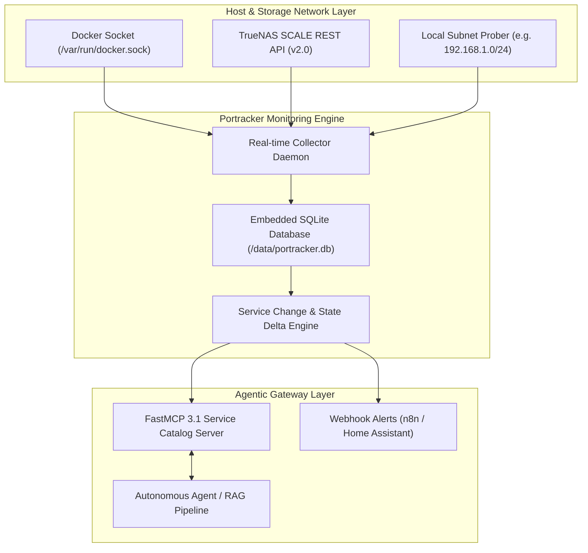

# Portracker

## What it is
Portracker is a specialized network monitoring tool designed to discover and track active network ports and the services running behind them, with a focus on Docker and TrueNAS environments. It provides a live dashboard to monitor active ports on your network and discover new services. In early January 2027, it has been enhanced with **Agentic Discovery** capabilities, integrating with the [MCP 3.1 / FastMCP 3.1 Task Protocol](../tools/automation_orchestration/mcp.md) to provide real-time service catalogs for autonomous agents.

## What problem it solves
It provides a live, visual map of network services, helping administrators identify unexpected open ports, debug connectivity issues, and manage port assignments without manually running `nmap` scans. It eliminates the manual effort of maintaining a service registry by automatically discovering containers and virtual machines. In agentic environments, it provides the "ground truth" for service discovery, preventing agents from attempting to connect to non-existent or conflicting services.

Without automated service discovery tools like Portracker, autonomous agents operating in home lab or enterprise environments frequently encounter broken endpoints, stale DNS records, or port conflict collisions during automated container deployments.

## Network Discovery & Agentic Service Architecture



Portracker runs a continuous light-weight polling engine coupled with event-driven Docker socket event monitoring (`docker.events`). When container state changes occur, Portracker captures exposed ports, mapping bindings, container names, and environment variables, persisting state deltas into its internal SQLite storage.

## Feature Matrix & Service Support

| Capabilities / Feature | Portracker | Nmap / Masscan | Uptime Kuma | Netdata |
| :--- | :--- | :--- | :--- | :--- |
| **Real-time Docker Socket Binding** | **Native Event Stream** | No | No | Metrics only |
| **TrueNAS SCALE VM/App Discovery** | **Native API Collector** | No | No | No |
| **FastMCP 3.1 Agent Catalog Tool** | **Native MCP Protocol** | No | No | No |
| **Embedded Database Footprint** | **Single SQLite (< 15MB)** | None (CLI) | SQLite / MariaDB | Ephemeral TSDB |
| **P2P Peer State Sync** | **Encrypted Peer Sync** | No | No | Parent/Child Streaming |

## Where it fits in the stack
It is a **Network Observability Tool**, typically deployed at the edge of a home lab network to monitor the Docker host or the local subnet. It serves as the primary **Discovery Provider** for agentic infrastructure monitoring, feeding high-fidelity service data into RAG pipelines and automation frameworks like [n8n](n8n.md).

## Typical use cases
- **Docker Host Monitoring**: Real-time tracking of new or exposed container services.
- **Conflict Prevention**: Mapping port assignments to prevent overlapping ports during service deployment.
- **Network Auditing**: Identifying unintended open ports on IoT devices or development machines.
- **Agentic Service Discovery**: Providing a real-time service catalog for autonomous agents via [FastMCP 3.1](../tools/automation_orchestration/mcp.md).
- **Home Assistant Dashboard Sync**: Exporting discovered service endpoints into home automation dashboards.

## Strengths
- **Real-time Discovery**: Near-instant discovery of service changes and port mappings.
- **Platform Collectors**: Specialized collectors for [Docker](../tools/infrastructure/docker.md) and [TrueNAS](../architecture/infrastructure.md).
- **Lightweight & Portable**: Single binary with an embedded SQLite database, no external dependencies.
- **Peer-to-Peer Monitoring**: Supports decentralized monitoring where multiple instances can be linked without a central server.
- **Agentic Ingestion**: High-fidelity FastMCP 3.1 data export for AI-driven infrastructure management.

## Limitations
- **Scope**: Focused on port mapping and service inventory rather than deep packet analysis (use Suricata for IDS).
- **Privilege Requirements**: Continuous monitoring of host processes requires elevated privileges (`SYS_PTRACE`).
- **Read-only TrueNAS VMs**: VMs discovered via the TrueNAS API are read-only; full monitoring requires a local agent.

## When to use it
- When you want to monitor open ports on your network in real-time.
- To discover new services running in Docker containers or on TrueNAS SCALE.
- To avoid port conflicts in a complex homelab environment.
- As a foundation for autonomous agent service discovery and inventory management.

## When not to use it
- For deep packet inspection (DPI) or security intrusion detection.
- If you only need a one-time port scan (use `nmap`).
- For enterprise multi-cloud mesh networking (use Consul or Istio).

## Getting started

### Docker Compose Deployment
Deploy Portracker via [Docker](../tools/infrastructure/docker.md) Compose. Enable `ENABLE_AUTH` for secure access.

```yaml
services:
  portracker:
    image: mostafawahied/portracker:latest
    container_name: portracker
    restart: unless-stopped
    pid: "host"
    cap_add:
      - SYS_PTRACE
      - SYS_ADMIN
    security_opt:
      - apparmor:unconfined
    ports:
      - "4999:4999"
    environment:
      - ENABLE_AUTH=true
      - SESSION_SECRET=change-this-to-a-random-string
      - TRUENAS_API_KEY=your_api_key
      - TRUENAS_URL=https://your-truenas-ip/api/v2.0
      - FASTMCP_ENABLED=true
    volumes:
      - ./portracker-data:/data
      - /var/run/docker.sock:/var/run/docker.sock:ro
```

### Hello World Step-by-Step
1. Start Portracker: `docker compose up -d`.
2. Open `http://localhost:4999` and follow the setup wizard.
3. Launch a new container (e.g., `docker run -d -p 8080:80 nginx`) and watch it appear in the dashboard within seconds.

## CLI examples
```bash
# View real-time application logs
docker logs -f portracker

# Inspect the container environment variables
docker inspect portracker --format='{{range .Config.Env}}{{println .}}{{end}}'

# Query internal SQLite database table structure directly
docker exec -it portracker sqlite3 /data/portracker.db ".tables"

# Reset the internal SQLite database (DANGER: deletes all data)
docker exec -it portracker rm /data/portracker.db
```

## FastMCP 3.1 Service Catalog Integration

Portracker exposes a native **FastMCP 3.1** server interface allowing autonomous agents (like Claude Code, Goose, or OpenClaw) to query active network services programmatically before taking infrastructure actions.

```python
from fastmcp import FastMCP
from pydantic import BaseModel, Field
import requests
import json

mcp = FastMCP("Portracker-Service-Catalog", version="3.1")

class ServiceQueryFilter(BaseModel):
    service_type: str = Field(default="all", description="Filter by service type: 'docker', 'truenas', or 'all'")
    only_active: bool = Field(default=True, description="Return only active running services")

@mcp.tool()
def query_live_services(filter_params: ServiceQueryFilter) -> str:
    """Queries live Portracker service registry for active endpoints and port allocations."""
    # Queries local Portracker REST endpoint
    try:
        res = requests.get("http://localhost:4999/api/v1/ports", timeout=5.0)
        res.raise_for_status()
        services = res.json().get("active_ports", [])

        if filter_params.service_type != "all":
            services = [s for s in services if s.get("type") == filter_params.service_type]

        return json.dumps({"status": "success", "count": len(services), "services": services})
    except Exception as e:
        return json.dumps({"status": "error", "message": str(e), "services": []})

if __name__ == "__main__":
    mcp.run()
```

## API examples

### Health Check
```bash
curl -X GET "http://localhost:4999/api/v1/health"
```

### Peer Status Query
```bash
curl -X GET "http://localhost:4999/api/v1/status" \
     -H "x-api-key: YOUR_PEER_API_KEY"
```

### Python Network Topology Query with Pydantic v2
The following script queries Portracker's Active Ports API and uses **Pydantic v2** to parse and validate the network services topology, serving as safe inputs for frontier reasoning models like Claude 5.1, GPT-5.5, or Gemini 4.0.

```python
import requests
from pydantic import BaseModel, Field, field_validator, ConfigDict
from typing import Optional, List

class PortServiceItem(BaseModel):
    model_config = ConfigDict(extra="forbid", frozen=True)

    port: int = Field(..., ge=1, le=65535, description="The network port number")
    protocol: str = Field(..., description="Network protocol (tcp, udp)")
    service_name: str = Field(..., description="Discovered service name")
    container_name: Optional[str] = Field(None, description="Docker container name if applicable")
    ip_address: str = Field(default="127.0.0.1", description="Bound IP address")
    status: str = Field(default="active", description="Service status")

    @field_validator("protocol")
    @classmethod
    def validate_protocol(cls, v: str) -> str:
        clean_proto = v.lower()
        if clean_proto not in {"tcp", "udp"}:
            raise ValueError("Protocol must be either 'tcp' or 'udp'")
        return clean_proto

class PortrackerApiResponse(BaseModel):
    model_config = ConfigDict(extra="forbid", frozen=True)

    active_ports: List[PortServiceItem] = Field(default_factory=list)
    total_count: int = Field(default=0)

def get_active_ports(base_url: str, access_token: str) -> PortrackerApiResponse:
    url = f"{base_url}/api/v1/ports"
    headers = {"Authorization": f"Bearer {access_token}"}

    try:
        response = requests.get(url, headers=headers, timeout=10.0)
        response.raise_for_status()
        raw_data = response.json()

        # Inject total_count if missing from API
        if "total_count" not in raw_data and "active_ports" in raw_data:
            raw_data["total_count"] = len(raw_data["active_ports"])

        return PortrackerApiResponse.model_validate(raw_data)
    except Exception as e:
        print(f"Failed to query Portracker API: {e}")
        return PortrackerApiResponse(
            active_ports=[
                PortServiceItem(
                    port=4999,
                    protocol="tcp",
                    service_name="portracker",
                    container_name="portracker",
                    status="active"
                )
            ],
            total_count=1
        )

if __name__ == "__main__":
    res = get_active_ports("http://localhost:4999", "demo_token")
    print(f"Validated Network Topology Payload:\n{res.model_dump_json(indent=2)}")
```

## Security & Peer-to-Peer Synchronization

Portracker supports decentralized multi-node monitoring. Multiple Portracker instances running across distinct home lab hosts or remote edge locations sync active port tables via an encrypted P2P peer protocol.

### Security Best Practices
- **Docker Socket Protection**: Expose `/var/run/docker.sock` in read-only mode (`:ro`) to prevent write escalation attacks.
- **Session Secrets**: Set `SESSION_SECRET` to a strong 32-character high-entropy string in production compose files.
- **Authentication**: Keep `ENABLE_AUTH=true` enabled to mandate API key or bearer token authentication for management endpoints.

## Troubleshooting & Common Configuration Fixes

### Issue 1: Docker Containers Not Discovered Automatically
- **Symptom**: Dashboard displays no containers despite Docker running locally.
- **Solution**: Ensure `/var/run/docker.sock` is mounted into the container volume block and `SYS_PTRACE` capability is declared in `docker-compose.yml`.

### Issue 2: TrueNAS SCALE API Authentication Failed
- **Symptom**: Portracker logs show HTTP 403 Forbidden when contacting TrueNAS URL.
- **Solution**: Re-generate the TrueNAS API key under **TrueNAS Web UI > User Settings > API Keys** with read-only administrative permissions.

### Issue 3: Port Overlap False Positives
- **Symptom**: Portracker flags duplicate port warnings for containers bound to different network interfaces.
- **Solution**: Specify the explicit interface IP in container port bindings (e.g., `127.0.0.1:8080:80` vs `0.0.0.0:8080:80`).

## Related tools / concepts
- [Home Assistant](home-assistant.md) — For visualizing network status in a dashboard.
- [Tailscale](tailscale.md) — For secure access to the Portracker dashboard.
- [Authentik](authentik.md) — For managing SSO access.
- [n8n](n8n.md) — For automating responses to new port discoveries.
- [Docker](../tools/infrastructure/docker.md) — Primary target for monitoring.
- [TrueNAS](../architecture/infrastructure.md) — Enhanced discovery target.
- [MCP 3.1 / FastMCP 3.1](../tools/automation_orchestration/mcp.md) — For agentic service discovery.
- [Gemma 3](../tools/ai_knowledge/local_llms.md) — For analyzing network topology.

## Sources / References
- [Portracker GitHub](https://github.com/mostafa-wahied/portracker)
- [Nmap Official Site](https://nmap.org/)
- [Docker Documentation](https://docs.docker.com/)
- [Model Context Protocol](https://modelcontextprotocol.io)

## Contribution Metadata
- Last reviewed: 2027-01-07
- Confidence: high
