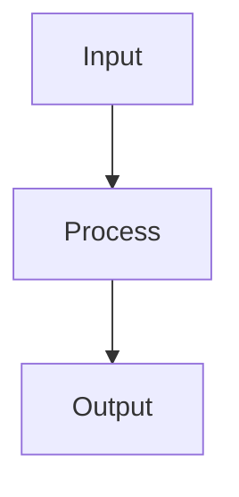

# [Topic Title]

## What it is

<!-- Plain English, no jargon, 3-5 sentences explaining the concept -->

## Why it matters for home automation

<!-- Connect to the home-office stack: how does understanding this help someone automate their workflow? -->

## How it works

<!-- Simplified explanation with a Mermaid diagram -->

## Key terms

<!-- Definition list of 5-8 terms a beginner needs to understand this topic -->

Term 1
: Definition here.

Term 2
: Definition here.

## Try it yourself

<!-- Link to relevant tool docs and playbooks in THIS repo that let the reader get hands-on -->

## Further reading

<!-- 3-5 high-quality external links for deeper exploration -->

## Sources / References

<!-- URLs used to write this article -->

- Last reviewed: YYYY-MM-DD
- Confidence: medium
