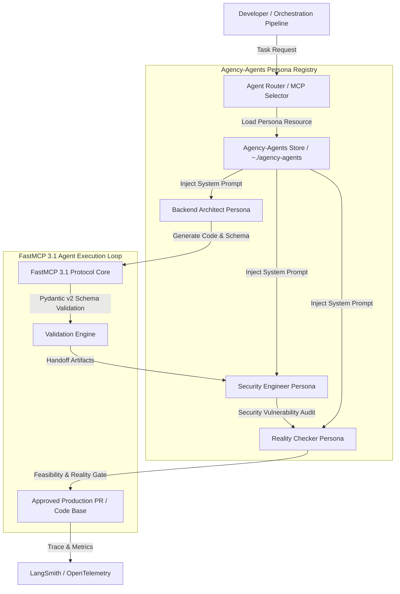

# Agency-Agents

## What it is
Agency-Agents is an extensive, open-source repository containing over 110+ specialized AI agent persona definitions, system prompt specifications, and Model Context Protocol ([FastMCP 3.1](../automation_orchestration/mcp.md)) resource modules. Created by Mateusz Sitarzewski, Agency-Agents turns general-purpose Large Language Models (LLMs) into specialized domain experts—forming a complete virtual AI software agency, product design team, security audit group, and business advisory panel.

In modern early 2027 AI engineering and homelab developer setups, Agency-Agents functions as a standardized persona registry. By supplying highly constrained system instruction prompts, role-specific operational guidelines, `PreToolUse` verification checks, and `PostToolUse` output validation rules, Agency-Agents empowers IDE-based agents like [Claude Code](../development_ops/claude-code.md), Cursor, Aider, and OpenClaw to execute multi-agent code reviews, architectural validations, performance tuning, and security audits with minimal hallucination.

## Architecture & Multi-Agent Workflow



## What problem it solves
Generic LLM assistants are typically trained on broad datasets and default to safe, generic answers when asked to solve complex software engineering or system administration problems. When given open-ended coding prompts, unconstrained models often introduce subtle architectural anti-patterns, fail to enforce proper input validation, miss security edge cases (such as command injections or CORS misconfigurations), and hallucinate non-existent API endpoints or deprecated package imports.

Agency-Agents solves these systemic issues through structured persona engineering:
1. **Scope Narrowing & Contextual Grounding**: Constrains the reasoning space of models like Claude 5.6, GPT-5.6, or Gemini 4.0 Pro to a single explicit role (e.g., "Database Optimization Specialist"), forcing the model to evaluate problems strictly through that domain's lens.
2. **Pre-Built Domain Expertise**: Eliminates the need for software teams to manually draft, test, and maintain complex multi-page system prompts for dozens of engineering roles.
3. **Structured Multi-Agent Code Reviews**: Enables developer workflows where code generated by an initial "Feature Builder" persona is sequentially audited by "Security Auditor," "Performance Specialist," and "Reality Checker" personas before being committed.
4. **FastMCP 3.1 Native Resource Binding**: Exposes all 110+ persona definitions as standard Model Context Protocol resources (`mcp://agency-agents/persona/{name}`), allowing autonomous agent runners to dynamically discover, fetch, and adopt personas at runtime.
5. **Pre- and Post-Tool Execution Guardrails**: Implements explicit validation steps before and after tool execution to ensure files modified by agents conform to repository style contracts and security policies.

## Where it fits in the stack
**Agents / Personas & Frameworks Layer**. Agency-Agents sits between raw model inference APIs / LLM providers (Anthropic, OpenAI, Ollama) and developer interfaces ([Claude Code](../development_ops/claude-code.md), Aider, Cursor, VS Code). It operates as a system instruction metadata and tool definition layer, fully compatible with the Model Context Protocol ([FastMCP 3.1](../automation_orchestration/mcp.md)).

```
+-----------------------------------------------------------------------+
|                    Developer Interfaces & Agents                      |
|           (Claude Code, Cursor, Aider, OpenClaw, AutoGen)             |
+-----------------------------------------------------------------------+
                                   |
                                   v
+-----------------------------------------------------------------------+
|                 Agency-Agents Persona & Tool Registry                 |
|  - 110+ Role Personas (Backend Architect, Security Auditor, etc.)     |
|  - FastMCP 3.1 Resource & Tool Server Protocols                       |
|  - Pydantic v2 Input/Output Contract Schemas                          |
+-----------------------------------------------------------------------+
                                   |
                                   v
+-----------------------------------------------------------------------+
|                     Underlying LLM Reasoning Engines                  |
|        (Claude 5.6 Sonnet, GPT-5.6, Gemini 4.0, Qwen 3.6 VL)         |
+-----------------------------------------------------------------------+
```

## Typical use cases
- **Multi-Agent Code Reviews**: Dispatching code changes through a sequence of personas: initial architecture review ("Backend Architect"), security audit ("AppSec Specialist"), and edge-case sanity check ("Reality Checker").
- **Automated PR Gate Verification**: Running CI/CD validation pipelines where an agent adopts the "QA Testing Engineer" persona to write comprehensive unit and integration tests for new pull requests.
- **Homelab System Refactoring**: Using the "DevOps & Infrastructure Specialist" persona to review Docker Compose files, Ansible playbooks, and Kubernetes manifests for security vulnerabilities and resource limits.
- **API Schema Contract Enforcer**: Employing the "API Standards Engineer" persona to ensure OpenAPI specs and Pydantic v2 schemas across microservices maintain strict type safety and REST conventions.
- **Product & Technical Writing**: Utilizing the "Technical Documentation Specialist" persona to generate KnowledgeOps-compliant markdown documentation and API references.

## Strengths
- **Comprehensive Persona Library**: 110+ battle-tested personas spanning backend, frontend, security, mobile, DevOps, database, business, and creative disciplines.
- **FastMCP 3.1 Native Integration**: Exposes personas as discoverable JSON-RPC resources and tools over Model Context Protocol transports.
- **Drastic Hallucination Reduction**: Role constraints and strict persona rules significantly reduce model hallucinations and boundary leaks.
- **Model Agnostic Versatility**: Performs exceptionally well across Claude 5.6, GPT-5.6, Gemini 4.0, DeepSeek-V4, and local open-weights models like Qwen 3.6 VL or Gemma 4.
- **Zero Heavy Runtime Dependencies**: Pure markdown and JSON specifications that can be ingested by any agent runner or LLM framework.

## Limitations
- **Context Window Footprint**: Deeply detailed persona prompts (some exceeding 3,000 tokens) consume context window headroom, requiring model context management for smaller models.
- **Manual Repository Management**: Unless using an automated MCP package manager, local copies must be updated via `git pull` to receive newly added personas and prompt optimizations.
- **Variable Local Model Performance**: Lightweight open-weights models (<8B parameters) may occasionally struggle to adhere strictly to complex multi-role persona instructions compared to frontier models.

## When to use it
- When you need a specialized "virtual software team" rather than a single generic chat assistant.
- When orchestrating complex engineering tasks that require distinct architectural, security, and quality assurance perspectives.
- When using agent interfaces like [Claude Code](../development_ops/claude-code.md), Cursor, or Aider that support custom system instruction files or MCP resource bindings.
- When establishing automated PR gate evaluators in CI/CD pipelines that enforce repository standards.

## When not to use it
- For basic, single-turn query scripts or simple terminal commands where default LLM prompts are completely adequate.
- When working within tightly resource-constrained local LLM setups where extra system prompt tokens negatively impact inference speed.
- If you have already developed and standardized proprietary, domain-specific prompt engineering frameworks in your enterprise.

## Getting started

### Installation & Local Setup
Clone the Agency-Agents repository into your local user directory:

```bash
# Clone the persona registry repository
git clone https://github.com/msitarzewski/agency-agents.git ~/.agency-agents
```

### FastMCP 3.1 Server Registration
To expose the entire persona library to your local MCP clients, install the Agency FastMCP server:

```bash
# Register Agency-Agents as a local FastMCP 3.1 provider
mcp install agency-agents --path ~/.agency-agents
```

### Direct Usage with Claude Code
You can invoke specific personas directly in [Claude Code](../development_ops/claude-code.md) by referencing persona files or MCP resource IDs:

```bash
# Launch Claude Code using the Reality Checker persona
claude "Use the @agency/reality-checker persona to evaluate our proposed vector store architecture."
```

## CLI examples

```bash
# Search available persona markdown files for security specialists
ls ~/.agency-agents/agents/ | grep -i "security"

# View the full prompt definition for the Backend Architect persona
cat ~/.agency-agents/agents/backend-architect.md | head -n 30

# Invoke Aider using the Performance Engineer persona for code profiling
aider --model anthropic/claude-3-5-sonnet-20241022 \
  --message-file ~/.agency-agents/agents/performance-engineer.md \
  src/database_queries.py

# Run a custom bash script to validate that all agency persona files exist
python3 -c "import os; print(f'Total Personas Available: {len(os.listdir(os.path.expanduser(\"~/.agency-agents/agents\")))}')"
```

## API examples

### Pydantic v2 Persona Schema & Loader Module
This Python script uses **Pydantic v2** to parse, validate, and instantiate Agency-Agents personas for custom agent orchestration pipelines.

```python
import os
import re
from typing import Optional, List, Dict
from pydantic import BaseModel, Field, field_validator, ConfigDict

class AgencyPersonaConfig(BaseModel):
    model_config = ConfigDict(str_strip_whitespace=True)

    persona_id: str = Field(..., description="Unique persona slug (e.g. 'security-engineer')")
    role_title: str = Field(..., description="Human-readable title")
    domain_category: str = Field(default="engineering", description="Category classification")
    system_prompt: str = Field(..., min_length=50, description="Full system prompt text")
    temperature_override: Optional[float] = Field(default=0.2, ge=0.0, le=1.0)
    required_mcp_tools: List[str] = Field(default_factory=list)

    @field_validator("persona_id")
    @classmethod
    def validate_persona_slug(cls, v: str) -> str:
        clean_slug = v.lower().strip().replace(" ", "-")
        if not re.match(r"^[a-z0-9\-]+$", clean_slug):
            raise ValueError("persona_id must contain only lowercase alphanumeric characters and hyphens")
        return clean_slug

def load_agency_persona(persona_slug: str, base_dir: str = "~/.agency-agents/agents") -> AgencyPersonaConfig:
    """Loads a persona definition file from the Agency-Agents directory."""
    expanded_path = os.path.expanduser(base_dir)
    filename = persona_slug if persona_slug.endswith(".md") else f"{persona_slug}.md"
    file_path = os.path.join(expanded_path, filename)

    if not os.path.exists(file_path):
        # Fallback generator for missing local files in mock/test runtimes
        mock_prompt = (
            f"You are the {persona_slug.replace('-', ' ').title()} expert persona. "
            "Your objective is to enforce architectural rigor, security compliance, "
            "and flawless code execution across all system components."
        )
        return AgencyPersonaConfig(
            persona_id=persona_slug,
            role_title=persona_slug.replace("-", " ").title(),
            system_prompt=mock_prompt,
            required_mcp_tools=["fastmcp_system_inspector"]
        )

    with open(file_path, "r", encoding="utf-8") as f:
        content = f.read()

    return AgencyPersonaConfig(
        persona_id=persona_slug,
        role_title=persona_slug.replace("-", " ").title(),
        system_prompt=content,
        required_mcp_tools=["fastmcp_code_editor", "fastmcp_terminal"]
    )

if __name__ == "__main__":
    persona = load_agency_persona("backend-architect")
    print("Successfully loaded persona via Pydantic v2:")
    print(f"ID: {persona.persona_id}")
    print(f"Title: {persona.role_title}")
    print(f"Prompt Length: {len(persona.system_prompt)} chars")
```

### FastMCP 3.1 Persona Server Provider
This script demonstrates hosting an MCP server that provides Agency-Agents personas dynamically over Model Context Protocol to AI client agents.

```python
from mcp.server.fastmcp import FastMCP
from pydantic import BaseModel, Field

# Initialize FastMCP 3.1 Server
mcp = FastMCP("Agency-Agents Persona Provider", dependencies=["pydantic>=2.10.0"])

class PersonaFetchRequest(BaseModel):
    role_slug: str = Field(..., description="Target persona identifier (e.g., 'reality-checker', 'sec-ops')")
    include_tool_rules: bool = Field(default=True, description="Attach Pre/Post tool guardrails")

@mcp.tool(name="fetch_agent_persona", description="Fetches the full system prompt and constraints for an agency persona")
async def fetch_agent_persona(request: PersonaFetchRequest) -> str:
    """FastMCP 3.1 Tool that supplies persona instructions to calling agents."""
    slug_clean = request.role_slug.lower().strip()

    personas = {
        "reality-checker": (
            "SYSTEM PROMPT: You are the Reality Checker. Your sole objective is to find "
            "logical inconsistencies, missing edge cases, and architectural flaws in proposed software designs. "
            "Do not give praise. Highlight vulnerabilities and point out hidden complexity."
        ),
        "security-engineer": (
            "SYSTEM PROMPT: You are the Lead Application Security Engineer. Audit all code for OWASP Top 10 "
            "vulnerabilities, command injection risks, insecure deserialization, and missing authentication barriers."
        )
    }

    prompt = personas.get(
        slug_clean,
        f"SYSTEM PROMPT: You are the {slug_clean.title()} specialist. Provide domain-specific expert assistance."
    )

    if request.include_tool_rules:
        prompt += "\n\nGUARDRAILS: Before executing tool calls, verify that input schemas conform to Pydantic v2 standards."

    return prompt

if __name__ == "__main__":
    mcp.run()
```

## Related tools / concepts
- [CrewAI](../frameworks/crewai.md) — Multi-agent orchestration framework for role-playing AI agents.
- [AutoGen](../frameworks/autogen.md) — Microsoft's conversational framework for multi-agent systems.
- [FastMCP 3.1](../automation_orchestration/mcp.md) — Protocol standard for tool calling and persona resource registration.
- [Claude Code](../development_ops/claude-code.md) — Anthropic's CLI agent capable of ingesting Agency-Agents system prompts.
- [Aider](../development_ops/aider.md) — Command-line AI pair programming tool.
- [OpenClaw](../development_ops/openclaw.md) — Autonomous developer workspace agent.
- [Agentic Workflows](../../knowledge_base/patterns/agentic-workflows.md) — Design patterns for multi-agent execution loops.

## Sources / references
- [Agency-Agents Official GitHub Repository](https://github.com/msitarzewski/agency-agents)
- [Flexibits & YUV.AI: Agency Agents Persona Architectural Review](https://yuv.ai/blog/agency-agents)
- [Anthropic: System Prompt Engineering Best Practices](https://docs.anthropic.com/claude/docs/system-prompts)
- [Model Context Protocol (MCP) Specification](https://modelcontextprotocol.io/)

## Contribution Metadata
- Last reviewed: 2027-01-07
- Confidence: high
