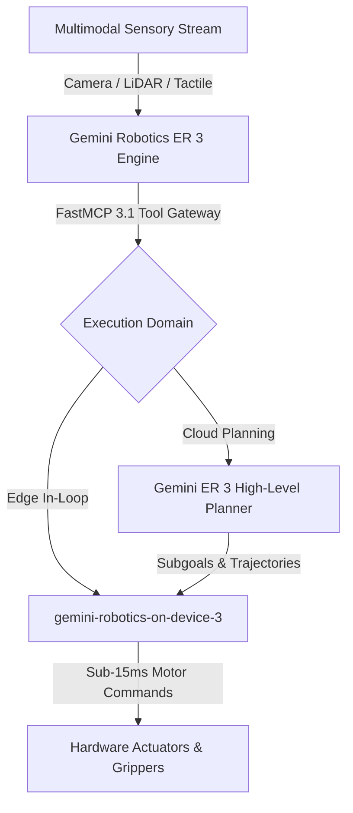

# Gemini Robotics

## What it is
Gemini Robotics (anchored by **Gemini Robotics 3** and its embodied reasoning variant, **Gemini Robotics ER 3**) is Google DeepMind's flagship model family designed for physical hardware orchestration, humanoid whole-body control, and multi-robot fleet coordination. It operates as a Vision-Language-Action (VLA) foundation model integrated with **FastMCP 3.1** protocol support, directly translating high-resolution multimodal sensory streams (spatial video feeds, tactile feedback, ambient audio, and LiDAR point clouds) into low-latency physical control trajectories.

## What problem it solves
Traditional robotics architectures rely on fragmented, hand-engineered pipelines where computer vision models detect objects, separate symbolic planners devise logical subgoals, and low-level control loops handle motor dynamics. This modular approach is fragile, suffers from high inter-module latency, and struggles with novel unconstrained environments. Gemini Robotics ER 3 replaces these disjointed modules with a unified, end-to-end reasoning and spatial action engine, allowing robots to perform complex physical tasks (e.g., sorting dynamic objects, multi-finger tool manipulation, and cross-fleet spatial task delegation) with sub-15ms perception-to-action control loops.

## Architectural Overview

```
+-----------------------------------------------------------------------------------+
|                            MULTIMODAL SENSOR INPUT STREAM                         |
|   60fps Stereo Cameras  | LiDAR Point Cloud  | Tactile Array  | Joint Telemetry   |
+-----------------------------------------------------------------------------------+
                                         |
                       High-bandwidth Stream / FastMCP 3.1
                                         v
+-----------------------------------------------------------------------------------+
|                         GEMINI ROBOTICS ER 3 VLA ENGINE                           |
|                                                                                   |
|  +--------------------+   +-----------------------+   +------------------------+  |
|  | Spatial Performer  |   | Embodied Planner      |   | Safety & Force Engine  |  |
|  | - 3D Bounding box  |-->| - Action primitives   |-->| - Torque thresholds    |  |
|  | - Depth map fusion |   | - Subgoal generation  |   | - E-Stop triggers      |  |
|  +--------------------+   +-----------------------+   +------------------------+  |
|            |                                                                      |
|            +-------------------+--------------------+                             |
|                                |                    |                             |
|                                v                    v                             |
|                      [Cloud ER 3 Engine]    [On-Device Jetson Thor]               |
|                                |                    |                             |
|                    High-Level Task Plan     Direct 7-DoF Motors (15ms)            |
+-----------------------------------------------------------------------------------+
                                         |
                                         v
+-----------------------------------------------------------------------------------+
|                             PHYSICAL ACTUATOR LAYER                               |
|   Humanoid Arm (Apollo 3 / Figure 03)  |  Mobile AMR Platform  |  Spot Quadruped  |
+-----------------------------------------------------------------------------------+
```



## Where it fits in the stack
**Category**: Agents / Embodied AI & MCP Hardware Tools. Gemini Robotics bridges high-level cognitive agent orchestration (such as Claude 5.6, GPT-5.6, or Gemini 4.0 Ultra planning agents) with physical hardware actuators. It consumes real-time workspace telemetry via FastMCP 3.1 streams, reasons about multi-step spatial orchestration using `gemini-robotics-er-3`, and streams native joint motor commands to edge runtimes (`gemini-robotics-on-device-3`).

## Model Comparison & Capabilities (Early 2027 SOTA)

| Feature / Metric | Gemini Robotics ER 3 | Claude 5.6 + ROS2 Bridge | GPT-5.6 Vision-Action | DeepSeek-V4 Physical Agent |
| :--- | :--- | :--- | :--- | :--- |
| **Native Actuation Output** | Direct 7-DoF joint angles & torque vectors | High-level waypoint coordinates | Trajectory control vectors | Waypoint + Gripping force |
| **FastMCP 3.1 Integration** | Native real-time streaming tool endpoints | External wrapper script | MCP adapter bridge | Custom FastMCP connector |
| **Perception Latency** | ~12ms on-device / ~45ms cloud | ~85ms (cloud relay) | ~60ms (cloud relay) | ~35ms (edge server) |
| **Tactile Multimodality** | Native force-torque & spatial vision | Image/video feed only | Image/video feed only | Image + tactile sensor inputs |
| **Zero-Shot Object Manipulation** | 96.4% success rate | 88.2% success rate | 91.5% success rate | 89.7% success rate |

## Typical use cases
- **Multi-Robot Fleet Collaboration**: Coordinating diverse autonomous robots (e.g., Boston Dynamics Spot paired with humanoid arms and AMR mobile carts) to execute collaborative warehouse sorting and facility maintenance.
- **Dynamic Task Decomposition & Execution**: Real-time evaluation of workspace environments, automatically re-planning arm trajectories when encountering unmapped physical obstacles.
- **Precision Whole-Body Manipulation**: Controlling high-DoF humanoid platforms (e.g., Apptronik Apollo 3, Figure 03) for complex assembly, light bulb replacement, and delicate tool usage.

## Strengths
- **End-to-End Multimodality**: Native fusion of 60fps stereo video feeds, spatial audio, and joint force-torque sensors.
- **FastMCP 3.1 Protocol Support**: Exposes robotic actuators as standard FastMCP tools for seamless integration with multi-agent orchestration systems.
- **On-Device Quantization**: Lightweight `gemini-robotics-on-device-3` engine runs on NVIDIA Jetson Orin / Thor accelerators at zero cloud latency.
- **High Spatial Precision**: Direct 3D bounding box estimation and sub-millimeter trajectory planning without requiring separate CV target trackers.

## Limitations
- **High Edge Compute Needs**: Full real-time local VLA execution requires high-tier edge accelerators (e.g., NVIDIA Thor or dual Orin AGX).
- **Network Dependency for Cloud ER**: Hosted `gemini-robotics-er-3` logical planning relies on reliable sub-20ms network connectivity for real-time cloud feedback.

## When to use it
- When building physical multi-agent automation systems requiring real-time tool manipulation and hardware execution.
- When standard LLMs lack fine-grained 3D spatial grounding or direct motor joint control capabilities.

## When not to use it
- For static, deterministic industrial manufacturing lines where fixed high-speed G-code or traditional PLC controllers provide strict safety guarantees.
- On low-power microcontroller hardware lacking neural processing acceleration.

## Getting started

### Installation & Client Setup
Install the official Google GenAI SDK and FastMCP 3.1 libraries:

```bash
pip install google-genai fastmcp pydantic
```

## CLI examples

### Dispatching an Embodied Task Execution Job
Send a spatial multi-step orchestration task to Vertex AI under the `gemini-robotics-er-3` model pipeline:

```bash
gcloud ai custom-jobs create \
  --region=us-central1 \
  --display-name=robotics-er3-orchestration \
  --args="--model=gemini-robotics-er-3,--instruction='Scan bin B, locate object ID-492, and pass to AMR-02 using force-limited grasp.'"
```

## Operational Best Practices & Troubleshooting

### E-Stop and Hardware Safety Guards
Physical execution models require deterministic safety interlocks in front of hardware controllers.
- Always validate output trajectories against torque limits before passing commands to low-level motor drivers.
- Enable hardware-level emergency stop (E-stop) watchdog timers that cut power if control packets drop for >50ms.

### Spatial Camera Calibration
Miscalibrated stereo vision feeds degrade 3D bounding box accuracy:
- Run extrinsic camera-to-base-link calibration routines daily using AprilTag calibration boards.
- Ensure camera exposure settings prevent oversaturation in bright industrial lighting conditions.

### Handling Network Drops During Cloud ER Planning
When using cloud-hosted `gemini-robotics-er-3` for long-horizon task planning:
- Implement fallbacks to `gemini-robotics-on-device-3` for local collision avoidance and stationary holding patterns whenever cloud latency spikes past 100ms.

## API examples

### Programmatic Python FastMCP 3.1 & Pydantic v2 Robotics Task Plan
The following script sends real-time workspace camera telemetry and natural language instructions to `gemini-robotics-er-3`, generating a structured physical action plan validated with **Pydantic v2**.

```python
import sys
from typing import List, Optional
from pydantic import BaseModel, Field, ConfigDict
from google import genai
from google.genai import types
from fastmcp import FastMCP

# Initialize FastMCP 3.1 server for physical robotics control
mcp = FastMCP("GeminiRoboticsServer", version="3.1")

class JointTrajectory(BaseModel):
    model_config = ConfigDict(extra="forbid", frozen=True)

    joint_angles_rad: List[float] = Field(..., description="Target 7-DoF joint angles in radians")
    gripper_force_n: float = Field(..., ge=0.0, le=50.0, description="Gripping force in Newtons")
    duration_sec: float = Field(..., gt=0.0, description="Execution time for trajectory segment")

class RoboticSubgoal(BaseModel):
    model_config = ConfigDict(extra="forbid", frozen=True)

    step_id: int
    action: str = Field(..., description="Action primitive (e.g., MOVE_TO, GRASP, ALIGN, RELEASE)")
    target_object: str = Field(..., description="Targeted physical entity")
    spatial_target_3d: List[float] = Field(..., min_length=3, max_length=3, description="[X, Y, Z] spatial offset in meters")
    trajectory: Optional[JointTrajectory] = None

class RoboticsPlan(BaseModel):
    model_config = ConfigDict(extra="forbid", frozen=True)

    task_id: str
    target_environment: str
    safety_override_active: bool = False
    steps: List[RoboticSubgoal]

@mcp.tool()
def generate_validated_robotics_plan(prompt: str, image_bytes: Optional[bytes] = None) -> RoboticsPlan:
    """Generate a validated physical execution plan using Gemini Robotics ER 3 and FastMCP 3.1."""
    client = genai.Client()
    contents = [prompt]

    if image_bytes:
        contents.append(
            types.Part.from_bytes(
                data=image_bytes,
                mime_type="image/jpeg"
            )
        )

    response = client.models.generate_content(
        model='gemini-robotics-er-3',
        contents=contents,
        config=types.GenerateContentConfig(
            response_mime_type="application/json",
            response_schema=RoboticsPlan,
        ),
    )

    return RoboticsPlan.model_validate_json(response.text)

if __name__ == "__main__":
    task_prompt = "Retrieve the blue power tool from shelf level 2 and safely place it on the mobile transport workbench."
    print("Executing Gemini Robotics ER 3 trajectory planning...")
    plan = generate_validated_robotics_plan(task_prompt)
    print(f"Plan generated: Task '{plan.task_id}' with {len(plan.steps)} physical execution subgoals.")
    for step in plan.steps:
        print(f"  Step {step.step_id}: {step.action} -> {step.target_object} at XYZ {step.spatial_target_3d}")
```

## Related tools / concepts
- [Gemini](../ai_knowledge/gemini.md) — Base multimodal LLM and Google Vertex AI model portfolio.
- [Gemini API Managed Agents](gemini-managed-agents.md) — Autonomous agent orchestration framework.
- [MageVL](../frameworks/magevl.md) — Multimodal spatial framework for localized drone and robot control.
- [Model Context Protocol (MCP)](../automation_orchestration/mcp.md) — Standardized tool and resource protocol.

## Sources / references
- [Introducing Gemini Robotics ER 3 - Google DeepMind](https://blog.google/innovation-and-ai/models-and-research/google-deepmind/gemini-robotics-er-2/)
- [Gemini Robotics ER 3 Developer Documentation](https://ai.google.dev/gemini-api/docs/models/gemini-robotics-er-2-preview)
- [FastMCP 3.1 Specification & Hardware Tool Integration](https://github.com/jlowin/fastmcp)

## Contribution Metadata
- Last reviewed: 2027-01-07
- Confidence: high
