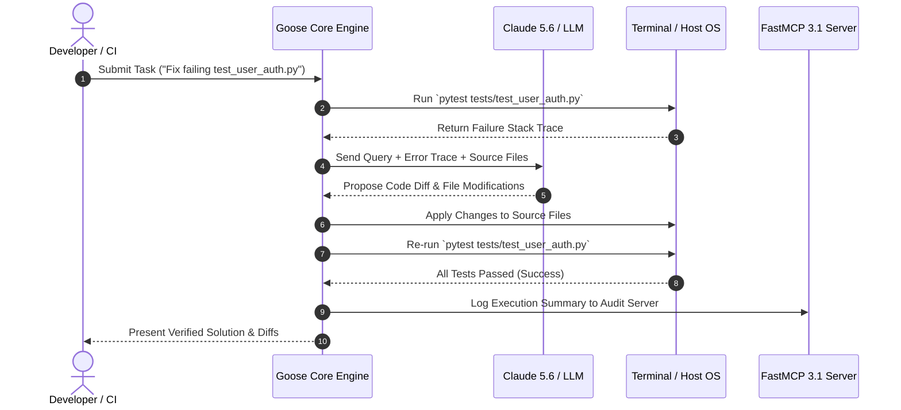

# Goose

Goose is an open-source, fully autonomous, extensible AI developer agent designed to execute, edit, test, debug, and verify software engineering tasks directly in local shells or remote containerized environments.

## What it is

Goose is hosted by the Agentic AI Foundation (AAIF) as an open-source developer platform that goes beyond inline code completion or passive chat assistance. It acts as an autonomous agent equipped with direct filesystem, shell, and network capabilities, running multi-step feedback loops to verify code changes before presenting solutions to developers.

By early 2027, Goose features native implementation of the [Model Context Protocol (MCP 3.1 / FastMCP 3.1)](../../knowledge_base/patterns/tool-calling-and-mcp.md) Task Protocol. This allows Goose to act both as a consumer of external MCP tool servers and as an agentic service provider that can be controlled remotely by frontier models—including [Claude 5.6](../ai_knowledge/claude.md), [GPT-5.6](../ai_knowledge/openai.md), [Gemini 4.0 Ultra](../ai_knowledge/gemini.md), [DeepSeek-V4](../ai_knowledge/claude.md), and local [Qwen 3.6 VL](../ai_knowledge/qwen.md).

```
+-------------------------------------------------------------------------------------------------------------------+
|                                            GOOSE AGENT ARCHITECTURE                                               |
+-------------------------------------------------------------------------------------------------------------------+
|                                                                                                                   |
|   +--------------------------+      +---------------------------+      +--------------------------+               |
|   | Goose CLI Interactive    |      | FastMCP 3.1 Client / Agent|      | GitHub Actions / CI Loop |               |
|   | Session (`goose session`)|      | (`goose run` Automation) |      | Automated PR Remediation |               |
|   +------------+-------------+      +-------------+-------------+      +------------+-------------+               |
|                |                                  |                                 |                             |
|                +----------------------------------+---------------------------------+                             |
|                                                   |                                                               |
|                                                   v                                                               |
|                                 +-----------------------------------+                                             |
|                                 |    Goose Core Agentic Runtime     |                                             |
|                                 |   (Session & Context Manager)     |                                             |
|                                 +-----------------+-----------------+                                             |
|                                                   | Protocol / API Calls                                          |
|                                                   v                                                               |
|       +-------------------------------------------+-------------------------------------------+                   |
|       |                                           |                                           |                   |
|       v                                           v                                           v                   |
| +---------------------------+             +---------------------------+             +---------------------------+ |
| | External Toolkits         |             | LLM Inference Provider    |             | Environment Sandbox       | |
| | (FastMCP 3.1 / Plugins)   |             | (Claude 5.6, LiteLLM)     |             | (Docker / Host Shell)     | |
| +---------------------------+             +---------------------------+             +---------------------------+ |
|                                                                                                                   |
+-------------------------------------------------------------------------------------------------------------------+
```

## What problem it solves

Conventional LLM coding assistants suffer from the "execution gap": they generate code suggestions without inspecting real-time runtime environments, running unit test suites, or checking dependency compatibility. When generated code contains bugs or missing imports, developers must manually copy errors back into the prompt, leading to high context-switching overhead.

Goose eliminates this gap by operating in an autonomous "write-run-debug-verify" loop. It writes code directly to files, executes tests in the host terminal, reads traceback errors, applies corrections, and iterates until all verification criteria pass.

## Where it fits in the stack

**Category**: Development Ops / Autonomous Software Agents.

Goose operates at the **execution and developer automation layer**:
1. **Foundation Models**: Interfaces with [Claude 5.6](../ai_knowledge/claude.md), [GPT-5.6](../ai_knowledge/openai.md), or local models via [LiteLLM](../../services/litellm.md) or [Ollama](../../services/ollama.md).
2. **Tool Infrastructure**: [MCP 3.1 / FastMCP 3.1](../../knowledge_base/patterns/tool-calling-and-mcp.md) toolkits.
3. **Execution Runtime**: Host OS shell, Docker containers, or Kubernetes dev pods.
4. **Peer Alternatives**: Direct open-source alternative to [Aider](../development_ops/aider.md), [OpenHands](../development_ops/openhands.md), and [Claude Code](../development_ops/claude-code.md).

## Typical use cases

- **Automated Test-Driven Bug Remediation**: Feeding pytest/vitest tracebacks into Goose and letting it locate relevant modules, write regression tests, and implement code fixes autonomously.
- **Large-Scale Repo Migrations**: Executing structural updates across hundreds of files (e.g., updating Pydantic v1 codebases to Pydantic v2 schemas).
- **Environment Bootstrapping**: Generating full project scaffolding, configuring CI/CD workflows, installing dependencies, and verifying build success.
- **Headless CI/CD Self-Healing**: Running Goose as a step in GitHub Actions pipelines to automatically analyze failed test runs, construct bug-fix commits, and open pull requests.

## Strengths

- **AAIF Vendor Neutrality**: Governance under the Agentic AI Foundation ensures long-term open-source freedom without proprietary lock-in.
- **Model Agnostic**: Native integration with LiteLLM allows instant switching across Anthropic, OpenAI, Google, DeepSeek, and local hardware backends.
- **Extensible FastMCP 3.1 Architecture**: Effortlessly connects to custom FastMCP 3.1 servers for specialized database or infrastructure tools.
- **Persistent Session State**: Maintains full session history, enabling long-running agent missions with pause, resume, and audit capabilities.

## Limitations

- **Sandboxing Requirements**: Direct shell and filesystem access mandates execution within isolated environments (e.g., Docker, DevContainers, or disposable VMs) when running untrusted prompts.
- **Token Expenditure**: Autonomous iteration loops on complex codebases can consume substantial token quotas if not constrained by turn limits.

## When to use it

- When you require an autonomous software engineering agent that can execute terminal commands and run test suites.
- When creating customized developer agents connected to internal enterprise toolkits via FastMCP 3.1.
- When automating multi-file refactoring or dependency upgrades across large repositories.

## When not to use it

- For simple inline code completions (where lightweight Copilot/Codeium extensions are faster).
- In lock-down security environments that strictly prohibit automated code execution on local filesystems.

## Getting started

### Installation & System Setup

```bash
# Official installer script
curl -fsSL https://goose.run/install.sh | sh

# Verify installation and view version
goose --version
```

### Basic Interactive Session

```bash
# Launch interactive agent session
goose session

# Launch session with custom model and max turn constraints
goose session --model claude-5-6-sonnet --max-turns 20
```

### Agentic Loop Execution Sequence



## CLI examples

### 1. Autonomous One-Off Mission
```bash
goose run "Audit the codebase for unused imports using ruff, fix them, and run pytest" \
          --model claude-5-6-sonnet \
          --max-turns 10
```

### 2. Launch Session with Specific FastMCP Tool Server
```bash
goose session --mcp-server http://localhost:8000/mcp --toolkit developer
```

### 3. Session Auditing
```bash
# List active agent sessions
goose session list

# Export session logs for security audit
goose session export --session-id "s_9841ab2" --output /tmp/goose_audit.json
```

## API examples

Below is a complete Python implementation demonstrating custom toolkit definition using Goose and Pydantic v2 schemas:

```python
"""
Goose Agent Custom Toolkit Implementation with Pydantic v2 Validation
"""

import subprocess
import re
from typing import Dict, Any, Optional
from pydantic import BaseModel, Field, field_validator, ConfigDict
from goose.toolkit import Toolkit, tool

class NetworkDiagnosticQuery(BaseModel):
    """
    Pydantic v2 Schema for Network Diagnostic Inputs with Strict Validation
    """
    model_config = ConfigDict(
        extra="forbid",
        str_strip_whitespace=True,
        validate_assignment=True
    )

    hostname: str = Field(
        ...,
        description="Target hostname or IPv4/IPv6 address for diagnostics"
    )
    count: int = Field(
        default=3,
        ge=1,
        le=10,
        description="Number of ping packets to send"
    )

    @field_validator("hostname")
    @classmethod
    def validate_hostname(cls, value: str) -> str:
        sanitized = value.strip().lower()
        # Prevent shell command injection
        if not re.match(r"^[a-zA-Z0-9.-]+$", sanitized):
            raise ValueError("Invalid hostname: contains unauthorized characters")
        if len(sanitized) > 253:
            raise ValueError("Hostname exceeds maximum allowable length")
        return sanitized

class NetworkDiagnosticsToolkit(Toolkit):
    """
    Custom Goose Toolkit providing safe network diagnostic commands
    """

    @tool
    def execute_ping(self, query: NetworkDiagnosticQuery) -> Dict[str, Any]:
        """
        Executes a controlled system ping against the verified target hostname.
        """
        cmd = ["ping", "-c", str(query.count), query.hostname]
        try:
            result = subprocess.run(
                cmd,
                capture_output=True,
                text=True,
                timeout=10
            )
            return {
                "success": result.returncode == 0,
                "hostname": query.hostname,
                "stdout": result.stdout,
                "stderr": result.stderr
            }
        except subprocess.TimeoutExpired:
            return {
                "success": False,
                "error": f"Ping operation timed out after 10 seconds for {query.hostname}"
            }
        except Exception as err:
            return {
                "success": False,
                "error": str(err)
            }
```

### FastMCP 3.1 Server Integration

Connecting Goose to an external FastMCP server for automated database schema inspection:

```python
"""
FastMCP 3.1 Server for Goose Agent Database Diagnostics
"""

from typing import Dict, Any
from pydantic import BaseModel, Field
from mcp.server.fastmcp import FastMCP

mcp = FastMCP("GooseDatabaseInspector")

class SchemaInspectionInput(BaseModel):
    table_name: str = Field(..., description="Name of the database table to inspect")

@mcp.tool()
def inspect_table_schema(input_data: SchemaInspectionInput) -> Dict[str, Any]:
    """
    Returns column metadata and indexes for a target database table.
    """
    # Mock database schema reflection for Goose inspection
    mock_schemas = {
        "users": {
            "columns": ["id (UUID)", "email (VARCHAR)", "created_at (TIMESTAMP)"],
            "indexes": ["idx_users_email"]
        },
        "orders": {
            "columns": ["id (UUID)", "user_id (UUID)", "total_amount (NUMERIC)"],
            "indexes": ["idx_orders_user_id"]
        }
    }

    table = input_data.table_name.lower()
    if table in mock_schemas:
        return {"success": True, "table": table, "schema": mock_schemas[table]}
    return {"success": False, "error": f"Table '{table}' not found in database metadata"}

if __name__ == "__main__":
    mcp.run()
```

## Related tools / concepts

- [Aider](../development_ops/aider.md): Pair-programming CLI tool.
- [OpenHands](../development_ops/openhands.md): Autonomous software agent platform.
- [Claude Code](../development_ops/claude-code.md): Terminal developer assistant.
- [FastMCP 3.1 Pattern](../../knowledge_base/patterns/tool-calling-and-mcp.md): Protocol for agent tool execution.
- [LiteLLM](../../services/litellm.md): Universal LLM proxy for multi-provider routing.

## Sources / references

- [Goose Official Site](https://goose.run)
- [Goose GitHub Repository](https://github.com/aaif-goose/goose)
- [Agentic AI Foundation (AAIF) Website](https://agentic-ai-foundation.org)

## Contribution Metadata

- Last reviewed: 2027-01-07
- Confidence: high
