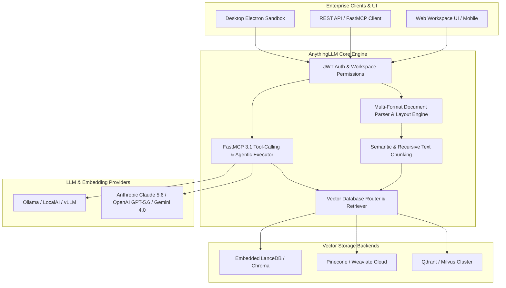

# AnythingLLM

## What it is
AnythingLLM is an enterprise-grade, privacy-first AI workspace and Agentic Retrieval-Augmented Generation (RAG) platform. Operating as a unified operational interface for document-grounded AI in 2027, AnythingLLM abstracts the complete end-to-end vector pipeline—document ingestion, layout-aware parsing, chunking, embedding generation, vector storage, self-correcting retrieval, and tool-augmented response generation.

It natively bridges open-source local inference servers (such as **Ollama**, **LocalAI**, **KoboldCPP**, and **vLLM**) with leading cloud frontier APIs (**Claude 5.6**, **GPT-5.6**, **Gemini 4.0 Ultra**, **Gemma 4**, **DeepSeek-V4**, and **Qwen 3.6 VL**). Designed for multi-tenant enterprise deployment as well as single-user desktop sandboxes, AnythingLLM features built-in support for **FastMCP 3.1** (Model Context Protocol), enabling autonomous agents to dynamic-bind external databases, web search endpoints, and execution runtimes without modifying core application code.



## What problem it solves
AnythingLLM directly addresses the **Knowledge Fragmentation** and **Data Sovereignty** challenges that arise when organizations attempt to adopt agentic workflows across disparate documents, enterprise siloes, and multi-tenant teams:

1. **Eliminating Custom Pipeline Boilerplate**: Building a production RAG system typically requires stitching together OCR parsers, embedding models, vector databases, LLM orchestration layers, and permission controls. AnythingLLM packages this entire architecture into a single, deployable binary or container.
2. **Data Leakage & Compliance Risks**: Sensitive internal documentation (financial audits, medical records, proprietary code) often cannot be transmitted to public cloud LLMs. AnythingLLM allows end-to-end zero-egress operation using local embedding models and local LLM backends.
3. **Hallucination and Blind Retrieval**: Traditional RAG systems fail when initial vector queries return low-relevance results. AnythingLLM incorporates **Self-Correcting Retrieval** loops and FastMCP 3.1 tool calls, permitting agents to iteratively refine queries, verify retrieved evidence, and fetch supplementary metadata before generating final answers.
4. **Multi-Tenant Access Isolation**: In enterprise environments, different departments require strict segmentation. AnythingLLM enforces workspace-level Access Control Lists (ACLs) and role-based permissions (Admin, Manager, Default User).

## Where it fits in the stack
**Category**: AI Assistants & Knowledge / Enterprise AI Workspaces & Agentic RAG Platform.

In the 2027 modern AI technology stack, AnythingLLM functions as the orchestration and user interface layer positioned directly above vector databases and underlying LLM providers. It serves as the bridge connecting human teams, enterprise document repositories, and autonomous FastMCP 3.1 agent loops.

```
+-----------------------------------------------------------------------+
|                       Human Users & API Clients                       |
+-----------------------------------------------------------------------+
                                    |
                                    v
+-----------------------------------------------------------------------+
|            AnythingLLM Enterprise Workspace / Desktop Engine          |
|  - Workspace ACLs & JWT Auth                                          |
|  - Self-Correcting FastMCP 3.1 Agentic RAG                            |
|  - Multi-Modal Document Parsing & Citation Engine                     |
+-----------------------------------------------------------------------+
        |                           |                           |
        v                           v                           v
+------------------+     +--------------------+     +-------------------+
|  Vector Backends |     | LLM / Embed Models |     | MCP 3.1 Tools     |
| (Qdrant, Milvus, |     | (Claude 5.6,       |     | (PostgreSQL,      |
|  LanceDB, PG)    |     |  Ollama, GPT-5.6)  |     |  GitHub, Web)     |
+------------------+     +--------------------+     +-------------------+
```

## Typical use cases
- **Self-Hosted Enterprise Knowledge Hub**: Connecting internal Confluence spaces, Notion databases, PDF repositories, and Slack export files into isolated workspaces with granular user permissions.
- **Agentic Document Mining & Extraction**: Deploying FastMCP 3.1 agents to process thousands of unstructured financial reports or legal contracts, extracting structured Pydantic v2 schemas for downstream analytical pipelines.
- **Local Air-Gapped RAG Sandbox**: Running AnythingLLM Desktop coupled with an **Ollama** instance loaded with **DeepSeek-R1** or **Gemma 4** on defense or healthcare workstations with network interface cards disabled.
- **Automated Customer Support Copilot**: Grounding support representatives in product documentation while exposing custom MCP tools to execute live order status checks and account resets.

## Strengths
- **Turnkey All-in-One Deployment**: Includes embedded database backends (LanceDB/SQLite) out of the box, requiring zero initial external database provisioning.
- **FastMCP 3.1 Native Protocol Support**: Full compliance with the 2027 Model Context Protocol standard, allowing seamless tool discovery, resource streaming, and prompt template injection.
- **Extensible Model Integration**: Instant configuration switches between local hardware execution (Ollama, LM Studio) and cloud APIs (Anthropic, OpenAI, Google Vertex AI, Azure OpenAI).
- **Comprehensive Document Parsing Engine**: Built-in layout-aware parser handling PDFs, Word documents, Excel spreadsheets, HTML web crawls, EPUBs, and raw audio transcripts.
- **Multi-Tenant Workspace Partitioning**: Unrestricted workspace generation with individual vector database namespace mapping and isolated system prompts.

## Limitations
- **Vector DB Migration at Ultra-Scale**: While the default embedded LanceDB instance handles up to hundreds of thousands of document chunks effectively, multi-million document enterprises must migrate to dedicated external vector clusters (Qdrant, Milvus, or Weaviate).
- **Limited Custom Frontend White-Labeling**: The opinionated React/Tailwind frontend can be customized via CSS themes and branding assets, but major UI component restructuring requires maintaining a custom fork of the open-source repository.
- **Hardware Footprint for Heavy Local OCR**: Processing image-heavy multi-page PDFs using local layout models requires dedicated GPU resources (8GB+ VRAM recommended).

## When to use it
- When your organization requires an operational, multi-user RAG workspace in hours rather than months.
- When strict data privacy requirements necessitate running the entire LLM, embedding, and vector stack completely on-premise.
- When non-technical users need an intuitive web dashboard to upload documents, build custom agents, and share conversation threads.
- When integrating dynamic FastMCP 3.1 tools alongside vector retrieval in a single conversational workspace.

## When not to use it
- When building a fully customized consumer-facing mobile application where you only require backend APIs (use raw [LangGraph](../frameworks/langgraph.md) or [PydanticAI](../frameworks/pydantic-ai.md) instead).
- When your application consists solely of transactional single-turn prompt calls without any document retrieval or persistent workspace needs.

## Getting started

### Installation Options

AnythingLLM is available as an all-in-one Desktop application, a multi-user Docker container, or an enterprise Kubernetes deployment.

#### 1. Docker Deployment (Recommended for Teams)
To run AnythingLLM with persistent storage on a server:

```bash
# Prepare persistent storage directory and configuration file
export STORAGE_LOCATION=$HOME/anythingllm
mkdir -p $STORAGE_LOCATION
touch "$STORAGE_LOCATION/.env"

# Run the official Docker container
docker run -d \
  --name anythingllm \
  -p 3001:3001 \
  --cap-add SYS_ADMIN \
  -v "$STORAGE_LOCATION:/app/storage" \
  -v "$STORAGE_LOCATION/.env:/app/server/.env" \
  -e STORAGE_DIR="/app/storage" \
  --restart always \
  mintplexlabs/anythingllm:latest
```

#### 2. Environment Configuration (`.env`)
Populate `$STORAGE_LOCATION/.env` with your desired configuration settings:

```env
SERVER_PORT=3001
JWT_SECRET="super-secret-jwt-key-change-in-production-2027"
DISABLE_TELEMETRY="true"

# Default Vector DB Setup
VECTOR_DB="lancedb"

# Default LLM Provider (Anthropic, OpenAI, Ollama, etc.)
LLM_PROVIDER="anthropic"
ANTHROPIC_API_KEY="sk-ant-api03-..."
ANTHROPIC_MODEL_PREF="claude-5-6-sonnet-20270107"

# MCP Protocol Configuration
ENABLE_MCP_HOSTING="true"
MCP_SERVER_PORT=8080
```

## CLI examples

### 1. Vector Database Re-Indexing and Inspection
When managing server installations, use the CLI utilities inside the container to inspect workspace vectors or trigger re-indexing routines:

```bash
# Execute internal maintenance script inside running container
docker exec -it anythingllm node /app/server/scripts/maintenance.js --workspace="engineering-docs" --reindex

# Export workspace vector metrics and chunk statistics
docker exec -it anythingllm node /app/server/scripts/export-stats.js --json
```

### 2. Multi-Workspace Batch Document Ingestion
You can programmatically ingest entire folders of documents into specific workspaces using curl and bash scripts:

```bash
#!/usr/bin/env bash
API_KEY="YOUR_ANYTHINGLLM_API_KEY"
ANYTHINGLLM_URL="http://localhost:3001/api/v1"
WORKSPACE_SLUG="financial-reports"

# 1. Upload Document
UPLOAD_RESPONSE=$(curl -s -X POST "$ANYTHINGLLM_URL/document/upload" \
  -H "Authorization: Bearer $API_KEY" \
  -F "file=@/data/q4_audit_report.pdf")

DOC_PATH=$(echo $UPLOAD_RESPONSE | jq -r '.documents[0].location')

# 2. Embed Document into Workspace
curl -s -X POST "$ANYTHINGLLM_URL/workspace/$WORKSPACE_SLUG/update-embeddings" \
  -H "Authorization: Bearer $API_KEY" \
  -H "Content-Type: application/json" \
  -d "{\"adds\": [\"$DOC_PATH\"], \"deletes\": []}"
```

### 3. Account and Key Management
Reset credentials or issue new admin API keys via CLI commands:

```bash
# Issue a new API key with supervisor privileges
docker exec -it anythingllm yarn prisma db seed -- --create-api-key --name="CI/CD Integration"
```

## API examples

### Python FastMCP 3.1 Server Integration with AnythingLLM
This example demonstrates setting up a **FastMCP 3.1** server that exposes custom backend tools to AnythingLLM agents, allowing them to query external operational metrics alongside RAG retrieval.

```python
import asyncpg
from fastmcp import FastMCP
from pydantic import BaseModel, Field

# Initialize FastMCP 3.1 server
mcp = FastMCP("AnythingLLM Operational Tools")

class InventoryQuery(BaseModel):
    sku: str = Field(..., description="Stock keeping unit ID (e.g. SKU-9921)")
    warehouse_id: str = Field(default="wh-main", description="Target warehouse facility")

class SystemMetricsQuery(BaseModel):
    service_name: str = Field(..., description="Target service name, e.g. payment-service")

@mcp.tool()
async def get_live_inventory(params: InventoryQuery) -> dict:
    """Retrieves real-time stock levels from the central inventory database."""
    # Simulated database lookup
    return {
        "sku": params.sku,
        "warehouse": params.warehouse_id,
        "available_units": 1420,
        "reserved_units": 85,
        "status": "IN_STOCK"
    }

@mcp.tool()
async def check_service_latency(params: SystemMetricsQuery) -> dict:
    """Queries Prometheus metrics for service latency breakdown."""
    return {
        "service": params.service_name,
        "p95_latency_ms": 18.4,
        "error_rate_pct": 0.002,
        "health": "HEALTHY"
    }

if __name__ == "__main__":
    # Start the FastMCP server on port 8080 for AnythingLLM binding
    mcp.run(transport="sse", port=8080)
```

### Production Pydantic v2 Schema for AnythingLLM Workspace API
This Python script enforces strict Pydantic v2 schema validation for AnythingLLM workspace configuration, document metadata, self-correcting RAG parameters, and chat execution outputs.

```python
from datetime import datetime
from enum import Enum
from typing import List, Optional, Dict, Any
from pydantic import BaseModel, Field, field_validator, ConfigDict

class VectorDistanceMetric(str, Enum):
    COSINE = "cosine"
    EUCLIDEAN = "euclidean"
    INNER_PRODUCT = "inner_product"

class SearchMode(str, Enum):
    VECTOR = "vector"
    HYBRID = "hybrid"
    FULL_TEXT = "full_text"

class ChunkingStrategy(BaseModel):
    chunk_size: int = Field(default=1000, ge=100, le=4000)
    chunk_overlap: int = Field(default=200, ge=0, le=1000)

    @field_validator("chunk_overlap")
    @classmethod
    def validate_overlap(cls, v: int, info) -> int:
        if "chunk_size" in info.data and v >= info.data["chunk_size"]:
            raise ValueError("chunk_overlap must be strictly less than chunk_size")
        return v

class WorkspaceSettings(BaseModel):
    model_config = ConfigDict(extra="ignore")

    name: str = Field(..., min_length=2, max_length=100)
    slug: str = Field(..., pattern=r"^[a-z0-9-]+$")
    open_mcp_enabled: bool = Field(default=True)
    search_mode: SearchMode = Field(default=SearchMode.HYBRID)
    vector_metric: VectorDistanceMetric = Field(default=VectorDistanceMetric.COSINE)
    similarity_threshold: float = Field(default=0.75, ge=0.0, le=1.0)
    max_context_chunks: int = Field(default=8, ge=1, le=32)
    chunking: ChunkingStrategy = Field(default_factory=ChunkingStrategy)

class ChatMessagePayload(BaseModel):
    message: str = Field(..., min_length=1)
    mode: str = Field(default="query", pattern=r"^(query|chat)$")
    mcp_version: str = Field(default="FastMCP 3.1")
    temperature: float = Field(default=0.2, ge=0.0, le=2.0)
    session_id: Optional[str] = None

class DocumentCitation(BaseModel):
    doc_id: str
    title: str
    chunk_text: str
    score: float
    page_number: Optional[int] = None

class ChatResponse(BaseModel):
    id: str
    response: str
    citations: List[DocumentCitation] = Field(default_factory=list)
    tokens_used: int
    executed_tools: List[Dict[str, Any]] = Field(default_factory=list)
    timestamp: datetime = Field(default_factory=datetime.utcnow)

# Example Execution & Validation
if __name__ == "__main__":
    # Validate Workspace Configuration
    config_data = {
        "name": "Engineering Operations KB",
        "slug": "eng-ops-kb",
        "open_mcp_enabled": True,
        "search_mode": "hybrid",
        "vector_metric": "cosine",
        "similarity_threshold": 0.82,
        "max_context_chunks": 12,
        "chunking": {
            "chunk_size": 1200,
            "chunk_overlap": 150
        }
    }

    workspace = WorkspaceSettings.model_validate(config_data)
    print(f"Validated Workspace: {workspace.name} (Slug: {workspace.slug})")
    print(f"Config JSON:\n{workspace.model_dump_json(indent=2)}")
```

## Related tools / concepts
- [LobeHub](lobehub.md) — Multi-agent platform and UI interface.
- [Open WebUI](../../services/open-webui.md) — Extensible web user interface for LLMs and local models.
- [Dify](dify.md) — Visual LLM application development platform.
- [Ollama](../../services/ollama.md) — Local model serving runtime.
- [Weaviate](../infrastructure/weaviate.md) — High-performance cloud and local vector database.
- [Agentic RAG](../../knowledge_base/patterns/data-copilot-agentic-rag.md) — Core architectural pattern behind self-correcting document retrieval.
- [MCP](../../knowledge_base/patterns/tool-calling-and-mcp.md) — Support for external tool and resource integration.
- [Self-Healing Agents](../../knowledge_base/self-healing-agent-research.md) — Frameworks for agents that correct search query failures autonomously.
- [Data Copilot Reference Implementation](../../reference-implementations/data-copilot/skeleton-guide.md) — Reference design guide for enterprise agentic RAG setups.

## Sources / references
- [AnythingLLM Official Site](https://anythingllm.com)
- [AnythingLLM Documentation](https://docs.useanything.com)
- [GitHub Repository](https://github.com/Mintplex-Labs/anything-llm)
- [AnythingLLM Agentic RAG Architecture & Patterns](https://anythingllm.com/blog/agentic-rag-patterns)
- [Data Copilot Reference Implementation Guide](../../reference-implementations/data-copilot/skeleton-guide.md)

## Contribution Metadata
- Last reviewed: 2027-01-07
- Confidence: high
