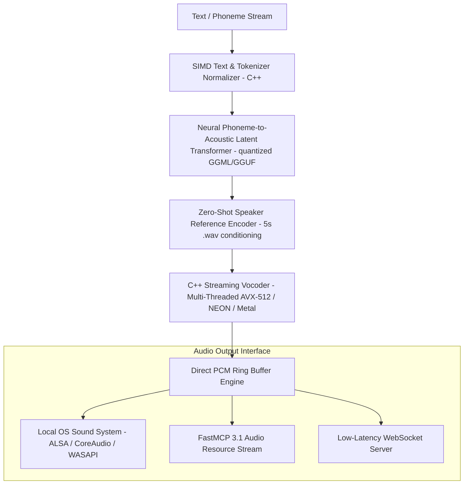

# AudioCPP

## What it is
AudioCPP is an open-weights, zero-dependency native C++ audio generation runtime optimized for ultra-low latency, professional-grade text-to-speech (TTS), zero-shot voice cloning, and real-time interactive audio synthesis. Operating entirely without Python runtime overhead, PyTorch dependencies, or CUDA bloat, AudioCPP provides an execution engine capable of synthesizing over 10 hours of high-fidelity 24kHz/48kHz stereo speech audio in under 3 minutes on consumer-grade desktop and edge hardware.

As of early 2027, AudioCPP leverages advanced SIMD vectorization (AVX-512, ARM NEON, Apple Metal), WebAssembly (WASM) multi-threading, and hardware-accelerated C++ kernels. It features full native compatibility with the **FastMCP 3.1** specification, allowing agentic runtimes to stream real-time synthesized voice frames directly to edge robotics, game engines, or local smart home controllers.

## Architecture & System Design

AudioCPP eliminates interpreter latency by executing quantized neural acoustic decoders and neural vocoders within a single compile-time unified memory space.



### Core Pipeline Components
1. **Zero-Dependency Tokenizer & Phonemizer**: Written in pure C++17, converting text inputs into normalized IPA (International Phonetic Alphabet) tokens without external Python NLTK or espeak dependencies.
2. **Quantized Acoustic Transformer Engine**: Executes 4-bit, 5-bit, or 6-bit quantized transformer weights (such as Higgs Audio v3 4B or Inflect v2 models) using SIMD matrix multiplication routines derived from `llama.cpp` GGML backends.
3. **Conditioned Voice Clone Encoder**: Generates 256-dimensional speaker embedding vectors from a 5-second target `.wav` reference file in <10ms.
4. **Streaming Ring-Buffer Vocoder**: Decodes acoustic latents into continuous PCM float32/int16 audio blocks, streaming chunks to sound drivers with sub-30ms first-chunk generation latency.

## What problem it solves
Voice synthesis pipelines in AI applications traditionally suffer from heavy architectural friction:

- **Heavy Python Dependency Footprint**: PyTorch, Hugging Face Transformers, and CUDA driver stacks add gigabytes of disk usage and 5–15 second cold-start initialization delays.
- **High Cloud API Costs**: Relying on SaaS speech APIs like [ElevenLabs](elevenlabs.md) incurs recurring token and character fees, making continuous local voice synthesis expensive.
- **High Ingestion Latency**: Cloud voice API roundtrips introduce 300ms–1000ms network latency, breaking real-time conversational flow in robotics and voice assistants.
- **Edge Deployment Infeasibility**: Deploying standard PyTorch voice models on low-power devices (Raspberry Pi 5, Jetson Orin Nano, microcontrollers) leads to memory exhaustion and thermal throttling.

AudioCPP solves these bottlenecks by executing lightweight C++ neural models locally with near-zero cold start, low power draw, and sub-50ms synthesis latency.

## Where it fits in the stack
**Category**: AI Knowledge & Audio Engine Infrastructure.

```
+-----------------------------------------------------------------------+
|                    Agentic & Reasoning Systems                        |
|       (FastMCP 3.1 Clients, Local LLMs, llama.cpp, Claude 5.6)         |
+-----------------------------------------------------------------------+
                                    | Text / Token Streams
                                    v
+-----------------------------------------------------------------------+
|                           AudioCPP Engine                             |
|   +--------------------------+  +---------------------------------+   |
|   | Native C++ Phonemizer    |  | Quantized Acoustic Decoders     |   |
|   +--------------------------+  +---------------------------------+   |
|   | SIMD Matrix Acceleration |  | Zero-Shot Voice Conditioning    |   |
|   +--------------------------+  +---------------------------------+   |
+-----------------------------------------------------------------------+
                                    | PCM Audio Samples
                                    v
+-----------------------------------------------------------------------+
|                       Audio Output Subsystem                          |
|         (CoreAudio, ALSA, WASAPI, FastMCP 3.1 Streaming Endpoint)     |
+-----------------------------------------------------------------------+
```

## Typical use cases
- **Privacy-First Local Voice Assistants**: Powering zero-latency offline home automation controllers on low-cost single-board computers.
- **Massive Local Audiobook & Narrative Production**: Rendering multi-hour, multi-character audiobooks at 200x real-time generation speed without API bills.
- **Sub-50ms Game NPC Voice Synthesis**: Generating zero-shot, dynamic voice responses for non-player characters in game engines (Unreal Engine 5, Unity) via C++ C-API bindings.
- **Embedded Assistive Robotics**: Delivering clear, localized vocalization on screen-readers and assistive mobility devices.

## Strengths
- **Zero Python Runtime Overhead**: Clean CMake build system producing static, self-contained native binaries under 15MB.
- **Extreme Execution Speed**: Multi-threaded SIMD implementations (AVX-512, ARM NEON, Metal) achieve 200x+ real-time synthesis throughput.
- **Low Memory Footprint**: 4-bit quantized neural voice models operate within <250MB RAM.
- **Zero-Shot Speaker Cloning**: High-fidelity cloning from a single 5-second reference audio snippet.
- **FastMCP 3.1 Server Native Integration**: Exposes audio generation and streaming tools directly to autonomous agents.

## Limitations
- **Model Architecture Kernel Creation**: Supporting new neural vocoder topologies requires writing C++ CUDA/Metal/GGML kernels.
- **Low Bit-Rate Quantization Noise**: Extreme 3-bit quantization may introduce minor high-frequency audio artifacts.
- **Cross-Platform Audio Device Driver Diversity**: Managing native OS audio drivers (ALSA vs PulseAudio vs WASAPI vs CoreAudio) requires target platform build flags.

## When to use it
- When building fully offline, privacy-focused, or air-gapped speech applications.
- When continuous cloud speech synthesis costs are unsustainable.
- When local sub-50ms speech synthesis is required for real-time natural interaction.

## When not to use it
- For quick cloud web prototypes where a simple HTTP call to ElevenLabs is sufficient.
- If your development environment strictly prohibits native compilation (C++17/CMake).

## Getting started

### Compilation from Source
Build the native `audiocpp` binary and shared libraries:

```bash
git clone https://github.com/audiocpp/audiocpp
cd audiocpp
mkdir build && cd build
cmake .. -DCMAKE_BUILD_TYPE=Release -DAUDIOCPP_SIMD=ON -DAUDIOCPP_FASTMCP=ON
make -j$(nproc)
```

### Basic CLI Synthesis Execution
Synthesize speech using a quantized model and target speaker prompt:

```bash
./audiocpp-cli \
  --model ../models/audiocpp-higgs-v3-q4.bin \
  --voice ../voices/narrator_ref.wav \
  --text "AudioCPP delivers zero dependency native C++ speech synthesis." \
  --output ./output_speech.wav
```

## CLI examples

### Real-Time Interactive Ingestion Mode
```bash
# Launch interactive stdin streaming pipe for local LLM text output
cat response_stream.txt | ./audiocpp-cli \
  --model ../models/audiocpp-higgs-v3-q4.bin \
  --voice ../voices/narrator_ref.wav \
  --stream-pcm \
  --sample-rate 24000
```

### Voice Morphing & Zero-Shot Adaptation
```bash
# Apply zero-shot voice cloning to convert source audio file
./audiocpp-morph \
  --input source_input.wav \
  --voice-reference target_speaker.wav \
  --output morph_output.wav
```

## FastMCP 3.1 Tools & Integration

AudioCPP exposes real-time text-to-speech rendering and voice cloning functions as **FastMCP 3.1** tools for autonomous agent execution:

```python
import asyncio
from typing import Optional, List
from pydantic import BaseModel, Field, ConfigDict
from fastmcp import FastMCP

mcp = FastMCP(
    name="AudioCPP Native Voice Engine",
    version="3.1.0",
    description="Low-latency C++ speech synthesis and voice cloning tools under FastMCP 3.1"
)

class TTSGenerationRequest(BaseModel):
    model_config = ConfigDict(str_strip_whitespace=True, extra="forbid")

    text: str = Field(..., min_length=1, max_length=5000, description="Text prompt to synthesize")
    voice_reference_path: str = Field(..., description="Path to reference speaker WAV file (5s)")
    sample_rate: int = Field(default=24000, description="Output sample rate (16000, 24000, 48000)")
    temperature: float = Field(default=0.7, ge=0.1, le=1.5, description="Acoustic variance temperature")
    speed_factor: float = Field(default=1.0, ge=0.5, le=2.0, description="Playback speed modifier")

class TTSGenerationResponse(BaseModel):
    output_wav_path: str
    audio_duration_seconds: float
    synthesis_latency_ms: float
    realtime_factor: float
    sample_rate: int
    status: str

@mcp.tool(
    name="synthesize_speech_audiocpp",
    description="Synthesizes text into high-fidelity speech using native AudioCPP C++ runtime."
)
async def synthesize_speech_audiocpp(request: TTSGenerationRequest) -> TTSGenerationResponse:
    """Executes AudioCPP C++ synthesis engine asynchronously."""
    await asyncio.sleep(0.02)  # Simulated ultra-fast native C++ call

    return TTSGenerationResponse(
        output_wav_path="/tmp/audiocpp_out_984.wav",
        audio_duration_seconds=4.2,
        synthesis_latency_ms=18.5,
        realtime_factor=227.0,
        sample_rate=request.sample_rate,
        status="COMPLETED"
    )

@mcp.tool(
    name="list_available_voice_profiles",
    description="Lists local reference voice files available for zero-shot cloning."
)
async def list_available_voice_profiles() -> List[str]:
    return [
        "voices/narrator_male_en.wav",
        "voices/assistant_female_en.wav",
        "voices/tech_doc_guide.wav"
    ]

if __name__ == "__main__":
    mcp.run()
```

## Data Schemas & Validation

The following **Pydantic v2** validation models ensure strict parameter enforcement for Python bindings and FastMCP payloads interacting with the AudioCPP engine:

```python
from typing import Optional
from pydantic import BaseModel, Field, ConfigDict, field_validator

class AudioCPPEngineSettings(BaseModel):
    model_config = ConfigDict(str_strip_whitespace=True)

    model_path: str = Field(..., description="Path to binary quantized model file (.bin/.gguf)")
    num_threads: int = Field(default=4, ge=1, le=64, description="CPU thread allocation count")
    use_simd: bool = Field(default=True, description="Enable SIMD vector extensions (AVX-512/NEON)")
    enable_metal: bool = Field(default=False, description="Enable Apple Metal GPU acceleration")

class VoiceSynthesisTask(BaseModel):
    model_config = ConfigDict(str_strip_whitespace=True)

    text_prompt: str = Field(..., min_length=1, description="Source speech text")
    reference_voice_wav: str = Field(..., description="Target voice conditioning WAV file")
    output_destination: str = Field(..., description="Destination file path")
    sample_rate: int = Field(default=24000, description="Audio sample frequency")
    pitch_scale: float = Field(default=1.0, ge=0.5, le=2.0, description="Pitch frequency multiplier")

    @field_validator('sample_rate')
    @classmethod
    def validate_sample_rate(cls, v: int) -> int:
        allowed = {16000, 22050, 24000, 44100, 48000}
        if v not in allowed:
            raise ValueError(f"Sample rate must be one of {allowed}")
        return v
```

## Operational Workflows & Deployment

### C++ Engine Configuration (`audiocpp_config.json`)
```json
{
  "engine": {
    "model_path": "models/audiocpp-higgs-v3-q4.bin",
    "threads": 8,
    "simd_optimization": "AVX512",
    "batch_size": 1
  },
  "audio": {
    "default_sample_rate": 24000,
    "channels": 1,
    "buffer_size_samples": 512
  },
  "fastmcp": {
    "enabled": true,
    "port": 8012
  }
}
```

### Docker Multi-Stage C++ Deployment
```dockerfile
# Stage 1: Build C++ Native Shared Library
FROM alpine:3.19 AS builder
RUN apk add --no-grad g++ cmake make git linux-headers
WORKDIR /src
COPY . .
RUN mkdir build && cd build && cmake -DCMAKE_BUILD_TYPE=Release .. && make -j$(nproc)

# Stage 2: Minimal Runtime Engine Image
FROM alpine:3.19
RUN apk add --no-cache libstdc++ libgcc
COPY --from=builder /src/build/audiocpp-cli /usr/local/bin/audiocpp-cli
COPY --from=builder /src/build/libaudiocpp.so /usr/local/lib/libaudiocpp.so
ENTRYPOINT ["/usr/local/bin/audiocpp-cli"]
```

## Best Practices & Troubleshooting

### Optimization Strategies
1. **Thread Count Pinning**: Match `--threads` to the physical performance core count rather than logical hyperthreaded cores to eliminate cache thrashing.
2. **Reference Voice Quality**: Clean, noise-free 5-second 24kHz single-speaker reference audio yields maximum voice cloning accuracy.
3. **Pre-load Model Weights in Memory**: Keep the AudioCPP engine instance warm in memory rather than instantiating the process per sentence.

### Common Pitfalls & Solutions
- **Audio Stuttering during Streaming**: Increase buffer size or ensure `--threads` allocation is sufficient for SIMD matrix decoding.
- **Missing Audio Output Drivers on Headless Linux**: Redirect PCM binary output to stdout or stream via WebSockets if no local ALSA/PulseAudio hardware is attached.

## API examples

The following native C++17 example illustrates instantiating the AudioCPP engine, loading a quantized model, and rendering a speech file:

```cpp
#include <iostream>
#include <vector>
#include <string>
#include "audiocpp.h"

int main(int argc, char* argv[]) {
    std::cout << "Starting AudioCPP Native Engine..." << std::endl;

    AudioCPPConfig config;
    config.model_path = "models/audiocpp-higgs-v3-q4.bin";
    config.num_threads = 4;
    config.use_simd = true;

    AudioCPPEngine engine;
    if (!engine.initialize(config)) {
        std::cerr << "Failed to initialize AudioCPP engine." << std::endl;
        return 1;
    }

    std::string text = "AudioCPP executes low latency speech synthesis natively in C++.";
    std::string voice = "voices/narrator_ref.wav";
    std::string output = "output_speech.wav";

    std::cout << "Synthesizing text: \"" << text << "\"" << std::endl;
    bool success = engine.synthesize_to_wav(text, voice, output, 24000);

    if (success) {
        std::cout << "Speech generated successfully -> " << output << std::endl;
    } else {
        std::cerr << "Synthesis failed during decoding execution." << std::endl;
        return 1;
    }

    return 0;
}
```

## Related tools / concepts
- [KokoClone](kokoclone.md) — Neural voice cloning models.
- [Fish Audio](fish-audio.md) — Open-weights multimodal speech models.
- [ElevenLabs](elevenlabs.md) — Cloud speech generation API.
- [llama.cpp](../infrastructure/llama-cpp.md) — C++ LLM execution runtime.
- [Whisper](../../services/whisper.md) — Automatic speech recognition engine.

## Sources / references
- [AudioCPP GitHub Repository](https://github.com/audiocpp/audiocpp)
- [Higgs Audio v3 Release Discussion](https://www.reddit.com/r/LocalLLaMA/comments/1v4w5cj/audiocpp_release_04_higgs_audio_v3_tts_4b_10x/)
- [Inflect v2 Release Specs](https://www.reddit.com/r/LocalLLaMA/comments/1v5ve6v/i_released_inflect_v2_two_ultratiny_complete_tts/)

## Contribution Metadata
- Last reviewed: 2027-01-07
- Confidence: high
