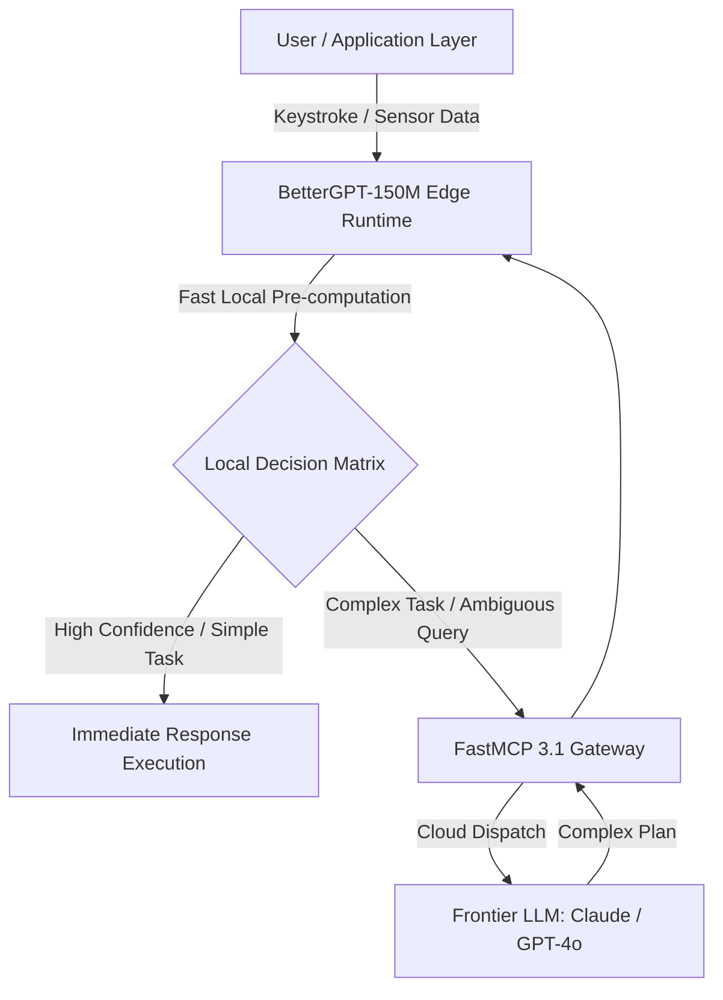

# BetterGPT-150M

BetterGPT-150M is an ultra-compact, 150-million parameter causal language model designed for high-throughput local completion, edge device text generation, offline telemetry parsing, and ultra-low-latency micro-agent utility execution.

## What it is

BetterGPT-150M is a highly efficient, open-weights causal language model with approximately 152 million parameters. Developed by the **thinkingmachines** team, it is engineered for high-speed causal inference, local text autocomplete, and structured classification on resource-constrained hardware. It serves as an accessible baseline for edge developers, embedded systems engineers, and multi-agent systems researchers who require an offline language model without GPU dependencies.

With its compact footprint (~300MB in FP16, under ~80MB in 4-bit quantization), BetterGPT-150M brings autoregressive transformer capabilities to microcontrollers, single-board computers (such as Raspberry Pi 5 or NVIDIA Jetson Orin Nano), and client-side WebAssembly runtimes. In multi-agent architectures, it acts as a zero-latency speculative helper, local query router, and offline telemetry sanitizer.

## What problem it solves

Frontier LLMs (such as Claude 3.7 Sonnet, GPT-4o, or Gemini 2.5 Flash) require discrete GPU acceleration, substantial memory bandwidth, and persistent cloud connectivity. High API invocation latency (>200ms) and token costs make them impractical for real-time keystroke completion, low-power IoT sensor loop evaluation, or completely disconnected edge deployments.

BetterGPT-150M resolves these limitations by executing entirely on standard ARM and x86 CPUs with sub-10ms token generation latency. It eliminates cloud API costs, guarantees complete data privacy for local log parsing, and functions reliably in air-gapped environments where network access is restricted or unavailable.

## Where it fits in the stack

**Local Model / Edge Compute Layer**. BetterGPT-150M functions as a lightweight local inference engine, providing instant text completions and micro-agent helper tasks for larger orchestrators.



## Typical use cases

- **Smart Terminal & IDE Autocomplete**: Delivering sub-15ms real-time shell command, inline code, and Markdown completions inside local editors without cloud round-trips.
- **Wasm & WebGPU In-Browser Inference**: Running client-side LLM features directly inside browser runtimes using ONNX Web or WebGPU pipelines for offline web applications.
- **Mock Endpoints for Agent Testing**: Rapidly simulating LLM response streams in automated test suites for multi-agent frameworks without incurring API token expenses.
- **Edge Sensor Telemetry Analysis**: Parsing, summarizing, and classifying dense IoT sensor telemetry streams directly on gateway devices before forwarding summarized metrics to cloud datastores.
- **Speculative Decoding Accelerator**: Serving as a lightweight draft model in speculative decoding setups alongside larger open-weights foundation models (such as Llama 3 8B or Gemma 2 9B).

## Strengths

- **Ultra-Compact Footprint**: ~152M parameters yield a ~300MB FP16 disk footprint and under 100MB RAM usage in quantized GGML/GGUF formats.
- **Exceptional CPU Throughput**: Achieves over 80 tokens/second on standard ARM64 laptop processors and 35+ tokens/second on low-power single-board computers.
- **Permissive Open Weights**: Distributed under open licenses permitting unrestricted fine-tuning, domain adaptation, commercial embedding, and offline distribution.
- **Hugging Face & ONNX Native**: Instantiates seamlessly via PyTorch `transformers`, ONNX Runtime, Llama.cpp, and WebGPU frameworks.
- **Deterministic Latency**: Eliminates network jitter, web gateway throttling, and cloud provider rate limits for mission-critical edge loops.

## Limitations

- **Reasoning Capacity**: Incapable of complex multi-step logical deduction, deep mathematical reasoning, or full-repository code editing compared to frontier models.
- **Context Horizon**: Optimized for short-context completions (up to 1,024 or 2,048 tokens) rather than long-document analysis or extensive chat histories.
- **Knowledge Depth**: Retains limited internal parametric knowledge; relies heavily on Retrieval-Augmented Generation (RAG) for factual accuracy.
- **Instruction Following**: Requires precise prompt structuring and fine-tuning for strict JSON/tool-calling output compliance.

## When to use it

- When building 100% offline edge applications that require immediate text generation with zero network latency.
- For embedded systems, smart home controllers, and IoT devices operating under strict memory and power constraints.
- For mocking LLM generation in rapid local unit tests, CI/CD pipelines, and benchmark suites.
- As a local pre-filter or router to sanitize sensitive telemetry before dispatching complex queries to cloud LLMs.

## When not to use it

- For complex architectural reasoning, full-file software code refactoring, or multi-step symbolic logic.
- When high factual accuracy across broad historical or domain knowledge without retrieval augmentation is required.
- For multi-turn conversational agents demanding complex roleplay, emotional nuance, or deep stylistic adaptation.

## Getting started

Load BetterGPT-150M using Python's `transformers` library or run quantized weights with `llama.cpp`:

```bash
# Install transformers, torch, and fastmcp dependencies
pip install transformers torch fastmcp pydantic
```

Execute a simple completion script in Python:

```python
from transformers import pipeline

generator = pipeline("text-generation", model="thinkingmachines/BetterGPT-150M")
result = generator("Automated edge computing enables", max_new_tokens=30)
print(result[0]["generated_text"])
```

## CLI examples

Download model weights and execute local generation or ONNX export via CLI:

```bash
# Download model weights from Hugging Face Hub
huggingface-cli download thinkingmachines/BetterGPT-150M

# Run instant generation via inline Python execution
python3 -c "
from transformers import pipeline
generator = pipeline('text-generation', model='thinkingmachines/BetterGPT-150M')
print(generator('System status check:', max_new_tokens=25))
"

# Benchmark CPU execution latency using optimum or ONNX Runtime CLI
optimum-cli export onnx --model thinkingmachines/BetterGPT-150M onnx_output/
```

## API examples

### FastMCP 3.1 Local Autocomplete Server
The following example implements a **FastMCP 3.1** server that hosts BetterGPT-150M as an ultra-fast local completion tool.

```python
import time
from fastmcp import FastMCP
from pydantic import BaseModel, Field
from transformers import pipeline

# Initialize FastMCP Server
mcp = FastMCP("BetterGPT-150M Fast Completion Server")

# Load model pipeline into memory
generator = pipeline("text-generation", model="thinkingmachines/BetterGPT-150M")

class AutocompleteRequest(BaseModel):
    prompt: str = Field(..., min_length=1, max_length=1000, description="Input prompt for local completion")
    max_tokens: int = Field(default=30, ge=1, le=256, description="Maximum new tokens to generate")
    temperature: float = Field(default=0.7, ge=0.0, le=2.0, description="Sampling temperature")

class AutocompleteResponse(BaseModel):
    prompt: str
    generated_text: str
    tokens_generated: int
    duration_ms: float
    throughput_tok_sec: float

@mcp.tool()
def generate_completion(request: AutocompleteRequest) -> AutocompleteResponse:
    """Generate high-speed local text completions using BetterGPT-150M."""
    start_time = time.perf_counter()

    outputs = generator(
        request.prompt,
        max_new_tokens=request.max_tokens,
        temperature=request.temperature,
        do_sample=(request.temperature > 0.0)
    )

    end_time = time.perf_counter()
    duration_ms = (end_time - start_time) * 1000.0
    full_text = outputs[0]["generated_text"]
    completion_text = full_text[len(request.prompt):]

    # Rough token estimation based on word count
    tokens_count = len(completion_text.split())
    throughput = (tokens_count / (duration_ms / 1000.0)) if duration_ms > 0 else 0.0

    return AutocompleteResponse(
        prompt=request.prompt,
        generated_text=completion_text,
        tokens_generated=tokens_count,
        duration_ms=round(duration_ms, 2),
        throughput_tok_sec=round(throughput, 2)
    )

if __name__ == "__main__":
    mcp.run()
```

### Telemetry Parsing and Validation with Pydantic v2
In edge IoT environments, validating model output metadata before downstream consumption ensures reliability.

```python
from typing import Optional
from pydantic import BaseModel, Field, field_validator

class TelemetryReport(BaseModel):
    sensor_id: str = Field(..., description="Unique hardware sensor identifier")
    raw_reading: float = Field(..., description="Raw metric value")
    bettergpt_summary: str = Field(..., min_length=5, description="Edge LLM classification summary")
    alert_level: str = Field("INFO", description="Assigned severity level")
    latency_ms: float = Field(..., gt=0.0, description="Inference latency in milliseconds")

    @field_validator("alert_level")
    @classmethod
    def validate_alert_level(cls, value: str) -> str:
        allowed = {"INFO", "WARNING", "CRITICAL"}
        if value.upper() not in allowed:
            raise ValueError(f"Alert level must be one of {allowed}")
        return value.upper()

# Sample validation execution
data = {
    "sensor_id": "EDGE-NODE-081",
    "raw_reading": 87.4,
    "bettergpt_summary": "Thermal reading elevated above normal baseline threshold.",
    "alert_level": "warning",
    "latency_ms": 8.45
}

report = TelemetryReport(**data)
print(f"Validated Telemetry [{report.sensor_id}]: {report.bettergpt_summary} (Alert: {report.alert_level})")
```

## Related tools / concepts

- [Inkling-Small](inkling-small.md) — SOTA compact small language model family from thinkingmachines.
- [AnsIGPT](ansigpt.md) — Zero-dependency C89 portable transformer inference runtime.
- [MicroGPT](microgpt.md) — Educational minimalist autoregressive transformer model.
- [Local LLMs](local_llms.md) — Strategic overview of offline model deployment architectures.
- [Hugging Face Hub](../providers/huggingface.md) — Open model registry host.
- [Ollama](../../services/ollama.md) — Local runner for quantized models.

## Sources / references

- [BetterGPT-150M on Hugging Face](https://huggingface.co/thinkingmachines/BetterGPT-150M)
- [LocalLLaMA Community Release Discussion](https://www.reddit.com/r/LocalLLaMA/comments/1v9oa1u/built_and_released_bettergpt150m_a_compact_150m/)

## Contribution Metadata

- Last reviewed: 2027-01-07
- Confidence: high
