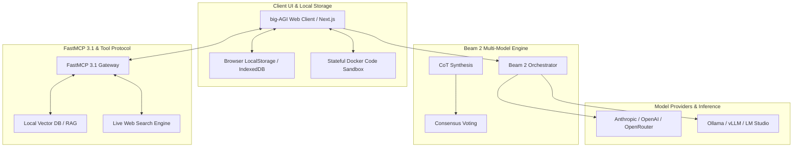

# big-AGI

## What it is
**big-AGI** is a local-first, vendor-neutral, professional AI workspace and multi-model orchestrator. Designed for power users, researchers, software engineers, and AI platform architects, it provides a high-density, ultra-low-latency web interface to query, compare, and orchestrate multiple LLMs simultaneously. Featuring the **Beam 2** multi-model synthesis engine, stateful code execution sandboxes, live web research tools, and native **FastMCP 3.1** protocol support, big-AGI turns individual LLM endpoints into an integrated multi-agent decision workspace.

Rather than locking users into a single AI provider interface, big-AGI routes requests across 20+ commercial APIs (Claude 5.1, GPT-5.5, Gemini 4.0) and local inference servers (Ollama, LM Studio, vLLM, llama.cpp), while storing all conversation histories and API keys locally in browser storage or encrypted user volumes.

## What problem it solves
Operating across isolated vendor web interfaces introduces severe friction, cognitive overhead, and evaluation blind spots:
- **Single-Model Bias & Blind Spots**: Relying on a single AI model for complex architectural decisions or debugging often leads to undetected hallucinations or suboptimal code. big-AGI queries multiple frontier models in parallel and synthesizes their consensus using Beam 2.
- **Interface Friction & Copy-Paste Fatigue**: Manually opening separate browser tabs, copying code snippets, and comparing outputs across multiple models is tedious. big-AGI presents side-by-side multi-model response streams in a unified high-density UI.
- **Stateless Code Sandbox Execution**: Inspecting and running LLM-generated code typically requires copying code into local terminals. big-AGI embeds stateful execution sandboxes directly into chat turns.
- **Privacy & Key Vendor Lock-in**: SaaS chat platforms store confidential chat logs on third-party servers and tie users to recurring subscription tiers. big-AGI operates local-first with zero intermediate proxy servers between the user's client and the target model endpoints.

## System Architecture & Orchestration Flow



## Where it fits in the stack
**Category**: AI & Knowledge / Professional AI Workspaces. Operating at the **Interface & Orchestration Layer**, big-AGI serves as a local-first control center connecting user browsers, FastMCP 3.1 tool servers, cloud API gateways ([OpenRouter](openrouter.md)), and local inference engines ([ollama](../../services/ollama.md), [vLLM](../infrastructure/vllm.md)).

## Key Features & Functional Modules
- **Beam 2 Multi-Model Synthesis**: Query up to 4 models concurrently, apply multi-perspective Chain-of-Thought (CoT) program pipelines, and merge optimal responses into a single authoritative answer.
- **FastMCP 3.1 Native Integration**: Connect local filesystems, SQL databases, and custom FastMCP servers directly into chat sessions with full parameter inspection.
- **Persistent Code Sandboxing**: Built-in container support for safe, stateful execution of Python, JavaScript, and Bash scripts across conversation turns.
- **Persona & System Prompt Library**: Pre-configured system prompts for specialized engineering personas (e.g., Senior Systems Architect, Security Auditor, Code Optimizer).
- **Interactive Markdown & Diagramming**: Native rendering of Mermaid.js architecture diagrams, LaTeX mathematical formulas, interactive tables, and code diff views.

## Typical use cases
- **Multi-Model Architecture Consensus**: Querying Claude 5.1, GPT-5.5, and Gemini 4.0 Pro in parallel to evaluate complex system design tradeoffs.
- **Interactive Code Debugging & Execution**: Executing generated Python scripts within stateful sandboxes to catch runtime errors immediately.
- **Local RAG & Knowledge Retrieval**: Connecting local vector databases via FastMCP 3.1 to answer queries using private document repositories.
- **Deep Technical Web Research**: Launching multi-step web searches with live URL citations and automated summary extraction.

## Strengths
- **Zero Lock-In & Local-First**: API keys and session histories remain under user control in local browser storage or encrypted volumes.
- **High Information Density**: UI designed specifically for power users, developers, and researchers who require low latency and high context throughput.
- **Beam 2 Synthesis Engine**: Advanced program-based model reasoning and voting synthesis far superior to simple side-by-side chats.
- **Comprehensive Provider Support**: Direct native compatibility with over 20 commercial and open-source model backends.

## Limitations
- **Power User UI Complexity**: The feature-rich, high-density UI can present a steep learning curve for non-technical casual users.
- **Browser-Bound Cache Management**: Relying on local browser storage requires regular JSON backup exports to avoid loss if browser data is cleared.

## When to use it
- When verifying mission-critical architectural designs or debugging complex code across multiple frontier models simultaneously.
- When seeking a self-hostable workspace with persistent execution sandboxes and FastMCP 3.1 tool calling built into the UI.
- When requiring complete control over sampling parameters, system prompts, and model routing.

## When not to use it
- For basic, low-density conversational chats on mobile devices where lightweight apps suffice.
- In strict enterprise environments that forbid direct client-to-API outbound internet connectivity without an enterprise proxy.

## Feature & Parameter Comparison Matrix

| Capability / Module | Standard Web Chat Clients | big-AGI Workspace | Technical Benefit |
| :--- | :--- | :--- | :--- |
| Model Execution Mode | Single Model Sequential | Beam 2 Concurrent Multi-Model | Eliminates single-model hallucinations through multi-model consensus |
| Code Execution | Static Syntax Highlighting | Stateful Docker Sandbox Container | Live runtime debugging directly within chat turns |
| Tool Integration | Closed Vendor Tools | FastMCP 3.1 Open Protocol | Seamless integration with local filesystems, DBs, and APIs |
| Data Privacy & Keys | Remote SaaS Cloud Storage | Local-First Browser Storage / Self-Hosted | Complete credential sovereignty and zero vendor logging |
| System Prompts | Fixed System Instructions | Dynamic Persona Presets & System Overrides | Fine-grained control over model behavior and output formatting |

## Getting started

### 1. Web Access
Access big-AGI directly in your browser at [app.big-agi.com](https://app.big-agi.com/) and configure your API keys in the settings menu.

### 2. Self-Hosted Docker Deployment
Deploy a persistent, self-hosted container instance on your local machine or server node:

```bash
docker run -d \
  --name big-agi \
  -p 3000:3000 \
  -e NEXT_PUBLIC_SHOW_BENCHMARKS=false \
  ghcr.io/enricoros/big-agi:latest
```

Open `http://localhost:3000` to access your self-hosted workspace.

## CLI examples

### 1. Local Development Build via Node.js
```bash
git clone https://github.com/enricoros/big-AGI.git && cd big-AGI
npm install
npm run dev
```

### 2. Updating Docker Container Build
```bash
docker pull ghcr.io/enricoros/big-agi:latest
docker stop big-agi && docker rm big-agi
docker run -d --name big-agi -p 3000:3000 ghcr.io/enricoros/big-agi:latest
```

### 3. Deploying to Private Vercel Instance
```bash
npx vercel --prod
```

## API examples

### 1. Python Beam 2 Multi-Model Synthesis Configuration & Pydantic v2 Validation
This example validates a Beam 2 multi-model execution configuration using Pydantic v2 schemas before issuing orchestrator calls:

```python
import asyncio
from typing import List, Optional
from pydantic import BaseModel, Field, ValidationError

class ModelWeight(BaseModel):
    model_id: str = Field(..., alias="modelId", description="Target model API identifier")
    weight: float = Field(default=1.0, ge=0.0, le=1.0, description="Voting weight")

class Beam2Config(BaseModel):
    synthesis_mode: str = Field("cot-merge", alias="synthesisMode")
    candidate_models: List[ModelWeight] = Field(..., alias="candidateModels")
    max_tokens: int = Field(2048, alias="maxTokens", ge=256, le=16384)
    temperature: float = Field(0.2, ge=0.0, le=2.0)
    system_instruction: Optional[str] = Field(None, alias="systemInstruction")

async def validate_beam_orchestration():
    raw_payload = {
        "synthesisMode": "majority-consensus-cot",
        "candidateModels": [
            {"modelId": "anthropic/claude-5.1-sonnet", "weight": 1.0},
            {"modelId": "openai/gpt-5.5", "weight": 0.9},
            {"modelId": "google/gemini-4.0-pro", "weight": 0.8}
        ],
        "maxTokens": 4096,
        "temperature": 0.3,
        "systemInstruction": "Synthesize the best system design tradeoffs and identify hidden race conditions."
    }

    try:
        beam_cfg = Beam2Config.model_validate(raw_payload)
        print("Beam 2 Orchestration Config Validated Successfully:")
        print(f"Mode: {beam_cfg.synthesis_mode}")
        print(f"Active Candidate Models: {len(beam_cfg.candidate_models)}")
        return beam_cfg
    except ValidationError as e:
        print("Validation error in Beam config:", e)
        raise

if __name__ == "__main__":
    asyncio.run(validate_beam_orchestration())
```

### 2. FastMCP 3.1 Gateway Connection to big-AGI Workspace
This script implements a FastMCP 3.1 tool server providing RAG vector search capabilities to big-AGI chat sessions:

```python
import asyncio
from pydantic import BaseModel, Field
from typing import List, Dict, Any

class SearchQuery(BaseModel):
    query: str = Field(..., min_length=3, description="Search query string")
    top_k: int = Field(default=3, ge=1, le=10)

class SearchHit(BaseModel):
    doc_id: str
    content: str
    relevance_score: float

class BigAGIFastMCPGateway:
    def __init__(self, server_name: str):
        self.server_name = server_name

    async def handle_tool_call(self, tool_name: str, args: Dict[str, Any]) -> List[Dict[str, Any]]:
        if tool_name == "search_knowledge_base":
            query_obj = SearchQuery.model_validate(args)
            print(f"Processing FastMCP 3.1 query '{query_obj.query}' on {self.server_name}...")

            # Simulate vector database lookup
            await asyncio.sleep(0.04)
            hits = [
                SearchHit(doc_id="arch-001", content="big-AGI local storage uses IndexedDB.", relevance_score=0.95),
                SearchHit(doc_id="arch-002", content="Beam 2 uses majority consensus voting.", relevance_score=0.89)
            ][:query_obj.top_k]

            return [hit.model_dump() for hit in hits]
        raise ValueError(f"Unknown tool: {tool_name}")

async def main():
    gateway = BigAGIFastMCPGateway(server_name="homelab-rag-server")
    results = await gateway.handle_tool_call("search_knowledge_base", {"query": "Beam 2 architecture", "top_k": 2})
    print("FastMCP Gateway Results:", results)

if __name__ == "__main__":
    asyncio.run(main())
```

## Related tools / concepts
- [LobeHub](lobehub.md) — Visual multi-agent chat interface.
- [OpenRouter](openrouter.md) — Unified API aggregator for intelligent model routing.
- [FastMCP 3.1](../../knowledge_base/patterns/tool-calling-and-mcp.md) — Open protocol for agent tools.
- [AnythingLLM](anythingllm.md) — Local document RAG workspace.
- [Claude Code](../development_ops/claude-code.md) — CLI software engineering agent.

## Sources / references
- [big-AGI Official Portal](https://big-agi.com/)
- [big-AGI GitHub Repository](https://github.com/enricoros/big-AGI)
- [big-AGI Release Documentation & Changelog](https://big-agi.com/docs/changelog)

---
## Contribution Metadata
- Last reviewed: 2027-01-07
- Confidence: high
