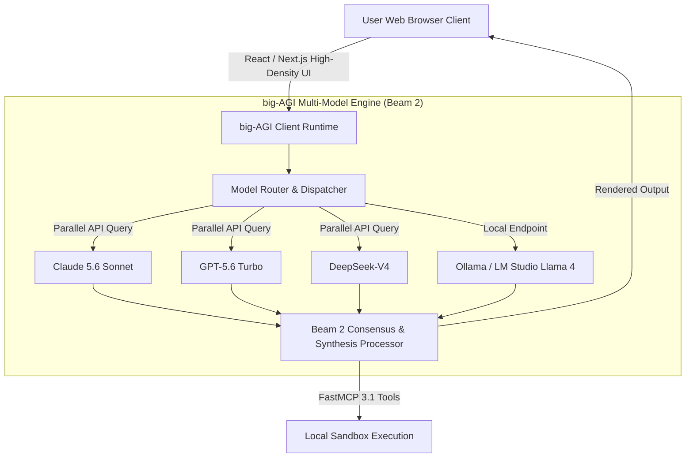

# big-AGI

## What it is
big-AGI is a local-first, vendor-neutral, professional AI workspace and multi-model orchestrator. Designed for power users, researchers, and engineers, it provides a high-density, low-latency web interface to query and orchestrate multiple models simultaneously. By early January 2027, big-AGI features the **Beam 2** multi-model synthesis engine, stateful code-execution sandboxes, and native **FastMCP 3.1** protocol support.



## What problem it solves
It overcomes the limitations and interface friction of single-model web clients. Instead of manually copying prompts across separate browser tabs to compare outputs, big-AGI queries frontier models (Claude 5.6, GPT-5.6, Gemini 4.0 Pro, DeepSeek-V4) in parallel, merges their insights via customizable consensus pipelines, and executes generated code in persistent sandboxes.

Key operational problems solved include:
- **Model Output Divergence & Hallucination Elimination**: Leveraging Beam 2 multi-model voting and consensus synthesis to verify answers across disparate model families.
- **Context Fragmentation**: Centralizing chat histories, custom system prompts, and multi-modal file attachments across cloud and local model providers.
- **Tool Access Isolation**: Connecting web-based chat workflows directly to local environment tool execution via FastMCP 3.1 protocols.

## Where it fits in the stack
**AI Assistants & Knowledge / Professional AI Workspace**. It acts as a local-first control panel connecting the user's browser, remote API providers (OpenAI, Anthropic, OpenRouter), and self-hosted inference servers (Ollama, LM Studio, vLLM).

## Typical use cases
- **Multi-Model Synthesis (Beam 2)**: Querying multiple models simultaneously, applying automated reasoning synthesis, and merging the best components into a single response.
- **Stateful Sandbox Code Execution**: Running and debugging Python or Shell scripts within persistent, isolated containers.
- **FastMCP 3.1 Tool Integration**: Connecting browser sessions to local databases, file systems, and custom tools via FastMCP 3.1 endpoints.
- **Deep Technical Research**: Launching multi-step web searches with live citations, diagramming (Mermaid.js), and resumable session checkpoints.

## Strengths
- **Instant Response UI**: Highly optimized Next.js/React frontend handling markdown, LaTeX math, and live charts without UI lag.
- **Beam 2 Merge Engine**: Fully customizable, program-based multi-model reasoning and voting synthesis.
- **Persistent Code Sandboxing**: Built-in container support for safe, stateful execution of code scripts across chat turns.
- **Zero Lock-In Provider Support**: Direct connections to 20+ model providers and local endpoints with native reasoning effort controls.
- **Local-First Privacy**: API keys and session histories are stored locally in the browser or encrypted in transit.

## Limitations
- **High Information Density**: The feature-rich UI can have a learning curve for casual users seeking a basic chat client.
- **Browser-Bound Storage**: Relying on local browser storage requires periodic manual backup exports to prevent accidental cache loss.

## When to use it
- When verifying complex architectural decisions or debugging tricky code across multiple frontier models.
- When seeking a self-hostable workspace with persistent execution sandboxes and tool calling built into chat.
- When requiring granular control over sampling parameters, system prompts, and tool calling schemas.

## When not to use it
- For quick, lightweight conversational chats on mobile devices where simple apps suffice.
- In corporate environments that strictly forbid direct browser-to-API internet connections.

## Getting started

### 1. Web App Access
Access big-AGI directly in your web browser at [app.big-agi.com](https://app.big-agi.com/) and enter your API credentials.

### 2. Self-Hosted (Docker)
Deploy a persistent, self-hosted container instance on your local machine or server:

```bash
docker run -d \
  --name big-agi \
  -p 3000:3000 \
  -e NEXT_PUBLIC_SHOW_BENCHMARKS=false \
  ghcr.io/enricoros/big-agi
```

Open `http://localhost:3000` to access your self-hosted workspace.

## CLI examples

### Clone and Run Dev Server
Clone repository and start local development server:
```bash
git clone https://github.com/enricoros/big-AGI.git && cd big-AGI
npm install && npm run dev
```

### Pull Latest Docker Build
Update self-hosted big-AGI Docker container:
```bash
docker pull ghcr.io/enricoros/big-agi && docker restart big-agi
```

### Deploy to Private Vercel Instance
Deploy production big-AGI instance directly to Vercel:
```bash
npx vercel --prod
```

## API examples

### Python: Pydantic v2 Beam 2 Multi-Model Synthesis Configuration
This Python script demonstrates configuring a Beam 2 multi-model consensus run for big-AGI with strict Pydantic v2 validation:

```python
import asyncio
from typing import List, Optional, Dict, Any
from pydantic import BaseModel, Field, field_validator

class CandidateModelSpec(BaseModel):
    model_id: str = Field(..., alias="modelId", description="Target model API identifier")
    weight: float = Field(default=1.0, ge=0.0, le=1.0, description="Voting weight")
    temperature: float = Field(default=0.2, ge=0.0, le=2.0)

    @field_validator('model_id')
    @classmethod
    def validate_model_id(cls, v: str) -> str:
        if not v or "/" not in v and "-" not in v:
            raise ValueError(f"Invalid model_id format: '{v}'")
        return v

class Beam2Config(BaseModel):
    synthesis_mode: str = Field("majority-consensus-cot", alias="synthesisMode")
    candidate_models: List[CandidateModelSpec] = Field(..., alias="candidateModels")
    max_tokens: int = Field(4096, alias="maxTokens")
    system_instruction: Optional[str] = Field(None, alias="systemInstruction")
    mcp_tool_enabled: bool = Field(default=True, alias="mcpToolEnabled")

def execute_beam_synthesis(payload: Dict[str, Any]) -> dict:
    validated_beam = Beam2Config.model_validate(payload)
    print("Beam 2 Multi-Model Config Validated successfully via Pydantic v2.")
    print(f"  Synthesis Mode: {validated_beam.synthesis_mode}")
    print(f"  Candidate Models Active: {len(validated_beam.candidate_models)}")
    print(f"  FastMCP 3.1 Integration: {validated_beam.mcp_tool_enabled}")

    return {
        "status": "configured",
        "active_candidates": [m.model_id for m in validated_beam.candidate_models],
        "synthesis_mode": validated_beam.synthesis_mode
    }

if __name__ == "__main__":
    raw_payload = {
        "synthesisMode": "majority-consensus-cot",
        "candidateModels": [
            {"modelId": "anthropic/claude-5.6-sonnet", "weight": 1.0, "temperature": 0.2},
            {"modelId": "openai/gpt-5.6-turbo", "weight": 0.8, "temperature": 0.3},
            {"modelId": "deepseek/deepseek-v4", "weight": 0.9, "temperature": 0.1}
        ],
        "maxTokens": 4096,
        "systemInstruction": "Synthesize response across candidate outputs and verify code safety.",
        "mcpToolEnabled": True
    }
    result = execute_beam_synthesis(raw_payload)
    print("Execution output summary:", result)
```

## Related tools / concepts
- [LobeHub](lobehub.md) — Visual multi-agent chat interface.
- [OpenRouter](openrouter.md) — Unified API aggregator for model routing.
- [FastMCP 3.1](../../knowledge_base/patterns/tool-calling-and-mcp.md) — Open protocol for agent tools.
- [AnythingLLM](anythingllm.md) — RAG workspace for local documents.
- [Claude Code](../development_ops/claude-code.md) — CLI software engineering agent.

## Sources / references
- [big-AGI Official Site](https://big-agi.com/)
- [big-AGI GitHub Repository](https://github.com/enricoros/big-AGI)
- [big-AGI Release Documentation](https://big-agi.com/docs/changelog)

## Contribution Metadata
- Last reviewed: 2027-01-07
- Confidence: high
