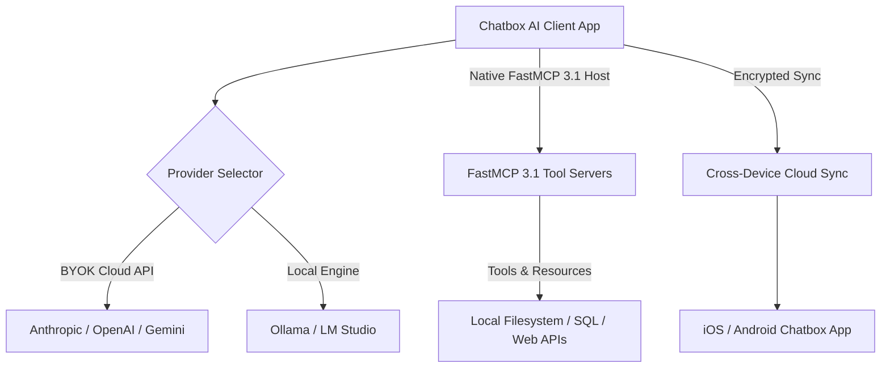

# Chatbox AI

## What it is

Chatbox AI is a cross-platform AI desktop and mobile application providing a unified, privacy-focused client interface to frontier models (Claude 3.7 Sonnet, GPT-4o, Gemini 2.5 Pro) and local runtimes (Ollama, LM Studio). By early 2027, Chatbox AI acts as a multi-model workspace featuring native **FastMCP 3.1** host capabilities, artifact previews, and end-to-end encrypted session synchronization across macOS, Windows, Linux, iOS, and Android.

Built as an open-core desktop application using Electron and React on desktop and React Native on mobile, Chatbox AI enables developers, researchers, and enterprise users to manage model interactions across multiple providers through a single polished GUI. It eliminates vendor lock-in by supporting direct Bring Your Own Key (BYOK) authentication, local model execution, and custom endpoint configurations.

## What problem it solves

Using AI across disparate web platforms creates fragmented chat histories, multiple monthly subscription fees, inconsistent UI features, and privacy concerns regarding model training on user inputs. Web interfaces often lack integration with local filesystems, custom developer tools, or self-hosted models running on local GPU infrastructure.

Chatbox AI addresses these issues by centralizing model access into a single application. It stores conversation histories locally or in user-controlled encrypted cloud storage, supports direct tool calling via FastMCP 3.1, renders code and visual artifacts natively, and allows switching between cloud APIs and local offline models with a single click.

## Where it fits in the stack

**AI Assistants & Knowledge / Multi-Provider Client**. Chatbox AI functions as the desktop and mobile client layer for cloud LLM APIs and local inference servers. Through native FastMCP 3.1 integration, it acts as an MCP host, connecting desktop users to local tools, databases, and filesystem connectors.



## Typical use cases

- **Multi-Device Research**: Initiating complex technical prompts on a desktop workstation and continuing research seamlessly on mobile devices via end-to-end encrypted session synchronization.
- **Local Model GUI Workspace**: Providing a high-performance desktop interface for self-hosted SLMs and quantized LLMs running locally via Ollama or LM Studio.
- **FastMCP 3.1 Tool Workflows**: Connecting local file systems, database query engines, and web search APIs directly to model chats using FastMCP 3.1 server tools.
- **Interactive Artifact Preview**: Rendering code snippets, HTML/SVG graphics, Markdown documentation, and Mermaid diagrams side-by-side with chat conversations.
- **Cost-Optimized API Switching**: Bypassing fixed monthly SaaS subscriptions by paying only for exact token consumption using personal API keys across multiple providers.

## Strengths

- **Native Multi-Platform Ecosystem**: Dedicated, responsive applications tailored for macOS, Windows, Linux, iOS, and Android.
- **FastMCP 3.1 Host Support**: Built-in support for discovering, configuring, and executing tools provided by FastMCP 3.1 servers.
- **Broad Model Support**: Direct integration with OpenAI, Anthropic, Google Gemini, OpenRouter, DeepSeek, and local OpenAI-compatible endpoints.
- **Interactive Artifact Viewer**: Clean side-by-side split view rendering generated code, HTML previews, and visual diagrams.
- **Privacy First (BYOK)**: User API keys and conversation histories remain stored locally or securely encrypted in cloud sync without being used for model training.
- **Custom System Prompts**: Configurable agent persona templates, custom temperature controls, and per-chat system message overrides.

## Limitations

- **Semi-Proprietary Architecture**: While community issue tracking and desktop client code are open, core synchronization services and mobile builds rely on proprietary backend services.
- **Sync Features Require Account**: Multi-device synchronization and premium agent preset sharing require a Chatbox Pro account.
- **Chat-Centric Scope**: Lacks the deep autonomous filesystem editing and terminal control found in dedicated CLI agents like [Claude Code](../development_ops/claude-code.md).
- **Resource Usage**: Desktop Electron bundle consumes moderate RAM when managing multiple active artifact previews simultaneously.

## When to use it

- When requiring a polished, multi-device chat client to switch seamlessly between Claude 3.7 Sonnet, GPT-4o, DeepSeek V3, and local models.
- When wanting to utilize FastMCP 3.1 tools in a visual chat desktop interface without building custom UI wrappers.
- When needing encrypted, cross-platform history sync for research and coding notes across desktop and mobile devices.
- For local model power users who want a rich GUI over Ollama or LM Studio.

## When not to use it

- For autonomous, terminal-driven code refactoring or multi-file repository modification (use [Claude Code](../development_ops/claude-code.md) or [Aider](../development_ops/aider.md)).
- If strict corporate compliance mandates 100% open-source software and self-hosted sync infrastructure (prefer [LibreChat](librechat.md)).
- When building headless background automation scripts or serverless agent microservices.

## Getting started

### Installation
1. **Desktop**: Download the installer for macOS, Windows, or Linux from [ChatboxAI.app](https://chatboxai.app/).
2. **Mobile**: Install Chatbox AI from the Apple App Store or Google Play Store.
3. **Configuration**: Open **Settings** > **Model**, choose your provider (e.g., Anthropic or Ollama), and enter your API key or endpoint URL.

### Connecting FastMCP 3.1 Servers
1. Open **Settings** > **MCP Servers**.
2. Register a new server using its endpoint URL (e.g., `http://localhost:3000/mcp`) or command execution string (`npx -y @modelcontextprotocol/server-filesystem /path`).
3. Chatbox will automatically discover available tools and present them for user authorization during chat turns.

## CLI examples

Inspect local configuration and manage Chatbox settings via command line:

```bash
# Locate Chatbox local sqlite database and settings on macOS
ls -la ~/Library/Application\ Support/chatbox/

# Inspect Chatbox configuration file on Linux
cat ~/.config/chatbox/config.json | grep -i "model"

# Backup local Chatbox configuration file before updates
cp ~/.config/chatbox/config.json ~/.config/chatbox/config.json.bak

# Launch local FastMCP 3.1 tool server for Chatbox integration
npx -y @modelcontextprotocol/server-memory
```

## API examples

### FastMCP 3.1 Server for Chatbox AI Tool Calls
The following Python script defines a FastMCP 3.1 server that provides filesystem search tools directly to Chatbox AI.

```python
import os
from glob import glob
from fastmcp import FastMCP
from pydantic import BaseModel, Field

# Initialize FastMCP Server for Chatbox integration
mcp = FastMCP("Chatbox Desktop Helper")

class FileSearchQuery(BaseModel):
    directory: str = Field(..., description="Target directory path to search")
    file_pattern: str = Field("*.md", description="Glob pattern for filtering files")

class FileSearchResult(BaseModel):
    matched_files: list[str]
    total_matches: int

@mcp.tool()
def search_local_files(query: FileSearchQuery) -> FileSearchResult:
    """Search local desktop directory files for matching patterns."""
    search_path = os.path.join(query.directory, query.file_pattern)
    matches = glob(search_path, recursive=True)

    return FileSearchResult(
        matched_files=matches[:20],
        total_matches=len(matches)
    )

if __name__ == "__main__":
    # Runs HTTP SSE endpoint compatible with Chatbox MCP host settings
    mcp.run(transport="sse", port=3000)
```

### Configuration Validation with Pydantic v2
Validate Chatbox provider configuration profiles programmatically before deploying configurations across team workstations:

```python
import json
from typing import List, Optional
from pydantic import BaseModel, Field, HttpUrl, ValidationError

class MCPServerConfig(BaseModel):
    name: str = Field(..., description="Server name")
    url: HttpUrl = Field(..., description="FastMCP 3.1 endpoint")
    enabled: bool = Field(True, description="Active status")

class ProviderProfile(BaseModel):
    name: str = Field(..., description="Profile identifier")
    api_key: str = Field(..., description="Provider secret key or placeholder")
    base_url: Optional[HttpUrl] = Field(None, description="Custom base endpoint URL")
    model: str = Field(..., description="Default model, e.g., claude-3-7-sonnet")
    mcp_servers: List[MCPServerConfig] = Field(default_factory=list, description="Associated FastMCP 3.1 servers")

class ChatboxConfig(BaseModel):
    version: str = Field("2.1.0", description="Configuration schema version")
    active_profile: str = Field(..., description="Active profile name")
    profiles: List[ProviderProfile] = Field(..., description="Registered connection profiles")

def validate_config(raw_json: str) -> Optional[ChatboxConfig]:
    try:
        data = json.loads(raw_json)
        return ChatboxConfig.model_validate(data)
    except ValidationError as e:
        print(f"Validation Error: {e.json()}")
        return None

# Test validation
raw_data = '''
{
    "version": "2.1.0",
    "active_profile": "anthropic-prod",
    "profiles": [
        {
            "name": "anthropic-prod",
            "api_key": "sk-ant-api03-...",
            "model": "claude-3-7-sonnet",
            "mcp_servers": [
                {"name": "local-tools", "url": "http://localhost:3000/mcp", "enabled": true}
            ]
        }
    ]
}
'''

config = validate_config(raw_data)
if config:
    print(f"Validated configuration for active profile: {config.active_profile}")
```

## Related tools / concepts

- [Model Context Protocol (MCP)](../automation_orchestration/mcp.md) — Standard protocol for client tool connection.
- [Ollama](../../services/ollama.md) — Local model engine supported by Chatbox.
- [Claude](claude.md) — Anthropic frontier models supported by Chatbox.
- [ChatGPT](chatgpt.md) — OpenAI models supported by Chatbox.
- [LibreChat](librechat.md) — Open-source multi-model web client.
- [Jan.ai](../infrastructure/jan-ai.md) — Local-first AI desktop client.

## Sources / references

- [Chatbox AI Official Site](https://chatboxai.app/)
- [Chatbox AI GitHub Repository](https://github.com/Bin-Huang/chatbox)
- [Chatbox MCP Integration Guide](https://chatboxai.app/docs/mcp)

## Contribution Metadata

- Last reviewed: 2027-01-07
- Confidence: high
