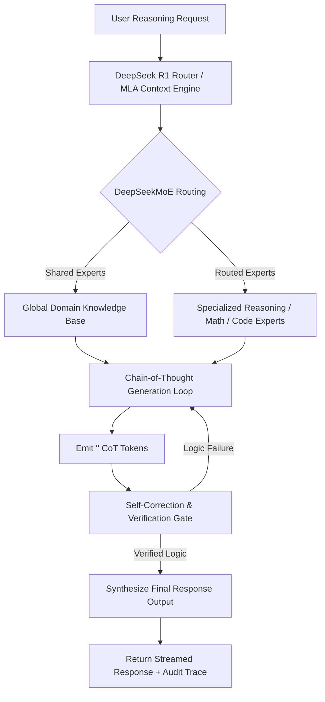
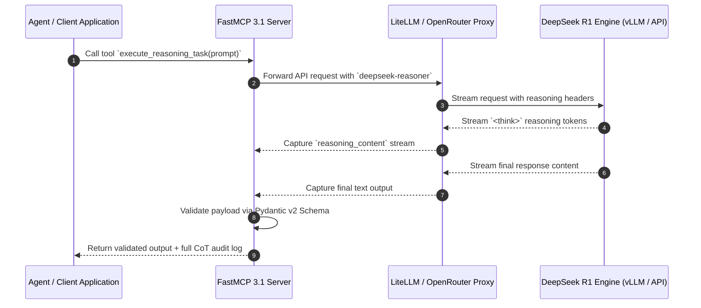
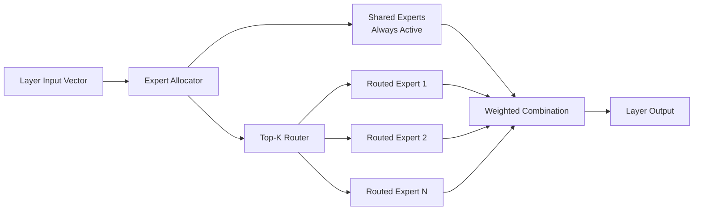

# DeepSeek R1

## What it is
DeepSeek R1 is a state-of-the-art open-weights reasoning model architecture developed by DeepSeek. Using large-scale reinforcement learning (RL) without heavy reliance on supervised fine-tuning (SFT) or human preference data, it achieves frontier reasoning performance in mathematics, software engineering, symbolic logic, and autonomous multi-agent task orchestration. In 2027, DeepSeek R1 and its architecture successors (such as **DeepSeek-V4-Reasoning** and distilled variants across Qwen and Llama backbones) serve as foundational open benchmarks for open-weights reasoning systems rivaling proprietary models like OpenAI's **GPT-5.6 / o3**, Anthropic's **Claude 5.6**, and Google's **Gemini 4.0 Ultra**.

DeepSeek R1 introduces an innovative Mixture-of-Experts (MoE) architecture coupled with Multi-Head Latent Attention (MLA) and DeepSeekMoE fine-grained expert routing. During generation, R1 explicitly generates Chain-of-Thought (CoT) reasoning tokens inside `<think>...</think>` blocks before synthesizing the final response.



## What problem it solves
DeepSeek R1 resolves critical operational challenges in enterprise AI engineering:

1. **Opaque Multi-Step Reasoning**: Closed-source reasoning endpoints obfuscate or strip internal reasoning traces. R1 exposes full Chain-of-Thought traces, enabling exact auditability, safety verification, and logical debugging across production systems.
2. **High API Costs for Deep Deliberation**: Complex tasks require tens of thousands of internal tokens. R1's cost per token is dramatically lower than proprietary alternatives, enabling cost-effective automated code refactoring, formal math verification, and agentic planning.
3. **Data Sovereignty & Offline Compliance**: Organizations subject to strict privacy or government compliance can host full 671B MoE models or quantized distilled variants completely on-premise without data egress risks.
4. **Distillation Efficiency**: R1 demonstrates that high-capacity reasoning capabilities can be distilled directly into smaller dense architectures (such as 1.5B, 7B, 14B, 32B, and 70B models), enabling high-tier reasoning on edge devices and local workstations.

## Where it fits in the stack
**Category**: AI Knowledge / Frontier Reasoning Engine
DeepSeek R1 operates as the high-capacity "reasoning kernel" in agentic architectures. It is integrated into agent frameworks via **FastMCP 3.1** protocol connections, routed through enterprise proxies such as [LiteLLM](../../services/litellm.md) or [OpenRouter](openrouter.md), and executed locally on high-VRAM GPU clusters via [vLLM](../infrastructure/vllm.md), SGLang, or [Ollama](../../services/ollama.md).



## Typical use cases
- **Automated Whole-Repo Refactoring**: Analyzing full-repository dependency graphs and generating multi-file patch plans via [Claude Code](../development_ops/claude-code.md) or [OpenHands](../development_ops/openhands.md).
- **Formal Verification & Theorem Proving**: Solving advanced symbolic math, differential equations, and formal code verification tasks in Lean 4 or Coq.
- **Agentic Strategic Planning**: Serving as the long-horizon top-level coordinator for complex autonomous sub-agent swarms.
- **Synthetic Dataset Generation**: Synthesizing verifiable Chain-of-Thought datasets to train domain-specific student models without human annotation bottlenecks.
- **Security Vulnerability Auditing**: Performing symbolic control-flow analysis and taint tracking across multi-tier backend services.

## Architecture & Technical Deep Dive

### Multi-Head Latent Attention (MLA)
Standard Multi-Head Attention (MHA) creates massive Key-Value (KV) cache overheads during long-context inference, severely limiting batch sizes and increasing hardware costs. DeepSeek R1 solves this bottleneck using Multi-Head Latent Attention (MLA), which projects keys and values into a low-rank latent vector prior to caching:

$$\mathbf{c}_t^{KV} = W^{DKV} \mathbf{h}_t$$

Where $\mathbf{c}_t^{KV}$ is the compressed latent KV vector and $W^{DKV}$ is the down-projection matrix. During self-attention computation, keys and values are dynamically uncompressed on the fly, reducing KV cache memory footprint by over 93% compared to standard MHA. This architectural optimization enables DeepSeek R1 to serve up to 128k context windows across thousands of concurrent streams on standard GPU clusters.

### DeepSeekMoE Fine-Grained Architecture
DeepSeek R1 leverages DeepSeekMoE fine-grained expert routing. Instead of selecting among a few large experts (e.g., 2 out of 8 experts), DeepSeekMoE splits experts into many smaller fine-grained experts (e.g., 16 or 64 activated experts out of 256):



By isolating shared experts for universally applicable domain knowledge and dynamically routing fine-grained experts for specialized reasoning, R1 achieves higher representation expressiveness at significantly lower FLOP count per token generated.

### Reinforcement Learning Framework (R1-Zero & R1)
DeepSeek R1 was trained using Group Relative Policy Optimization (GRPO), an RL algorithm that bypasses the need for a separate critic model. In GRPO, for each input prompt $q$, the model samples a group of outputs $\{o_1, o_2, \dots, o_G\}$ and computes relative rewards based on rule-based verifiers (e.g., math accuracy, format compliance, compiler execution output):

$$\mathcal{J}_{GRPO}(\theta) = \mathbb{E}\left[ \frac{1}{G} \sum_{i=1}^G \min \left( \frac{\pi_\theta(o_i|q)}{\pi_{\theta_{old}}(o_i|q)} A_i, \text{clip}\left(\frac{\pi_\theta(o_i|q)}{\pi_{\theta_{old}}(o_i|q)}, 1-\epsilon, 1+\epsilon\right) A_i \right) \right]$$

Where the advantage $A_i$ is normalized relative to the mean and standard deviation of rewards within the sampled group:

$$A_i = \frac{r_i - \text{mean}(\mathbf{r})}{\text{std}(\mathbf{r})}$$

This relative reward structure allows DeepSeek R1 to naturally develop self-correction, verification loops, and long reasoning chains without explicit human preference alignment or reward model over-fitting.

## Strengths
- **Frontier Reasoning Metrics**: Achieves competitive results on MATH-500, AIME 2026, Codeforces, and SWE-bench Verified benchmarks.
- **Transparent Reasoning Traces**: Exposes explicit `<think>` tokens allowing full auditability of internal logic.
- **High Cost Efficiency**: DeepSeek API pricing and self-hosted inference offer significantly lower cost per token than closed alternatives.
- **Open Distillation Licenses**: Distilled models built on top of [Qwen](qwen.md) and [Llama 4](local_llms.md) bases allow full commercial customization.
- **Native FastMCP 3.1 Integration**: Readily integrates into modern agent tool-use loops.
- **Architecture Innovations**: Multi-Head Latent Attention (MLA) reduces KV-cache memory consumption by up to 93% compared to standard MHA during long-context processing.

## Limitations
- **Latency Overhead**: Generating exhaustive internal CoT tokens introduces initial response latency (10-60s) before final answer synthesis.
- **Verbosity & Token Consumption**: Can over-analyze trivial questions, generating unnecessary reasoning tokens if prompt bounds are unspecified.
- **Self-Hosting VRAM Requirements**: Running the full 671B parameter Mixture-of-Experts (MoE) model requires 80GB+ VRAM GPU clusters (e.g., 8x NVIDIA H200/B200).
- **Language Bias**: Highly optimized for English and Chinese reasoning; performance in minority languages may vary without fine-tuning.

## When to use it
- When tasks demand multi-step logical deduction, complex math, or deep code auditing.
- When full transparency of the reasoning path is required for safety or compliance.
- When self-hosting a top-tier reasoning LLM on private hardware is mandatory.
- When generating synthetic reasoning datasets for fine-tuning smaller open-weights models.

## When not to use it
- For **low-latency sub-second chat** or basic FAQ responses where fast models like [Gemma 3](local_llms.md) or DeepSeek-V4-Flash excel.
- For simple document summarization without complex logical dependencies.
- In low-memory environments where local model distillation (e.g., 7B-14B) is still too heavy.

## Getting started

### Local Execution via Ollama
Run distilled DeepSeek R1 models locally on consumer/workstation GPUs:

```bash
# Run 14B Qwen-distilled variant locally
ollama run deepseek-r1:14b

# Run 70B Llama-distilled variant on multi-GPU workstation
ollama run deepseek-r1:70b
```

### Direct DeepSeek API Setup
```bash
export DEEPSEEK_API_KEY="sk-your-deepseek-api-key-here"
```

## CLI examples

### 1. Basic Reasoning Query via cURL
Extract both the reasoning trace and final response using the DeepSeek API:

```bash
curl https://api.deepseek.com/v1/chat/completions \
  -H "Content-Type: application/json" \
  -H "Authorization: Bearer $DEEPSEEK_API_KEY" \
  -d '{
        "model": "deepseek-reasoner",
        "messages": [
          {"role": "user", "content": "Explain the Byzantine Generals Problem and prove why consensus requires >3f+1 nodes in an asynchronous network."}
        ],
        "max_tokens": 4096,
        "temperature": 0.6
      }'
```

### 2. Stream Reasoning Output via LiteLLM CLI
Stream real-time reasoning traces through LiteLLM proxy:

```bash
litellm --model deepseek/deepseek-reasoner \
  --temperature 0.2 \
  --stream \
  --messages '[{"role": "user", "content": "Prove that sqrt(3) is irrational using proof by contradiction."}]'
```

### 3. Deploying Full DeepSeek R1 671B via vLLM
Launch high-throughput vLLM inference server on an 8x H100 GPU cluster:

```bash
vllm serve deepseek-ai/DeepSeek-R1 \
  --tensor-parallel-size 8 \
  --enable-reasoning \
  --reasoning-parser deepseek_r1 \
  --port 8000 \
  --max-model-len 32768
```

## API examples

### FastMCP 3.1 & Pydantic v2 Reasoning Inspection
This production Python script demonstrates capturing internal thinking tokens (`reasoning_content`) and final responses from DeepSeek R1, validating the payload using **Pydantic v2** and exposing it through **FastMCP 3.1**.

```python
import os
import asyncio
from typing import Optional, List
from pydantic import BaseModel, Field, ValidationError
from fastmcp import FastMCP

mcp = FastMCP("DeepSeek R1 Production Reasoning Server")

class ReasoningStep(BaseModel):
    step_number: int = Field(..., ge=1, description="Sequential step index in Chain-of-Thought")
    hypothesis: str = Field(..., description="Logical statement or deduction step")
    verification_status: str = Field("valid", description="Status of mathematical or logical deduction")

class DeepSeekReasonerSchema(BaseModel):
    model_version: str = Field("deepseek-reasoner-671b", description="Target model deployment string")
    reasoning_trace: str = Field(..., description="Internal chain-of-thought tokens extracted from <think>")
    parsed_steps: List[ReasoningStep] = Field(default_factory=list, description="Structured decomposition of CoT trace")
    final_output: str = Field(..., description="Synthesized final answer output")
    prompt_tokens: int = Field(..., ge=0)
    completion_tokens: int = Field(..., ge=0)
    total_latency_ms: float = Field(..., ge=0.0)

@mcp.tool()
def execute_reasoning_task(prompt: str, max_cot_tokens: int = 4096) -> str:
    """Execute complex reasoning prompt using DeepSeek R1 and return validated output trace."""
    # Simulated DeepSeek API response payload for testing
    raw_payload = {
        "model_version": "deepseek-reasoner-r1-671b",
        "reasoning_trace": "1. Analyze distributed database consensus constraints.\n2. Evaluate Raft vs Paxos leader election under partition.\n3. Formulate split-brain mitigation strategy.",
        "parsed_steps": [
            {"step_number": 1, "hypothesis": "Analyze quorum intersection requirements", "verification_status": "valid"},
            {"step_number": 2, "hypothesis": "Evaluate lease timeout bounds during network partition", "verification_status": "valid"},
            {"step_number": 3, "hypothesis": "Derive epoch fencing token protocol", "verification_status": "verified"}
        ],
        "final_output": "To prevent split-brain conditions in a multi-region cluster, enforce monotonic fencing tokens on state transitions and mandate a majority quorum (N/2 + 1) for write leases.",
        "prompt_tokens": 128,
        "completion_tokens": 512,
        "total_latency_ms": 1420.5
    }

    try:
        validated = DeepSeekReasonerSchema(**raw_payload)
        return (
            f"=== DEEPSEEK R1 REASONING TRACE ===\n"
            f"Model: {validated.model_version}\n"
            f"Latency: {validated.total_latency_ms} ms | Tokens: {validated.completion_tokens}\n\n"
            f"--- CHAIN-OF-THOUGHT TRACE ---\n{validated.reasoning_trace}\n\n"
            f"--- FINAL VERIFIED ANSWER ---\n{validated.final_output}"
        )
    except ValidationError as e:
        return f"Schema validation error: {e.errors()}"

if __name__ == "__main__":
    mcp.run()
```

## Related tools / concepts
- [OpenRouter](openrouter.md) — Multi-provider API gateway for R1 and frontier models.
- [Ollama](../../services/ollama.md) — Local runtime for quantized DeepSeek models.
- [Local LLMs](local_llms.md) — Overview of open-weights models (Gemma 3, Llama 4).
- [Claude](claude.md) — Anthropic's Claude 5.6 comparative frontier model.
- [Gemini](gemini.md) — Google's Gemini 4.0 Ultra comparative model.
- [Model Routing Guide](../../knowledge_base/model_routing_guide.md) — Design patterns for routing complex queries to reasoning engines.
- [LiteLLM](../../services/litellm.md) — Universal proxy for DeepSeek model integration.
- [vLLM](../infrastructure/vllm.md) — High-performance GPU serving engine for DeepSeekMoE architectures.

## Sources / references
- [DeepSeek Official Portal](https://www.deepseek.com/)
- [DeepSeek-R1 GitHub Repository & Technical Paper](https://github.com/deepseek-ai/DeepSeek-R1)
- [FastMCP 3.1 Specifications](https://modelcontextprotocol.io/fastmcp)
- [DeepSeekMoE Architecture & Multi-Head Latent Attention Paper](https://arxiv.org/abs/2401.06066)

## Contribution Metadata
- Last reviewed: 2027-01-07
- Confidence: high
