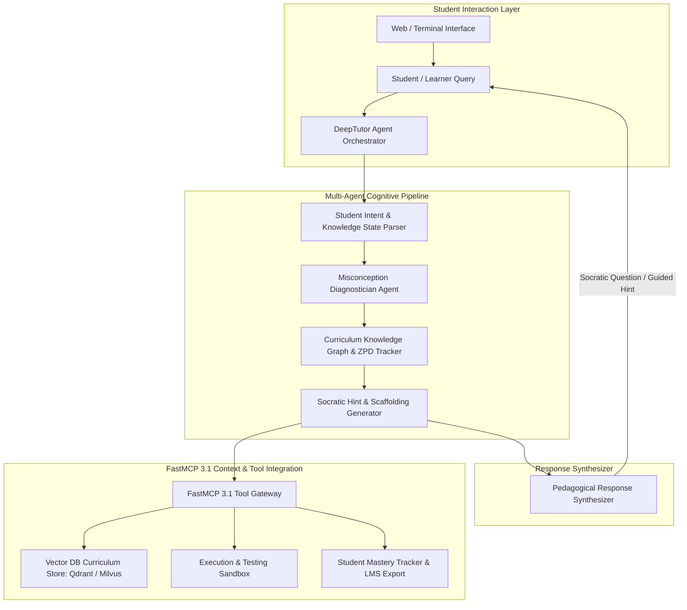

# DeepTutor

## What it is
DeepTutor is an open-source, multi-agent cognitive tutoring framework and intelligent tutoring system (ITS) designed for personalized STEM education, software engineering mentorship, and corporate technical training. Created to bridge cognitive science principles with state-of-the-art foundation models (Claude 3.7 Sonnet, GPT-5, Gemini 2.5 Pro, DeepSeek-R1, and open-weight models like Llama 3.3 and Qwen 2.5), DeepTutor replaces naive single-prompt Q&A with structured, multi-turn Socratic reasoning, misconception diagnosis, and adaptive hint generation engines.

Unlike standard LLM interfaces that immediately generate complete answers or code solutions, DeepTutor implements pedagogical scaffolding grounded in Vygotsky's Zone of Proximal Development (ZPD) and Bloom's Revised Taxonomy. Through native support for **FastMCP 3.1** context servers, DeepTutor connects cognitive agent swarms directly to verified textbook knowledge bases, vector search databases, code sandboxes, and automated grading pipelines.



## What problem it solves
The "Tutor's Dilemma" highlights a fundamental issue in AI-assisted education: when presented with a student's problem, standard LLMs tend to solve the problem instantly and output complete code or math derivations. While fast, this passive answer consumption stunts active cognitive engagement, prevents long-term memory retention, and conceals foundational misconceptions in the learner's mental model.

DeepTutor resolves these critical pedagogical and technical challenges:

- **Enforced Socratic Scaffolding**: Restricts direct answer generation in favor of multi-step, incremental questioning that guides students to discover solution steps independently.
- **Automated Misconception Isolation**: Utilizes chain-of-thought (CoT) reasoning to analyze student explanations, identify exact conceptual flaws (e.g., confusing velocity with acceleration, misinterpreting variable scoping, or misapplying thermodynamic laws), and map them against a structured ontology.
- **Adaptive ZPD Calibration**: Continuously calculates student mastery levels across specific skill nodes, dynamically adjusting hint specificity (from high-level conceptual prompts to concrete structural guidance) based on learner performance.
- **Grounded Curriculum Integration**: Integrates directly with verified course syllabi and textbook knowledge bases via FastMCP 3.1 endpoints to ensure tutoring interactions adhere to accredited academic standards without model hallucination.
- **Multimodal Artifact Diagnostics**: Leverages vision-language capabilities to analyze student-drawn molecular structures, circuit diagrams, mathematical proofs, and architectural blueprints.

## Where it fits in the stack
DeepTutor occupies the **Cognitive Education, Agentic Tutoring, Skill Assessment, and Instructional Orchestration Layer** of modern software architectures. It interfaces between student interaction endpoints, reasoning LLMs, and curriculum context repositories.

```
+-----------------------------------------------------------------------------------+
|                        Student & Educational Client Interfaces                    |
|             (Web LMS, Desktop GUI, Mobile Apps, CLI Tutoring Shells)             |
+-----------------------------------------------------------------------------------+
                                          |
                                          v
+-----------------------------------------------------------------------------------+
|                         DeepTutor Orchestration Engine                            |
|  +--------------------+  +--------------------+  +-----------------------------+  |
|  | Intent & ZPD       |  | Misconception      |  | Socratic Hint Generator     |  |
|  | State Parser       |  | Diagnostician      |  | & Scaffolding Engine        |  |
|  +--------------------+  +--------------------+  +-----------------------------+  |
|  +-----------------------------------------------------------------------------+  |
|  |                  FastMCP 3.1 Curriculum & Tool Gateway                      |  |
|  +-----------------------------------------------------------------------------+  |
+-----------------------------------------------------------------------------------+
                                          |
                        +-----------------+-----------------+
                        |                                   |
                        v (FastMCP / OTLP)                  v (HTTPS LLM API)
+-------------------------------------------------+ +-------------------------------+
|         Curriculum Storage & Sandboxes          | |   Reasoning Foundation LLMs   |
|   (Vector DBs, Code Execution, LMS Systems)     | |  (Claude 3.7, GPT-5, DeepSeek)  |
+-------------------------------------------------+ +-------------------------------+
```

## Typical use cases
- **Personalized STEM Tutoring**: Guiding physics and calculus students through complex multivariable derivations using step-by-step Socratic questioning and conceptual feedback.
- **Software Engineering & Code Mentorship**: Mentoring junior developers learning systems programming (e.g., Rust memory safety, concurrency patterns, or database query optimization) by pointing out algorithmic edge cases rather than auto-generating code.
- **Enterprise Technical Onboarding**: Automating developer training on internal software architectures, proprietary microservices, and security compliance rules grounded via FastMCP 3.1 knowledge servers.
- **Multimodal Handwritten & Diagram Assessment**: Evaluating student-submitted circuit schematics, handwritten calculus proofs, or system design diagrams using vision-capable foundation models.
- **Automated Misconception Analytics**: Aggregating real-time student error patterns across entire classrooms to alert human educators to widespread conceptual gaps in specific course modules.

## Strengths
- **Rigorous Pedagogical Design**: Built on established cognitive science frameworks (Bloom's Taxonomy, Zone of Proximal Development, Scaffolding Theory) to maximize active learning.
- **Deep Misconception Mapping**: Advanced reasoning capabilities isolate why a student is mistaken, rather than merely stating that an answer is incorrect.
- **Model-Agnostic Flexibility**: Works seamlessly across commercial frontier models (Claude 3.7 Sonnet, GPT-5) and open-weights models (DeepSeek-R1, Llama 3.3, Qwen 2.5 Coder).
- **FastMCP 3.1 Context Grounding**: Directly queries vector databases, local git repositories, and external testing microservices via standard FastMCP protocols.
- **Multimodal Diagnostic Capabilities**: Supports text, code, handwritten mathematical formulas, and technical diagrams.

## Limitations
- **Multi-Turn Interaction Latency**: Executing multi-agent CoT diagnostic chains across high-tier reasoning models introduces latency compared to single-shot LLM completion.
- **Higher Token Overhead**: Maintaining deep cognitive context, student history logs, and Socratic evaluation states increases token utilization per session.
- **Persona & Curriculum Engineering Requirements**: Mapping domain curricula into structured concept dependency graphs requires initial subject matter expert effort.

## When to use it
- When building educational platforms, virtual teaching assistants, or interactive mentorship tools that require active learning methods over direct answer output.
- For technical software mentorship systems where guiding developers to reason through architectural trade-offs is prioritized over code generation.
- When conducting academic research on Intelligent Tutoring Systems (ITS) and agentic pedagogical workflows.
- When enterprise training systems require verified grounding against proprietary internal documentation and compliance standards.

## When not to use it
- For generic Q&A search engines or direct coding copilots where users expect instant code generation or factual answers.
- In ultra-low-latency real-time applications where response speed outweighs educational interaction quality.

## Getting started

### Local Python Environment Setup
DeepTutor requires Python 3.12+ and Node.js 22+.

```bash
# Clone the official repository
git clone https://github.com/HKUDS/DeepTutor.git
cd DeepTutor

# Create virtual environment
python3 -m venv .venv
source .venv/bin/activate

# Install core dependencies with reasoning and server extras
pip install -e ".[server,reasoning]" pydantic>=2.0 fastmcp
```

### Environment Configuration
Create a `.env` file in the root directory:

```env
ANTHROPIC_API_KEY="sk-ant-api03-..."
OPENAI_API_KEY="sk-proj-..."
DEEPTUTOR_MODEL="claude-3.7-sonnet"
DEEPTUTOR_LOG_LEVEL="INFO"
```

### Launching the DeepTutor Orchestration Server
```bash
# Start DeepTutor API server on localhost port 8000
python scripts/start_tutor.py --port 8000 --model claude-3.7-sonnet
```

### Docker Deployment
```bash
# Run containerized DeepTutor server via Docker Compose
docker compose up -d deeptutor-server
```

## CLI examples

### Interactive Socratic Tutoring Session
```bash
# Start an interactive CLI Socratic tutoring session in Physics
deeptutor chat --subject "Quantum Mechanics" --mode socratic --model claude-3.7-sonnet
```

### Ingesting Curriculum Content via FastMCP 3.1
```bash
# Ingest local textbook chapters into DeepTutor vector store via FastMCP
deeptutor kb ingest ./curriculum/thermodynamics/ \
  --name thermodynamics-v1 \
  --mcp-server http://localhost:8088/mcp
```

### Running Misconception Analysis on Student Text
```bash
# Analyze a student explanation for cognitive misconceptions
deeptutor analyze \
  --student-input "A heavier ball falls faster in a vacuum because gravity pulls harder on greater mass." \
  --domain "Classical Mechanics"
```

## API examples

### Pydantic v2 Schema for Student Profiles & Misconception Diagnostics
The following Python module defines strict Pydantic v2 schemas for validating student learner profiles, concept mastery states, misconception diagnoses, and Socratic hint payloads.

```python
import time
from typing import List, Dict, Any, Optional, Literal
from pydantic import BaseModel, Field, field_validator, ConfigDict


class KnowledgeConceptState(BaseModel):
    """Pydantic v2 schema for tracking student mastery of a specific curriculum node."""
    model_config = ConfigDict(extra="forbid")

    concept_id: str = Field(..., description="Unique concept ID e.g. physics_newton_second_law")
    concept_name: str = Field(..., description="Human-readable concept name")
    mastery_score: float = Field(..., ge=0.0, le=1.0, description="Calculated mastery score between 0.0 and 1.0")
    last_assessed_timestamp: int = Field(default_factory=lambda: int(time.time()))


class MisconceptionDiagnosis(BaseModel):
    """Pydantic v2 schema for isolated cognitive misconceptions."""
    model_config = ConfigDict(extra="forbid")

    misconception_id: str = Field(...)
    concept_ref: str = Field(..., description="Target concept ID")
    description: str = Field(..., description="Detailed description of identified cognitive misconception")
    severity: Literal["low", "medium", "high", "critical"] = Field(default="medium")
    recommended_remediation_strategy: str = Field(..., description="Suggested Socratic questioning approach")


class StudentLearnerProfile(BaseModel):
    """Pydantic v2 schema for student profile state and ZPD tracking."""
    model_config = ConfigDict(extra="forbid")

    student_id: str = Field(...)
    display_name: str = Field(...)
    target_subject: str = Field(...)
    zpd_level: Literal["beginner", "intermediate", "advanced"] = Field(default="beginner")
    concept_mastery: List[KnowledgeConceptState] = Field(default_factory=list)
    active_misconceptions: List[MisconceptionDiagnosis] = Field(default_factory=list)


class SocraticHintPayload(BaseModel):
    """Pydantic v2 schema for generating structured Socratic scaffolding turns."""
    model_config = ConfigDict(extra="forbid")

    turn_id: str = Field(...)
    session_id: str = Field(...)
    scaffolding_level: int = Field(..., ge=1, le=5, description="1=Abstract Conceptual Prompt, 5=Concrete Structural Hint")
    socratic_question: str = Field(..., description="Question posed to guide student discovery")
    target_misconception_id: Optional[str] = Field(default=None)


def validate_tutoring_state():
    """Demonstrates validation of student profile and misconception payload."""
    misconception = MisconceptionDiagnosis(
        misconception_id="misc_grav_vacuum_01",
        concept_ref="physics_free_fall",
        description="Student believes gravitational acceleration depends on mass in free fall in a vacuum.",
        severity="high",
        recommended_remediation_strategy="Prompt student to reflect on Galileo's equivalence principle and F=ma vs F=GmM/r^2."
    )

    profile = StudentLearnerProfile(
        student_id="std_88321",
        display_name="Alex Rivera",
        target_subject="Classical Mechanics",
        zpd_level="intermediate",
        concept_mastery=[
            KnowledgeConceptState(
                concept_id="physics_free_fall",
                concept_name="Free Fall Acceleration",
                mastery_score=0.45
            )
        ],
        active_misconceptions=[misconception]
    )

    print("Validated Student Learner Profile JSON:", profile.model_dump_json(indent=2))


if __name__ == "__main__":
    validate_tutoring_state()
```

### FastMCP 3.1 AI Tutoring Orchestration Server Implementation
The following FastMCP 3.1 server provides AI tutoring tools that allow orchestration agents to evaluate student responses, diagnose misconceptions, generate Socratic hints, and query curriculum databases.

```python
import os
import json
from typing import Dict, Any, List, Optional
from fastmcp import FastMCP, Context
from pydantic import BaseModel, Field

# Initialize FastMCP 3.1 AI Tutoring Server
mcp = FastMCP(
    name="DeepTutorOrchestrationServer",
    version="3.1.0",
    description="FastMCP 3.1 Server for Student Misconception Diagnosis, Socratic Scaffolding, and Curriculum Retrieval"
)


class EvaluateResponseInput(BaseModel):
    student_id: str = Field(..., description="Unique student profile ID")
    problem_statement: str = Field(..., description="STEM or coding problem under study")
    student_response: str = Field(..., description="Student's submitted answer or code explanation")
    subject_domain: str = Field(default="Physics", description="Subject matter domain")


class GenerateHintInput(BaseModel):
    session_id: str = Field(..., description="Tutoring session ID")
    misconception_description: str = Field(..., description="Target misconception to address")
    scaffolding_step: int = Field(default=1, ge=1, le=5, description="Scaffolding level (1=subtle, 5=direct)")


@mcp.tool(
    name="evaluate_student_response",
    description="Evaluates a student response to detect correctness and isolate potential misconceptions."
)
async def evaluate_student_response(input_data: EvaluateResponseInput, ctx: Context) -> Dict[str, Any]:
    """Analyzes student input to determine cognitive alignment."""
    ctx.info(f"Evaluating student '{input_data.student_id}' response for problem: {input_data.problem_statement[:50]}...")

    # Mock cognitive diagnostic logic
    response_text = input_data.student_response.lower()
    is_correct = "depends on mass" not in response_text and "vacuum" in response_text

    misconceptions = []
    if "depends on mass" in response_text:
        misconceptions.append({
            "misconception_id": "misc_mass_gravity_01",
            "concept": "Free Fall Acceleration",
            "description": "Student incorrectly asserts that gravitational acceleration in a vacuum is mass-dependent.",
            "severity": "high"
        })

    return {
        "student_id": input_data.student_id,
        "is_correct": is_correct,
        "detected_misconceptions": misconceptions,
        "recommended_action": "generate_socratic_hint" if misconceptions else "advance_to_next_concept"
    }


@mcp.tool(
    name="generate_socratic_hint",
    description="Generates a Socratic question or guided hint targeted at resolving a student misconception."
)
async def generate_socratic_hint(input_data: GenerateHintInput, ctx: Context) -> Dict[str, Any]:
    """Generates an incremental Socratic hint based on scaffolding level."""
    ctx.info(f"Generating scaffolding level {input_data.scaffolding_step} hint for session '{input_data.session_id}'")

    hints = {
        1: "Consider what forces act on an object in a vacuum. Does mass affect gravitational acceleration 'g' when air resistance is zero?",
        2: "Recall Newton's second law (F = m * a) and the gravitational force equation (F = m * g). If you set them equal, what happens to the mass 'm'?",
        3: "Notice that m * a = m * g implies a = g. Does the acceleration 'a' depend on the object's mass 'm'?"
    }

    hint_text = hints.get(input_data.scaffolding_step, hints[1])

    return {
        "session_id": input_data.session_id,
        "scaffolding_step": input_data.scaffolding_step,
        "socratic_question": hint_text,
        "target_misconception": input_data.misconception_description
    }


if __name__ == "__main__":
    mcp.run()
```

## Related tools / concepts
- [NotebookLM](notebooklm.md) - Grounded research and AI document interaction engine.
- [Model Context Protocol (MCP)](../automation_orchestration/mcp.md) - Open standard for linking AI agents to context sources.
- [Claude](../ai_knowledge/claude.md) - State-of-the-art reasoning model for pedagogical interaction.
- [ChatGPT](../ai_knowledge/chatgpt.md) - Conversational AI and reasoning model platform.
- [Agentic Workflows](../../knowledge_base/patterns/agentic-workflows.md) - Design patterns for multi-agent reasoning chains.
- [Local LLMs](../ai_knowledge/local_llms.md) - Open-weights models (Llama 3.3, Qwen 2.5) for local tutoring.

## Sources / references
- [DeepTutor GitHub Repository](https://github.com/HKUDS/DeepTutor)
- [DeepTutor: Agentic Scaffolding in STEM Education (arXiv Paper)](https://arxiv.org/abs/2604.26962)
- [DeepTutor Documentation and Soul Gallery](https://deeptutor.ai/docs)
- [FastMCP 3.1 Framework Documentation](https://github.com/jlowin/fastmcp)

## Contribution Metadata
- Last reviewed: 2027-01-07
- Confidence: high
