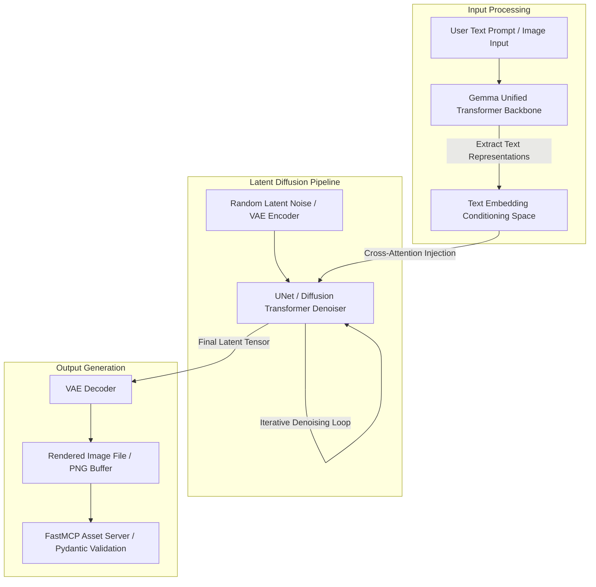

# DiffusionGemma

## What it is
DiffusionGemma is an open-weights generative diffusion foundation model based on Google's Gemma architecture, released in August 2026. Combining Gemma's language understanding representations with a lightweight, high-performance diffusion generation back-end, DiffusionGemma enables real-time text-to-image synthesis, visual editing, and cross-modal generative reasoning on edge hardware and consumer GPUs.



## What problem it solves
Traditional generative image diffusion models (e.g., Stable Diffusion XL, FLUX) rely on separate text encoder backbones (such as CLIP or T5) which can create bottlenecks in fine-grained prompt alignment and require heavy memory footprints. DiffusionGemma solves this by natively integrating Google's Gemma Transformer architecture as a unified text-and-diffusion backbone, reducing VRAM usage while enabling superior text-prompt instruction following and fast sampling iteration.

## Where it fits in the stack
**Category**: AI & Knowledge / Generative Diffusion & Vision Models. DiffusionGemma serves as a local, open-weights image and visual generation engine within multi-agent creative workflows, automated asset pipelines, and vision-language creation frameworks.

In local agent pipelines, DiffusionGemma executes structured image generation and instruction-guided editing tasks triggered by orchestrated agents via [FastMCP 3.1](../automation_orchestration/mcp.md) servers.

## Typical use cases
- **On-Device Image Generation**: Generating high-fidelity visual assets locally on consumer GPUs and Apple Silicon workstations.
- **Instruction-Guided Image Editing**: Modifying existing image regions using natural language instructions processed directly by the Gemma backbone.
- **Automated Design Pipelines**: Integrating image generation tools into autonomous developer agents via [FastMCP 3.1](../automation_orchestration/mcp.md) servers.
- **Multimodal Prototyping**: Rapidly creating visual UI mockups, thumbnails, and synthetic training imagery.

## Strengths
- **Unified Gemma Backbone**: High alignment with complex textual prompts due to Gemma's deep language representation layer.
- **Low VRAM & High Latency Efficiency**: Optimized for single-GPU execution (8GB-16GB VRAM) and Apple Silicon MPS acceleration.
- **Open-Weights License**: Permissive open license allowing local commercial deployment and custom fine-tuning.
- **Pydantic v2 Compatible Tooling**: Clean structural interfaces for programmatic generation parameters.

## Limitations
- **Resolution Constraints**: Native resolution generation is optimized for 1024x1024; ultra-high 4K rendering requires secondary upscaling passes.
- **Compute Overhead**: Step-wise diffusion generation requires CUDA/MPS acceleration; unsuited for CPU-only inference.

## When to use it
- When requiring local, open-weights image generation with strong prompt adherence without cloud API dependencies.
- When building creative multi-agent workflows that run on single consumer workstation GPUs.
- For privacy-sensitive visual asset generation in local enterprises.

## When not to use it
- On CPU-only environments without GPU/MPS acceleration.
- When generating real-time multi-minute video streams where dedicated video diffusion models (e.g., [Sora](sora.md), [RunwayML](runwayml.md)) are required.

## Getting started

### Installation
```bash
pip install diffusers transformers torch pydantic pillow
```

### Python Quickstart
```python
import torch
from diffusers import DiffusionGemmaPipeline

pipe = DiffusionGemmaPipeline.from_pretrained("google/diffusion-gemma-2b", torch_dtype=torch.float16)
pipe = pipe.to("cuda")

image = pipe("A futuristic smart city powered by clean energy, highly detailed").images[0]
image.save("futuristic_city.png")
```

## CLI examples

### Generate Image via Diffusers CLI
```bash
# Generate image from text prompt
python -m diffusers.cli.generate \
  --model google/diffusion-gemma-2b \
  --prompt "A minimalist modern workspace with developer tools on screen" \
  --output workspace.png
```

## API examples

### Python Integration with Pydantic v2 Schema
The following script demonstrates how to define generation parameter schemas and validate execution outputs for DiffusionGemma using **Pydantic v2**:

```python
import time
from typing import Optional, List
from pydantic import BaseModel, Field, ValidationError

class GenerationParams(BaseModel):
    prompt: str = Field(..., min_length=3, description="Text prompt guiding image synthesis")
    negative_prompt: Optional[str] = Field(None, description="Elements to exclude from generated image")
    num_inference_steps: int = Field(30, ge=1, le=100, description="Number of diffusion denoising steps")
    guidance_scale: float = Field(7.5, ge=1.0, le=20.0, description="Classifier-free guidance scale")
    width: int = Field(1024, ge=512, le=2048, description="Image width in pixels")
    height: int = Field(1024, ge=512, le=2048, description="Image height in pixels")
    seed: Optional[int] = Field(None, description="Reproducibility seed")

class GenerationResult(BaseModel):
    file_path: str = Field(..., description="Local path to generated output file")
    seed_used: int = Field(..., description="Random seed used for generation reproducibility")
    generation_time_seconds: float = Field(..., ge=0.0, description="Total generation time in seconds")
    width: int
    height: int

def run_diffusion_gemma(params_data: dict) -> GenerationResult:
    """Validates parameters and simulates DiffusionGemma image synthesis."""
    try:
        params = GenerationParams.model_validate(params_data)
        print(f"Executing DiffusionGemma with prompt: '{params.prompt}' ({params.num_inference_steps} steps)")

        # Simulated generation response
        raw_output = {
            "file_path": "./outputs/generated_gemma_asset.png",
            "seed_used": params.seed or 420912,
            "generation_time_seconds": 2.45,
            "width": params.width,
            "height": params.height
        }
        return GenerationResult.model_validate(raw_output)
    except ValidationError as ve:
        print(f"Validation error in generation request: {ve}")
        raise

if __name__ == "__main__":
    request_payload = {
        "prompt": "An abstract 3D visualization of distributed AI neural nodes",
        "num_inference_steps": 25,
        "guidance_scale": 7.0,
        "width": 1024,
        "height": 1024,
        "seed": 1337
    }

    result = run_diffusion_gemma(request_payload)
    print("DiffusionGemma Asset Generated:")
    print(f" - Path: {result.file_path}")
    print(f" - Seed: {result.seed_used}")
    print(f" - Elapsed: {result.generation_time_seconds}s")
```

### FastMCP 3.1 Tool Server Pattern
This FastMCP 3.1 server exposes DiffusionGemma image synthesis as a callable tool for automated agent design pipelines:

```python
from fastmcp import FastMCP
import os
import time
from typing import Dict, Any, Optional

mcp = FastMCP("DiffusionGemmaProvider")

OUTPUT_DIR = "./generated_assets"
os.makedirs(OUTPUT_DIR, exist_ok=True)

@mcp.tool()
def generate_image_asset(
    prompt: str,
    negative_prompt: Optional[str] = None,
    num_steps: int = 25,
    width: int = 1024,
    height: int = 1024
) -> Dict[str, Any]:
    """Generate a visual asset using DiffusionGemma.

    Args:
        prompt: Descriptive text prompt for image synthesis
        negative_prompt: Concepts or objects to avoid in generated visual
        num_steps: Denoising inference steps (15-50)
        width: Output image width in pixels
        height: Output image height in pixels
    """
    start_time = time.time()
    filename = f"asset_{int(start_time)}.png"
    filepath = os.path.join(OUTPUT_DIR, filename)

    # In production, invokes Diffusers pipeline
    # e.g., image = pipe(prompt, negative_prompt=negative_prompt, num_inference_steps=num_steps).images[0]
    # image.save(filepath)

    elapsed = round(time.time() - start_time, 2)

    return {
        "success": True,
        "prompt": prompt,
        "file_path": filepath,
        "dimensions": f"{width}x{height}",
        "inference_steps": num_steps,
        "generation_time_seconds": elapsed
    }

if __name__ == "__main__":
    mcp.run()
```

## Related tools / concepts
- [Gemma](local_llms.md) — Google's open-weights foundation model family.
- [Muse Glimmer](muse-glimmer.md) — Open-weights multimodal vision model.
- [ComfyUI](comfyui.md) — Modular node-based generative GUI workflow engine.
- [Luma Dream Machine](luma-dream-machine.md) — Cloud generative video engine.

## Sources / references
- [Reddit LocalLLaMA: DiffusionGemma Technical Report](https://www.reddit.com/r/LocalLLaMA/comments/1vkqqjx/diffusiongemma_technical_report/)
- [Hugging Face Models Hub](https://huggingface.co/)

---
## Contribution Metadata
- Last reviewed: 2027-01-07
- Confidence: high
