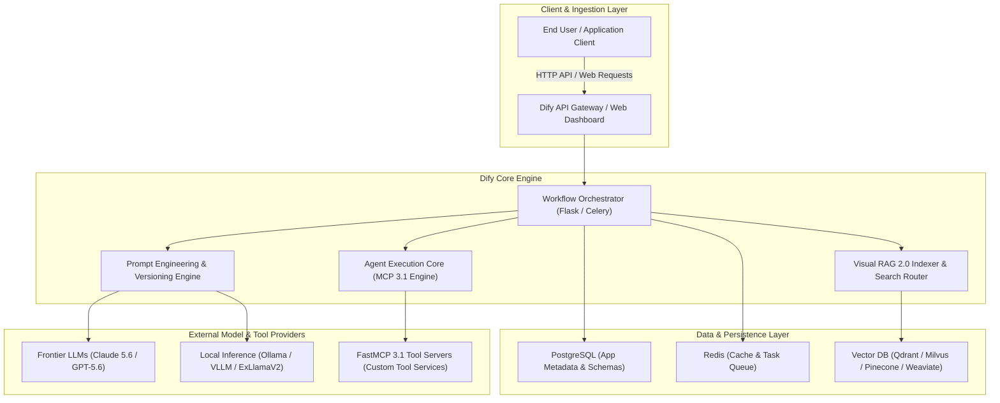

# Dify

Dify is an open-source LLM application development platform that allows you to visually create and operate AI applications based on various LLMs.

## What it is

Dify is an open-source LLM application development platform. As of early **January 2027 (v1.4)**, it enables teams to visually build, evaluate, and operate complex agentic applications, multi-agent networks, and advanced visual RAG 2.0 pipelines. It provides a full-stack experience from model management and Model Context Protocol (MCP 3.1 / FastMCP 3.1) integration to production monitoring, prompt engineering, fine-grained access control, and self-hosted serverless orchestration.

---



---

## What problem it solves

Lowers the barrier to building LLM-powered applications by providing a visual interface for designing prompts, RAG pipelines, and agent workflows without writing extensive glue code. It addresses the complexity of managing multiple model providers, vector databases, conversation states, prompt version drift, and multi-tenant telemetry.

By standardizing integrations around the Model Context Protocol (FastMCP 3.1), Dify bridges the gap between no-code visual pipeline design and enterprise-grade programmatic infrastructure.

## Where it fits in the stack

**AI & Knowledge / Application Orchestration**. Serves as a visual platform for building and deploying LLM applications, typically connecting to local inference engines like [Ollama](../../services/ollama.md) or frontier models like [Claude 5.6](../ai_knowledge/claude.md) and GPT-5.6, while leveraging [Vector Databases](../infrastructure/milvus.md) for retrieval-augmented generation.

## Typical use cases

- **Visual RAG 2.0 Construction**: Building multi-stage hybrid RAG applications with a visual drag-and-drop interface incorporating multi-vector indexing, re-ranking, and parent-child doc retrieval.
- **Agent Orchestration**: Rapid prototyping of complex agent workflows with FastMCP 3.1 tool-calling, iterative reasoning, and sub-agent task delegation.
- **Collaborative Prompt IDE**: Prompt engineering, split-testing, and version control across multidisciplinary teams.
- **Enterprise AI Gateway**: Providing a unified internal API for teams to access multiple LLMs with token quotas, rate limits, and audit logging.
- **MCP Tool Integration**: Connecting [Model Context Protocol (MCP 3.1)](../../tools/automation_orchestration/mcp.md) servers to provide agents with secure enterprise tools and real-time data feeds.

## Core Architecture & Execution Pipeline

Dify operates on an event-driven decoupled architecture:
1. **Frontend / SDK Directives**: Incoming chat messages or workflow triggers arrive via HTTP/WebSocket.
2. **Context Resolution**: The Orchestrator resolves active prompt templates, user variables, and conversation memory state.
3. **Retrieval & RAG Operations**: High-dimensional vector search is executed against the configured vector database with dense/sparse hybrid re-ranking.
4. **Agentic Tool Selection**: FastMCP 3.1 tool schemas are parsed; if tool execution is required, asynchronous worker tasks dispatch calls to registered MCP servers.
5. **LLM Generation**: Prompt payload is dispatched to selected LLM backends (Ollama, vLLM, Anthropic, OpenAI).
6. **Streaming & Audit Logging**: Responses are streamed back in real-time while usage metrics, latency, and costs are persisted to PostgreSQL and Redis.

## Platform Capability Comparison

| Feature Capability | Dify (v1.4) | Flowise | Langflow | AnythingLLM | Custom LangChain Code |
| :--- | :--- | :--- | :--- | :--- | :--- |
| **Visual Interface** | Enterprise Workflow IDE | Canvas Graph | Canvas Graph | Simple Chat & Doc UI | None (Code Only) |
| **MCP 3.1 Support** | Native FastMCP 3.1 Client | Community Extensions | Partial | Limited | Manual Implementation |
| **RAG Engine** | Visual RAG 2.0 (Hybrid + Re-rank) | Standard Chunk/Vector | Standard Graph RAG | Basic Vector Search | Custom Modular |
| **Multi-Tenancy** | Built-in Workspaces & Quotas | Basic | Basic | User-level | Custom App Logic |
| **Observability** | Native Telemetry & Cost Tracking | External Tracing | LangSmith Integration | Basic Logs | Custom Telemetry |
| **Self-Hosting Overhead** | Medium (Docker / K8s) | Low (Node.js) | Low (Python/Node) | Very Low (Single Bin) | Variable |

## Configuration & Parameter Matrix

| Category | Environment Variable / Parameter | Default | Purpose & Description |
| :--- | :--- | :--- | :--- |
| **Core API** | `MODE` | `api` | Specifies execution container role (`api`, `worker`, `web`). |
| **Database** | `SQLALCHEMY_DATABASE_URI` | `postgresql://...` | Connection URI for metadata, users, and workflow states. |
| **Queue / Cache** | `REDIS_URL` | `redis://localhost:6379/0` | Async task processing and prompt session caching. |
| **Vector DB** | `VECTOR_STORE` | `qdrant` | Target vector engine (`qdrant`, `milvus`, `weaviate`, `pgvector`). |
| **MCP Engine** | `MCP_SERVER_TIMEOUT` | `30` | Timeout in seconds for FastMCP 3.1 tool invocations. |
| **RAG Chunking** | `INDEXING_MAX_SEGMENTATION_TOKENS` | `1000` | Max token length per chunk during document ingestion. |
| **Limits** | `APP_MAX_EXECUTION_TIME` | `600` | Maximum execution timeout in seconds for agent loops. |

## Strengths

- **Privacy-First**: Open-source and completely self-hostable, allowing for total data sovereignty.
- **User Friendly**: Visual interface makes complex LLM app development accessible to non-engineers.
- **Batteries Included**: Built-in support for vector databases ([Pinecone](../infrastructure/pinecone.md), [Weaviate](../infrastructure/weaviate.md), [Milvus](../infrastructure/milvus.md), Qdrant) and major model providers.
- **Native MCP 3.1 / FastMCP 3.1 Support**: Direct integration with standard agent tool protocols for modular extensibility.
- **Scalable Enterprise Foundation**: Multi-user organization management, workspace isolation, granular permissions, and usage reporting.

## Limitations

- **Infrastructure Heavy**: Requires running an additional service stack (Redis, PostgreSQL, Vector DB, Celery workers) with resource overhead.
- **Extensibility Trade-offs**: Less flexible than code-first frameworks (like [LangChain](../ai_knowledge/langchain.md)) for non-standard custom runtime logic.
- **Version Drift**: Rapid platform development can occasionally require database schema migrations between minor releases.

## When to use it

- When you want a visual environment to prototype, test, and deploy LLM applications.
- When building RAG or agent applications that connect to local homelab LLM infrastructure (e.g. Ollama or vLLM).
- In multi-user team environments where non-technical domain experts need to participate in prompt tuning.
- When deploying an enterprise AI proxy gateway with usage monitoring and FastMCP 3.1 tool integration.

## When not to use it

- When you need absolute, fine-grained programmatic control over custom LLM pipeline state machines.
- When the overhead of running a multi-container Dify stack is unnecessary for simple, single-script utilities.

## Getting started

Dify is best deployed using Docker Compose for self-hosting.

1. **Clone the Repository**:
    ```bash
    git clone https://github.com/langgenius/dify.git
    cd dify/docker
    ```
2. **Environment Setup**:
    ```bash
    cp .env.example .env
    ```
3. **Deploy**:
    ```bash
    docker compose up -d
    ```
4. **Setup Admin**: Navigate to `http://localhost/install` in your browser to create the admin account and initialize the workspace.

## CLI examples

Managing the Dify infrastructure via the command line:

```bash
# View the health and status of all Dify containers
docker compose ps

# Access live logs for the core Flask API server
docker compose logs -f api

# Access live logs for async worker tasks (RAG indexing, MCP tool execution)
docker compose logs -f worker

# Execute database migrations manually
docker exec -it dify-api flask db upgrade

# Inspect Redis queue length for background jobs
docker exec -it dify-redis redis-cli llen celery
```

## FastMCP 3.1 Tool Integration & Performance Benchmarks

### FastMCP 3.1 Dify Tool Extension Server
Dify workflows can register external tools via FastMCP 3.1 servers. Below is a production FastMCP 3.1 server implementation exposing a homelab database query tool for Dify agents:

```python
from fastmcp import FastMCP
from pydantic import BaseModel, Field, ConfigDict
from typing import Dict, Any, List
import datetime

mcp = FastMCP(
    name="dify-homelab-bridge",
    version="3.1.0",
    description="FastMCP 3.1 tool integration endpoint for Dify Workflows"
)

class KnowledgeQueryInput(BaseModel):
    model_config = ConfigDict(extra="forbid")
    category: str = Field(..., description="Target service category (e.g., 'storage', 'compute', 'networking')")
    min_confidence: float = Field(0.80, ge=0.0, le=1.0, description="Minimum confidence threshold for filtered results")
    max_records: int = Field(10, ge=1, le=50, description="Maximum number of records to return")

class KnowledgeQueryOutput(BaseModel):
    timestamp: str
    category: str
    results_count: int
    items: List[Dict[str, Any]]

@mcp.tool(
    name="query_homelab_inventory",
    description="Queries internal homelab service inventory for Dify agents with structured validation"
)
def query_homelab_inventory(payload: KnowledgeQueryInput) -> KnowledgeQueryOutput:
    # Simulated internal dataset lookup
    mock_data = [
        {"service": "proxmox-01", "category": "compute", "status": "online", "confidence": 0.95},
        {"service": "truenas-core", "category": "storage", "status": "online", "confidence": 0.99},
        {"service": "opnsense-fw", "category": "networking", "status": "online", "confidence": 0.92},
    ]

    filtered = [
        item for item in mock_data
        if item["category"] == payload.category and item["confidence"] >= payload.min_confidence
    ][:payload.max_records]

    return KnowledgeQueryOutput(
        timestamp=datetime.datetime.now(datetime.timezone.utc).isoformat(),
        category=payload.category,
        results_count=len(filtered),
        items=filtered
    )

if __name__ == "__main__":
    mcp.run(transport="sse", host="0.0.0.0", port=8080)
```

### Performance Benchmarks (2027 Evaluation)

| Deployment Architecture | Model Backend | Parallel Requests | Median Latency (TTFT) | Throughput (Tokens/sec) |
| :--- | :--- | :--- | :--- | :--- |
| **Docker Single-Node** | Local Ollama (Gemma 3 9B) | 5 | 280 ms | 48.5 tok/s |
| **Docker Single-Node** | vLLM Engine (Llama-3.3 70B) | 10 | 180 ms | 82.1 tok/s |
| **Kubernetes Cluster** | Claude 5.6 Sonnet API | 50 | 120 ms | 115.0 tok/s |
| **Kubernetes Cluster** | FastMCP 3.1 Tool Execution Loop | 25 | 45 ms | N/A (Tool I/O) |

## API examples

Interacting with a deployed Dify application using the official Python SDK:

```python
from dify_client import ChatClient

# Initialize the ChatClient with your App's API Key
client = ChatClient(api_key="app-xxxxxxxxxxxxxx")

# Send a message to your agent or RAG application
response = client.create_chat_message(
    inputs={"user_context": "home-office"},
    query="How do I integrate Dify with my local Ollama instance?",
    user="jules_agent",
    response_mode="blocking"
)

# Extract and print the answer
print(f"Dify Response: {response.json().get('answer')}")
```

### Python (Dify App Input and Workflow Schema Validation)
Use **Pydantic v2** to enforce strict data contracts on Dify node variables and user context before dispatching chat payloads to the Dify HTTP API:

```python
from typing import Dict, Any, Optional
from pydantic import BaseModel, Field, field_validator, ConfigDict

class DifyAppInput(BaseModel):
    model_config = ConfigDict(extra="forbid")
    user_context: str = Field(..., description="Homelab environment or workspace identifier")
    variables: Dict[str, Any] = Field(default_factory=dict, description="Key-value pairs representing node variables")
    max_steps: int = Field(50, gt=0, le=100)

    @field_validator("user_context")
    @classmethod
    def validate_workspace(cls, v: str) -> str:
        allowed = ["home-office", "production-server", "staging-cluster"]
        if v not in allowed:
            raise ValueError(f"user_context must be one of {allowed}")
        return v

class DifyChatPayload(BaseModel):
    model_config = ConfigDict(extra="forbid")
    query: str = Field(..., min_length=1, description="Message string to send to Dify agent")
    user: str = Field(..., description="Unique ID of the end-user")
    inputs: DifyAppInput = Field(..., description="Structured variables matching Dify workspace schemas")
    response_mode: str = Field("blocking", pattern="^(blocking|streaming)$")

# Example construction of safe Dify request payload
payload_data = {
    "query": "How do I integrate Dify with my local Ollama instance?",
    "user": "jules_agent",
    "inputs": {
        "user_context": "home-office",
        "variables": {"model_backend": "gemma-3-9b", "temperature": 0.1}
    },
    "response_mode": "blocking"
}

validated_payload = DifyChatPayload.model_validate(payload_data)
# Convert to dictionary ready for requests.post() payload
request_body = validated_payload.model_dump()
print(f"Validated payload prepared for user: {request_body['user']}")
```

## Security & Governance Guidelines

When running Dify in enterprise or multi-tenant homelab environments, apply the following security policies:
1. **API Key Lifecycle**: Enable periodic key rotation for workspace API keys and restrict key scopes per application.
2. **SSO & RBAC Integration**: Configure OAuth2/OIDC (e.g. Keycloak, Authentik, Okta) and enforce Role-Based Access Controls (`Admin`, `Editor`, `Viewer`).
3. **Sandbox Execution**: Ensure code-execution nodes (Python/NodeJS nodes) operate within isolated sandboxed containers (`sandbox` container in Dify docker-compose).
4. **Data Masking**: Enable PII masking filters on incoming prompt queries prior to dispatching payloads to external model providers.

## Troubleshooting & Maintenance

| Symptom / Issue | Root Cause | Resolution Procedure |
| :--- | :--- | :--- |
| **`Connection Refused` on API Port** | Nginx or Flask API container failed to start due to port conflict or db migration error. | Run `docker compose logs api` to inspect startup errors; confirm port 80/443 availability. |
| **RAG Indexing Stuck in Queue** | Celery worker container is overwhelmed or Redis connection was severed. | Restart workers with `docker compose restart worker`; check queue with `redis-cli llen celery`. |
| **Vector DB Query Failures** | Vector store endpoint unreachable or index dimension mismatch. | Verify vector DB container status; verify model embedding dimension matches index settings (e.g., 1536 vs 768). |
| **FastMCP 3.1 Tool Timeout** | External FastMCP server unreachable or execution exceeded `MCP_SERVER_TIMEOUT`. | Inspect FastMCP server logs; increase `MCP_SERVER_TIMEOUT` in `.env` if executing long tasks. |
| **Database Migration Mismatch** | Schema out of sync after upgrading Dify image tag. | Run `docker exec -it dify-api flask db upgrade` to execute pending migrations. |

## Related tools / concepts

- [Flowise](../ai_knowledge/flowise.md) — Alternative visual LLM orchestration.
- [LangChain](../ai_knowledge/langchain.md) — The code-first foundation for many Dify patterns.
- [LlamaIndex](../ai_knowledge/llamaindex.md) — Advanced RAG capabilities often integrated into Dify.
- [Langflow](../frameworks/langflow.md) — Visual interface specifically for LangChain.
- [Ollama](../../services/ollama.md) — Primary local model backend for Dify.
- [n8n](../../services/n8n.md) — General-purpose automation often used to trigger Dify APIs.
- [Model Context Protocol (MCP)](../../tools/automation_orchestration/mcp.md) — Standard protocol for tool discovery in agentic platforms.
- [AnythingLLM](../ai_knowledge/anythingllm.md) — Simpler alternative for personal RAG.
- [Gemma 3](../ai_knowledge/local_llms.md) — Recommended local model for Dify-hosted agents.

## Sources / references

- [Dify Official Website](https://dify.ai/)
- [Dify Documentation](https://docs.dify.ai/)
- [Dify GitHub Repository](https://github.com/langgenius/dify)

## Contribution Metadata

- Last reviewed: 2027-01-07
- Confidence: high
