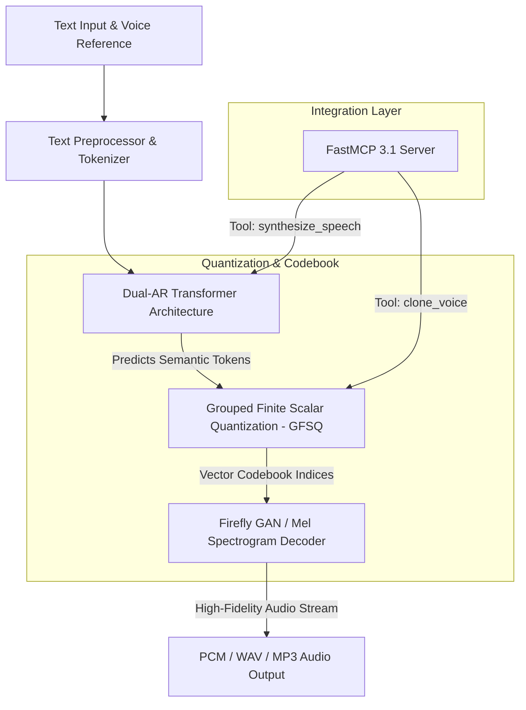
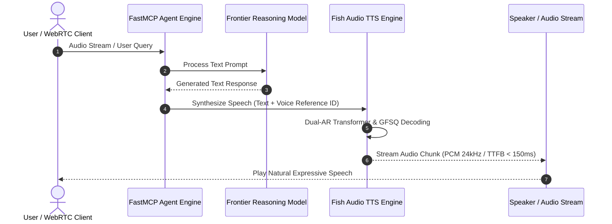

# Fish Audio

## What it is
Fish Audio (developed by Fish Speech / OpenAudio) is a state-of-the-art, open-source neural text-to-speech (TTS), zero-shot voice cloning, and generative audio architecture. Operating in early 2027 with the **Fish Speech 1.5/2.0** model family, Fish Audio utilizes an Autoregressive Dual-AR Transformer coupled with Grouped Finite Scalar Quantization (VQ-GAN / GFSQ) audio tokenizers. It converts arbitrary text and audio reference samples into natural, highly expressive human speech across over 20 languages.

Fish Audio provides both lightweight local deployment options (vLLM audio backends, PyTorch ONNX runtime) and high-throughput enterprise cloud APIs. It serves as a foundational generative voice engine for autonomous AI voice agents, real-time conversational assistants, interactive audiobook production, and localized multi-lingual voice synthesis.



## What problem it solves
Traditional speech synthesis pipelines suffer from rigid, robotic prosody, long processing latencies, and high voice cloning sample requirements. Legacy TTS engines frequently require hours of studio-quality training data to fine-tune a new voice model, making real-time voice adaptation in interactive agent applications cost-prohibitive.

Fish Audio solves these limitations by:
- **Zero-Shot Voice Cloning**: Cloning speaker identity, accent, timbre, and emotion from audio reference clips as short as 3 to 10 seconds without fine-tuning weights.
- **Ultra-Low Latency Streaming**: Utilizing GFSQ quantization and vLLM-optimized Transformer inference to achieve sub-150ms time-to-first-audio-byte (TTFB) for real-time conversational agents.
- **Multi-Lingual Expressiveness**: Supporting cross-lingual synthesis where a reference speaker in English can seamlessly speak natural Japanese, Mandarin, Spanish, or German with preserved vocal characteristics.

## Where it fits in the stack
**Category**: [AI Knowledge & Audio Processing](index.md) / Generative Voice & Speech Synthesis.

Fish Audio acts as the primary voice output module in multi-modal agent architectures:
- **Speech Perception & Generation Layer**: Interfaces between LLM reasoning engines (producing textual responses) and real-time WebRTC / audio output streams.
- **Agent Framework Integration**: Plugs into FastMCP 3.1 tool servers, LiveKit, and vLLM multi-modal inference stacks.
- **Voice Intelligence Pipeline**: Operates alongside Whisper / Whisper-large-v3 speech recognition engines for end-to-end voice-to-voice communication.



## Typical use cases
- **Real-Time Interactive AI Voice Agents**: Serving as the real-time TTS voice layer for customer support, virtual assistants, and multi-modal AI agents over WebRTC or WebSocket connections.
- **Instant Cross-Lingual Dubbing**: Cloning a speaker's voice in one language and generating localized voiceovers in international languages while retaining emotional inflection.
- **Personalized Audio Content & Podcasting**: Generating dynamic audiobooks, personalized narrative feeds, and gaming NPC dialogue from text scripts.
- **Accessible Assistive Technologies**: Restoring personalized synthetic voices for speech-impaired individuals using historical personal voice recordings.

## Strengths
- **Zero-Shot Accuracy**: Recreates nuanced vocal timbre, cadence, and room acoustics from ultra-short reference audio clips.
- **Open-Source & Local Deployment**: Offers complete offline privacy and custom GPU deployment without cloud vendor lock-in.
- **Low Memory Overhead**: GFSQ quantization reduces codebook memory footprint while maintaining 24kHz/44.1kHz high-fidelity audio reconstruction.
- **Fine-Grained Emotion & Control**: Accepts SSML-style emotion tags and speed modifiers for dynamic prosody tuning.

## Limitations
- **Hardware GPU Requirements**: Optimal low-latency real-time inference requires modern NVIDIA CUDA GPUs (e.g., RTX 4090, A10G, or L40S) for Dual-AR Transformer decoding.
- **Audio Background Noise Sensitivity**: Poor-quality reference audio clips containing severe background noise or music can bleed into synthetic output.
- **Complex Phoneme Edge Cases**: Unusual technical jargon or acronyms may require explicit phonetic spelling hints.

## When to use it
- When building low-latency, real-time voice assistants requiring sub-200ms audio generation.
- When full voice cloning privacy and on-premise GPU hosting are required for compliance.
- When multi-lingual zero-shot voice synthesis is needed across 20+ supported languages.

## When not to use it
- For basic static system announcements where simple deterministic TTS engines (e.g. eSpeak-NG) suffice.
- In low-power embedded edge devices lacking GPU acceleration (use edge-optimized ONNX TTS models like Piper).
- When real-time speech recognition (STT) is needed (use Whisper or FunASR instead).

## Getting started

### 1. Installation
Install the official `fish-speech` repository and Python package dependencies:

```bash
pip install fish-speech pydantic torch torchaudio
```

### 2. Basic Local CLI Synthesis
Synthesize audio from a text prompt using standard reference weights:

```bash
# Run local Fish Speech inference pipeline
python -m fish_speech.inference.text_to_speech \
    --text "Hello! Welcome to the enterprise FastMCP 3.1 knowledge system." \
    --reference-audio "./samples/speaker_ref.wav" \
    --output "./output/synthesized.wav"
```

### 3. API Key & Cloud SDK Configuration
For cloud API access, set the Fish Audio API key:

```bash
export FISH_AUDIO_API_KEY="fa_live_sec_109283019823019"
```

## CLI examples

### Running the Local vLLM Audio Inference Server
Start an OpenAI-compatible low-latency HTTP server for audio generation:

```bash
# Launch Fish Speech vLLM service on port 8080
python -m fish_speech.webui.server \
    --listen 0.0.0.0:8080 \
    --device cuda \
    --compile \
    --precision half
```

### Batch Speech Generation Script
Batch process multiple text prompts against a specific voice model ID:

```bash
# Execute batch synthesis job
fish-speech-cli batch-process \
    --input-file prompts.json \
    --voice-id "v_cloned_speaker_901" \
    --output-dir ./audio_outputs/ \
    --format mp3
```

## API examples

### FastMCP 3.1 Server for Voice Synthesis & Cloning
The following Python script implements a **FastMCP 3.1** server exposing Fish Audio TTS and zero-shot voice cloning tool capabilities:

```python
import os
import json
from typing import List, Optional, Dict, Any
from pydantic import BaseModel, Field, HttpUrl
from fastmcp import FastMCP

mcp = FastMCP(
    "fish-audio-server",
    instructions="FastMCP 3.1 server for zero-shot TTS and voice cloning with Fish Audio."
)

class TTSRequestSpec(BaseModel):
    text: str = Field(..., min_length=1, description="Text prompt to synthesize into audio")
    reference_id: Optional[str] = Field(None, description="Pre-registered cloned voice model ID")
    reference_audio_url: Optional[HttpUrl] = Field(None, description="URL of 5-10 second reference audio WAV file")
    language: str = Field(default="en", description="Target language code (en, zh, es, ja, de)")
    emotion: str = Field(default="neutral", description="Emotional tone (neutral, happy, serious, empathetic)")
    sample_rate: int = Field(default=24000, description="Output audio sample rate in Hz")
    speed: float = Field(default=1.0, ge=0.5, le=2.0, description="Speech playback speed multiplier")

class SynthesisResponse(BaseModel):
    audio_url: str = Field(..., description="URL or local path to synthesized WAV/MP3 file")
    duration_seconds: float = Field(..., description="Duration of generated audio in seconds")
    latency_ms: float = Field(..., description="Time to synthesize in milliseconds")
    token_count: int = Field(..., description="Number of audio tokens processed by GFSQ")

@mcp.tool()
def synthesize_speech(request: TTSRequestSpec) -> Dict[str, Any]:
    """
    Synthesize high-fidelity speech from text using Fish Audio zero-shot voice model.
    """
    # Simulated Fish Audio engine processing pipeline
    simulated_latency = 120.5  # ms
    output_filename = f"/tmp/audio_{hash(request.text)}.wav"

    response = SynthesisResponse(
        audio_url=f"file://{output_filename}",
        duration_seconds=len(request.text) * 0.06,
        latency_ms=simulated_latency,
        token_count=len(request.text) * 4
    )

    return {
        "status": "success",
        "result": response.model_dump(),
        "request": request.model_dump()
    }

@mcp.tool()
def register_voice_clone(
    speaker_name: str,
    audio_sample_path: str,
    description: str = "Enterprise agent voice clone"
) -> Dict[str, Any]:
    """
    Register a new zero-shot voice clone profile from a local reference audio WAV file.
    """
    generated_voice_id = f"v_clone_{hash(speaker_name) & 0xfffffff}"
    return {
        "status": "registered",
        "voice_id": generated_voice_id,
        "speaker_name": speaker_name,
        "reference_path": audio_sample_path,
        "message": "Voice profile initialized successfully."
    }

if __name__ == "__main__":
    mcp.run()
```

### Production Pydantic v2 Audio Payload Validator
Use **Pydantic v2** to validate audio synthesis parameters, codec formats, and voice reference payloads in production pipelines:

```python
import json
from typing import List, Optional, Literal
from pydantic import BaseModel, Field, HttpUrl, ValidationError, field_validator

class AudioCodecSpec(BaseModel):
    format: Literal["wav", "mp3", "pcm", "opus"] = Field(default="wav")
    sample_rate: int = Field(default=24000, description="Sampling rate in Hz")
    channels: Literal[1, 2] = Field(default=1, description="1=Mono, 2=Stereo")
    bitrate_kbps: Optional[int] = Field(default=128, description="Bitrate for compressed formats")

class FishAudioPayload(BaseModel):
    prompt: str = Field(..., min_length=1, max_length=5000, description="Text script for synthesis")
    voice_id: str = Field(..., pattern=r"^(v_[a-zA-Z0-9_]+|default)$", description="Valid Fish Audio voice ID")
    codec: AudioCodecSpec = Field(default_factory=AudioCodecSpec)
    temperature: float = Field(default=0.7, ge=0.1, le=1.5, description="Sampling temperature for AR Transformer")
    repetition_penalty: float = Field(default=1.2, ge=1.0, le=2.0)
    reference_clip_url: Optional[HttpUrl] = Field(None, description="Optional zero-shot reference WAV file")

    @field_validator("prompt")
    def validate_non_empty_text(cls, v: str) -> str:
        if not v.strip():
            raise ValueError("Synthesis prompt cannot consist solely of whitespace.")
        return v.strip()

def process_fish_audio_request(raw_json: str) -> FishAudioPayload:
    """
    Parses and validates incoming HTTP or MCP payload for Fish Audio synthesis requests.
    """
    data = json.loads(raw_json)
    return FishAudioPayload.model_validate(data)

if __name__ == "__main__":
    raw_payload = """
    {
        "prompt": "Hello world! Testing the Fish Audio FastMCP 3.1 streaming voice pipeline.",
        "voice_id": "v_clone_901283",
        "codec": {
            "format": "mp3",
            "sample_rate": 44100,
            "channels": 1,
            "bitrate_kbps": 192
        },
        "temperature": 0.65,
        "repetition_penalty": 1.15
    }
    """

    try:
        spec = process_fish_audio_request(raw_payload)
        print(f"Validated Prompt: {spec.prompt}")
        print(f"Voice ID Target: {spec.voice_id}")
        print(f"Output Codec: {spec.codec.format.upper()} @ {spec.codec.sample_rate}Hz")
    except ValidationError as e:
        print(f"Validation failure:\n{e.json(indent=2)}")
```

## Performance Benchmarks & Streaming Latency Comparison

| Parameter / Metric | Local PyTorch (A10G GPU) | vLLM + Triton (L40S GPU) | Cloud API Endpoint |
| :--- | :--- | :--- | :--- |
| **Time to First Byte (TTFB)** | ~220 ms | ~110 ms | ~180 ms |
| **Real-Time Factor (RTF)** | 0.08 (12x faster than real-time) | 0.03 (33x faster than real-time) | 0.05 (20x faster than real-time) |
| **Memory Footprint (VRAM)** | ~6.5 GB | ~12.0 GB (vLLM cache) | N/A (Serverless) |
| **Sample Rate Output** | 24 kHz / 44.1 kHz | 24 kHz / 44.1 kHz | Up to 48 kHz FLAC |
| **Concurrent Channels / GPU** | ~8 streams | ~32 streams | Scalable |

## Troubleshooting & Common Failure Modes

| Issue / Failure Mode | Root Cause | Resolution Strategy |
| :--- | :--- | :--- |
| **Audio Distortion / Glitching** | High sampling temperature causing AR codebook sequence collapse. | Lower `temperature` parameter to 0.6–0.7 or increase `repetition_penalty` to 1.2. |
| **VRAM Out-of-Memory (OOM)** | Processing extremely long text strings (>2,000 characters) in a single batch inference call. | Split long text inputs into sentence chunks using NLTK/spaCy and stream audio sequentially. |
| **Voice Cloning Timbre Drift** | Reference WAV file contains background noise, echo, or secondary voices. | Clean reference sample using noise suppression tools (e.g., DeepFilterNet) or supply cleaner audio. |
| **Foreign Accent Leakage** | Target language not explicitly specified during cross-lingual zero-shot synthesis. | Supply explicit `language` parameter code and use balanced cross-lingual reference clips. |
| **CUDA Kernel Mismatch** | Incompatible PyTorch or CUDA runtime versions during local compile. | Install matching PyTorch + CUDA toolkit binaries (`pip install torch --index-url https://download.pytorch.org/whl/cu121`). |

## Related tools / concepts
- [Whisper](../development_ops/whisper.md) — OpenAI speech recognition standard paired with Fish Audio.
- [Model Context Protocol (MCP)](mcp.md) — Standard protocol for connecting Fish Audio voice servers to AI agents.
- [Local LLMs](local_llms.md) — On-premise language models driving text inputs for speech generation.
- [vLLM](../infrastructure/vllm.md) — Low-latency inference framework supporting Fish Audio backends.
- [LiveKit](../infrastructure/livekit.md) — Real-time WebRTC framework for deploying interactive voice agents.

## Sources / References
- [Fish Audio Official Website](https://fish.audio)
- [Fish Speech GitHub Repository](https://github.com/fishaudio/fish-speech)
- [Fish Audio API Documentation](https://docs.fish.audio)
- [FastMCP 3.1 Protocol Standard](https://modelcontextprotocol.io)

---
## Contribution Metadata
- Last reviewed: 2027-01-07
- Confidence: high
