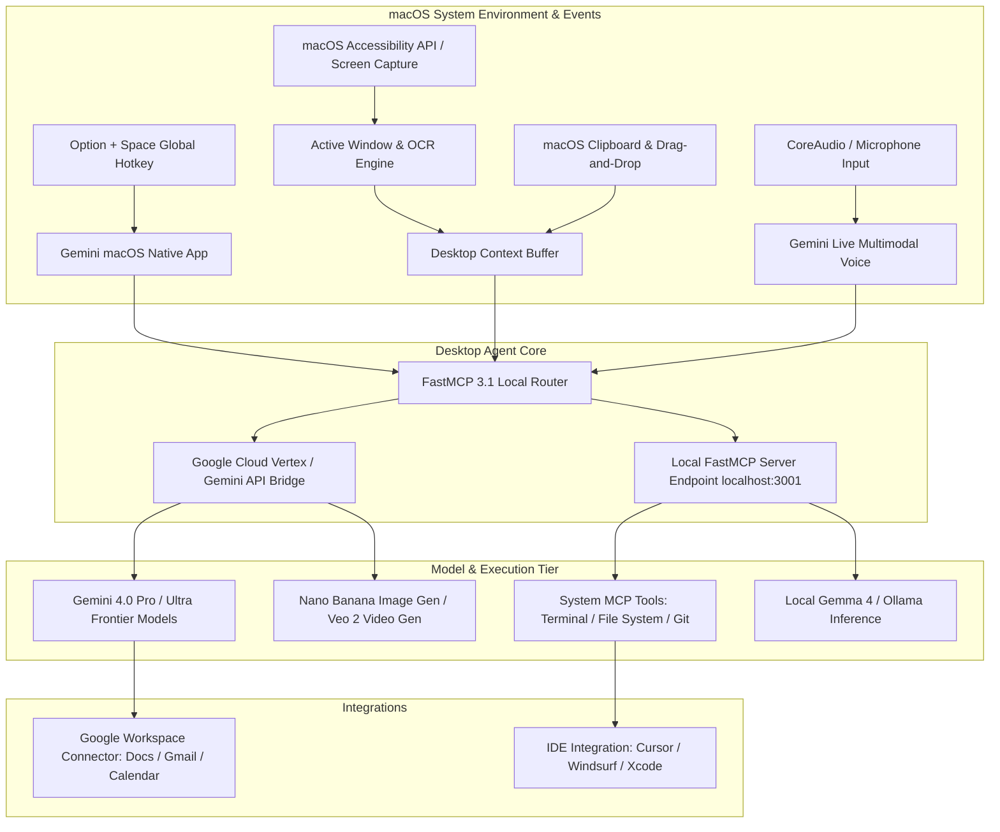

# Google Gemini for macOS

## What it is
Google Gemini for macOS is a native desktop application designed to deeply integrate Google's multimodal AI capabilities into Apple Silicon Mac environments (M1 through M6 generations). Built specifically for macOS Sequoia (15.0+) and later operating system versions, Gemini for macOS functions as a system-wide intelligence companion. It provides global hotkey access, real-time screen and window context awareness, native audio and clipboard capturing, local file system indexing, and multi-modal creation capabilities.

By early January 2027, Google Gemini for macOS natively supports the **FastMCP 3.1** specification and **MCP 3.0 Task Protocol**. Operating as both an MCP client and a local FastMCP server host on `localhost:3001`, the application can route complex multi-step developer workflows between Google's cloud-hosted frontier models—including **Gemini 4.0 Pro**, **Gemini 4.0 Ultra**, **Gemini 4.0 Flash**, and **Gemini Spark 2.5**—and local execution tools or local models like [Gemma 4](../ai_knowledge/local_llms.md) running via [Ollama](../../services/ollama.md).



## What problem it solves
Google Gemini for macOS directly resolves productivity bottlenecks and context-switching overhead in modern desktop workflows:

1. **Context Fragmentation**: Eliminates manual copying and pasting between browser tabs, terminals, and IDEs by providing continuous, ambient access to on-screen content via native macOS Accessibility APIs.
2. **Multi-Step Developer Troubleshooting**: Allows developers to instantly capture active compiler errors, terminal logs, or Figma design mockups using global shortcuts (`Option + Space`), feeding visual and textual context into Gemini 4.0 Pro without leaving the active window.
3. **Local Tool Execution via FastMCP 3.1**: Bridges cloud-based reasoning with local file system modifications, bash command execution, and local database queries through secure Model Context Protocol sandboxes.
4. **Real-Time Multimodal Collaboration**: Enables simultaneous voice, screen, and text streaming via Gemini Live, allowing hands-free debugging and interactive code reviews.
5. **Unified Workspace Intelligence**: Integrates cloud-stored Google Workspace data (Gmail, Google Drive, Docs, Calendar) with local desktop artifacts into a single unified search and reasoning context.

## Where it fits in the stack
Google Gemini for macOS operates at the **Desktop Client & Ambient Intelligence Layer**:

- **System Layer**: Interoperates directly with macOS Sequoia system APIs (CoreGraphics, ScreenCaptureKit, CoreAudio, Accessibility Services).
- **Protocol Bridge Layer**: Serves as a local **FastMCP 3.1 Host**, allowing external agent frameworks like [Agno](../agents/phidata.md) or [LlamaIndex.TS](../ai_knowledge/llamaindex-ts.md) to query desktop state.
- **Model Orchestration Layer**: Routes user prompts dynamically between Google Cloud Vertex AI infrastructure (for heavy reasoning) and local on-device engines like [Gemma 4](../ai_knowledge/local_llms.md).
- **Application Integration Layer**: Connects desktop workflows directly to developer tools ([Cursor](../development_ops/cursor.md), [Zed](../development_ops/zed.md), Xcode) and productivity platforms.

## Typical use cases
- **Active Code Debugging**: Press `Option + Space` while viewing a failing test suite in Xcode or Cursor to let Gemini inspect the code snippet, analyze stack traces, and suggest fixes.
- **Visual Design & UI Extraction**: Share active Figma or browser windows with Gemini to extract CSS color schemes, generate Tailwind CSS classes, or generate matching visual assets via [Nano Banana](nano-banana.md).
- **Document & Spreadsheet Analysis**: Ask questions about dense PDFs, financial models in Excel, or Apple Keynote presentations currently displayed on screen.
- **Multimodal Meeting & Audio Synthesis**: Capture active system audio or microphone input during technical design discussions to automatically extract action items and create Google Tasks or Linear issues.
- **Automated Workspace Searching**: Execute cross-app searches combining local file system contents with Google Drive documents via natural language prompts.

## Strengths
- **Native macOS Performance & Design**: Polished SwiftUI interface optimized for Apple Silicon neural engines (NPU), offering negligible CPU and memory overhead when idle.
- **Ambient Screen & Window Intelligence**: High-precision window isolation allows users to target specific monitor displays or application windows without exposing sensitive background windows.
- **FastMCP 3.1 Client & Host Architecture**: Full compliance with FastMCP 3.1 specification, allowing desktop agents to execute local tools securely.
- **Multimodal Generation Suite**: Native desktop generation and editing of high-resolution images via [Nano Banana](nano-banana.md) and short video clips via Google Veo 2.
- **Keyboard-First Design**: Extensive global hotkey mappings for instant invocation, screen capture, clear context, and floating window pinning.

## Limitations
- **Apple Silicon Hardware Dependency**: Runs exclusively on Apple Silicon Macs (M1/M2/M3/M4/M5/M6); Intel-based Mac architectures are not supported.
- **Operating System Baseline**: Strictly requires macOS Sequoia (15.0) or later, preventing deployment on older macOS enterprise images.
- **Cloud Connection Requirement**: Complex multi-modal reasoning and high-fidelity generation require an active high-speed internet connection to Google Cloud.

## When to use it
- When developing or designing primarily on Apple Silicon hardware under macOS Sequoia+.
- When your daily workflow heavily utilizes Google Workspace alongside local desktop developer tools.
- When requiring real-time visual reasoning over active screen content without manual screenshot exports.
- When seeking a lightweight desktop FastMCP 3.1 host for local agent orchestration.

## When not to use it
- On legacy Intel-based Mac hardware or non-macOS platforms (Windows, Linux) — use [ChatGPT Desktop](chatgpt.md) or browser interfaces.
- In strictly air-gapped or offline enterprise environments where all cloud outbound traffic is disabled (use [Ollama](../../services/ollama.md) with local models).
- For terminal-exclusive headless workflows where a graphical desktop interface is unavailable — use [Gemini CLI](gemini-cli.md).

## Getting started

### 1. Installation & Setup
1. Download the official installer `.dmg` package from [Gemini for macOS](https://gemini.google/mac/).
2. Drag `Gemini.app` into your macOS `/Applications` directory.
3. Launch `Gemini.app` and sign in using your Google Workspace or Personal account.

### 2. Granting macOS System Permissions
For full screen-awareness, audio interaction, and global hotkeys, configure the following settings in **macOS System Settings > Privacy & Security**:
- **Accessibility**: Enable `Gemini.app` to allow global keybindings (`Option + Space`) and active UI element inspection.
- **Screen & System Audio Recording**: Enable `Gemini.app` to allow active window capture via ScreenCaptureKit.
- **Microphone**: Enable `Gemini.app` for Gemini Live voice interaction.

### 3. Testing Global Invocation
- Press `Option + Space` from any active application to launch the floating Gemini overlay.
- Click the **Screen Context** icon to attach the active window snippet.
- Type `"Explain this window contents and highlight potential errors"` and press Enter.

## CLI examples
Gemini for macOS installs a companion CLI utility, `gemini-mac`, facilitating automation and scriptable integration with terminal workflows.

```bash
# Check status of local Gemini macOS daemon and FastMCP bridge
gemini-mac status

# Capture active desktop window and send prompt to Gemini 4.0 Pro
gemini-mac capture --target active-window --prompt "Summarize stack trace"

# List all active FastMCP 3.1 tools registered with the desktop application
gemini-mac mcp list-tools

# Connect terminal context to local desktop session
gemini-mac stream --file ./build.log --model gemini-4.0-flash

# Trigger system audio capture for a 30-second voice memo
gemini-mac voice --duration 30 --output-task
```

## API examples

### 1. Python FastMCP 3.1 Server for Gemini macOS Context Bridge
The following complete Python script creates a FastMCP 3.1 server that collects macOS active window metadata and exposes it as an agent tool to Gemini for macOS.

```python
import asyncio
import json
import subprocess
from typing import Dict, Any, Optional
from pydantic import BaseModel, Field, HttpUrl, ValidationError
from fastmcp import FastMCP

# Initialize FastMCP Server for macOS Desktop Bridge
mcp_server = FastMCP(
    name="GeminiMacOSDesktopBridge",
    version="3.1.0",
    description="Provides active window and screen context to Gemini macOS Agent"
)

class MacOSWindowMetadata(BaseModel):
    app_name: str = Field(..., description="Name of active macOS application (e.g. Cursor, Safari)")
    window_title: str = Field(..., description="Title bar text of the active window")
    is_fullscreen: bool = Field(default=False, description="Whether the window occupies full screen")
    display_id: int = Field(default=1, description="Active display monitor index")
    url: Optional[str] = Field(default=None, description="URL if active app is a web browser")

class CaptureScreenPayload(BaseModel):
    metadata: MacOSWindowMetadata
    ocr_text_snippet: str = Field(..., max_length=10000, description="Extracted OCR text from window")
    timestamp_utc: str = Field(..., description="ISO 8601 capture timestamp")

@mcp_server.tool()
async def get_active_window_context() -> str:
    """Queries macOS system APIs to extract active application context for Gemini."""
    # Mocking native AppleScript / System Events execution
    applescript_cmd = """
    tell application "System Events"
        set frontApp to name of first application process whose frontmost is true
        set windowName to name of front window of (first application process whose frontmost is true)
        return frontApp & "||" & windowName
    end tell
    """
    try:
        # In actual macOS environment, subprocess executes osascript
        # output = subprocess.check_output(["osascript", "-e", applescript_cmd]).decode("utf-8").strip()
        mock_output = "Cursor||gemini-macos.md - Enterprise-AI-KB - Visual Studio Code"
        app_name, window_title = mock_output.split("||")

        payload = {
            "metadata": {
                "app_name": app_name,
                "window_title": window_title,
                "is_fullscreen": False,
                "display_id": 1,
                "url": None
            },
            "ocr_text_snippet": "## What it is\nGoogle Gemini for macOS is a native desktop application...",
            "timestamp_utc": "2027-01-07T12:30:00Z"
        }

        # Validate payload against strict Pydantic v2 schema
        validated = CaptureScreenPayload.model_validate(payload)
        return validated.model_dump_json(indent=2)
    except Exception as err:
        return f"Error retrieving macOS desktop context: {str(err)}"

if __name__ == "__main__":
    # Start FastMCP 3.1 Server over SSE on localhost
    print("Starting Gemini macOS FastMCP 3.1 Bridge on http://localhost:3001/sse")
    mcp_server.run(transport="sse", port=3001)
```

### 2. Client Side Response Schema Validation (Python & Pydantic v2)
This script demonstrates validating multimodal responses received from Gemini for macOS desktop API endpoints:

```python
from typing import List, Optional
from pydantic import BaseModel, Field, ValidationError

class ActionableSuggestion(BaseModel):
    suggestion_id: str = Field(..., description="Unique suggestion identifier")
    category: str = Field(..., description="Category: refactoring | bugfix | optimization")
    description: str = Field(..., description="Detailed technical suggestion")
    confidence_score: float = Field(..., ge=0.0, le=1.0, description="Model confidence score")

class GeminiDesktopAnalysisResponse(BaseModel):
    model_version: str = Field(..., description="Gemini model version utilized")
    active_app_analyzed: str = Field(..., description="Application evaluated")
    summary: str = Field(..., description="High-level synthesis of on-screen state")
    suggestions: List[ActionableSuggestion] = Field(default_factory=list)
    tokens_consumed: int = Field(..., ge=0, description="Total prompt and completion tokens")

def validate_gemini_response(raw_json: dict) -> GeminiDesktopAnalysisResponse:
    try:
        validated_data = GeminiDesktopAnalysisResponse.model_validate(raw_json)
        print("Pydantic v2 Validation Successful!")
        print(f"Model: {validated_data.model_version} | App: {validated_data.active_app_analyzed}")
        print(f"Summary: {validated_data.summary}")
        for sug in validated_data.suggestions:
            print(f"  - [{sug.category.upper()}] {sug.description} (Score: {sug.confidence_score})")
        return validated_data
    except ValidationError as err:
        print(f"Validation Error: {err}")
        raise

if __name__ == "__main__":
    mock_api_response = {
        "model_version": "gemini-4.0-pro",
        "active_app_analyzed": "Cursor",
        "summary": "Detected missing Pydantic v2 validation step in active Python file.",
        "suggestions": [
            {
                "suggestion_id": "sug-101",
                "category": "bugfix",
                "description": "Wrap dictionary payload in model_validate() call to catch schema exceptions.",
                "confidence_score": 0.98
            }
        ],
        "tokens_consumed": 4120
    }

    validate_gemini_response(mock_api_response)
```

## Related tools / concepts
- [ChatGPT for Desktop](chatgpt.md) — OpenAI native desktop client alternative.
- [Claude for Desktop](claude.md) — Anthropic desktop application with MCP support.
- [Gemini CLI](gemini-cli.md) — Command-line interface for Google Gemini models.
- [Nano Banana](nano-banana.md) — High-fidelity AI image generation model integrated into Gemini.
- [Gemini](gemini.md) — Core Google multimodal cloud model architecture.
- [Gemma 4](../ai_knowledge/local_llms.md) — Google lightweight open-weights model family.
- [NotebookLM](notebooklm.md) — AI grounded research and notebook platform.
- [Model Context Protocol (FastMCP 3.1)](../automation_orchestration/mcp.md) — Protocol for agent tools.

## Sources / references
- [Google Gemini for macOS Official Landing Page](https://gemini.google/mac/)
- [Google Blog: Gemini App Expands to macOS Ecosystem](https://blog.google/innovation-and-ai/products/gemini-app/gemini-app-now-on-mac-os/)
- [The New Stack: Gemini Native Mac App Launch Analysis](https://thenewstack.io/gemini-app-macos-launch/)
- [Model Context Protocol (FastMCP 3.1) Specification](https://modelcontextprotocol.io/spec/3.1)

## Contribution Metadata
- Last reviewed: 2027-01-07
- Confidence: high
