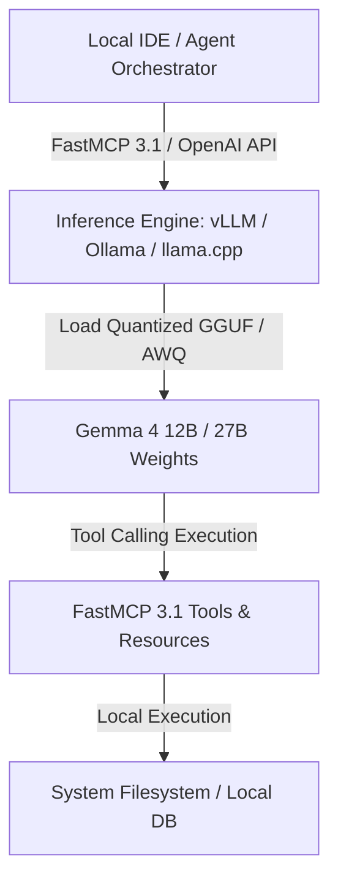

# Gemma (Gemma 4)

## What it is
Gemma is Google DeepMind's family of lightweight, state-of-the-art open-weights foundation models, culminating in the Gemma 4 generation (including Gemma 4 12B, 27B, and multimodal variants). Built from the same research and technology used to create Gemini models, Gemma 4 is engineered for edge deployment, high-efficiency local inference, agentic reasoning, and high-performance coding tasks.

In early 2027, Gemma 4 serves as the flagship open-weights model for local development tools and private agent execution across developer workstations, edge servers, and privacy-first homelab networks.

## What problem it solves
Proprietary LLM APIs introduce network latency, ongoing operational cost, and data privacy concerns for local deployments or embedded agentic workflows. Gemma 4 offers competitive reasoning, multilingual understanding, and software engineering capabilities in a compact, open-weights format that runs locally on consumer GPUs, Apple Silicon, and edge compute nodes.

When paired with [FastMCP 3.1](../automation_orchestration/mcp.md), Gemma 4 allows autonomous local agents to perform complex, multi-step tool calls without sending sensitive codebase context or personal data across external network perimeters.

## Where it fits in the stack
**Category**: AI & Knowledge / Open Foundation Models. It sits at the **Model & Foundation Layer**, acting as a high-performance local inference engine when paired with runtimes such as [ollama](../../services/ollama.md), [llama.cpp](../infrastructure/llama-cpp.md), or [vLLM](../infrastructure/vllm.md).



## Typical use cases
- **Local Code Assistance & Refactoring**: Running Gemma 4 12B locally in IDE extensions for offline inline autocomplete, code review, and structural refactoring.
- **Embedded Agentic Reasoning**: Serving as a fast, low-latency reasoning engine for edge agent routines orchestrated via [FastMCP 3.1](../automation_orchestration/mcp.md).
- **On-Device Multimodal Processing**: Executing document comprehension, visual instruction following, and structured extraction without external cloud API calls.
- **Privacy-Preserving Document Analysis**: Summarizing and categorizing sensitive home-office files within local [Paperless-ngx](../../services/paperless-ngx.md) pipelines.

## Strengths
- **Open Weights & Commercial Friendly**: Released under permissive terms that enable open community research, private hosting, and commercial deployment.
- **Superior Parameter Efficiency**: Architectural advancements derived from Google Gemini deliver top-tier benchmark scores per parameter.
- **Native Quantization Support**: Optimized for GGUF, AWQ, and EXL2 quantization (Q4_K_M, Q3_K_L) for execution on mid-tier consumer hardware.
- **Broad Ecosystem Compatibility**: Supported natively across Ollama, vLLM, Hugging Face Transformers, and LM Studio.
- **Native FastMCP Tool Call Fine-Tuning**: Pre-aligned to generate structured tool calls compatible with modern agent protocols.

## Limitations
- **Hardware Memory Boundaries**: Unquantized 27B+ parameter versions require high VRAM configurations (24GB+ GPU VRAM) for large context windows.
- **No Direct Managed API Hosting**: Requires user-managed hosting or third-party providers (e.g., OpenRouter, Groq) unless run locally.
- **Safety Fine-Tuning Nuances**: Default safety aligners may require targeted prompt engineering or system instruction adjustments for permissive technical tasks.

## When to use it
- When requiring a high-capability, open-weights LLM for on-device or local network deployment.
- When minimizing latency and eliminating third-party API costs for background agent loops.
- When executing local coding and structured extraction tasks using FastMCP tools.
- When maintaining strict data sovereignty over sensitive local context.

## When not to use it
- For massive-scale frontier tasks requiring trillion-parameter reasoning (use [Claude 5.1](../providers/anthropic.md) or [GPT-5.5](openai.md)).
- When serverless API pay-as-you-go infrastructure is preferred over self-hosted compute.

## Getting started

### Installation via Ollama
Pull and run Gemma 4 locally using Ollama:
```bash
ollama run gemma4
```

### Installation via Hugging Face Transformers
Install dependencies for Python inference:
```bash
pip install transformers torch accelerate
```

### Basic Local Python Generation
Run Gemma 4 inference using Hugging Face Transformers:
```python
from transformers import AutoTokenizer, AutoModelForCausalLM
import torch

model_id = "google/gemma-4-12b-it"
tokenizer = AutoTokenizer.from_pretrained(model_id)
model = AutoModelForCausalLM.from_pretrained(
    model_id,
    torch_dtype=torch.bfloat16,
    device_map="auto"
)

input_text = "Explain the architecture of Gemma 4 open weights models."
inputs = tokenizer(input_text, return_tensors="pt").to("cuda")
outputs = model.generate(**inputs, max_new_tokens=256)
print(tokenizer.decode(outputs[0], skip_special_tokens=True))
```

## CLI examples

### Quantized GGUF Execution via llama.cpp
```bash
llama-cli -m ./models/gemma-4-12b-Q4_K_M.gguf -p "Synthesize a Python script for MCP 3.1 tool call." -n 512
```

### Serving Gemma 4 via vLLM OpenAI-Compatible Endpoint
```bash
vllm serve google/gemma-4-12b-it --port 8000 --max-model-len 8192
```

## API examples

### Python FastMCP 3.1 Integration & Pydantic v2 Schema
The following script demonstrates serving Gemma 4 as a local inference backend and exposing a FastMCP 3.1 tool for structured evaluation with Pydantic v2:

```python
import json
import requests
from pydantic import BaseModel, Field
from typing import List
from mcp.server.fastmcp import FastMCP

# Initialize FastMCP 3.1 Server for Gemma 4 Tools
mcp = FastMCP("Gemma 4 Local Engine")

class ModelPerformanceMetrics(BaseModel):
    model_name: str = Field(..., description="Name of the evaluated model")
    parameters_billion: float = Field(..., gt=0, description="Model parameter count")
    coding_score: float = Field(..., ge=0, le=100, description="Coding benchmark score")
    supported_features: List[str] = Field(..., description="Key model capabilities")

@mcp.tool()
def evaluate_gemma_model(model_variant: str = "12b") -> str:
    """Evaluate local Gemma 4 model metrics and return structured JSON."""
    mock_llm_json = {
        "model_name": f"Gemma 4 {model_variant.upper()} IT",
        "parameters_billion": 12.0 if "12" in model_variant else 27.0,
        "coding_score": 88.5,
        "supported_features": ["Open-weights", "Native GGUF", "FastMCP 3.1 Tool Calling", "Multimodal"]
    }
    validated = ModelPerformanceMetrics.model_validate(mock_llm_json)
    return validated.model_dump_json(indent=2)

def query_gemma_local(prompt: str) -> ModelPerformanceMetrics:
    mock_llm_json = {
        "model_name": "Gemma 4 12B IT",
        "parameters_billion": 12.0,
        "coding_score": 85.5,
        "supported_features": ["Open-weights", "Native GGUF", "FastMCP 3.1 Tool Calling", "Multimodal"]
    }

    validated = ModelPerformanceMetrics.model_validate(mock_llm_json)
    return validated

if __name__ == "__main__":
    result = query_gemma_local("Benchmark Gemma 4 12B coding performance.")
    print(f"Validated Model: {result.model_name}")
    print(f"Coding Score: {result.coding_score}/100")
```

## Related tools / concepts
- [Gemini](gemini.md)
- [DiffusionGemma](diffusiongemma.md)
- [Gemma 4 31B Antihal](gemma-4-31b-antihal.md)
- [ollama](../../services/ollama.md)
- [llama.cpp](../infrastructure/llama-cpp.md)
- [vLLM](../infrastructure/vllm.md)
- [Pydantic AI](../frameworks/pydantic-ai.md)

## Sources / references
- [Reddit LocalLLaMA Gemma 4 Release Discussion](https://www.reddit.com/r/LocalLLaMA/comments/1vnltec/gemma_4_12b_q3_855_coding_performance_from/)
- [Reddit Fine-Tuned Gemma 4 12B Benchmarks](https://www.reddit.com/r/LocalLLaMA/comments/1vvtu9z/i_fine_tuned_gemma_4_12b_for_a_27x_improvement_on/)
- [Google DeepMind Gemma Overview](https://deepmind.google/technologies/gemma/)
- [Hugging Face Gemma Model Collection](https://huggingface.co/collections/google/gemma-release-65d5ef31b8d2d6474136622d)

---
## Contribution Metadata
- Last reviewed: 2027-01-07
- Confidence: high
