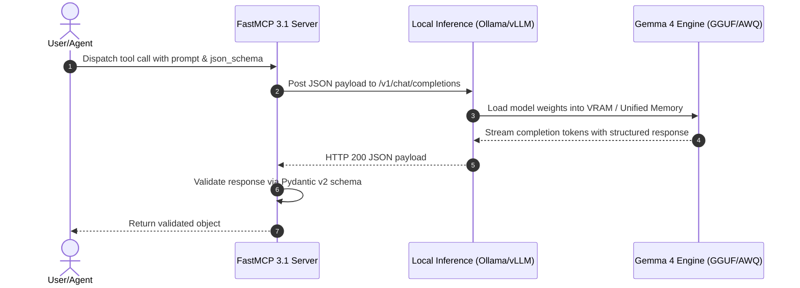

# Gemma (Gemma 4)

## What it is
Gemma is Google DeepMind's family of lightweight, state-of-the-art open-weights foundation models, culminating in the Gemma 4 generation (including Gemma 4 12B, 27B, and multimodal variants). Built from the same research and technology used to create Gemini models, Gemma 4 is engineered for edge deployment, high-efficiency local inference, agentic reasoning, and high-performance coding tasks.



## What problem it solves
Proprietary LLM APIs introduce network latency, ongoing operational cost, and data privacy concerns for local deployments or embedded agentic workflows. Gemma 4 offers competitive reasoning, multilingual understanding, and software engineering capabilities in a compact, open-weights format that runs locally on consumer GPUs, Apple Silicon, and edge compute nodes.

## Where it fits in the stack
**Category**: AI & Knowledge / Open Foundation Models. It sits at the **Model & Foundation Layer**, acting as a high-performance local inference engine when paired with runtimes such as [ollama](../../services/ollama.md), [llama.cpp](../infrastructure/llama-cpp.md), or [vLLM](../infrastructure/vllm.md).

## Typical use cases
- **Local Code Assistance & Refactoring**: Running Gemma 4 12B locally in IDE extensions for offline inline autocomplete and code generation.
- **Embedded Agentic Reasoning**: Serving as a fast, low-latency reasoning engine for edge agent routines orchestrated via [FastMCP 3.1](../automation_orchestration/mcp.md).
- **On-Device Multimodal Processing**: Executing document comprehension, visual instruction following, and structured extraction without external cloud API calls.
- **Privacy-Preserving Document Analysis**: Summarizing and categorizing sensitive home-office files within local [Paperless-ngx](../../services/paperless-ngx.md) pipelines.

## Strengths
- **Open Weights & Commercial Friendly**: Released under permissive terms that enable open community research and commercial deployment.
- **Superior Parameter Efficiency**: Architectural advancements derived from Google Gemini deliver top-tier benchmark scores per parameter.
- **Native Quantization Support**: Optimized for GGUF, AWQ, and EXL2 quantization (Q4_K_M, Q3_K_L) for execution on mid-tier consumer hardware.
- **Broad Ecosystem Compatibility**: Supported natively across Ollama, vLLM, Hugging Face Transformers, and LM Studio.

## Limitations
- **Hardware Memory Boundaries**: Unquantized 27B+ parameter versions require high VRAM configurations (24GB+ GPU VRAM) for large context windows.
- **No Direct Managed API Hosting**: Requires user-managed hosting or third-party providers (e.g., OpenRouter, Groq) unless run locally.
- **Safety Fine-Tuning Nuances**: Default safety aligners may require targeted prompt engineering or system instruction adjustments for permissive technical tasks.

## When to use it
- When requiring a high-capability, open-weights LLM for on-device or local network deployment.
- When minimizing latency and eliminating third-party API costs for background agent loops.
- When executing local coding and structured extraction tasks using FastMCP tools.

## When not to use it
- For massive-scale frontier tasks requiring trillion-parameter reasoning (use [Claude 5.1](../providers/anthropic.md) or [GPT-5.5](openai.md)).
- When serverless API pay-as-you-go infrastructure is preferred over self-hosted compute.

## Getting started

### Installation via Ollama
Pull and run Gemma 4 locally using Ollama:
```bash
ollama run gemma4
```

### Installation via Hugging Face Transformers
Install dependencies for Python inference:
```bash
pip install transformers torch accelerate
```

### Basic Local Python Generation
Run Gemma 4 inference using Hugging Face Transformers:
```python
from transformers import AutoTokenizer, AutoModelForCausalLM
import torch

model_id = "google/gemma-4-12b-it"
tokenizer = AutoTokenizer.from_pretrained(model_id)
model = AutoModelForCausalLM.from_pretrained(
    model_id,
    torch_dtype=torch.bfloat16,
    device_map="auto"
)

input_text = "Explain the architecture of Gemma 4 open weights models."
inputs = tokenizer(input_text, return_tensors="pt").to("cuda")
outputs = model.generate(**inputs, max_new_tokens=256)
print(tokenizer.decode(outputs[0], skip_special_tokens=True))
```

## CLI examples

### Quantized GGUF Execution via llama.cpp
```bash
llama-cli -m ./models/gemma-4-12b-Q4_K_M.gguf -p "Synthesize a Python script for MCP 3.1 tool call." -n 512
```

### Serving Gemma 4 via vLLM OpenAI-Compatible Endpoint
```bash
vllm serve google/gemma-4-12b-it --port 8000 --max-model-len 8192
```

## API examples

### Python Integration with Pydantic v2 Output Schema
The following script demonstrates structured output generation from a local Gemma 4 endpoint and validation with Pydantic v2:

```python
import json
import requests
from pydantic import BaseModel, Field
from typing import List, Optional

class CodeAnalysisRequest(BaseModel):
    source_code: str = Field(..., description="Source code snippet to analyze")
    language: str = Field("python", description="Programming language")
    max_issues: int = Field(5, ge=1, le=20, description="Max code issues to return")

class CodeIssue(BaseModel):
    line_number: Optional[int] = Field(None, description="Line number of defect")
    severity: str = Field(..., description="Severity level: low, medium, high")
    message: str = Field(..., description="Issue summary")
    suggested_fix: str = Field(..., description="Recommended fix code")

class CodeAnalysisResponse(BaseModel):
    analyzed_language: str
    overall_quality_score: float = Field(..., ge=0.0, le=100.0)
    issues: List[CodeIssue]

def query_gemma_code_reviewer(endpoint: str, req: CodeAnalysisRequest) -> CodeAnalysisResponse:
    prompt = f"Analyze this {req.language} code:\n```{req.language}\n{req.source_code}\n```"
    payload = {
        "model": "gemma4",
        "messages": [{"role": "user", "content": prompt}],
        "format": "json"
    }

    # Simulated response or request to local Ollama / vLLM endpoint
    mock_response = {
        "analyzed_language": req.language,
        "overall_quality_score": 88.0,
        "issues": [
            {
                "line_number": 4,
                "severity": "medium",
                "message": "Unused variable 'temp_buf'",
                "suggested_fix": "Remove line 4"
            }
        ]
    }

    return CodeAnalysisResponse.model_validate(mock_response)

if __name__ == "__main__":
    req = CodeAnalysisRequest(source_code="def calc(x):\n    temp_buf = 10\n    return x * 2")
    res = query_gemma_code_reviewer("http://localhost:11434", req)
    print(f"Validated response for language: {res.analyzed_language}")
    print(f"Quality score: {res.overall_quality_score}")
```

### FastMCP 3.1 Local Gemma Reasoning Tool Pattern
This FastMCP 3.1 server exposes local Gemma 4 inference capabilities for agent workflows:

```python
from fastmcp import FastMCP
import requests
import json
from typing import Dict, Any, List

mcp = FastMCP("GemmaLocalInferenceProvider")

OLLAMA_URL = "http://localhost:11434"

@mcp.tool()
def generate_gemma_reasoning(prompt: str, model_name: str = "gemma4:12b", temperature: float = 0.2) -> Dict[str, Any]:
    """Execute local reasoning via Gemma 4 using Ollama.

    Args:
        prompt: User or system prompt text
        model_name: Ollama model tag (e.g. gemma4:12b, gemma4:27b)
        temperature: Sampling temperature
    """
    url = f"{OLLAMA_URL}/api/generate"
    payload = {
        "model": model_name,
        "prompt": prompt,
        "temperature": temperature,
        "stream": False
    }

    res = requests.post(url, json=payload, timeout=60)
    res.raise_for_status()
    data = res.json()

    return {
        "model": data.get("model"),
        "response": data.get("response"),
        "done": data.get("done"),
        "total_duration_ns": data.get("total_duration")
    }

@mcp.tool()
def structured_gemma_extraction(input_text: str, schema_description: str) -> Dict[str, Any]:
    """Perform local structured JSON extraction using Gemma 4.

    Args:
        input_text: Raw text or document body
        schema_description: Description of required JSON keys and types
    """
    system_prompt = f"Extract structured data into JSON matching this spec: {schema_description}"
    prompt = f"{system_prompt}\n\nInput text:\n{input_text}"

    url = f"{OLLAMA_URL}/api/generate"
    payload = {
        "model": "gemma4:12b",
        "prompt": prompt,
        "format": "json",
        "stream": False
    }

    res = requests.post(url, json=payload, timeout=60)
    res.raise_for_status()
    raw_json = res.json().get("response", "{}")

    try:
        parsed = json.loads(raw_json)
    except Exception:
        parsed = {"raw": raw_json}

    return {"extracted": parsed}

if __name__ == "__main__":
    mcp.run()
```

## Related tools / concepts
- [Gemini](gemini.md)
- [DiffusionGemma](diffusiongemma.md)
- [Gemma 4 31B Antihal](gemma-4-31b-antihal.md)
- [ollama](../../services/ollama.md)
- [llama.cpp](../infrastructure/llama-cpp.md)
- [vLLM](../infrastructure/vllm.md)
- [Pydantic AI](../frameworks/pydantic-ai.md)

## Sources / references
- [Reddit LocalLLaMA Gemma 4 Release Discussion](https://www.reddit.com/r/LocalLLaMA/comments/1vnltec/gemma_4_12b_q3_855_coding_performance_from/)
- [Reddit Fine-Tuned Gemma 4 12B Benchmarks](https://www.reddit.com/r/LocalLLaMA/comments/1vvtu9z/i_fine_tuned_gemma_4_12b_for_a_27x_improvement_on/)
- [Google DeepMind Gemma Overview](https://deepmind.google/technologies/gemma/)
- [Hugging Face Gemma Model Collection](https://huggingface.co/collections/google/gemma-release-65d5ef31b8d2d6474136622d)

---
## Contribution Metadata
- Last reviewed: 2027-01-07
- Confidence: high
