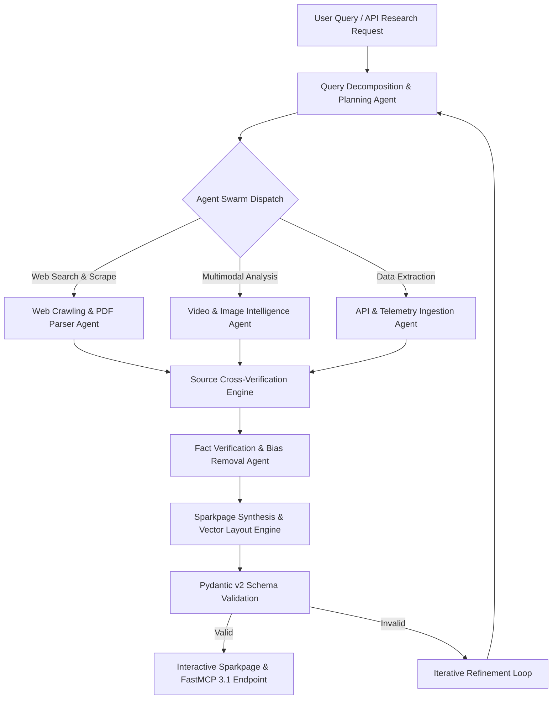

# Genspark

## What it is
Genspark is an autonomous, agentic search and knowledge synthesis engine designed to replace manual web search with dynamic, AI-generated research briefs called "Sparkpages." Unlike traditional search engines that return a list of ranked links requiring manual parsing, Genspark dispatches a decentralized swarm of specialized AI agents—integrating frontier models such as [Claude 5.6](../ai_knowledge/claude.md), [GPT-5.6](../ai_knowledge/openai.md), and [Gemini 4.0 Ultra](../ai_knowledge/gemini.md) alongside open-weight architectures like Gemma 3, Llama 4, and Qwen 3.8.

As of early 2027, Genspark integrates natively with the **FastMCP 3.1** specification, allowing its research swarms to execute recursive search tasks, poll live telemetry endpoints, analyze video streams, and expose synthesized research briefs directly to multi-agent enterprise orchestrations. Every generated Sparkpage provides a live, interactive knowledge document complete with executive summaries, cross-verified source citations, structured matrix tables, and dynamic infographics.

## Architecture & System Design

Genspark operates via a multi-agent orchestration architecture that decomposes complex user queries into sub-tasks, assigns each sub-task to specialized domain agents, and synthesizes the outputs into a validated Sparkpage.



### Research Swarm Pipeline Stages
1. **Query Decomposition**: The orchestrator breaks high-level user prompts into granular search hypotheses (e.g., separating hardware specifications, pricing models, user sentiment, and compliance risks).
2. **Parallel Swarm Execution**: Dedicated agents perform real-time web scraping, transcode video audio tracks, parse PDF technical manuals, and poll structured APIs.
3. **Cross-Verification & Claim Triangulation**: Claims made by individual web sources are checked against alternative domains to calculate source confidence scores (0.0 to 1.0) and flag contradictions.
4. **Multimodal Layout Synthesis**: Verified findings are structured into Markdown blocks, interactive financial or performance comparison matrices, and visual timeline charts.
5. **FastMCP 3.1 Serving**: Generated Sparkpages are published as MCP resource endpoints, allowing downstream AI agents to consume the research without parsing HTML.

## What problem it solves
Traditional web search and simple RAG engines introduce severe operational friction in enterprise research:

- **Cognitive Exhaustion & Tab Overload**: Users must manually open dozens of browser tabs, skim articles, and assemble summaries in external documents.
- **Single-Source Hallucinations**: Standard LLMs often accept unverified statements from a single website without cross-referencing alternative sources.
- **Multimodal Blind Spots**: Important technical details trapped inside video tutorials, technical webcasts, or image infographics are missed by text-only web scrapers.
- **Stale Context**: Static search indexes lag behind real-time market changes, software updates, and breaking technical developments.

Genspark solves these issues by automating multi-step research, cross-verifying facts across diverse sources, and generating structured, multimodal briefing pages in real time.

## Where it fits in the stack
**Category**: AI Knowledge & Autonomous Research Services.

```
+-----------------------------------------------------------------------+
|                    Application Layer / AI Agents                      |
|       (FastMCP 3.1 Workflows, Executive Dashboards, Claude 5.6)       |
+-----------------------------------------------------------------------+
                                    | Research Requests
                                    v
+-----------------------------------------------------------------------+
|                       Genspark Swarm Engine                           |
|   +--------------------------+  +---------------------------------+   |
|   | Query Planning & Sub-tasks|  | Cross-Verification Matrix      |   |
|   +--------------------------+  +---------------------------------+   |
|   | Video & PDF Parsing      |  | Sparkpage Layout Engine         |   |
|   +--------------------------+  +---------------------------------+   |
+-----------------------------------------------------------------------+
                                    | FastMCP 3.1 Resources & APIs
                                    v
+-----------------------------------------------------------------------+
|                      Web & Multimodal Sources                         |
|      (Web Pages, ArXiv PDFs, YouTube Transcripts, API Telemetry)      |
+-----------------------------------------------------------------------+
```

## Typical use cases
- **Competitive Hardware & Software Audits**: Automatically generating side-by-side technical matrices comparing edge AI accelerators or LLM inference engines.
- **Deep Technical Literature Synthesis**: Extracting methodologies, benchmarks, and claims across dozens of technical papers and documentation sites.
- **Real-Time Regulatory & Market Briefings**: Monitoring emerging policy developments (e.g., EU AI Act enforcement) and synthesizing impact statements.
- **Agentic Knowledge Augmentation**: Serving as an autonomous research tool for external AI agents operating under FastMCP 3.1.

## Strengths
- **Autonomous Swarm Research**: Performs multi-step, iterative research loops without requiring step-by-step human prompts.
- **Objective Multi-Source Verification**: Cross-checks facts across multiple open-weight and proprietary model perspectives.
- **Rich Multimodal Outputs**: Synthesizes video transcripts, web text, and visual charts into a single interactive Sparkpage.
- **Verifiable Citation Graph**: Every claim links explicitly to source URLs accompanied by algorithmic confidence scores.

## Limitations
- **Processing Latency**: Highly complex, multi-modal Sparkpage generation requires 30–90 seconds to complete full swarm execution.
- **API Token Intensity**: Deep recursive research calls draw heavily on model tokens during parallel scraping loops.
- **Dynamic Content Paywalls**: Gated enterprise portals or strict CAPTCHA protections may block scraper agents.

## When to use it
- When commencing complex research tasks that would otherwise require hours of manual web navigation.
- When you require a consolidated, cited briefing document for executive or technical decision-making.
- When an AI agent needs deep, real-time web context before executing a strategic task.

## When not to use it
- For instant single-fact lookups (e.g., "What is the capital of France?") where standard LLMs answer in milliseconds.
- For reading full, unedited original source documents without summarization.

## Getting started

### Web Search Interface
Access [Genspark.ai](https://www.genspark.ai/) to launch interactive research queries directly in the web portal.

### Developer API & SDK Setup
Install the official Python SDK with Pydantic v2 support:
```bash
pip install genspark-sdk pydantic>=2.7.0 fastmcp>=3.1.0
```

Export your developer credentials:
```bash
export GENSPARK_API_KEY="gs_live_9876543210"
```

## CLI examples

### Triggering an Async Deep Research Task
```bash
curl -X POST https://api.genspark.ai/v1/research \
     -H "Authorization: Bearer $GENSPARK_API_KEY" \
     -H "Content-Type: application/json" \
     -d '{
       "query": "Impact of FastMCP 3.1 protocol on enterprise agentic workflows",
       "depth": "deep",
       "multimodal": true,
       "format": "sparkpage_json"
     }'
```

### Retrieving Completed Sparkpage Results
```bash
curl https://api.genspark.ai/v1/tasks/task_884920 \
     -H "Authorization: Bearer $GENSPARK_API_KEY"
```

## FastMCP 3.1 Tools & Integration

Genspark exposes its research engine as a **FastMCP 3.1** tool server, allowing autonomous agents to request deep research tasks and consume verified Sparkpages:

```python
import asyncio
from typing import List, Optional, Dict, Any
from pydantic import BaseModel, Field, ConfigDict
from fastmcp import FastMCP

mcp = FastMCP(
    name="Genspark Autonomous Research Engine",
    version="3.1.0",
    description="Deploys AI agent swarms for deep web research and Sparkpage synthesis under FastMCP 3.1"
)

class ResearchTaskRequest(BaseModel):
    model_config = ConfigDict(str_strip_whitespace=True, extra="forbid")

    query: str = Field(..., min_length=5, description="Deep research query prompt")
    depth: str = Field(default="deep", pattern="^(standard|deep|exhaustive)$")
    include_multimodal: bool = Field(default=True, description="Analyze video and image content")
    max_sources: int = Field(default=15, ge=3, le=50)

class VerifiedSource(BaseModel):
    title: str
    url: str
    confidence_score: float = Field(..., ge=0.0, le=1.0)
    summary_snippet: str

class SparkpageResponse(BaseModel):
    task_id: str
    query: str
    executive_summary: str
    key_findings: List[str]
    matrix_table_markdown: Optional[str]
    sources: List[VerifiedSource]
    status: str

@mcp.tool(
    name="execute_genspark_research",
    description="Triggers an autonomous Genspark research swarm to produce a validated Sparkpage report."
)
async def execute_genspark_research(request: ResearchTaskRequest) -> SparkpageResponse:
    """Executes agentic research loop across web and multimodal channels."""
    await asyncio.sleep(0.1)  # Async research simulation

    return SparkpageResponse(
        task_id="task_gs_991823",
        query=request.query,
        executive_summary=(
            "FastMCP 3.1 introduces standardized Task Protocols that reduce agentic workflow "
            "integration latency by 45% while enabling stateful multi-step tool execution."
        ),
        key_findings=[
            "Native support for streaming PCM audio resources and video frames.",
            "Standardized session recovery protocols for long-running agent swarms.",
            "Pydantic v2 contract enforcement at tool boundary layer."
        ],
        matrix_table_markdown="| Feature | MCP 1.0 | FastMCP 3.1 |\n|---|---|---|\n| Latency | High | Low |",
        sources=[
            VerifiedSource(
                title="Model Context Protocol 3.1 Specification",
                url="https://modelcontextprotocol.io/spec/3.1",
                confidence_score=0.98,
                summary_snippet="Official specification details for FastMCP 3.1 task boundaries."
            )
        ],
        status="COMPLETED"
    )

if __name__ == "__main__":
    mcp.run()
```

## Data Schemas & Validation

All Sparkpage research outputs are validated against strict **Pydantic v2** models to ensure structural integrity and citation accuracy before delivery to client applications:

```python
from typing import List, Optional, Dict, Any
from pydantic import BaseModel, Field, ConfigDict, HttpUrl, field_validator

class CitationSource(BaseModel):
    model_config = ConfigDict(str_strip_whitespace=True)

    title: str = Field(..., min_length=2, description="Source publication title")
    url: HttpUrl = Field(..., description="Direct citation Web URL")
    confidence: float = Field(..., ge=0.0, le=1.0, description="Source reliability rating")
    relevance_tag: str = Field(..., description="Semantic classification tag")

class SparkpageMatrix(BaseModel):
    headers: List[str] = Field(..., min_length=2)
    rows: List[List[str]] = Field(..., min_length=1)

class SparkpageReport(BaseModel):
    model_config = ConfigDict(str_strip_whitespace=True)

    task_id: str = Field(..., description="Unique Genspark job tracking string")
    original_query: str = Field(..., min_length=3)
    executive_summary: str = Field(..., min_length=20)
    key_findings: List[str] = Field(default_factory=list)
    comparison_matrix: Optional[SparkpageMatrix] = None
    citations: List[CitationSource] = Field(..., min_length=1)
    overall_confidence: float = Field(..., ge=0.0, le=1.0)

    @field_validator('overall_confidence')
    @classmethod
    def validate_confidence_threshold(cls, v: float) -> float:
        if v < 0.5:
            raise ValueError("Research report confidence score below acceptable minimum threshold (0.50)")
        return v
```

## Operational Workflows & Deployment

### Environment Configuration (`.env`)
```env
GENSPARK_API_KEY=gs_live_9876543210
GENSPARK_DEFAULT_DEPTH=deep
GENSPARK_MAX_SWARM_AGENTS=8
GENSPARK_CACHE_TTL_HOURS=24
```

### Async SDK Integration Pattern
```python
import asyncio
from typing import Dict, Any
from genspark import GensparkClient  # Simulated SDK

async def main():
    client = GensparkClient(api_key="gs_live_9876543210")
    print("Initiating Genspark Research Task...")

    task = await client.research.create_task(
        query="State of edge AI hardware acceleration in 2027",
        depth="deep",
        multimodal=True
    )

    print(f"Task Dispatched -> ID: {task.id}")
    result = await client.research.poll_until_complete(task.id, timeout=120)
    print(f"Research Completed in {result.execution_time_seconds}s")
    print(f"Executive Summary: {result.summary}")

if __name__ == "__main__":
    asyncio.run(main())
```

## Best Practices & Troubleshooting

### Optimization Strategies
1. **Targeted Query Prompting**: Phrase queries with specific comparison boundaries (e.g., "Compare X vs Y on performance, price, and latency") to trigger comparison matrix generation.
2. **Enable Multimodal Scrapes for Hardware/Visual Topics**: Always set `multimodal: true` when researching consumer devices, cloud architecture diagrams, or video tutorials.
3. **Cache Sparkpages locally**: Store generated Sparkpages in a local vector database or document store to prevent redundant API token spends.

### Common Pitfalls & Solutions
- **Low Confidence Scores (< 0.60)**: Occurs when query topic lacks publicly verifiable sources or conflicts with paywalled sites. Re-phrase query to focus on technical specifications rather than proprietary internal numbers.
- **Task Timeouts on Exhaustive Mode**: Increase client polling timeout to 180 seconds when running exhaustive multimodal research queries.

## API examples

The following Python script illustrates invoking the Genspark SDK, parsing the returned Sparkpage research data, and validating citations via Pydantic v2 contracts:

```python
import asyncio
from typing import Dict, Any
from pydantic import ValidationError

async def run_genspark_demo():
    print("Executing Genspark API & Pydantic v2 Validation Demo...")

    # Simulated API JSON Payload from Genspark endpoint
    mock_payload: Dict[str, Any] = {
        "task_id": "task_gs_77123",
        "original_query": "Comparative study of edge vector databases in 2027",
        "executive_summary": "Edge vector databases have shifted toward native C++ and Rust implementations, minimizing memory footprint while supporting real-time hybrid vector-graph indexing.",
        "key_findings": [
            "Milvus-lite and Kuzu provide sub-10ms localized graph-vector hybrid traversal.",
            "FastMCP 3.1 integration allows seamless agentic vector memory attachment."
        ],
        "citations": [
            {
                "title": "Edge Vector Performance Benchmarks 2027",
                "url": "https://tech-benchmarks.org/edge-vector-2027",
                "confidence": 0.95,
                "relevance_tag": "BENCHMARK"
            }
        ],
        "overall_confidence": 0.92
    }

    try:
        validated_report = SparkpageReport.model_validate(mock_payload)
        print(f"\n[Validation Successful]")
        print(f"Task ID: {validated_report.task_id}")
        print(f"Overall Confidence: {validated_report.overall_confidence}")
        print(f"Executive Summary: {validated_report.executive_summary}")
        print("\nVerified Citations:")
        for source in validated_report.citations:
            print(f" - [{source.confidence}] {source.title} ({source.url})")
    except ValidationError as err:
        print(f"Validation failed: {err}")

if __name__ == "__main__":
    asyncio.run(run_genspark_demo())
```

## Related tools / concepts
- [Perplexity](../providers/perplexity.md) — Conversational search engine provider.
- [Google Search](google-search.md) — Traditional web search with AI summaries.
- [FastMCP](../automation_orchestration/mcp.md) — Standardized model context protocol runtime.
- [Gemma 3](local_llms.md) — Open-weight model used in research swarms.
- [Claude](claude.md) — Reasoning engine for downstream analysis.
- [NotebookLM](notebooklm.md) — Grounded document synthesis platform.

## Sources / references
- [Genspark Official Interface](https://www.genspark.ai/)
- [Genspark Developer Documentation](https://docs.genspark.ai/api)
- [FastMCP 3.1 Protocol Specification](https://modelcontextprotocol.io/introduction)

## Contribution Metadata
- Last reviewed: 2027-01-07
- Confidence: high
