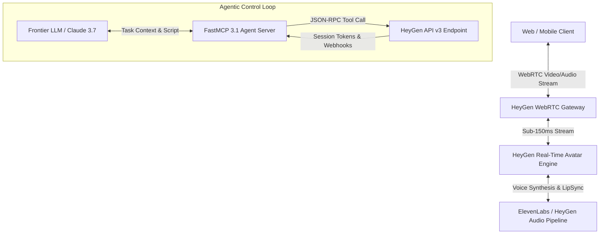

# HeyGen

## What it is
HeyGen is a state-of-the-art AI video generation platform that transforms text, scripts, and audio into photorealistic, interactive digital human video content. As of early 2027, HeyGen has evolved into an "Agentic Video Surface," providing developers and enterprise teams with ultra-low-latency WebRTC interactive avatars, headless batch video rendering via API v3, FastMCP 3.1 Task Protocol connectors, and high-fidelity 4K digital twins with automated gesture synchronization.

HeyGen operates both as an enterprise cloud studio for non-technical creators and as a developer-first video execution engine. Through its modern REST and Streaming APIs, organizations integrate HeyGen into automated customer engagement workflows, real-time AI concierges, localization pipelines, and multi-modal autonomous agent loops powered by frontier models like Claude 3.7 Sonnet, GPT-4.5, and Gemini 2.5 Flash.



## What problem it solves
Traditional video production requires significant resource investment, including camera crews, studio rentals, voice actors, video editors, and lengthy post-production cycles. Localizing video content into dozens of languages traditionally demands re-shooting or complex voice dubbing that breaks visual lip synchronization.

HeyGen solves these structural challenges by:
1. **Automating Video Production**: Generating broadcast-quality videos programmatically from plain text or structured data payloads in seconds.
2. **Zero-Latency Real-Time Interaction**: Enabling live, two-way conversational video agents with natural visual feedback, lip-syncing, and micro-expressions.
3. **Global Content Localization**: Translating existing videos into over 175 languages and dialects while automatically adjusting lip movement to match the target language phonemes.
4. **Programmatic Personalization at Scale**: Dynamically generating personalized video messages for sales outreach, client onboarding, and user education with zero manual editing.

## Where it fits in the stack
**Category**: AI Knowledge & Generative Media / Agentic Interfaces.

HeyGen acts as the visual and acoustic presentation tier (the "Avatar Surface") in modern enterprise AI stacks. It sits between autonomous reasoning agents (built on LangGraph, AutoGen, or FastMCP) and human end-users:

- **Upstream Integration**: Receives generated scripts, intent models, and structured state parameters from LLM orchestrators and knowledge retrieval pipelines.
- **Internal Engine**: Combines neural audio synthesis, neural radiance fields (NeRF/3DGS), and lip-sync models to render frame-accurate video streams.
- **Downstream Delivery**: Streams video via low-latency WebRTC to web/mobile SDKs or pushes rendered MP4 assets to cloud storage buckets (S3, Cloudflare R2, Google Cloud Storage).

## Typical use cases
- **Interactive AI Concierges & Customer Support**: Deploying digital representatives on web applications to handle complex customer queries with natural facial expressions and live voice dialogue.
- **Headless Personalized Sales Outreach**: Triggering automated video synthesis upon customer CRM events (e.g., Salesforce or HubSpot webhooks) to send high-touch, customized video pitch messages.
- **Enterprise Multilingual Training**: Creating localized employee training videos across 175+ languages from a single English master script, eliminating localization latency.
- **Automated News Briefings & Financial Updates**: Generating daily visual briefings by coupling database reporting pipelines with automated avatar voiceover execution.
- **Executive Digital Twins**: Allowing corporate leadership to deliver personalized internal video communications without spending hours in recording studios.

## Strengths
- **Sub-150ms WebRTC Real-Time Avatar Streaming**: Industry-leading low latency for live visual interaction, supporting full-duplex speech interruption.
- **API v3 Developer First Architecture**: Comprehensive REST endpoints, WebSockets, WebRTC SDKs, and open OpenAPI specs designed for programmatic control.
- **Photorealistic Lip-Sync & Micro-Expressions**: Natural eye blinking, head movement, and emotion-aware expression modulation matched to audio cadence.
- **Native FastMCP 3.1 Task Protocol Support**: Standardized MCP tools allowing autonomous AI agents to invoke video rendering and avatar session spawning natively.
- **Instant Digital Twin Creation**: High-precision avatar training requiring only 2–5 minutes of baseline video footage.
- **Enterprise Security & Compliance**: SOC 2 Type II certified, GDPR compliant, with full watermark protection and anti-deepfake authentication controls.

## Limitations
- **Cloud-Only Dependency**: HeyGen's high-fidelity avatar rendering engines require cloud GPU clusters; no fully offline local-only deployment model exists.
- **Consumption-Based Token Costs**: Real-time WebRTC streaming and 4K batch rendering incur per-minute usage fees that scale with high concurrent user traffic.
- **Strict Content Moderation**: Enterprise safety filters automatically flag and reject unauthorized public figure impersonation or policy-violating script inputs.
- **Bandwidth Sensitivity**: Real-time WebRTC interactive streams require stable network connections (>5 Mbps down/up) for optimal 1080p60 presentation.

## When to use it
- When your application requires a human-like, visual front-end for interactive AI dialogue or customer support.
- When generating personalized, dynamic video assets at high volume via automated API triggers.
- When rapid multilingual video translation with precise lip-sync alignment is mandatory.
- When building FastMCP 3.1 agentic pipelines where an LLM agent needs visual output capability.

## When not to use it
- For complete offline or air-gapped environments that prohibit cloud API traffic (consider offline text-to-speech tools like [Fish Audio](fish-audio.md) or local avatar engines).
- For stylized 3D animation or complex cinematic film production requiring physical multi-character stunt interactions.
- If the project scope requires simple text or voice-only responses without visual video avatar presentation.

## Getting started

### 1. Developer Account & API Key Provisioning
Register on the [HeyGen Developer Portal](https://developers.heygen.com) and obtain an API key from the developer console.

```bash
# Store API Key in environment variable
export HEYGEN_API_KEY="your_heygen_api_key_here"
```

### 2. Verify Connection via cURL
Test API connectivity and retrieve available default avatars:

```bash
curl -s -X GET "https://api.heygen.com/v2/avatars" \
     -H "X-Api-Key: $HEYGEN_API_KEY" \
     -H "Content-Type: application/json"
```

### 3. Install Official Python SDK
Install the HeyGen API v3 Python library and Pydantic v2 validation helpers:

```bash
pip install heygen-python-sdk pydantic mcp
```

## CLI examples

### 1. Retrieve Available Voices and Filter by Language
List available TTS voice engines for video generation, filtering for US English:

```bash
curl -s -X GET "https://api.heygen.com/v2/voices?language=en-US" \
     -H "X-Api-Key: $HEYGEN_API_KEY" | jq '.data.voices[] | {voice_id, name, gender}'
```

### 2. Submit Headless Batch Video Render Request
Queue a video generation task using avatar `Daisy-Professional-2027` and a custom script:

```bash
curl -s -X POST "https://api.heygen.com/v2/video/generate" \
     -H "X-Api-Key: $HEYGEN_API_KEY" \
     -H "Content-Type: application/json" \
     -d '{
       "video_inputs": [
         {
           "character": {
             "type": "avatar",
             "avatar_id": "Daisy-Professional-2027",
             "avatar_style": "normal"
           },
           "voice": {
             "type": "text",
             "input_text": "Welcome to the early 2027 Knowledge Base update. All systems are fully operational.",
             "voice_id": "13da4290c0a049d0ab1a0f82e6d6343e",
             "speed": 1.0
           },
           "background": {
             "type": "color",
             "value": "#0F172A"
           }
         }
       ],
       "dimension": {
         "width": 1920,
         "height": 1080
       },
       "test": false
     }'
```

### 3. Query Video Generation Status
Poll video rendering progress by passing the generated `video_id`:

```bash
curl -s -X GET "https://api.heygen.com/v1/video_status.get?video_id=v1234567890" \
     -H "X-Api-Key: $HEYGEN_API_KEY" | jq '.data'
```

### 4. Create WebRTC Real-Time Avatar Interactive Session Token
Generate a low-latency WebRTC token for interactive browser streaming:

```bash
curl -s -X POST "https://api.heygen.com/v1/realtime.streaming.create_token" \
     -H "X-Api-Key: $HEYGEN_API_KEY" \
     -H "Content-Type: application/json" | jq '.data.token'
```

## API examples

### FastMCP 3.1 Video Generation Tool Server (Python)
This production-ready FastMCP 3.1 server exposes HeyGen video synthesis and interactive avatar management as agentic tools:

```python
from typing import Dict, Any, Optional
from mcp.server.fastmcp import FastMCP
from pydantic import BaseModel, Field, HttpUrl
import os
import requests

mcp = FastMCP(
    "HeyGen-Video-Surface",
    instructions="FastMCP 3.1 tool server for HeyGen AI video rendering and WebRTC interactive avatar sessions."
)

HEYGEN_API_KEY = os.getenv("HEYGEN_API_KEY", "demo_key")
BASE_URL_V2 = "https://api.heygen.com/v2"
BASE_URL_V1 = "https://api.heygen.com/v1"

class HeyGenRenderRequest(BaseModel):
    avatar_id: str = Field(..., description="Unique avatar string identifier")
    voice_id: str = Field(..., description="Text-to-speech voice ID")
    script: str = Field(..., min_length=5, max_length=10000, description="Script content to speak")
    title: str = Field(default="Agentic Video Generation", description="Title of the output video")
    aspect_ratio: str = Field(default="16:9", description="Video aspect ratio: 16:9, 9:16, or 1:1")

class RealtimeSessionRequest(BaseModel):
    avatar_id: str = Field(..., description="Avatar model ID for live streaming")
    quality: str = Field(default="high", description="Stream quality: low, medium, high")
    voice_id: Optional[str] = Field(default=None, description="Optional custom voice override")

@mcp.tool()

async def create_heygen_video(request: HeyGenRenderRequest) -> Dict[str, Any]:
    """
    Triggers headless HeyGen batch video rendering using API v3 standards.
    """
    headers = {
        "X-Api-Key": HEYGEN_API_KEY,
        "Content-Type": "application/json"
    }

    dimensions = {
        "16:9": {"width": 1920, "height": 1080},
        "9:16": {"width": 1080, "height": 1920},
        "1:1": {"width": 1080, "height": 1080}
    }.get(request.aspect_ratio, {"width": 1920, "height": 1080})

    payload = {
        "title": request.title,
        "video_inputs": [
            {
                "character": {
                    "type": "avatar",
                    "avatar_id": request.avatar_id,
                    "avatar_style": "normal"
                },
                "voice": {
                    "type": "text",
                    "input_text": request.script,
                    "voice_id": request.voice_id
                }
            }
        ],
        "dimension": dimensions
    }

    response = requests.post(f"{BASE_URL_V2}/video/generate", json=payload, headers=headers, timeout=30)
    response.raise_for_status()
    return response.json()

@mcp.tool()

async def initialize_realtime_avatar_session(request: RealtimeSessionRequest) -> Dict[str, Any]:
    """
    Initializes a sub-150ms WebRTC streaming session for real-time AI avatar dialogue.
    """
    headers = {
        "X-Api-Key": HEYGEN_API_KEY,
        "Content-Type": "application/json"
    }

    token_resp = requests.post(f"{BASE_URL_V1}/realtime.streaming.create_token", headers=headers, timeout=15)
    token_resp.raise_for_status()
    token_data = token_resp.json().get("data", {})

    start_payload = {
        "avatar_name": request.avatar_id,
        "quality": request.quality,
        "voice_id": request.voice_id
    }

    session_resp = requests.post(
        f"{BASE_URL_V1}/realtime.streaming.start",
        json=start_payload,
        headers={"Authorization": f"Bearer {token_data.get('token')}", "Content-Type": "application/json"},
        timeout=15
    )
    session_resp.raise_for_status()

    return {
        "session_id": session_resp.json().get("data", {}).get("session_id"),
        "webrtc_token": token_data.get("token"),
        "status": "connected"
    }

if __name__ == "__main__":
    mcp.run()
```

### Pydantic v2 Webhook Payload & Session Schema Validation
Strict Pydantic v2 schemas for validating HeyGen video generation webhook events and session responses:

```python
from pydantic import BaseModel, Field, HttpUrl, field_validator
from typing import Optional, List
from datetime import datetime

class HeyGenVideoMeta(BaseModel):
    video_id: str = Field(..., description="Unique video asset ID")
    duration_seconds: float = Field(..., ge=0.0, description="Duration in seconds")
    video_url: HttpUrl = Field(..., description="Direct downloadable MP4 URL")
    thumbnail_url: HttpUrl = Field(..., description="Video thumbnail URL")

class HeyGenWebhookPayload(BaseModel):
    event_type: str = Field(..., description="Event classification, e.g. avatar_video.success")
    event_id: str = Field(..., description="Unique idempotency ID")
    created_at: datetime = Field(..., description="Timestamp of event dispatch")
    data: HeyGenVideoMeta

    @field_validator("event_type")
    @classmethod
    def validate_event_type(cls, v: str) -> str:
        valid_events = ["avatar_video.success", "avatar_video.failed", "realtime.session.started", "realtime.session.ended"]
        if v not in valid_events:
            raise ValueError(f"Unsupported event_type: {v}. Must be one of {valid_events}")
        return v

# Usage Example
raw_webhook_data = {
    "event_type": "avatar_video.success",
    "event_id": "evt_998877665544",
    "created_at": "2027-01-07T14:30:00Z",
    "data": {
        "video_id": "v1234567890",
        "duration_seconds": 42.5,
        "video_url": "https://resource.heygen.com/video/v1234567890.mp4",
        "thumbnail_url": "https://resource.heygen.com/image/v1234567890.jpg"
    }
}

event = HeyGenWebhookPayload.model_validate(raw_webhook_data)
print(f"Validated webhook event '{event.event_type}' for video ID: {event.data.video_id}")
```

## Related tools / concepts
- [Synthesia](synthesia.md) — Enterprise competitor for automated digital twin video creation.
- [PersonaPlex](personaplex.md) — NVIDIA's low-latency full-duplex voice and speech-to-speech model.
- [ElevenLabs](elevenlabs.md) — Premier audio cloning engine power-linking HeyGen voice synthesis.
- [Luma Dream Machine](luma-dream-machine.md) — Multi-modal generative video model for cinematic backgrounds.
- [Sora](sora.md) — OpenAI's video rendering model for creative background synthesis.
- [Fish Audio](fish-audio.md) — Open-source local audio synthesis alternative.
- [Desktop Commander MCP](../development_ops/desktop-commander-mcp.md) — Local system controller for desktop automation.

## Sources / references
- [HeyGen Official Site](https://www.heygen.com)
- [HeyGen API v3 Developer Documentation](https://developers.heygen.com)
- [HeyGen Real-Time WebRTC Interactive Avatar SDK](https://github.com/heygen-official/streaming-avatar-sdk)
- [HeyGen Security & Enterprise Governance](https://www.heygen.com/security)
- [FastMCP 3.1 Task Protocol Standard Specification](https://modelcontextprotocol.io)

## Contribution Metadata
- Last reviewed: 2027-01-07
- Confidence: high
