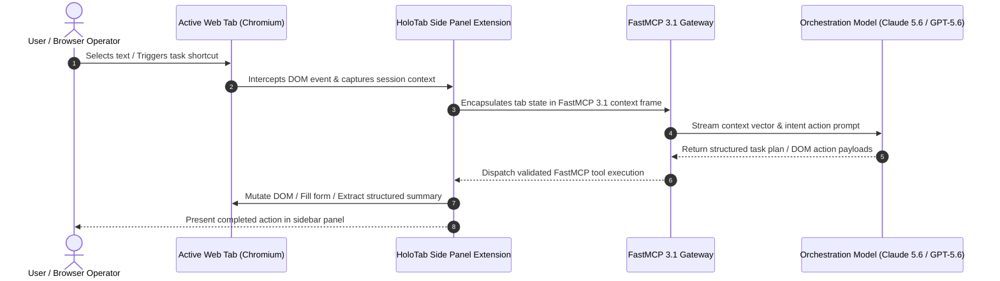

# HoloTab

## What it is
HoloTab is an AI browser companion developed by HCompany. It is designed to assist users with web-based tasks, contextual research, and navigation, serving as a proactive agentic layer within the modern browsing environment. Operating natively inside Chromium-based architectures (Chrome v145+, Edge, Brave), HoloTab links local browser state with autonomous backend intelligence.

In early 2027, HoloTab acts as a primary interface between desktop users and frontier reasoning engines like **Claude 5.6**, **GPT-5.6**, **Gemini 4.0 Ultra**, **Llama 4**, **Gemma 4**, and **Qwen 3.6**. Through native compliance with the **Model Context Protocol (MCP 3.1)** and **FastMCP 3.1** task protocol specifications, HoloTab exposes live tab DOM nodes, active selection vectors, and browser session context directly to orchestration agents without context switching.



## What problem it solves
Traditional AI browsing tools operate in isolated sidebars or require users to constantly copy and paste web content into external chat boxes. This manual workflow breaks developer flow, introduces context truncation, and prevents agents from taking direct action on web elements.

HoloTab addresses these bottlenecks by establishing a bi-directional, context-aware telemetry channel between active browser sessions and agentic workflows:
- **Context Loss**: Eliminates manual copying by continuously indexing active page state, DOM structures, and highlighted user text into unified context schemas.
- **Workflow Interruption**: Enables proactive in-page execution, allowing agents to execute repetitive web navigation, tabular data extraction, and form input without redirecting focus.
- **Protocol Fragmentation**: Standardizes browser tool interaction over the **FastMCP 3.1 Task Protocol**, ensuring seamless interoperability with remote agent runtimes.

## Where it fits in the stack
**AI & Knowledge / AI Browser Companion & Web Agent Layer**. HoloTab sits directly at the interface boundary between the user, the local browser DOM, and multi-agent backend orchestrators. In enterprise knowledge stacks, it bridges client-side browsing activity with server-side document stores and local/cloud LLMs.

```
+-----------------------------------------------------------------------+
|                         User Browsing Experience                      |
|                  (Chromium v145+ / Chrome Side Panel)                 |
+-----------------------------------------------------------------------+
                                   |
                                   v
+-----------------------------------------------------------------------+
|                            HoloTab Agent                              |
|           - Side Panel UI & Tab Telemetry Dispatcher                 |
|           - In-Page DOM Inspector & Action Injector                   |
+-----------------------------------------------------------------------+
                                   |
                     FastMCP 3.1 / JSON-RPC Protocol
                                   v
+-----------------------------------------------------------------------+
|                      Agent Orchestration Layer                        |
|        (Agno / LangGraph / FastMCP 3.1 Server / Pydantic v2)          |
+-----------------------------------------------------------------------+
                                   |
                                   v
+-----------------------------------------------------------------------+
|                    Frontier Intelligence Engines                      |
|       (Claude 5.6 / GPT-5.6 / Gemini 4.0 Ultra / Gemma 4 / Qwen 3.6)   |
+-----------------------------------------------------------------------+
```

## Typical use cases
- **In-Context Research & Summarization**: Automatically indexing background documentation, technical RFCs, or API references opened across active tabs into a consolidated agent workspace.
- **Automated Web Data Extraction**: Scraping tabular data or unstructured web elements directly into structured JSON schemas using Pydantic v2 models.
- **Form Automation & Web Task Execution**: Navigating web portals, filling repetitive inputs, and validating multi-step browser workflows under active developer oversight.
- **FastMCP 3.1 Context Broadcasting**: Streaming live browser selection events to remote IDE agents (e.g., Claude Code, Cursor) for cross-application debugging.

## Strengths
- **Proactive Context Awareness**: Continuously maintains active session vectors without requiring manual prompt initialization.
- **FastMCP 3.1 Protocol Native**: Fully compliant with modern MCP tool-use standards, allowing external orchestration frameworks to register HoloTab as a standard tool provider.
- **Seamless Chromium Integration**: Operates within the native Chromium Side Panel API, avoiding overlay lag or context menu clutter.
- **Strict Data Validation**: Leverages Pydantic v2 structures for inbound telemetry and action verification to prevent malformed DOM operations.

## Limitations
- **Chromium Ecosystem Lock-In**: Requires Chromium-based browsers (Chrome v145+, Edge, Brave), lacking native extensions for Firefox or Safari.
- **Permissions Overhead**: Demands broad browser tab and DOM access permissions, which may trigger corporate security policy reviews.
- **DOM Volatility**: Web pages with rapidly mutating dynamic DOMs or heavy anti-bot protections can occasionally cause selector mismatches during automated task execution.

## When to use it
- When you require a real-time AI research assistant that operates directly alongside your active web research sessions.
- When building automated web agent pipelines that need a native FastMCP 3.1 gateway into client browser windows.
- When needing to extract structured data from complex web interfaces directly into backend Python or Node.js data pipelines.

## When not to use it
- In strict zero-trust enterprise environments where extension-level DOM observation is strictly prohibited.
- For high-throughput background web scraping tasks where headless browser automation (e.g., Playwright or Puppeteer) is better suited.

## Getting started

### Installation
1. Install HoloTab from the official browser marketplace or load the unpackaged extension developer build:
   - **Chrome Web Store**: Search for "HoloTab AI Companion" and click **Add to Chrome**.
   - **Developer Build**: Download the release archive, navigate to `chrome://extensions`, enable **Developer mode**, and select **Load unpacked**.
2. Pin the extension icon to your browser toolbar and open the companion interface using `Alt + H` (or `Option + H` on macOS).

### Initial Configuration
Link HoloTab to your local or remote FastMCP 3.1 gateway by configuring the server endpoint inside `Extension Settings -> FastMCP Integration`:

```json
{
  "fastmcp_endpoint": "http://localhost:8080/mcp/v1",
  "enable_telemetry": true,
  "sync_interval_ms": 500,
  "active_model_tier": "Claude 5.6 Enterprise"
}
```

## CLI examples

### 1. Verifying HoloTab FastMCP 3.1 Endpoint Health
Inspect the availability and registration status of the HoloTab browser agent endpoint via cURL:

```bash
curl -X GET "http://localhost:8080/mcp/v1/health" \
     -H "Accept: application/json" \
     -H "X-HoloTab-Version: 1.4.0"
```

### 2. Querying Active Tab Telemetry via CLI
Retrieve current browser state and active DOM tab contexts exposed by the HoloTab daemon:

```bash
curl -X POST "http://localhost:8080/mcp/v1/tools/get_active_tab_context" \
     -H "Content-Type: application/json" \
     -d '{
       "jsonrpc": "2.0",
       "method": "tools/call",
       "params": {
         "name": "get_active_tab_context",
         "arguments": {
           "include_dom_snapshot": false,
           "max_text_bytes": 4096
         }
       },
       "id": 101
     }'
```

### 3. Dispatching an Automated Browsing Task
Issue a direct DOM automation request to HoloTab via the CLI interface:

```bash
curl -X POST "http://localhost:8080/mcp/v1/tools/execute_browser_action" \
     -H "Content-Type: application/json" \
     -d '{
       "jsonrpc": "2.0",
       "method": "tools/call",
       "params": {
         "name": "execute_browser_action",
         "arguments": {
           "action": "HIGHLIGHT_AND_SUMMARIZE",
           "selector": "#main-content-article",
           "summary_format": "bullet_points"
         }
       },
       "id": 102
     }'
```

## API examples

### Python (FastMCP 3.1 Tool Registration & Pydantic v2 Telemetry Schema)
The following Python script illustrates how to build a complete FastMCP 3.1 integration server that receives HoloTab browser telemetry, validates payload integrity using strict Pydantic v2 models, and exposes automated action capabilities back to the HoloTab side panel.

```python
import sys
from typing import List, Optional, Dict, Any
from pydantic import BaseModel, Field, HttpUrl, ValidationError
from mcp.server.fastmcp import FastMCP

# 1. Define strict Pydantic v2 models for inbound HoloTab state
class HoloTabFrameContext(BaseModel):
    tab_id: int = Field(..., description="Unique Chromium tab identifier")
    url: HttpUrl = Field(..., description="Active window web address")
    title: str = Field(..., min_length=1, description="Page title")
    is_focused: bool = Field(default=True, description="Active tab focus status")
    selected_text: Optional[str] = Field(None, description="Highlighted text snippet")
    dom_token_count: int = Field(..., ge=0, description="Estimated DOM token density")

class HoloTabTelemetryPayload(BaseModel):
    session_id: str = Field(..., description="Agent session UUID")
    timestamp_utc: str = Field(..., description="ISO timestamp of DOM event")
    active_tab: HoloTabFrameContext = Field(..., description="Current focused tab state")
    open_tabs_count: int = Field(..., gt=0, description="Total active tabs in window")
    meta_tags: Dict[str, str] = Field(default_factory=dict)

class HoloTabActionResult(BaseModel):
    action_id: str = Field(..., description="Unique action ID")
    status: str = Field(..., pattern="^(success|failed|pending)$")
    extracted_data: Optional[Dict[str, Any]] = None
    error_message: Optional[str] = None

# 2. Instantiate FastMCP 3.1 Server for HoloTab
mcp = FastMCP("HoloTab-Browser-Gateway", version="1.4.0")

@mcp.tool()
def process_holotab_telemetry(raw_payload: Dict[str, Any]) -> str:
    """Receives and validates browser state telemetry from HoloTab extension."""
    try:
        telemetry = HoloTabTelemetryPayload.model_validate(raw_payload)
        summary = (
            f"Successfully processed telemetry for session {telemetry.session_id}.\n"
            f"Active Tab: [{telemetry.active_tab.title}] ({telemetry.active_tab.url})\n"
            f"Highlighted Snippet: {telemetry.active_tab.selected_text or 'None'}"
        )
        return summary
    except ValidationError as err:
        return f"Telemetry Validation Failed: {err.json()}"

@mcp.tool()
def extract_structured_tab_data(
    tab_id: int, target_schema_type: str
) -> Dict[str, Any]:
    """Instructs HoloTab to extract structured JSON matching specific enterprise schemas."""
    result = HoloTabActionResult(
        action_id=f"act_tab_{tab_id}_99",
        status="success",
        extracted_data={
            "schema_applied": target_schema_type,
            "items_extracted": 12,
            "confidence_score": 0.98
        }
    )
    return result.model_dump()

if __name__ == "__main__":
    # Example execution validating sample payload
    sample_data = {
        "session_id": "sess_ht_88123a",
        "timestamp_utc": "2027-01-07T12:00:00Z",
        "active_tab": {
            "tab_id": 402,
            "url": "https://h.company/docs/holotab",
            "title": "HoloTab Agent Integration Standard",
            "is_focused": True,
            "selected_text": "HoloTab connects browser context directly to FastMCP 3.1 agent servers.",
            "dom_token_count": 1450
        },
        "open_tabs_count": 5,
        "meta_tags": {"author": "HCompany", "category": "AI Agents"}
    }

    print("--- HoloTab Telemetry Local Validation Run ---")
    res = process_holotab_telemetry(sample_data)
    print(res)

    # Run the FastMCP server when launched in daemon mode
    if "--serve" in sys.argv:
        mcp.run(port=8080)
```

## Related tools / concepts
- [Browser Use](../automation_orchestration/browser-use.md) — Headless web automation framework.
- [Model Context Protocol (MCP)](../automation_orchestration/mcp.md) — Universal agent context standard.
- [Gemma 4](../ai_knowledge/local_llms.md) — Open local reasoning models.
- [Perplexity](../providers/perplexity.md) — AI web search engine.
- [Open Agents](../agents/open-agents.md) — Multi-agent execution suites.
- [Claude Code](../development_ops/claude-code.md) — CLI software engineering agent.
- [Agno](../agents/agno.md) — Lightweight agent framework.

## Sources / references
- [HoloTab AI Browser Companion Announcement](https://huggingface.co/blog/Hcompany/holotab)
- [HCompany Developer Documentation](https://h.company/docs/holotab)
- [Model Context Protocol Specification v3.1](https://modelcontextprotocol.io/spec)

## Contribution Metadata
- Last reviewed: 2027-01-07
- Confidence: high
