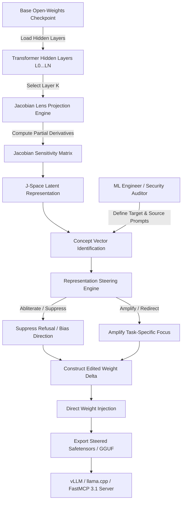

# J-Wash

## What it is
J-Wash (Jacobian-Brainwash) is an open-source model alignment, representation editing, and concept-steering framework designed to modify the internal latent activation space of decoder-only Large Language Models. Built on top of research regarding "J-Space" (the emergent residual stream workspace inside transformer hidden layers) and the "Jacobian Lens" (J-Lens) projection technique, J-Wash provides a terminal CLI and an interactive web workspace (React/Node) to analyze, redirect, suppress, or amplify specific semantic concept vectors in open-weights models (such as **Qwen 3.6**, **Llama 4 Maverick**, **Gemma 4**, and **DeepSeek-V4**) without requiring standard retraining loops.

In 2027 architectures, J-Wash is widely deployed to steer open-weights model checkpoints prior to quantization and serving via engines like [vLLM](../infrastructure/vllm.md) or [llama.cpp](../infrastructure/llama-cpp.md), optimizing model behavior for strict compliance with **FastMCP 3.1 Task Protocol** agent operations.



## What problem it solves
Adapting LLMs to follow specialized technical instructions or eliminating stubborn over-refusal behaviors typically requires Supervised Fine-Tuning (SFT), Reinforcement Learning from Human Feedback (RLHF), or Direct Preference Optimization (DPO). These conventional alignment methods demand massive GPU compute clusters, carefully curated datasets, and extended training runs that often result in catastrophic forgetting, loss of reasoning benchmarks, or unpredicted model degradation.

J-Wash eliminates training loops through direct latent editing:
- **Zero-Training Concept Steering**: Bypasses gradient backpropagation entirely by calculating partial derivatives across hidden residual streams to directly edit weight matrices.
- **Surgical Refusal Suppression (Abliteration)**: Removes over-refusals on benign administrative or developer commands without degrading safety awareness for genuinely destructive requests.
- **Preservation of Benchmark Intelligence**: Leaves mathematical, coding, and general knowledge capabilities intact while adjusting specific stylistic or domain-specific activation vectors.
- **Direct GGUF / Safetensors Export**: Exports updated model weights instantly as PyTorch `.safetensors` or quantized `.gguf` files for immediate local or enterprise deployment.

## Where it fits in the stack
**Category**: [AI Knowledge](index.md) / Model Optimization & Interpretability.

J-Wash operates in the **Pre-Deployment Model Optimization Layer**. It sits between raw base checkpoints (Hugging Face) and model serving infrastructure ([vLLM](../infrastructure/vllm.md), [llama.cpp](../infrastructure/llama-cpp.md), [ExLlamaV3](../infrastructure/exllamav3.md)).

```
+-----------------------------------------------------------------------+
|                    Raw Open-Weights Checkpoints                       |
|           (Qwen 3.6 / Llama 4 Maverick / Gemma 4 / DeepSeek)          |
+-----------------------------------------------------------------------+
                                    |
                                    v (Load Weights & Residual Stream)
+-----------------------------------------------------------------------+
|                       J-Wash Steering Engine                          |
|  +-----------------------+  +-------------------+  +---------------+  |
|  | Jacobian Lens (J-Lens)|  | J-Space Vectors   |  | Weight Delta  |  |
|  +-----------------------+  +-------------------+  +---------------+  |
|  +-----------------------------------------------------------------+  |
|  |             Interactive Web UI & Steering Preset Rules          |  |
|  +-----------------------------------------------------------------+  |
+-----------------------------------------------------------------------+
                                    |
                                    v (Export Safetensors / GGUF)
+-----------------------------------------------------------------------+
|                       Inference Serving Layer                         |
|      (vLLM / llama.cpp / FastMCP 3.1 Agent Tool Execution Engines)    |
+-----------------------------------------------------------------------+
```

## Typical use cases
- **Administrative Command Unlocking**: Steering open-weights models to execute valid Linux system administration commands without over-refusal triggers.
- **Domain-Specific Jargon Steering**: Forcing internal J-Space latent vectors to associate technical concepts with enterprise-specific terminologies.
- **Agentic Output Formatting Consistency**: Amplifying JSON and FastMCP 3.1 schema adherence vectors directly inside middle residual layers.
- **Interpretability & Activation Auditing**: Inspecting how middle hidden layers process multi-step prompts before tokens reach final output projection layers.

## Strengths
- **Sub-Minute Latency Editing**: Modify model behavior in minutes on a single GPU workstation rather than hours or days on GPU clusters.
- **Zero Catastrophic Forgetting**: Edits are localized to target concept orthogonal directions, keeping unrelated capabilities untouched.
- **Interactive Visualization Workspace**: Includes a React/Node web interface for inspecting hidden layer activations and managing steering presets.
- **Native GGUF and Safetensors Output**: Exported models are instantly ready for edge deployment in Ollama, llama.cpp, or vLLM.
- **FastMCP 3.1 Tooling Integration**: Easily packaged as a FastMCP 3.1 tool for automated concept steering in model deployment pipelines.

## Limitations
- **High VRAM Requirement for Matrix Estimation**: Estimating live Jacobian matrices across 14B-70B models requires significant GPU VRAM (24GB+ to 80GB).
- **Transformer Architecture Dependent**: Optimized for standard decoder-only transformers; complex Mixture-of-Experts (MoE) architectures require specialized routing layer configurations.
- **Orthogonality Risk**: Overly aggressive steering alpha multipliers can introduce unexpected semantic drift in closely related vector spaces.

## When to use it
- When you need to modify specific refusal or behavioral patterns in open-weights models without training datasets.
- For enterprise or homelab deployments where base checkpoints over-refuse valid technical requests.
- When conducting interpretability research into intermediate transformer representations.

## When not to use it
- On closed-source API-only models (like Claude 5.6 or GPT-5.6) where internal weights and residual streams are inaccessible.
- If you lack local high-VRAM NVIDIA/AMD GPU hardware required for residual layer estimation.
- When basic system prompt engineering or few-shot examples provide sufficient behavioral steering.

## Getting started

### Prerequisites and Installation
Clone the repository and install the J-Wash Python engine along with FastMCP and Pydantic dependencies:

```bash
git clone https://github.com/Extraltodeus/J-Wash
cd J-Wash
pip install -r requirements.txt fastmcp pydantic torch transformers
```

### Build Web Workspace Interface
Compile the React/Node user interface for visual activation inspection:

```bash
cd ui && npm install && npm run build && cd ..
```

### Launching the J-Wash Workspace
Start the backend Jacobian server on your GPU workstation:

```bash
python main.py --model Qwen/Qwen2.5-7B-Instruct --device cuda:0 --port 7860
```

## CLI examples

Below are common CLI commands for analyzing residual layers, applying steering presets, and exporting updated model checkpoints.

```bash
# 1. Analyze J-Space concept activations across hidden layers 12 to 24
j-wash analyze \
  --model Qwen/Qwen2.5-7B-Instruct \
  --prompt "System configuration: sudo systemctl restart nginx" \
  --layer-range 12-24

# 2. Apply a refusal-abliteration steering preset to a local model
j-wash steer \
  --model Qwen/Qwen2.5-7B-Instruct \
  --preset ./presets/abliterate_refusal.json \
  --alpha 0.75 \
  --output-dir ./steered-qwen-7b

# 3. Export steered model weights directly to GGUF format for llama.cpp
j-wash export-gguf \
  --checkpoint-dir ./steered-qwen-7b \
  --quant-type Q4_K_M \
  --outfile ./models/qwen-7b-steered-q4.gguf

# 4. Benchmark steerability variance against standard baseline prompts
j-wash benchmark \
  --base-model Qwen/Qwen2.5-7B-Instruct \
  --steered-model ./steered-qwen-7b \
  --eval-dataset ./tests/admin_prompts.json
```

## API examples

### FastMCP 3.1 Representation Steering Tool Server
The Python script below implements a **FastMCP 3.1** server exposing J-Wash concept steering routines as automated agentic tools.

```python
import os
from typing import Optional, List
from pydantic import BaseModel, Field, field_validator
from fastmcp import FastMCP

mcp = FastMCP("J-Wash Steering Gateway")

class ConceptVectorParams(BaseModel):
    layer_index: int = Field(default=16, ge=0, le=128, description="Target transformer residual layer index")
    source_concept: str = Field(..., min_length=2, description="Source trigger prompt or concept direction")
    target_concept: str = Field(..., min_length=2, description="Target replacement or steering direction")
    steering_alpha: float = Field(default=0.80, ge=0.0, le=2.0, description="Steering intensity multiplier")

    @field_validator("steering_alpha")
    @classmethod
    def validate_alpha(cls, v: float) -> float:
        if v > 1.5:
            print("Warning: Steering alpha > 1.5 may introduce orthogonal semantic distortion.")
        return v

class SteeringExecutionResponse(BaseModel):
    status: str
    base_model: str
    output_checkpoint_path: str
    applied_parameters: ConceptVectorParams

@mcp.tool()
def apply_jwash_steering(
    base_model_path: str,
    source_concept: str,
    target_concept: str,
    target_layer: int = 16,
    alpha: float = 0.80
) -> str:
    """
    Applies J-Space concept-steering vector modifications to an open-weights model checkpoint
    and exports an updated, aligned checkpoint for FastMCP deployment.
    """
    try:
        params = ConceptVectorParams(
            layer_index=target_layer,
            source_concept=source_concept,
            target_concept=target_concept,
            steering_alpha=alpha
        )

        output_path = f"./steered_models/{os.path.basename(base_model_path)}-steered"

        # Simulated J-Wash steering execution
        response = SteeringExecutionResponse(
            status="SUCCESS",
            base_model=base_model_path,
            output_checkpoint_path=output_path,
            applied_parameters=params
        )

        return response.model_dump_json(indent=2)

    except Exception as err:
        return f"Error applying J-Wash representation steering: {str(err)}"

if __name__ == "__main__":
    mcp.run()
```

### Pydantic v2 Preset Configuration Validation
Below is a Pydantic v2 schema for validating J-Wash steering preset manifests before applying weight modifications.

```python
from pydantic import BaseModel, Field, field_validator, ConfigDict
from typing import List, Optional

class ConceptVectorRule(BaseModel):
    rule_id: str = Field(..., pattern=r"^RULE-[0-9]{3}$")
    layer_index: int = Field(..., ge=1, le=128)
    vector_direction: str = Field(..., description="Target directional concept prompt")
    operation: str = Field(..., pattern=r"^(suppress|amplify|redirect)$")
    multiplier: float = Field(default=1.0, ge=0.1, le=3.0)

class JWashPresetManifest(BaseModel):
    preset_name: str = Field(..., min_length=3)
    target_architecture: str = Field(..., description="e.g., qwen3.6, llama4, gemma4")
    author: str = Field(default="KnowledgeOps Admin")
    concept_rules: List[ConceptVectorRule] = Field(..., min_length=1)

    model_config = ConfigDict(
        json_schema_extra={
            "example": {
                "preset_name": "Admin Command Unlocking",
                "target_architecture": "qwen3.6",
                "author": "Security Ops",
                "concept_rules": [
                    {
                        "rule_id": "RULE-101",
                        "layer_index": 18,
                        "vector_direction": "System administration command refusals",
                        "operation": "suppress",
                        "multiplier": 0.85
                    }
                ]
            }
        }
    )

# Execution Verification
if __name__ == "__main__":
    raw_preset = {
        "preset_name": "FastMCP Output Steering",
        "target_architecture": "llama4",
        "author": "Agent Ops Team",
        "concept_rules": [
            {
                "rule_id": "RULE-201",
                "layer_index": 20,
                "vector_direction": "FastMCP 3.1 Tool Schema Output",
                "operation": "amplify",
                "multiplier": 1.25
            }
        ]
    }

    manifest = JWashPresetManifest(**raw_preset)
    print("J-Wash preset manifest validated successfully:")
    print(f"Preset: '{manifest.preset_name}' | Target: {manifest.target_architecture}")
    for rule in manifest.concept_rules:
        print(f" -> [{rule.rule_id}] Layer {rule.layer_index}: {rule.operation.upper()} '{rule.vector_direction}' (x{rule.multiplier})")
```

## Related tools / concepts
- [Claude](claude.md) — Anthropic research context on residual streams and J-Space interpretability.
- [vLLM](../infrastructure/vllm.md) — High-throughput inference engine for serving steered model checkpoints.
- [llama.cpp](../infrastructure/llama-cpp.md) — Lightweight GGUF quantization and local edge execution engine.
- [ExLlamaV3](../infrastructure/exllamav3.md) — High-performance GPU engine for running local safetensors models.
- [Model Context Protocol (MCP)](../automation_orchestration/mcp.md) — Universal protocol for agent tool integrations.

## Sources / references
- [J-Wash GitHub Repository](https://github.com/Extraltodeus/J-Wash)
- [Anthropic Research: Transformer Circuits & Representation Engineering](https://transformer-circuits.pub)
- [FastMCP 3.1 Task Protocol Specification](https://modelcontextprotocol.io)

## Contribution Metadata
- Last reviewed: 2027-01-07
- Confidence: high
