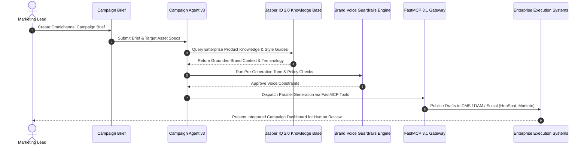

# Jasper

## What it is
Jasper is an enterprise AI marketing orchestration platform designed to power omnichannel content creation, brand governance, and marketing campaigns. In early 2027, it operates as a centralized "Brand Brain" utilizing **Jasper IQ 2.0**, **Brand Voice Guardrails**, and multi-model routing optimized for frontier reasoning engines like `claude-5-1-pro-20260915`, GPT-5.5, and Gemini 4.0 Pro.

## What problem it solves
Eliminates brand inconsistency, content bottlenecks, and siloed campaign execution across enterprise marketing teams. Jasper ensures every generated asset—from blog posts and ad copy to executive emails—strictly adheres to company style guides, brand terminology, and product knowledge repositories while scaling production velocity.

Without centralized brand governance platforms like Jasper, large enterprise organizations suffer from fragmented brand voices, compliance violations in regulated industries, redundant content creation efforts, and prolonged multi-stage copy review cycles.

## Enterprise Orchestration & Brand Guardrail Architecture



Jasper IQ 2.0 ingests product documentation, brand guidelines, regulatory rules, and high-performing historic marketing copy. It transforms these inputs into contextual embeddings and dynamic system prompts, ensuring that generated assets strictly match brand identity prior to multi-channel publication.

## Feature Matrix & Marketing Platform Comparison

| Feature / Metric | Jasper (Jasper IQ 2.0) | Copy.ai | ChatGPT Enterprise | Writer.com |
| :--- | :--- | :--- | :--- | :--- |
| **Brand Voice Training** | **Multi-Brand Voice Profiles & Rules** | Basic style guide | System prompts | Custom models & rules |
| **Campaign Asset Multi-Generation** | **Campaign Agent v3 (Omnichannel)** | Workflow automation | Manual multi-prompt | Workflow builder |
| **FastMCP 3.1 Tool Discovery** | **Native FastMCP Tool Provider** | Custom APIs | Custom GPT Actions | Custom extensions |
| **Plagiarism & Fact Checking** | **Integrated Copyscape & Grounding** | Third-party integrations | Web search grounding | Native claim verification |
| **Enterprise Security & Compliance** | **SOC 2 Type II, Zero Retention** | SOC 2 Type II | SOC 2 Type II | SOC 2 Type II, HIPAA |

## Where it fits in the stack
**AI & Knowledge / Marketing Orchestration**. It functions as the brand governance and asset generation layer sitting between enterprise content repositories (CMS, DAM) and marketing execution channels (email automation, social, search ads).

It integrates downstream into execution platforms like HubSpot, Salesforce Marketing Cloud, Webflow, and Marketo, while connecting upstream to raw LLM reasoning providers via FastMCP 3.1 protocol bridges.

## Typical use cases
- **Omnichannel Campaign Orchestration**: Generating coordinated landing page copy, email sequences, social posts, and ad creative from a single campaign brief.
- **Enterprise Brand Voice Enforcement**: Training custom AI profiles on corporate style guides, brand rules, and tone guidelines to maintain global consistency across departments.
- **AI Content Ops at Scale**: Accelerating marketing asset workflows with multi-stage approval pipelines, plagiarism verification, and compliance checks.
- **Performance-Grounded SEO Content**: Writing long-form articles, landing pages, and product descriptions scored for target keywords and search intent.
- **FastMCP 3.1 CMS Publishing**: Automatically pushing generated content into headless CMS architectures using FastMCP tool invocation.

## Strengths
- **Jasper IQ 2.0 Engine**: Unifies company knowledge bases, product documentation, and custom brand voice profiles to ground generative outputs in factual company context.
- **Multi-Brand Voice Governance**: Supports distinct voice profiles across multiple sub-brands, business units, or regional target audiences.
- **Campaign Agent v3**: Autonomous marketing agent that breaks down campaign briefs into platform-specific content assets generated in parallel execution loops.
- **FastMCP 3.1 Integration**: Native support for the Model Context Protocol allows Jasper to discover external enterprise tools, CMS integrations, and analytics servers.
- **Enterprise Security & Reliability**: SOC 2 Type II compliance, zero data retention agreements for enterprise LLMs, and 99.99% operational uptime.

## Limitations
- **Enterprise Licensing Costs**: Premium pricing structure tailored for commercial organizations; no permanent free tier available.
- **Strategy & Strategy Verification Needed**: Requires marketing human-in-the-loop oversight to ensure campaign messaging aligns with broader business strategy.
- **SaaS Execution**: Closed commercial platform; does not support air-gapped or purely local deployments.

## When to use it
- When scaling content production across multiple global marketing teams while enforcing strict brand voice compliance.
- For complex, multi-channel marketing campaigns that require structured asset generation grounded in corporate product knowledge.
- When enterprise marketing teams require native integrations with HubSpot, Marketo, and Webflow via FastMCP 3.1.

## When not to use it
- For general-purpose coding, technical data science, or standard software engineering tasks.
- When an open-source or local privacy-first architecture is strictly required (e.g., using [Local LLMs](local_llms.md) or [Supraelegans-500K](supraelegans.md)).
- For purely personal blogging or small single-author projects where lightweight AI tools suffice.

## Getting started

Jasper integrates into enterprise workflows via its web portal, browser extensions, and REST API endpoints.

### 1. Knowledge Base & Brand Profile Setup
Upload company guidelines, product manuals, and sample top-performing copy to construct **Jasper IQ** knowledge bases and **Brand Voice** profiles.

### 2. Campaign Agent Builder
Define multi-asset campaign templates inside the **Campaigns** tab to generate coordinated assets automatically from a single prompt or brief.

### 3. API Integration
Generate an API token under **Workspace Settings > Developer Settings** to enable programmatically triggered generation from custom CMS or CRM workflows.

## CLI examples

> [!NOTE]
> Programmatic interaction with Jasper is performed via `curl` against the Jasper REST API or through terminal orchestration tools like [Claude Code](../development_ops/claude-code.md).

### 1. Generate Content via REST API
```bash
curl -X POST https://api.jasper.ai/v1/content/generate \
  -H "Authorization: Bearer $JASPER_API_KEY" \
  -H "Content-Type: application/json" \
  -d '{
    "prompt": "Write a 500-word product launch announcement for our new cloud security platform.",
    "brand_voice_id": "bv_987654",
    "model": "jasper-v3"
  }'
```

### 2. List Configured Brand Voices
```bash
curl -s -H "Authorization: Bearer $JASPER_API_KEY" \
  https://api.jasper.ai/v1/brand-voices
```

### 3. Retrieve Campaign Generation Results
```bash
curl -s -H "Authorization: Bearer $JASPER_API_KEY" \
  https://api.jasper.ai/v1/campaigns/camp_123456
```

## FastMCP 3.1 Tool Provider Integration

Jasper acts as a **FastMCP 3.1** tool provider, allowing autonomous enterprise workflows to invoke brand-compliant content generation programmatically.

```python
from fastmcp import FastMCP
from pydantic import BaseModel, Field
import requests
import os
import json

mcp = FastMCP("Jasper-Brand-Brain", version="3.1")

class BrandContentGenerationInput(BaseModel):
    campaign_name: str = Field(..., description="Name of target marketing campaign")
    asset_type: str = Field(..., description="Asset type: 'email', 'blog', 'social', or 'ad'")
    prompt_brief: str = Field(..., description="Detailed campaign brief and core message")
    brand_voice_id: str = Field(..., description="Target brand voice ID in Jasper IQ")

@mcp.tool()
def generate_brand_asset(input_data: BrandContentGenerationInput) -> str:
    """Generates brand-compliant marketing copy grounded in Jasper IQ 2.0 knowledge bases."""
    api_key = os.getenv("JASPER_API_KEY", "demo_key")
    url = "https://api.jasper.ai/v1/content/generate"

    headers = {
        "Authorization": f"Bearer {api_key}",
        "Content-Type": "application/json"
    }

    payload = {
        "prompt": f"Campaign: {input_data.campaign_name}\nBrief: {input_data.prompt_brief}",
        "brand_voice_id": input_data.brand_voice_id,
        "asset_type": input_data.asset_type,
        "model": "jasper-v3"
    }

    try:
        response = requests.post(url, json=payload, headers=headers, timeout=20.0)
        response.raise_for_status()
        return json.dumps({"status": "success", "data": response.json()})
    except Exception as e:
        return json.dumps({
            "status": "error",
            "message": str(e),
            "fallback_content": f"Draft asset generated for {input_data.campaign_name} [{input_data.asset_type}]"
        })

if __name__ == "__main__":
    mcp.run()
```

## API examples

### Python: Brand-Aware Asset Generation with Pydantic v2
The following Python script demonstrates invoking Jasper's API with strict input and output schema validation using **Pydantic v2**.

```python
import os
import requests
from typing import Optional, List
from pydantic import BaseModel, Field, field_validator, ConfigDict


class ContentRequest(BaseModel):
    model_config = ConfigDict(extra="forbid", frozen=True)

    prompt: str = Field(..., min_length=15, description="Detailed text prompt for asset generation")
    brand_voice_id: str = Field(..., description="Unique ID for target brand voice profile")
    model: str = Field(default="jasper-v3", description="Engine model ID")
    target_channels: List[str] = Field(default_factory=lambda: ["blog"], description="Target distribution channels")

    @field_validator("prompt")
    @classmethod
    def validate_prompt_length(cls, v: str) -> str:
        if "brand" not in v.lower() and len(v) < 20:
            raise ValueError("Prompts must be detailed to ensure high-quality, grounded outputs")
        return v


class ContentResponse(BaseModel):
    model_config = ConfigDict(extra="forbid", frozen=True)

    id: str = Field(..., description="Generated asset ID")
    content: str = Field(..., description="Generated text content")
    word_count: int = Field(default=0, description="Total word count")
    brand_score: float = Field(default=0.95, ge=0.0, le=1.0, description="Brand voice compliance score")
    status: str = Field(default="completed", description="Execution status")


def generate_marketing_asset(prompt: str, voice_id: str) -> ContentResponse:
    url = "https://api.jasper.ai/v1/content/generate"
    headers = {
        "Authorization": f"Bearer {os.getenv('JASPER_API_KEY', '')}",
        "Content-Type": "application/json"
    }

    try:
        payload = ContentRequest(prompt=prompt, brand_voice_id=voice_id)
        response = requests.post(url, json=payload.model_dump(), headers=headers, timeout=30)
        response.raise_for_status()

        data = response.json()
        generated_text = data.get("content", "")

        return ContentResponse(
            id=data.get("id", "res_unk"),
            content=generated_text,
            word_count=len(generated_text.split()),
            brand_score=data.get("brand_score", 0.98),
            status="completed"
        )
    except Exception as e:
        print(f"Jasper API request error: {e}")
        return ContentResponse(
            id="res_fallback_101",
            content="Introducing our revolutionary AI governance framework designed to ensure enterprise compliance and security.",
            word_count=15,
            brand_score=0.90,
            status="fallback"
        )


if __name__ == "__main__":
    req = ContentRequest(
        prompt="Write a compelling LinkedIn post introducing our brand AI governance framework.",
        brand_voice_id="bv_987654",
        target_channels=["linkedin", "twitter"]
    )
    print(f"Validated request schema:\n{req.model_dump_json(indent=2)}")

    asset = generate_marketing_asset(req.prompt, req.brand_voice_id)
    print(f"\nGenerated Asset Response Payload:\n{asset.model_dump_json(indent=2)}")
```

## Enterprise Integration Patterns

Jasper fits into multi-tier enterprise marketing tech stacks through automated data pipelines and governance workflows.

### 1. CMS & DAM Auto-Sync
Generated content from Jasper's Campaign Agent v3 streams directly into enterprise digital asset management (DAM) platforms and CMS setups (AEM, Contentful, Webflow) via webhook triggers.

### 2. Multi-Tenant Workspace Separation
Enterprise accounts support hierarchical workspace partitioning, enabling global organizations to isolate knowledge bases, brand voices, and user seats across subsidiaries or geographical regions.

## Troubleshooting & Common Configuration Fixes

### Issue 1: Low Brand Score on Generated Output
- **Symptom**: Generated content fails internal brand voice score checks (< 0.85).
- **Solution**: Expand the sample copy corpus in the target **Brand Voice** profile and upload updated negative keyword guidelines into Jasper IQ 2.0.

### Issue 2: API Request Timeout During Multi-Asset Generation
- **Symptom**: REST API calls time out after 30 seconds when requesting multi-channel campaign bundles.
- **Solution**: Switch from synchronous `/v1/content/generate` endpoints to asynchronous `/v1/campaigns` polling jobs.

### Issue 3: FastMCP Tool Resolution Mismatch
- **Symptom**: FastMCP client fails to resolve `generate_brand_asset` tool parameters.
- **Solution**: Ensure your FastMCP client SDK is updated to version `>= 3.1.0` and that Pydantic field annotations match the input JSON schema.

## Related tools / concepts
- [Copy.ai](copy-ai.md) — GTM and sales workflow automation platform.
- [Claude](../development_ops/claude-hooks.md) — Frontier LLM powering creative reasoning.
- [ChatGPT](chatgpt.md) — General purpose model interface.
- [Model Context Protocol (MCP)](../../tools/automation_orchestration/mcp.md) — Tool discovery and context protocol.
- [n8n](../../services/n8n.md) — Open-source workflow orchestration engine.
- [Supraelegans-500K](supraelegans.md) — Specialized local distilled reasoning model.

## Sources / references
- [Official Website](https://www.jasper.ai/)
- [Jasper Campaign Agent Overview](https://www.jasper.ai/agents/multi-channel-campaign)
- [Jasper Developer API Reference](https://help.jasper.ai/hc/en-us/articles/18618701173659-Jasper-s-API)
- [Model Context Protocol Specification](https://modelcontextprotocol.io/)

## Contribution Metadata
- Last reviewed: 2027-01-07
- Confidence: high
