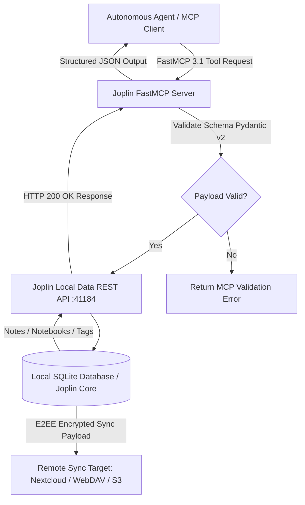

# Joplin

## What it is
Joplin is a free, open-source note-taking and to-do application capable of managing structured notes across notebooks and sub-notebooks. It features native end-to-end encryption (E2EE) and provides a secure, token-authenticated Data REST API allowing frontier AI models and autonomous agent frameworks (including Claude Code, GPT-5.5, Gemini 4.0 Pro, and Llama 4) to index, query, edit, and synchronize note graphs via **FastMCP 3.1** protocol tools.



## What problem it solves
Organizations, privacy-focused researchers, and homelab engineers frequently require a unified, secure knowledge management repository that bridges human note-taking with AI scratchpad and long-term memory operations. Standard cloud note applications expose private thoughts, personal data, and proprietary technical documentation to vendor AI training loops and potential telemetry leaks. Joplin addresses these risks by maintaining all notes in plain Markdown format on local storage, protecting synchronized data across devices via client-side E2EE, and exposing a local REST API that enables agentic systems to interact with knowledge graphs without external network exposure.

## Where it fits in the stack
**AI & Knowledge / Note Taking**. Joplin serves as a privacy-centric knowledge retrieval application, local scratchpad, and structured document store. It integrates into local homelab automation and multi-agent knowledge loops via its REST Data API, browser web clipper extension, and **FastMCP 3.1** protocol connectors.

## Typical use cases
- **Personal & Engineering Knowledge Management**: Organizing architecture designs, code snippets, and operational playbooks in hierarchical notebook structures.
- **AI Scratchpad & Agentic Memory**: Serving as long-term, indexed memory storage where autonomous agents write task logs, research summaries, and context snapshots.
- **Secure Web Clipping**: Capturing web pages, articles, and code documentation directly into local Markdown notes using the browser extension.
- **Cross-Device Encrypted Sync**: Synchronizing note repositories across desktop, mobile, and CLI clients via self-hosted Nextcloud, WebDAV, or S3 targets using zero-knowledge E2EE.

## Strengths
- **100% Client-Side End-to-End Encryption**: Ensures note content is encrypted locally before being transmitted to remote sync targets.
- **Standardized Plain Markdown Storage**: Notes are stored in plain text Markdown with HTML support, ensuring zero vendor lock-in and seamless LLM readability.
- **Extensible Local Data REST API**: Provides a full-featured HTTP REST API (`http://localhost:41184`) for programmatic search, note creation, resource attachments, and folder management.
- **Cross-Platform CLI and GUI**: Offers headless CLI binaries alongside native desktop (Linux, macOS, Windows) and mobile applications.

## Limitations
- **Sync Conflict Handling**: Complex multi-device concurrent edits can generate conflict notes rather than performing automated operational transformation.
- **Block-Level Editing**: Operates primarily on whole-document Markdown files rather than granular block-based canvases (e.g., Notion or Logseq).
- **Multi-User Real-Time Co-Editing**: Designed for single-user cross-device synchronization rather than real-time simultaneous co-authoring.

## When to use it
- When you require a cross-platform, open-source note-taking tool with native client-side E2EE and local SQLite backing.
- When you want to self-host note synchronization across infrastructure components (Nextcloud, WebDAV, MinIO/S3).
- When integrating local note search and creation into agentic AI frameworks using FastMCP 3.1 tools.

## When not to use it
- When real-time multi-user multiplayer editing is required (consider Hedgedoc or Nextcloud Text).
- When visual node-graph canvas interfaces are the primary workflow requirement (consider Obsidian or Excalidraw).

## Getting started

### Installation
Install the Joplin CLI tool globally via NPM or download desktop binaries from [joplinapp.org](https://joplinapp.org/):

```bash
# Install Joplin CLI globally
npm install -g joplin

# Start Joplin CLI in interactive mode
joplin
```

### Enabling the Data REST API
1. Open Joplin Desktop application.
2. Navigate to **Tools > Options > Web Clipper** (or **Preferences > Web Clipper** on macOS).
3. Enable the Web Clipper service (which exposes the local HTTP Data API server on port 41184).
4. Copy the generated **Authorization Token** for use in API requests.

## CLI examples

### 1. Create a Notebook and Markdown Note
Create a parent notebook and instantiate a note within it:

```bash
# Create a new notebook folder
joplin mkbook "AI Architecture Operations"

# Create a note inside the notebook
joplin use "AI Architecture Operations"
joplin mknote "FastMCP 3.1 Protocol Notes" --body "# FastMCP 3.1 Integration\n\n- Zero transport overhead\n- Pydantic v2 strict schemas"
```

### 2. Search and Query Notes
Search across all notebooks for specific keywords:

```bash
# Search notes containing 'FastMCP'
joplin search "FastMCP"

# List notes in current active notebook
joplin ls -l
```

### 3. Synchronize with Remote E2EE Target
Trigger background synchronization to the configured WebDAV or Nextcloud server:

```bash
# Execute sync operation
joplin sync
```

## API examples

### Python FastMCP 3.1 Server Integration with Joplin REST API
The following code demonstrates a complete FastMCP 3.1 server exposing Joplin note operations as structured MCP tools backed by Pydantic v2 validation:

```python
import json
import urllib.request
import urllib.parse
from typing import List, Optional
from pydantic import BaseModel, Field
from mcp.server.fastmcp import FastMCP

# Define Pydantic v2 schemas for Joplin API operations
class JoplinNoteCreateRequest(BaseModel):
    title: str = Field(..., min_length=1, description="Title of the new Joplin note.")
    body: str = Field(..., description="Markdown content body of the note.")
    parent_id: Optional[str] = Field(None, description="Optional ID of the target notebook folder.")
    tags: Optional[List[str]] = Field(default_factory=list, description="Tags to attach to the note.")

class JoplinNoteSearchRequest(BaseModel):
    query: str = Field(..., description="Search query string to search across notes.")
    limit: int = Field(default=10, ge=1, le=50, description="Maximum number of search results to return.")

class JoplinNoteResponse(BaseModel):
    id: str = Field(..., description="Unique Joplin object identifier.")
    title: str = Field(..., description="Title of the note.")
    body: str = Field(..., description="Markdown body of the note.")
    parent_id: str = Field(..., description="Parent notebook ID.")
    updated_time: int = Field(..., description="Unix timestamp of last modification.")

# Initialize FastMCP 3.1 server instance
mcp = FastMCP("joplin-knowledge-server")

JOPLIN_API_URL = "http://localhost:41184"
JOPLIN_TOKEN = "your_joplin_web_clipper_token_here"

@mcp.tool()
async def create_joplin_note(request: JoplinNoteCreateRequest) -> JoplinNoteResponse:
    """Creates a new note in Joplin with full Pydantic v2 validation and returns note metadata."""
    params = {"token": JOPLIN_TOKEN}
    url = f"{JOPLIN_API_URL}/notes?{urllib.parse.urlencode(params)}"

    payload = {
        "title": request.title,
        "body": request.body
    }
    if request.parent_id:
        payload["parent_id"] = request.parent_id

    req = urllib.request.Request(
        url,
        data=json.dumps(payload).encode("utf-8"),
        headers={"Content-Type": "application/json"}
    )

    with urllib.request.urlopen(req) as response:
        res_data = json.loads(response.read().decode("utf-8"))

    return JoplinNoteResponse(
        id=res_data["id"],
        title=res_data["title"],
        body=res_data["body"],
        parent_id=res_data["parent_id"],
        updated_time=res_data["updated_time"]
    )

@mcp.tool()
async def search_joplin_notes(request: JoplinNoteSearchRequest) -> List[JoplinNoteResponse]:
    """Searches Joplin notes matching a query term via the local REST API."""
    params = {
        "token": JOPLIN_TOKEN,
        "query": request.query,
        "limit": request.limit,
        "fields": "id,title,body,parent_id,updated_time"
    }
    url = f"{JOPLIN_API_URL}/search?{urllib.parse.urlencode(params)}"

    req = urllib.request.Request(url, headers={"Accept": "application/json"})
    with urllib.request.urlopen(req) as response:
        res_data = json.loads(response.read().decode("utf-8"))

    results = []
    for item in res_data.get("items", []):
        results.append(JoplinNoteResponse(
            id=item["id"],
            title=item.get("title", ""),
            body=item.get("body", ""),
            parent_id=item.get("parent_id", ""),
            updated_time=item.get("updated_time", 0)
        ))
    return results

if __name__ == "__main__":
    mcp.run()
```

## Related tools / concepts
- [Obsidian](obsidian.md) — Local Markdown knowledge base with graph visualization.
- [Logseq](logseq.md) — Outliner-first local knowledge graph with PDF annotation support.
- [Trilium Notes](../../services/trilium.md) — Hierarchical self-hosted knowledge base with active scripting.
- [Anytype](../intake_storage/anytype.md) — Local-first P2P encrypted object-based workspace.
- [Nextcloud](../../services/nextcloud.md) — Self-hosted private cloud platform for file and Joplin sync.
- [Khoj](../intake_storage/khoj.md) — Open-source AI copilot for local personal notes and documents.
- [Notion AI](notion-ai.md) — Cloud-native workspace with integrated AI assistant capabilities.
- [Model Context Protocol (FastMCP 3.1)](../../tools/automation_orchestration/mcp.md) — Open protocol standard for model-tool interactions.

## Sources / references
- [Joplin Official Website](https://joplinapp.org/)
- [Joplin Data REST API Reference Specification](https://joplinapp.org/api/references/rest_api/)
- [Joplin GitHub Repository](https://github.com/laurent22/joplin)

## Contribution Metadata
- Last reviewed: 2027-01-07
- Confidence: high
