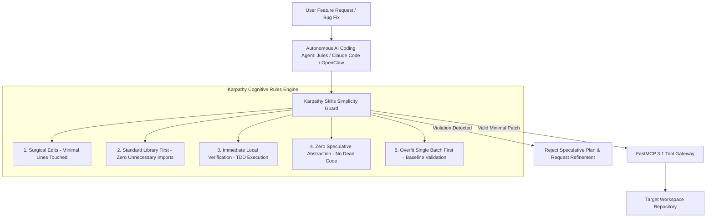

# Andrej Karpathy Skills

## What it is
Andrej Karpathy Skills is a codified collection of software engineering principles, system prompt instructions, cognitive guardrails, and agentic execution guidelines inspired by Andrej Karpathy's philosophy on AI engineering, neural network debugging, and software simplicity. Designed specifically for frontier AI models (including Claude 5.6, GPT-5.6, Gemini 4.0 Ultra, DeepSeek-V4, and Llama 4), these skills steer autonomous coding agents away from over-complication, speculative code generation, framework bloat, and "hallucination of complexity." Operating in tandem with **FastMCP 3.1** server guards, Karpathy Skills enforce surgical, minimalist, and verifiable file modifications that preserve codebase integrity while maximizing execution velocity.

Karpathy's engineering philosophy emphasizes first-principles thinking, minimal abstractions, hands-on data inspection, and continuous local verification. When translated into AI agent system prompts and automated tool validators, Karpathy Skills act as a strict quality filter that forces LLMs to treat code modification as a high-precision, surgical operation rather than an unconstrained text generation exercise.

## What problem it solves
As frontier AI models have become increasingly capable, they have also exhibited a strong propensity toward "speculative over-engineering"—inventing complex class abstractions, importing unnecessary third-party dependencies, refactoring unrelated files, and writing verbose placeholder comments when solving straightforward bugs or adding minor features. This "hallucination of complexity" creates massive technical debt, increases code review friction, and breaks existing test suites. Codifying "Karpathy instincts" solves this by embedding strict constraint-based, goal-driven, test-verified, and minimalist software engineering habits directly into an agent's planning and execution loops.

Additionally, in deep learning research and model training, developers often jump straight to complex hyperparameter tuning or architectural modifications without verifying that their data pipeline or baseline model works. Karpathy's "Recipe for Training Neural Networks" provides structured step-by-step diagnostic workflows that agents follow to isolate bugs, visualize training batches, overfit single batches, and establish rock-solid baselines before scaling up experiments.

## Where it fits in the stack
**Category**: [AI Knowledge & Best Practices](./index.md) / Cognitive Guardrails & Engineering Philosophy. Operating at the **Planning & Reasoning Governance Layer**, Karpathy Skills serve as a cognitive filter and static quality gate before an agent invokes FastMCP 3.1 file modification tools.



At the top layer, agent prompts enforce simplicity principles during chain-of-thought planning. At the middle execution layer, FastMCP 3.1 tools intercept diffs and enforce line-count and dependency constraints using Pydantic v2 schemas. At the underlying repository level, automated test suites immediately validate that modified files compile and pass tests cleanly.

## Typical use cases
- **Agent System Initialization**: Standardizing execution rules inside files like `AGENTS.md`, `.cursorrules`, `CLAUDE.md`, or system prompts across team repositories.
- **Autonomous Coding Workflows**: Constraining autonomous agents (such as Jules, OpenClaw, Cline, or Claude Code) to perform minimal, highly focused bug fixes and feature additions.
- **Programmatic Pre-Commit Audits**: Running automated Pydantic v2 linting scripts that inspect proposed git diffs for speculative bloat before submitting pull requests.
- **FastMCP 3.1 Tool Policy Enforcement**: Configuring FastMCP 3.1 server middleware to intercept tool calls and block unauthorized package installation or file rewrites.
- **Deep Learning Model Debugging**: Applying Karpathy's "Recipe for Training Neural Networks" (e.g., visualize input data, overfit a single batch, disable regularization first) within AI research agents.
- **Code Review & Refactoring Refinement**: Evaluating existing codebase complexity to identify dead code, redundant wrappers, and over-engineered abstractions for removal.

## Strengths
- **Surgical Code Modifications**: Enforces localized edits, preventing destructive full-file rewrites and preserving git history context.
- **Elimination of Dependency Bloat**: Encourages native language features and standard libraries over speculative third-party package additions.
- **High Predictability & Auditability**: Makes AI agent actions deterministic, readable, and easy for human engineers to review and merge.
- **Zero Runtime Infrastructure Cost**: Implemented as lightweight Markdown prompt rules, FastMCP 3.1 middleware, or Pydantic v2 validation logic.
- **Rapid Debugging Acceleration**: Emphasizes early failure detection and immediate local unit test execution after every edit.
- **Structured Neural Net Training**: Provides a deterministic, step-by-step checklist for building and debugging deep learning pipelines.

## Limitations
- **Architectural Friction in Enterprise Boilerplate**: Minimalist standards may clash with rigid enterprise architectures that mandate heavy design pattern abstractions.
- **Requires High Reasoning Capability**: Relies on frontier models (e.g., Claude 5.6 or GPT-5.6) to accurately evaluate abstract simplicity constraints.
- **Explicit Bootstrapping Required**: Developers must explicitly inject and maintain the skill guidelines within target repository system prompts and tool configs.
- **Over-Restriction Risks**: Unnecessarily strict line-count limits might prevent necessary architectural refactoring when genuine code structural debt exists.

## When to use it
- When your AI coding assistant produces overly verbose pull requests, introduces unrequested refactoring, or bloats `package.json` / `requirements.txt`.
- At the start of new software projects to establish clean, lightweight architectural conventions.
- In automated test-driven development (TDD) pipelines where agents must write the minimal code necessary to pass failing tests.
- When configuring FastMCP 3.1 agent execution sandboxes to prevent unauthorized system modifications.
- When training or debugging neural networks where systematically isolating data errors and baseline model performance is critical.

## When not to use it
- In legacy enterprise codebases where verbose multi-layer abstractions (e.g., AbstractFactoryProvider Beans) are mandatory structural requirements.
- During exploratory, unconstrained architectural brainstorming sessions where rapid ideation takes precedence over minimal diff sizes.

## Getting started

### Installation via Plugin Managers
To load Karpathy Simplicity Skills as a native plugin in Claude Code or supported CLI agent tools:

```bash
# Install Andrej Karpathy Skills plugin globally
/plugin install andrej-karpathy-skills@latest
```

### Direct System Prompt & AGENTS.md Injection
Add the following Markdown block into your repository's root `AGENTS.md` file:

```markdown
## Karpathy Engineering Simplicity Rules
1. **Surgical Edits**: Modify only the exact lines necessary. Never rewrite intact surrounding functions.
2. **Standard Library First**: Utilize standard library features before importing external packages.
3. **Verify Immediately**: Run local test suites (`pytest`, `npm test`) immediately after every code modification.
4. **No Speculative Abstraction**: Do not write unused helper functions, future-proofing interfaces, or empty placeholder comments.
5. **Neural Net Recipe**: Always visualize raw data, establish a random baseline, and overfit a single batch before scaling model capacity.
```

## CLI examples

### Auditing Repository Changes for Simplicity Compliance
Run CLI checks to evaluate git diffs against Karpathy simplicity metrics:

```bash
# Audit active git working tree against Karpathy simplicity rules
karpathy-skills audit --diff --max-lines-per-file=30 --forbid-new-deps

# Automatically remove speculative unused imports and dead code
karpathy-skills prune --working-tree
```

### Validating Test-Driven Execution Loops
Ensure that tests are run and verified after every individual file edit:

```bash
karpathy-skills verify-loop --command "pytest tests/test_core.py"
```

## API examples

### Python: FastMCP 3.1 Karpathy Simplicity Guard Server with Pydantic v2
This comprehensive Python implementation creates a FastMCP 3.1 agent tool guard that enforces Karpathy simplicity rules on proposed code modifications using Pydantic v2:

```python
import json
import re
from typing import List, Optional, Dict, Any
from pydantic import BaseModel, Field, field_validator, ConfigDict
from mcp.server.fastmcp import FastMCP

# Initialize FastMCP 3.1 Server for Karpathy Skills Policy Enforcement
mcp = FastMCP("Karpathy Simplicity Guard")

class ProposedDiffPayload(BaseModel):
    model_config = ConfigDict(str_strip_whitespace=True, extra="forbid")

    filepath: str = Field(..., description="Relative path of file being modified")
    original_code: str = Field(..., description="Original content before modification")
    proposed_code: str = Field(..., description="New content generated by AI agent")
    max_line_diff_ratio: float = Field(default=0.35, ge=0.05, le=1.0, description="Max allowed modified line ratio")
    allow_new_dependencies: bool = Field(default=False)

    @field_validator("proposed_code")
    @classmethod
    def check_karpathy_anti_patterns(cls, v: str) -> str:
        # Check 1: Prohibit placeholder comments and speculative TODOs
        if re.search(r"#\s*TODO:|//\s*TODO:|#\s*placeholder", v, re.IGNORECASE):
            raise ValueError("Karpathy Rule Violation: Speculative TODOs and placeholders are prohibited in production diffs.")

        # Check 2: Detect hallucinated framework over-engineering
        overengineering_terms = ["AbstractProxyFactory", "GenericSingletonWrapper", "SpeculativeInterfaceProvider"]
        for term in overengineering_terms:
            if term in v:
                raise ValueError(f"Karpathy Rule Violation: Over-engineered pattern '{term}' detected.")
        return v

class SimplicityAuditReport(BaseModel):
    filepath: str
    is_surgical: bool
    lines_changed: int
    new_dependencies_detected: List[str]
    audit_status: str
    feedback_instructions: Optional[str] = None

@mcp.tool()
def audit_proposed_file_modification(payload_json: str) -> str:
    """Audits an agent's proposed code modification against Karpathy simplicity principles."""
    try:
        data = json.loads(payload_json)
        payload = ProposedDiffPayload(**data)

        orig_lines = payload.original_code.splitlines()
        prop_lines = payload.proposed_code.splitlines()
        lines_changed = abs(len(prop_lines) - len(orig_lines))

        # Inspect for new import statements
        orig_imports = set(re.findall(r"^(?:import|from)\s+([a-zA-Z0-9_]+)", payload.original_code, re.MULTILINE))
        prop_imports = set(re.findall(r"^(?:import|from)\s+([a-zA-Z0-9_]+)", payload.proposed_code, re.MULTILINE))
        new_deps = list(prop_imports - orig_imports)

        if new_deps and not payload.allow_new_dependencies:
            report = SimplicityAuditReport(
                filepath=payload.filepath,
                is_surgical=False,
                lines_changed=lines_changed,
                new_dependencies_detected=new_deps,
                audit_status="REJECTED",
                feedback_instructions=f"Karpathy Rule Violation: Unapproved new dependencies introduced: {new_deps}. Resolve using standard library."
            )
            return report.model_dump_json(indent=2)

        report = SimplicityAuditReport(
            filepath=payload.filepath,
            is_surgical=True,
            lines_changed=lines_changed,
            new_dependencies_detected=[],
            audit_status="PASSED",
            feedback_instructions="Diff adheres strictly to Karpathy simplicity standards."
        )
        return report.model_dump_json(indent=2)
    except Exception as err:
        return json.dumps({"audit_status": "ERROR", "message": str(err)})

if __name__ == "__main__":
    mcp.run()
```

### Python: Neural Network Debugging Checklist Guard
Implementation of Karpathy's neural net training recipe validation:

```python
from pydantic import BaseModel, Field

class NeuralNetRecipeChecklist(BaseModel):
    data_visualized: bool = Field(..., description="Did you manually inspect raw input data samples?")
    baseline_loss_checked: bool = Field(..., description="Is initial loss equal to -log(1/num_classes)?")
    single_batch_overfit: bool = Field(..., description="Can the model reach zero loss on 1 batch?")
    regularization_disabled: bool = Field(..., description="Are weight decay and dropout disabled during initial tests?")

def verify_training_readiness(checklist: NeuralNetRecipeChecklist) -> bool:
    if not checklist.data_visualized:
        print("ERROR: Inspect raw data before training!")
        return False
    if not checklist.single_batch_overfit:
        print("ERROR: Overfit a single batch to 100% accuracy first!")
        return False
    return True
```

## Related tools / concepts
- [Matt Pocock Skills](./matt-pocock-skills.md) — Complementary developer workflows focusing on strict TypeScript and TDD patterns.
- [Claude Code](../development_ops/claude-code.md) — Command-line agent environment supporting Karpathy plugin rules.
- [Model Context Protocol](../automation_orchestration/mcp.md) — Tool protocol standardizing agent execution boundaries.
- [PydanticAI](../frameworks/pydantic-ai.md) — Python agent framework with native schema validation guards.
- [Jules (Agent)](./jules.md) — Autonomous agent software engineer built around surgical edit principles.

## Sources / references
- [Andrej Karpathy Official Website](https://karpathy.ai/)
- [Andrej Karpathy: A Recipe for Training Neural Networks](https://karpathy.github.io/2019/04/25/recipe/)
- [Andrej Karpathy Skills GitHub Repository](https://github.com/forrestchang/andrej-karpathy-skills)
- [FastMCP Specification](https://modelcontextprotocol.io/)

---
## Contribution Metadata
- Last reviewed: 2027-01-07
- Confidence: high
