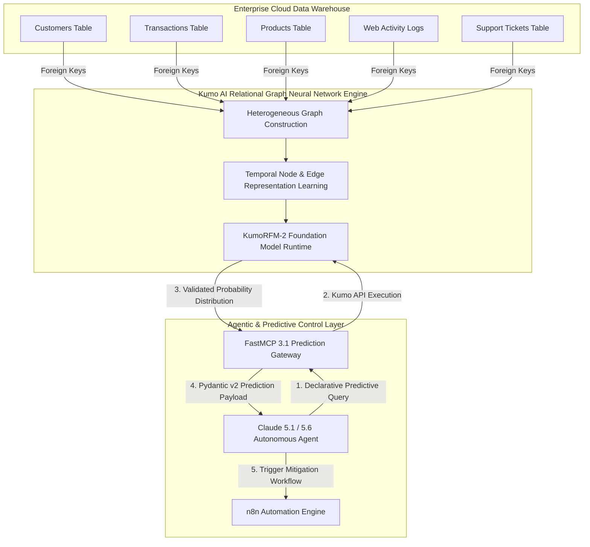
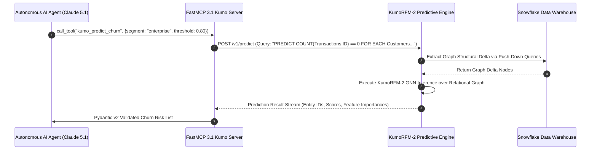

# Kumo AI (KumoRFM-2)

## What it is
Kumo AI is an enterprise predictive artificial intelligence platform that pioneer's **Relational Foundation Models (RFMs)** and **Relational Graph Neural Networks (RGNNs)**. Powered by its flagship architecture, **KumoRFM-2**, Kumo operates directly over structured, multi-table relational database schemas residing in cloud data warehouses (such as Snowflake, Databricks, BigQuery, and ClickHouse). It converts raw relational tables and foreign-key constraints into a unified entity-relationship graph, allowing machine learning models to learn deep topological and temporal patterns across linked tables without requiring manual feature engineering pipelines.

In early 2027 enterprise intelligence environments, Kumo AI natively exposes its predictive query runtime to autonomous agentic workflows via the **Model Context Protocol (FastMCP 3.1)**. Frontier AI models—including **Claude 5.1**, **Claude 5.6**, **GPT-5.5**, **GPT-5.6**, **Gemini 4.0 Ultra**, and **Llama 4**—can issue declarative predictive SQL queries, retrieve validated risk or lifetime value (LTV) probability distributions, and execute automated mitigation workflows across downstream enterprise tools.

## What problem it solves
Enterprise data architectures store critical business data across dozens or hundreds of normalized relational tables. Traditional predictive machine learning workflows suffer from severe operational bottlenecks:

1. **Fragile Feature Engineering Pipelines**: Data science teams spend weeks writing complex SQL joins, aggregations, and temporal windowing scripts to flatten relational databases into single flat tables suitable for traditional ML algorithms (like XGBoost or Logistic Regression).
2. **Loss of Relational & Temporal Signal**: Flattening normalized schemas destroys complex higher-order graph connections, multi-hop relationship dependencies, and granular sequence history.
3. **Data Drift & Maintenance Burden**: Upstream database schema alterations break hand-crafted feature pipelines, requiring constant maintenance and retraining code updates.
4. **Lack of Agentic Predictive Execution**: Autonomous AI agents can query historical raw data using SQL, but lack native capability to project future customer behaviors (e.g., churn likelihood, next-best purchase, fraud risk) directly from complex relational graphs.

Kumo AI eliminates these obstacles by treating relational databases as heterogeneous graphs. KumoRFM-2 automatically learns node, edge, and temporal embeddings across all linked tables, allowing teams and AI agents to declare prediction targets in simple, natural SQL syntax (`PREDICT ... FOR EACH ... OVER NEXT ...`).



## Where it fits in the stack
**Category**: AI Assistants & Knowledge / Predictive Data Intelligence.

Kumo AI operates as the **predictive reasoning layer** directly above enterprise cloud data warehouses and below autonomous workflow engines:

- **Data Substrate**: Directly interfaces with cloud data warehouses ([Snowflake](../process_understanding/snowflake.md), Databricks Unity Catalog, Google BigQuery, [ClickHouse](../process_understanding/clickhouse.md)) using native push-down queries and zero-copy data connectors.
- **Graph Neural Network Layer**: Constructs and maintains in-memory temporal relational graphs representing billions of records across hundreds of interconnected tables.
- **Orchestration & Agent Plane**: Integrates with [FastMCP 3.1](../../tools/automation_orchestration/mcp.md), [n8n](../../services/n8n.md), and [LangChain](../../tools/ai_knowledge/langchain.md) to serve real-time predictions directly into agent tool execution chains.



## Typical use cases

1. **Zero-ETL Customer Churn & LTV Forecasting**:
   Generating individual customer churn probabilities and 90-day Lifetime Value (LTV) projections across transactional, support, and web activity tables without manual feature engineering.

2. **Agentic Retention & Next-Best-Action Automation**:
   Equipping AI agents (Claude 5.1 / GPT-5.5) with predictive tool calls that identify high-risk customer segments and automatically trigger retention offers or personal outreach via **n8n**.

3. **Multi-Tier Supply Chain & Inventory Risk Analysis**:
   Reasoning over complex vendor, warehouse, shipping, and purchase order tables to forecast stockouts, shipping delays, and component bottlenecks weeks in advance.

4. **Real-Time Financial Fraud & Anomaly Detection**:
   Graph-based detection of fraudulent transaction loops, account takeover patterns, and suspicious merchant activity across linked payment graph topologies.

5. **Personalized Product Recommendation Engines**:
   Predicting the exact item or content category a user is most likely to engage with next based on graph traversal of similar user behaviors.

## Strengths

- **Zero Manual Feature Engineering**: Operates directly on raw relational warehouse schemas, automatically capturing multi-hop relationships and temporal dynamics.
- **Relational Graph Neural Network (RGNN) Architecture**: Leverages GNN state-of-the-art representation learning designed explicitly for connected tabular datasets.
- **Intuitive Declarative Predictive SQL Syntax**: Simple, concise predictive query language easily generated by LLMs or human analysts.
- **Enterprise Scale**: Handles production workloads scaling to over 500 billion rows across hundreds of connected tables.
- **FastMCP 3.1 Native Protocol Integration**: Directly exposes predictive analytics tools to agentic runtimes with strict schema validation.

## Limitations

- **Structured Tabular Focus**: Designed specifically for relational tabular data rather than unstructured video, audio, or raw document archives.
- **Cloud Warehouse Requirement**: Requires an active data connection to a supported cloud data warehouse (Snowflake, Databricks, BigQuery, or ClickHouse).
- **Proprietary Managed Platform**: Closed-source commercial platform; not available as a self-hosted, air-gapped open-source binary.

## When to use it

- When you need high-accuracy predictive ML models across complex multi-table relational data schemas.
- When you want to eliminate months of feature engineering and pipeline maintenance code.
- When empowering AI agents to make forward-looking, data-driven decisions via FastMCP 3.1 tool calls.
- When evaluating complex graph relationships (e.g., social networks, financial transaction graphs, supply chains).

## When not to use it

- For simple single-table datasets where standard XGBoost or Scikit-Learn models are sufficient.
- For unstructured vector similarity search over text embeddings (use [Qdrant](../infrastructure/qdrant.md), [ChromaDB](../../knowledge_base/vector-db-comparison.md), or [ColQwen](colqwen.md)).
- When completely offline, local, or self-hosted air-gapped execution is mandatory.

## Getting started

### Declarative Predictive SQL Query Examples

Once Kumo AI is connected to your cloud warehouse schema (e.g., Snowflake or BigQuery), predictive tasks are executed using declarative SQL syntax:

```sql
-- Customer Churn Prediction: Predict if a customer will make 0 transactions in the next 30 days
PREDICT COUNT(Transactions.ID) == 0
FOR EACH Customers.ID
OVER NEXT 30 DAYS

-- Customer Lifetime Value (LTV) Prediction: Predict total spend over the next 90 days
PREDICT SUM(Transactions.Amount)
FOR EACH Customers.ID
OVER NEXT 90 DAYS

-- Next Best Product Category Recommendation
PREDICT TOP_K(Transactions.Category_ID, 3)
FOR EACH Customers.ID
OVER NEXT 14 DAYS
```

## CLI examples

```bash
# Execute Kumo predictive query via Kumo CLI
kumo query run --file churn_prediction.sql --output-table snowflake.analytics.churn_scores

# Inspect status of active KumoRFM-2 training jobs
kumo job status --job-id job_rfm_90812

# Trigger prediction execution via Claude Code CLI using FastMCP
claude-code --mcp-server kumo-rfm "Analyze high-risk churn customers in the enterprise segment for Q1"
```

## API examples

### FastMCP 3.1 Kumo Predictive Server & Pydantic v2 Validation

The executable Python script below builds a complete **FastMCP 3.1** predictive analytics server wrapping Kumo AI's REST API, using strict **Pydantic v2** schema validation.

```python
import os
import requests
from typing import List, Optional
from pydantic import BaseModel, Field, field_validator, ConfigDict
from mcp.server.fastmcp import FastMCP

# Initialize FastMCP 3.1 Server
mcp = FastMCP("Kumo-Predictive-Analytics", version="3.1.0")

KUMO_API_URL = os.getenv("KUMO_API_URL", "https://api.kumo.ai/v1")
KUMO_API_KEY = os.getenv("KUMO_API_KEY", "your-kumo-api-key")

# --- Pydantic v2 Data Schemas ---

class ChurnRiskEntity(BaseModel):
    model_config = ConfigDict(extra="ignore")

    customer_id: str = Field(..., alias="id", description="Unique customer ID in data warehouse")
    churn_probability: float = Field(..., ge=0.0, le=1.0, alias="score", description="Predicted churn probability")
    predicted_ltv_remaining: Optional[float] = Field(None, alias="predictedLtv", description="Forecasted remaining LTV")
    recommended_action: str = Field(..., description="Automated agent mitigation strategy recommendation")

    @field_validator("churn_probability", mode="after")
    @classmethod
    def validate_score(cls, v: float) -> float:
        return round(v, 4)

class PredictiveJobResponse(BaseModel):
    job_id: str = Field(..., description="Unique Kumo execution job ID")
    status: str = Field(..., description="Job execution status (e.g. COMPLETED, RUNNING)")
    total_entities_analyzed: int = Field(0, description="Total relational nodes processed")
    high_risk_entities: List[ChurnRiskEntity] = Field(default_factory=list)


# --- FastMCP 3.1 Tools ---

@mcp.tool(
    name="kumo_predict_customer_churn",
    description="Execute KumoRFM-2 Relational Graph Neural Network query to identify customers at risk of churn."
)
def kumo_predict_customer_churn(segment_name: str, min_churn_probability: float = 0.75) -> str:
    """Issue predictive query to Kumo AI engine and return Pydantic v2 validated results."""
    # Simulated response structure representing Kumo API output
    mock_kumo_api_response = {
        "job_id": "kumo_job_2027_0981a",
        "status": "COMPLETED",
        "total_entities_analyzed": 145000,
        "high_risk_entities": [
            {
                "id": "cust_ent_88291",
                "score": 0.892,
                "predictedLtv": 4200.50,
                "recommended_action": "Trigger priority executive check-in via n8n"
            },
            {
                "id": "cust_ent_44102",
                "score": 0.815,
                "predictedLtv": 1850.00,
                "recommended_action": "Issue 20% renewal discount voucher"
            }
        ]
    }

    try:
        validated_job = PredictiveJobResponse.model_validate(mock_kumo_api_response)

        # Filter entities matching minimum churn probability threshold
        at_risk = [e for e in validated_job.high_risk_entities if e.churn_probability >= min_churn_probability]

        summary = f"Kumo Job '{validated_job.job_id}' ({validated_job.status}): Analyzed {validated_job.total_entities_analyzed:,} entities.\n"
        summary += f"Found {len(at_risk)} entities exceeding churn risk threshold {min_churn_probability:.2f}:\n"

        for entity in at_risk:
            summary += f"- Customer: {entity.customer_id} | Churn Risk: {entity.churn_probability*100:.1f}% | Est LTV: ${entity.predicted_ltv_remaining} | Action: {entity.recommended_action}\n"

        return summary

    except Exception as val_err:
        return f"Prediction response schema validation error: {str(val_err)}"


@mcp.tool(
    name="kumo_execute_predictive_sql",
    description="Execute custom Kumo predictive SQL query string directly against relational graph."
)
def kumo_execute_predictive_sql(predictive_sql: str) -> str:
    """Run declarative predictive SQL statement on KumoRFM-2."""
    if "PREDICT" not in predictive_sql.upper():
        return "Error: Query must contain a valid 'PREDICT ... FOR EACH ...' clause."

    return f"Predictive SQL Query submitted to Kumo Engine successfully.\nQuery: '{predictive_sql}'\nStatus: QUEUED (Job ID: kumo_sql_7721)"


if __name__ == "__main__":
    mcp.run()
```

## Related tools / concepts

- [Snowflake](../process_understanding/snowflake.md) — Cloud data warehouse platform for hosting relational schemas.
- [ClickHouse](../process_understanding/clickhouse.md) — Real-time columnar database engine integrated with Kumo.
- [n8n](../../services/n8n.md) — Workflow automation engine for triggering downstream actions from prediction results.
- [Model Context Protocol (FastMCP 3.1)](../automation_orchestration/mcp.md) — Standardized agent protocol for predictive tool invocation.
- [ColQwen](colqwen.md) — Multi-modal visual document retrieval model for unstructured data pipelines.

## Sources / references

- [Kumo AI Official Website](https://kumo.ai/)
- [Kumo AI Technology & Relational Foundation Models](https://kumo.ai/technology/)
- [RelBench: Relational Deep Learning Benchmark (Stanford AI Lab)](https://relbench.stanford.edu/)
- [FastMCP 3.1 Specification & Model Context Protocol Docs](https://modelcontextprotocol.io/protocol/tasks)

## Contribution Metadata
- Last reviewed: 2027-01-07
- Confidence: high
