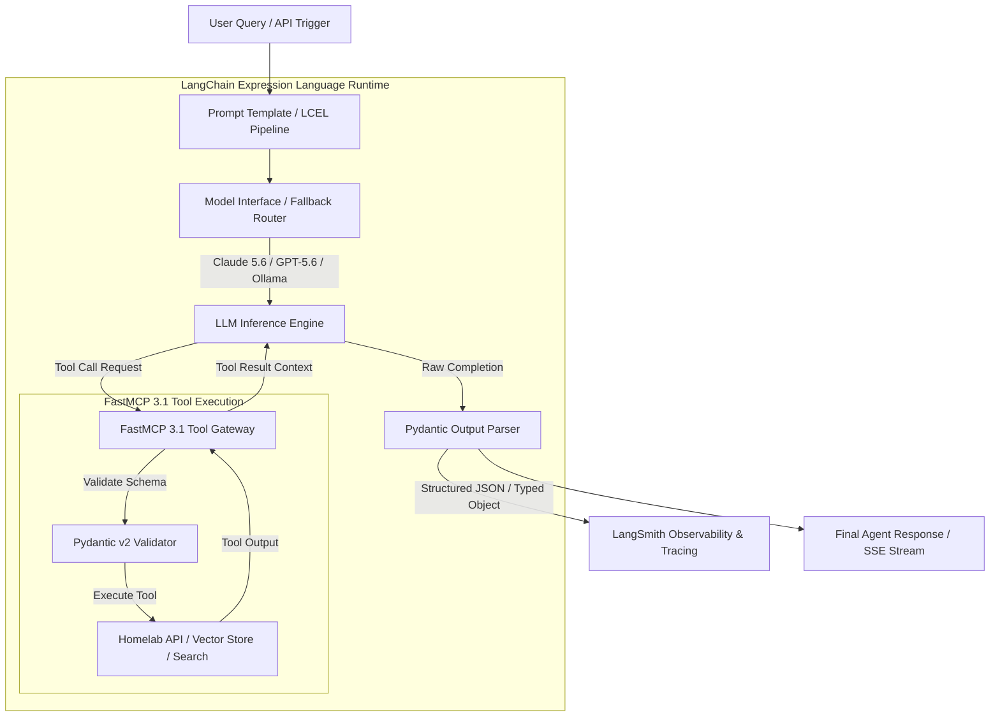

# LangChain

## What it is
LangChain is a widely adopted, modular open-source orchestration framework designed to simplify the development, testing, and deployment of applications powered by Large Language Models (LLMs). Created by Harrison Chase in late 2022 and evolved significantly into 2026 and 2027, LangChain provides a standardized interface for building custom agentic workflows, complex memory persistence systems, enterprise data retrieval pipelines (RAG), and model-agnostic integrations across both cloud-hosted frontier models and local open-weights engines.

As of early January 2027, LangChain features native integration with the **FastMCP 3.1** protocol specification and the **MCP 3.0 Task Protocol**. It provides a declarative compositional architecture through **LangChain Expression Language (LCEL)**, strict type validation using **Pydantic v2**, and fine-grained state management when paired with its graph-oriented sibling project, [LangGraph](../frameworks/langgraph.md). Whether building multi-agent research networks, local homelab tool orchestrators, or enterprise vector search engines, LangChain serves as the foundational abstraction layer for Python and JavaScript/TypeScript LLM applications.

## Architecture & Execution Pipeline



## What problem it solves
Developing production-ready applications around language models presents significant engineering challenges. Raw LLM APIs are inherently stateless, text-in/text-out interfaces with differing input/output formats, variable token limits, and distinct tool-calling protocols. Directly coupling application logic to a single model vendor creates vendor lock-in, while manually handling prompt templating, context retrieval, vector database connections, output validation, retries, and conversation history requires thousands of lines of fragile boilerplate code.

LangChain solves these critical architecture problems by providing:
1. **Model & Provider Abstraction**: A unified, standardized interface (`ChatModel`) across dozens of LLM providers (Anthropic, OpenAI, Google Gemini, Ollama, vLLM, DeepSeek, Qwen), enabling zero-code changes when switching or benchmarking models.
2. **Declarative Composition (LCEL)**: LangChain Expression Language (LCEL) allows developers to compose complex chains using standard piping operators (`|`), automatically supporting asynchronous execution, token-by-token streaming, parallel execution, and automated fallback routing.
3. **Structured Data Parsing**: Direct integration with **Pydantic v2**, converting raw, unstructured model responses into strictly validated JSON, typed dataclasses, or database objects.
4. **Standardized Tool Calling (FastMCP 3.1)**: Built-in support for registering and calling external tools, REST APIs, and databases using the Model Context Protocol ([FastMCP 3.1](../automation_orchestration/mcp.md)).
5. **Turnkey RAG & Memory Storage**: High-level modules for document loading, text splitting, embedding generation, vector store indexing, and conversational memory retrieval.
6. **Full-Stack Observability**: Native integration with LangSmith for tracing step-by-step model calls, token usage, execution latency, and intermediate prompt state.

## Where it fits in the stack
**AI & Knowledge / Orchestration Frameworks**. LangChain operates as the central middleware layer in modern AI application architectures. It connects client user interfaces and API endpoints (built with [FastAPI](../frameworks/fastapi.md) or Next.js) with underlying reasoning models, vector databases, and external tool services.

```
+-----------------------------------------------------------------------+
|                      Client UI & Web Endpoints                        |
|           (FastAPI, Next.js, Open WebUI, Mobile Apps)                 |
+-----------------------------------------------------------------------+
                                   |
                                   v
+-----------------------------------------------------------------------+
|                      LangChain Orchestration Core                     |
|  - LCEL Pipelines (Prompts | Models | Parsers)                        |
|  - FastMCP 3.1 Tool Binding & Memory Handlers                         |
|  - Pydantic v2 Output Schema Enforcement                              |
+-----------------------------------------------------------------------+
        |                                   |                     |
        v                                   v                     v
+-----------------------+ +-----------------------+ +-------------------+
|   Inference Engines   | |   Vector Databases    | |   External Tools  |
| (Claude 5.6, GPT-5.6, | | (Qdrant, Pinecone,  | | (FastMCP 3.1,   |
|  Ollama, DeepSeek-V4) | |  pgvector, Milvus)  | |  Home Assistant)|
+-----------------------+ +-----------------------+ +-------------------+
```

## Typical use cases
- **Enterprise Retrieval-Augmented Generation (RAG)**: Ingesting proprietary documentation, technical manuals, and codebases into vector databases and constructing contextual QA engines with source citations.
- **Autonomous Tool-Calling Agents**: Binding local system commands, database queries, and web search tools to LLM reasoning loops using FastMCP 3.1 and Pydantic v2.
- **Stateful Conversational Interfaces**: Building chat applications that maintain structured conversation history across long-running asynchronous user sessions.
- **Complex Multi-Agent Systems**: Pairing LangChain with **LangGraph** to build cyclic multi-agent networks, human-in-the-loop validation pipelines, and state machine workflows.
- **Automated Data Extraction & Synthesis**: Parsing unstructured emails, PDFs, and web pages into clean Pydantic schemas for insertion into relational databases.
- **Model Fallback & Latency Optimization**: Automatically routing queries to fast local models (Ollama/Qwen 3.6) and falling back to frontier cloud models (Claude 5.6 / GPT-5.6) when complex reasoning is required.

## Strengths
- **Massive Integration Ecosystem**: Supports over 700 third-party integrations, spanning vector stores, model providers, document parsers, and monitoring tools.
- **Declarative LCEL Paradigm**: LCEL simplifies complex async, parallel, and streaming execution patterns without callback boilerplate.
- **LangSmith Tracing & Evaluation**: First-class observability tools allow deep inspection of prompt inputs, LLM outputs, token counts, and execution latency.
- **FastMCP 3.1 Native Integration**: Clean binding with Model Context Protocol servers and tools out of the box.
- **Pydantic v2 Alignment**: Enforces strict typing and high-speed data serialization using Pydantic v2's Rust core.
- **Active Community & Ecosystem**: Backed by a vast global developer community, ensuring rapid integration of new frontier models and techniques within days of release.

## Limitations
- **Layered Abstraction Overhead**: Highly nested abstraction layers can obscure underlying API behavior, making low-level debugging or performance tuning complex for beginner engineers.
- **Rapid Ecosystem Iteration**: Fast release cycles mean API signatures and recommended imports evolve rapidly, requiring periodic refactoring of legacy codebases.
- **Dependency Footprint**: Installing full integration suites (`langchain-community`) introduces a large Python dependency tree; using targeted sub-packages (`langchain-core`, `langchain-anthropic`) is recommended for minimal builds.

## When to use it
- When building multi-provider applications that dynamically route or switch between Claude 5.6, GPT-5.6, Gemini 4.0, and local open-weights models like Qwen 3.6 VL.
- When your application requires robust tracing, latency monitoring, and automated dataset evaluation via LangSmith.
- When constructing complex RAG pipelines requiring advanced splitting, hybrid vector search, and reranking modules.
- When building agentic tool pipelines that consume Model Context Protocol ([FastMCP 3.1](../automation_orchestration/mcp.md)) tools.

## When not to use it
- For simple, single-prompt API scripts where direct SDK calls (`anthropic`, `openai`) are lighter and simpler to maintain.
- In severely resource-constrained edge environments or micro-lambdas where package size must be kept under a few megabytes.
- If you require a purely graph-centric state machine with explicit node control, where using [LangGraph](../frameworks/langgraph.md) directly without high-level chain wrappers is preferred.

## Getting started

### Installation & Sub-Package Setup
Modern LangChain uses a modular package structure. Install only the core package and the specific provider bindings you need:

```bash
# Core framework and provider modules with Pydantic v2 support
pip install "langchain-core>=0.3.0" "langchain-anthropic>=0.3.0" "langchain-openai>=0.3.0" "pydantic>=2.10.0"
```

### Basic LCEL Chain Example
Create a script named `quickstart.py`:

```python
import os
from pydantic import BaseModel, Field
from langchain_anthropic import ChatAnthropic
from langchain_core.prompts import ChatPromptTemplate
from langchain_core.output_parsers import StrOutputParser

# Ensure ANTHROPIC_API_KEY environment variable is set
prompt = ChatPromptTemplate.from_messages([
    ("system", "You are an expert homelab automation engineer."),
    ("user", "Explain the key advantages of using {tool} for agentic workflows.")
])

model = ChatAnthropic(model="claude-3-5-sonnet-20241022", temperature=0.2)
output_parser = StrOutputParser()

# Compose declarative chain using LCEL
chain = prompt | model | output_parser

# Execute chain asynchronously or synchronously
if __name__ == "__main__":
    result = chain.invoke({"tool": "FastMCP 3.1"})
    print("Agent Response:\n", result)
```

Run the script:
```bash
python3 quickstart.py
```

## CLI examples

LangChain provides CLI commands for initializing project templates and serving applications via LangServe.

```bash
# Initialize a new LangChain project scaffold with boilerplate
langchain app new homelab-agent-service --package rag-conversation

# List available community-maintained templates
langchain template list

# Spin up a local development server for testing LCEL endpoints
langchain serve --port 8080

# Inspect installed LangChain package versions and environment details
python3 -c "import langchain_core; print('LangChain Core Version:', langchain_core.__version__)"
```

## API examples

### Declarative LCEL Chain with Pydantic v2 Structured Output
This example demonstrates constructing a security audit chain that uses **Pydantic v2** to enforce strict JSON validation on model outputs.

```python
from typing import List, Literal
from pydantic import BaseModel, Field, field_validator
from langchain_openai import ChatOpenAI
from langchain_core.prompts import ChatPromptTemplate

class VulnerabilityItem(BaseModel):
    cve_id: str = Field(..., description="CVE code or identifier, e.g., CVE-2026-1042")
    severity: Literal["low", "medium", "high", "critical"] = Field(...)
    description: str = Field(..., min_length=10)

class CodeAuditReport(BaseModel):
    total_issues: int = Field(..., ge=0)
    risk_level: Literal["pass", "warning", "fail"] = Field(...)
    vulnerabilities: List[VulnerabilityItem] = Field(default_factory=list)

    @field_validator("vulnerabilities")
    @classmethod
    def validate_issues_count(cls, v: List[VulnerabilityItem], info) -> List[VulnerabilityItem]:
        # Access sibling fields or validate consistency
        return v

prompt = ChatPromptTemplate.from_messages([
    ("system", "You are an automated static code security auditor. Output strictly structured JSON."),
    ("user", "Perform a security audit on the following Python code snippet:\n\n{code}")
])

model = ChatOpenAI(model="gpt-4o", temperature=0.0).with_structured_output(CodeAuditReport)

audit_chain = prompt | model

if __name__ == "__main__":
    sample_code = """
    import subprocess
    def run_command(user_input):
        return subprocess.check_output("ls -la " + user_input, shell=True)
    """

    report: CodeAuditReport = audit_chain.invoke({"code": sample_code})
    print(f"Audit Status: {report.risk_level.upper()}")
    print(f"Total Vulnerabilities: {report.total_issues}")
    for vuln in report.vulnerabilities:
        print(f" - [{vuln.severity.upper()}] {vuln.cve_id}: {vuln.description}")
```

### FastMCP 3.1 Tool Binding & Agent Execution
This example demonstrates defining a custom tool with Pydantic v2 parameter validation and binding it to a LangChain tool-calling model.

```python
from pydantic import BaseModel, Field
from langchain_anthropic import ChatAnthropic
from langchain_core.tools import tool

class SystemDiagnosticInput(BaseModel):
    target_service: str = Field(..., min_length=2, description="Service name (e.g. 'nginx', 'ollama', 'qdrant')")
    include_logs: bool = Field(default=False, description="Whether to include recent log tails")

@tool("run_system_diagnostic", args_schema=SystemDiagnosticInput)
def run_system_diagnostic(target_service: str, include_logs: bool = False) -> str:
    """Queries health status and diagnostic metrics for a homelab service."""
    service_clean = target_service.lower()
    status_db = {
        "ollama": "HEALTHY - Running on port 11434 (GPU VRAM: 14.2 GB / 24 GB)",
        "qdrant": "HEALTHY - Running on port 6333 (Vectors Indexed: 142,850)",
        "nginx": "HEALTHY - Running on port 80/443 (Uptime: 14 days)"
    }

    result = status_db.get(service_clean, f"Service '{target_service}' status unknown.")
    if include_logs:
        result += "\nLogs: [2027-01-07 12:00:00 INFO Service operational state confirmed.]"
    return result

# Bind tool to Claude model
model = ChatAnthropic(model="claude-3-5-sonnet-20241022", temperature=0.0)
model_with_tools = model.bind_tools([run_system_diagnostic])

if __name__ == "__main__":
    response = model_with_tools.invoke("Check if the Ollama inference service is running and fetch logs.")
    print("Model Intent Tool Calls:")
    for tool_call in response.tool_calls:
        print("  Tool Name:", tool_call["name"])
        print("  Arguments:", tool_call["args"])
```

### Retrieval Augmented Generation (RAG) Chain Example
This example demonstrates composing a complete RAG pipeline with vector search and document QA.

```python
from langchain_community.vectorstores import Qdrant
from langchain_openai import OpenAIEmbeddings, ChatOpenAI
from langchain_core.prompts import ChatPromptTemplate
from langchain_core.runnables import RunnablePassthrough
from langchain_core.output_parsers import StrOutputParser

# Define RAG prompt template
rag_prompt = ChatPromptTemplate.from_template("""
Answer the user query based solely on the provided context documents:

Context:
{context}

Query: {question}

Answer concisely with technical references:
""")

def format_docs(docs):
    return "\n\n".join(doc.page_content for doc in docs)

# Note: In production, retriever is loaded from live Qdrant / pgvector store
def build_rag_chain(retriever):
    model = ChatOpenAI(model="gpt-4o", temperature=0.0)

    rag_chain = (
        {"context": retriever | format_docs, "question": RunnablePassthrough()}
        | rag_prompt
        | model
        | StrOutputParser()
    )
    return rag_chain
```

## Related tools / concepts
- [LlamaIndex](llamaindex.md) — Premier data indexing and connectivity framework for RAG and complex data structures.
- [LangGraph](../frameworks/langgraph.md) — Advanced stateful multi-agent orchestrator built on LangChain primitives.
- [FastMCP 3.1](../automation_orchestration/mcp.md) — Standardized tool-calling and server protocol integrated with LangChain agents.
- [FastAPI](../frameworks/fastapi.md) — Async web framework frequently used to deploy LangChain applications.
- [Local LLMs](local_llms.md) — Framework for running local open-weights reasoning models via Ollama or vLLM.
- [Claude](../ai_knowledge/claude.md) — Anthropic's frontier model family integrated with ChatAnthropic.
- [OpenAI](openai.md) — OpenAI frontier model family and API interfaces.

## Sources / references
- [LangChain Official Documentation](https://python.langchain.com/)
- [LangChain GitHub Repository](https://github.com/langchain-ai/langchain)
- [LangGraph Documentation](https://langchain-ai.github.io/langgraph/)
- [LangSmith Observability Platform](https://www.langchain.com/langsmith)
- [Pydantic v2 Documentation](https://docs.pydantic.dev/latest/)

## Contribution Metadata
- Last reviewed: 2027-01-07
- Confidence: high
