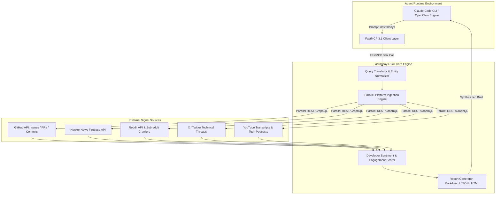

# last30days-skill

## What it is
`last30days-skill` is an open-source, highly optimized AI agent skill and real-time research assistant extension engineered for **Claude Code**, **OpenClaw**, **Cursor**, and custom command-line agentic workflows. It functions as a specialized neural research engine designed to prioritize authentic developer signals—including Reddit upvotes, X (Twitter) technical threads, GitHub issue comment velocity, YouTube transcript summaries, Polymarket prediction odds, and Hacker News sentiment—over traditional SEO-manipulated search index results.

Operating as a native **FastMCP 3.1** server or terminal plugin in 2027, `last30days-skill` allows frontier models (**Claude 5.6**, **GPT-5.6**, **Gemini 4.0 Ultra**, **Gemma 4**, **DeepSeek-V4**, and **Llama 4 Maverick**) to query, filter, score, and synthesize real-time technical community discussions and emerging codebase regressions from the immediate 30-day window.



## What problem it solves
In the rapidly accelerating AI software ecosystem of 2027, traditional web search engines suffer from systemic limitations that hinder developer productivity:

1. **SEO Manipulation & Blog Spagettification**: Search engine results pages (SERPs) are flooded with AI-generated affiliate articles and low-quality summaries that rehash outdated documentation rather than surfacing live bug reports or workarounds.
2. **Disconnected Community Siloes**: Critical insights regarding breaking changes, undocumented framework quirks, and zero-day dependency bugs emerge organically across scattered platforms (GitHub issues, X posts, Hacker News comments, Reddit subreddits).
3. **Stale Indexing Windows**: Standard web search crawlers take days or weeks to index technical discussions. `/last30days` bridges this gap by querying live APIs in parallel, restricting results strictly to the preceding 30 days.
4. **Lack of Signal Weighting**: Unweighted search engines treat a random blog post with the same relevance as a high-upvoted GitHub issue response from a core library maintainer. `last30days-skill` applies developer engagement scoring (stars, upvotes, comment sentiment, author authority) to rank results.

## Where it fits in the stack
**Category**: AI Assistants & Knowledge / Claude Code Skills & FastMCP 3.1 Research Assistants.

In the 2027 development environment, `last30days-skill` operates directly within developer terminals and agentic harnesses as a Model Context Protocol tool or local CLI skill.

```
+-----------------------------------------------------------------------+
|             Developer Terminal / Agent Harness (Claude Code)          |
+-----------------------------------------------------------------------+
                                    |
                                    v
+-----------------------------------------------------------------------+
|                    last30days-skill (FastMCP 3.1)                     |
|  - Real-Time Multi-Platform Parallel Ingestion                        |
|  - Developer Engagement & Upvote Weighting Algorithm                  |
|  - Structured Markdown, HTML, and Pydantic v2 JSON Synthesis          |
+-----------------------------------------------------------------------+
        |                           |                           |
        v                           v                           v
+------------------+     +--------------------+     +-------------------+
| GitHub / Hacker  |     | Reddit / Social X  |     | YouTube Transcripts|
| News Live APIs   |     | Technical Threads  |     | & Polymarket Odds |
+------------------+     +--------------------+     +-------------------+
```

## Typical use cases
- **Bleeding-Edge Tool & Framework Comparison**: Querying `/last30days OpenClaw vs Hermes agent` to evaluate real-world developer experience reports, commit velocities, and production pain points over the last month.
- **Zero-Day Library Bug & Workaround Identification**: Finding immediate community workarounds for newly introduced library bugs (e.g. `/last30days vllm cuda 12.8 out of memory on H100`).
- **Pre-Meeting & Founder Signal Briefings**: Compiling a person's, project's, or company's technical and open-source contributions over the preceding 30 days.
- **Git Repository & Issue Activity Synthesis**: Onboarding an AI agent to a codebase by summarizing the last 30 days of pull requests, security audits, and breaking changes.

## Strengths
- **Authentic Developer Signal Weighting**: Ranks search results using engagement metrics (GitHub upvotes, Reddit score, Hacker News karma, retweet velocity) rather than keyword density.
- **Parallel Multi-Platform Processing**: Asynchronously queries GitHub, Hacker News, Reddit, X, and YouTube simultaneously via optimized subprocess workers.
- **Automated Entity Normalization**: Translates natural language queries into platform-specific syntax (e.g. mapping "vLLM memory issues" to `r/LocalLLaMA`, `#vLLM`, and `repo:vllm-project/vllm`).
- **Native FastMCP 3.1 Support**: Full compliance with Model Context Protocol standards, allowing agents to invoke search capabilities programmatically.
- **Flexible Export Formatting**: Generates clean Markdown briefs, interactive standalone HTML reports, or strict JSON structures for downstream model processing.

## Limitations
- **External API Rate Limits**: High-frequency querying depends on external platform API quotas (GitHub PAT, Reddit API, X API), requiring caching layers for heavy enterprise usage.
- **Intentionally Narrow Temporal Scope**: By design, the skill ignores historical documentation or stable guides older than 30 days, making it unsuitable for fundamental reference queries.
- **Token Input Spikes**: Synthesizing raw comment threads across multiple sources can consume significant prompt context if limit parameters (`--max-results`) are not constrained.

## When to use it
- When researching rapidly evolving AI models, frameworks, or open-source releases from the past month.
- When seeking unfiltered community feedback, performance benchmarks, or unexpected bugs for a tool.
- When you need a "vibe check" on developer sentiment regarding a recent API change or pricing update.

## When not to use it
- For reviewing stable, long-established language specs or official documentation (e.g. "How does Python list comprehension work?").
- When authoritative, regulatory, or academic citations are required for safety-critical systems.

## Getting started

### Installation Options

#### 1. Claude Code Plugin Marketplace Installation
Install `last30days-skill` directly into your Claude Code terminal environment:

```bash
# Add the skill via the official marketplace
/plugin marketplace add mvanhorn/last30days-skill
```

#### 2. OpenClaw Package Manager Installation
For OpenClaw autonomous agents:

```bash
clawhub install last30days-official
```

#### 3. FastMCP 3.1 Server Installation
To run as a standalone FastMCP 3.1 server accessible to any MCP client:

```bash
pip install last30days-skill fastmcp pydantic
last30days-mcp-server --port 8080
```

## CLI examples

### 1. Researching Emerging Framework Benchmarks
Perform a multi-source research run and emit a structured Markdown brief:

```bash
# Query recent performance reports for vLLM vs SGLang
/last30days "vLLM vs SGLang throughput benchmarks" --summarize=executive
```

### 2. Exporting Standalone Interactive HTML Reports
Generate a rich HTML report containing source links, engagement scores, and sentiment breakdowns:

```bash
# Research DeepSeek-V4 benchmarks and save as HTML
/last30days "DeepSeek V4 evaluation results" --emit=html --output=deepseek_report.html
```

### 3. Source-Filtered Searching
Restrict signal queries strictly to technical discussion platforms:

```bash
# Query GitHub issues and Hacker News for specific CUDA errors
/last30days "PyTorch 2.6 flash attention bug" --sources=github,hacker-news
```

## API examples

### Python FastMCP 3.1 Server Implementation for last30days
This example demonstrates setting up a FastMCP 3.1 server that exposes `last30days-skill` research tools to autonomous agents.

```python
import asyncio
from fastmcp import FastMCP
from pydantic import BaseModel, Field
from typing import List, Optional

mcp = FastMCP("last30days Real-Time Research Server")

class ResearchRequest(BaseModel):
    query: str = Field(..., min_length=3, description="Search query string")
    sources: List[str] = Field(
        default=["github", "hacker-news", "reddit"],
        description="Target platforms to query"
    )
    max_results_per_source: int = Field(default=10, ge=1, le=50)

@mcp.tool()
async def search_last_30_days(params: ResearchRequest) -> dict:
    """Queries technical developer platforms for signals from the past 30 days."""
    # Simulated parallel platform fetcher
    await asyncio.sleep(0.1) # Simulating network latency

    findings = [
        {
            "source": "github",
            "title": "vLLM Issue #1209: Memory leak on CUDA 12.8",
            "url": "https://github.com/vllm-project/vllm/issues/1209",
            "score": 142,
            "snippet": "Setting PyTorch memory allocator config resolves the allocation spike."
        },
        {
            "source": "hacker-news",
            "title": "Discussion: SGLang v0.4 release and benchmark results",
            "url": "https://news.ycombinator.com/item?id=409210",
            "score": 310,
            "snippet": "SGLang demonstrates 1.8x token output speedup over vLLM on multi-GPU setups."
        }
    ]

    return {
        "query": params.query,
        "timeframe": "last_30_days",
        "total_signals_analyzed": len(findings),
        "results": findings
    }

if __name__ == "__main__":
    mcp.run(transport="sse", port=8080)
```

### Production Pydantic v2 Schema for Research Brief Validation
This production script validates incoming research queries, source filters, engagement score thresholds, and generated research briefs using Pydantic v2.

```python
from datetime import datetime
from enum import Enum
from typing import List, Optional, Dict, Any
from pydantic import BaseModel, Field, field_validator, ConfigDict

class SignalSource(str, Enum):
    GITHUB = "github"
    HACKER_NEWS = "hacker-news"
    REDDIT = "reddit"
    SOCIAL_X = "x"
    YOUTUBE = "youtube"

class SignalItem(BaseModel):
    source: SignalSource
    title: str = Field(..., min_length=3)
    url: str = Field(..., pattern=r"^https?://")
    engagement_score: int = Field(..., ge=0)
    sentiment: str = Field(default="neutral", pattern=r"^(positive|neutral|negative)$")
    summary: str = Field(..., min_length=10)

class ResearchBriefSpec(BaseModel):
    model_config = ConfigDict(extra="ignore")

    query: str = Field(..., min_length=3, max_length=200)
    target_sources: List[SignalSource] = Field(..., min_items=1)
    min_engagement_threshold: int = Field(default=10, ge=0)
    signals: List[SignalItem] = Field(default_factory=list)
    executive_summary: str = Field(..., min_length=20)
    mcp_protocol_version: str = Field(default="3.1")
    generated_at: datetime = Field(default_factory=datetime.utcnow)

    @field_validator("query")
    @classmethod
    def validate_non_empty_query(cls, v: str) -> str:
        if not v.strip():
            raise ValueError("Query string cannot consist solely of whitespace.")
        return v.strip()

# Example Validation
if __name__ == "__main__":
    raw_brief_data = {
        "query": "Claude Code FastMCP 3.1 integration patterns",
        "target_sources": ["github", "hacker-news", "reddit"],
        "min_engagement_threshold": 15,
        "executive_summary": "Over the past 30 days, developers have standardized FastMCP 3.1 SSE endpoints for Claude Code integrations.",
        "signals": [
            {
                "source": "github",
                "title": "Anthropic FastMCP Python SDK v0.8 Release",
                "url": "https://github.com/mcp/fastmcp/releases/tag/v0.8",
                "engagement_score": 240,
                "sentiment": "positive",
                "summary": "Native SSE transport support and Pydantic v2 tool parameter parsing."
            },
            {
                "source": "reddit",
                "title": "r/LocalLLaMA: Building self-healing agents with FastMCP 3.1",
                "url": "https://reddit.com/r/LocalLLaMA/comments/mcp_agents",
                "engagement_score": 88,
                "sentiment": "positive",
                "summary": "Community guide on capturing tool execution traces in Datadog and Langfuse."
            }
        ]
    }

    brief = ResearchBriefSpec.model_validate(raw_brief_data)
    print(f"Validated Research Brief: '{brief.query}' ({len(brief.signals)} signals parsed)")
    print(f"Generated At: {brief.generated_at.isoformat()}")
    print(f"Brief JSON:\n{brief.model_dump_json(indent=2)}")
```

## Related tools / concepts
- [Claude Code](../development_ops/claude-code.md) — Primary terminal harness for running the skill.
- [Everything Claude Code](everything-claude-code.md) — Optimization and configuration framework for Claude Code skills.
- [Model Context Protocol (FastMCP 3.1)](../automation_orchestration/mcp.md) — Protocol for agent skill and resource connection.
- [OpenRouter](openrouter.md) — Unified API router for model execution.
- [AI Signal Sources](../../knowledge_base/ai_signal_sources.md) — Catalog of social and developer platforms.
- [OpenClaw](../development_ops/openclaw.md) — Autonomous agent runtime for local skills.
- [Perplexity](../providers/perplexity.md) — AI web search engine.
- [Valyu](valyu.md) — Developer-focused signal search API.

## Sources / references
- [last30days-skill GitHub Repository](https://github.com/mvanhorn/last30days-skill)
- [SKILL.md Runtime Specification](https://github.com/mvanhorn/last30days-skill/blob/main/SKILL.md)
- [Anthropic Developer Guide: Claude Code Skills](https://docs.anthropic.com/claude/docs/code-skills)

## Contribution Metadata
- Last reviewed: 2027-01-07
- Confidence: high
