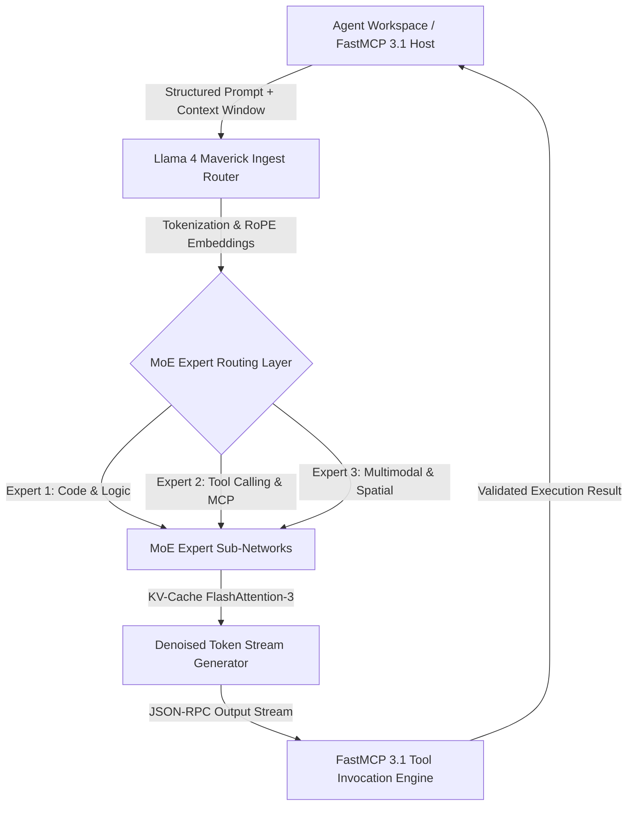

# Llama 4 Maverick

## What it is
**Llama 4 Maverick** is Meta's high-capacity, fine-tuned agentic foundation model within the Llama 4 open-weights family. Purpose-built for multi-step reasoning, autonomous tool orchestration, complex code generation, and low-latency structured output synthesis, Llama 4 Maverick integrates native FastMCP 3.1 tool-calling primitives and a sparse Mixture-of-Experts (MoE) execution architecture.



## What problem it solves
Standard open-weight models frequently suffer from tool invocation hallucination, context drift, and schema degradation during prolonged multi-turn agentic loops. Llama 4 Maverick resolves these bottlenecks by combining Reinforcement Learning from Agent Execution Feedback (RLAEF) with direct FastMCP 3.1 token emission. This allows the model to reliably produce valid function signatures, handle unexpected tool execution errors gracefully, and maintain long-horizon planning context without requiring excessive wrapper prompt engineering.

## Where it fits in the stack
**AI & Knowledge / Open Foundation Models**. Llama 4 Maverick operates at the core **Model & Foundation Layer**. It acts as the local intelligence runtime for agentic frameworks such as [Agency Agents](../agents/agency-agents.md), [OpenClaw](../development_ops/openclaw.md), and [Pydantic AI](../frameworks/pydantic-ai.md) deployed on private infrastructure.

## Typical use cases
- **Autonomous Tool & API Orchestration**: Emitting validated MCP tool calls across local file runners, databases, and microservices.
- **Agentic Code Generation & Self-Correction**: Executing automated software engineering loops (e.g., test creation, bug triage, refactoring) in isolated container sandboxes.
- **High-Density Multimodal Document Extraction**: Extracting complex tables, code snippets, and structural metadata from high-resolution PDF blueprints.
- **Air-Gapped Enterprise Copilots**: Powering secure, private copilots on local GPU clusters without outbound network traffic.

## Strengths
- **Native FastMCP 3.1 Protocol Support**: Directly emits typed JSON-RPC tool calls without reliance on brittle regex parsing or JSON wrapper prompts.
- **High-Efficiency MoE Architecture**: Activates a fraction of total parameters per token, delivering frontier-class reasoning scores with reduced inference latency.
- **Extended Context Horizon**: Supports up to 128k token context windows using optimized Rotary Positional Embeddings (RoPE) and FlashAttention-3.
- **Quantization Resilience**: Retains high tool-calling precision and reasoning fidelity when quantized to 4-bit (GGUF Q4_K_M) for local GPU deployment.

## Limitations
- **VRAM Requirements**: Requires high VRAM footprints (e.g., dual NVIDIA RTX 4090s, A100/H100 GPUs, or Mac Studio 64GB+ Unified Memory) for unquantized 128k context execution.
- **Strict License Terms**: Governed by the Meta Llama 4 Community License, requiring compliance for massive commercial user bases.
- **System Prompt Calibration**: Extremely tuned safety guardrails may require careful system prompt instructions when running authorized cybersecurity testing tools.

## When to use it
- When deploying self-hosted, privacy-first AI agent workflows that demand high-precision function calling.
- When minimizing cloud API expenditures for continuous, high-volume automated developer loops.
- When executing local, open-weights models for structured document extraction and software engineering tasks.

## When not to use it
- On resource-constrained edge hardware with under 16GB VRAM (consider smaller open models like Gemma 4 or Llama 3.2 3B).
- When fully managed cloud APIs (e.g., Anthropic Claude or OpenAI GPT series) are preferred over hosting local GPU hardware.

## Getting started

### Installation & Execution via Ollama
Pull and run Llama 4 Maverick locally using Ollama:

```bash
# Pull and run the quantized Llama 4 Maverick model
ollama run llama4-maverick
```

### High-Throughput Serving via vLLM
Deploy an OpenAI-compatible API server using vLLM with auto tool choice enabled:

```bash
vllm serve meta-llama/Llama-4-Maverick-70B-Instruct \
  --port 8000 \
  --max-model-len 32768 \
  --enable-auto-tool-choice \
  --tool-call-parser pythonic
```

## CLI examples

### 1. Local GGUF Execution via llama.cpp
Run quantized GGUF inference directly from the terminal with custom system prompts:

```bash
llama-cli -m ./models/llama-4-maverick-Q4_K_M.gguf \
  -p "<|system|>\nYou are an expert FastMCP 3.1 code generator.<|user|>\nWrite a Python FastMCP tool server definition." \
  -n 512 --temp 0.2
```

### 2. Context Window & Memory Inspection
Inspect model memory usage under high context loads:

```bash
ollama run llama4-maverick "Analyze memory consumption for processing a 64k token context window on dual 24GB GPUs."
```

## API examples

### Python FastMCP 3.1 & Pydantic v2 Tool Execution Integration
The following code snippet demonstrates connecting a FastMCP 3.1 server to a local Llama 4 Maverick model endpoint, parsing tool calls, and validating structured outputs using Pydantic v2:

```python
import json
import urllib.request
from typing import List, Optional, Dict, Any
from pydantic import BaseModel, Field
from mcp.server.fastmcp import FastMCP

# Define Pydantic v2 schemas for Llama 4 Maverick tool calling
class ToolInvocation(BaseModel):
    tool_name: str = Field(..., description="Name of the MCP tool to execute.")
    arguments: Dict[str, Any] = Field(default_factory=dict, description="Key-value arguments for tool execution.")

class MaverickAgentPlan(BaseModel):
    plan_id: str = Field(..., description="Unique plan tracking identifier.")
    reasoning: str = Field(..., description="Detailed step-by-step reasoning thought trace.")
    proposed_tools: List[ToolInvocation] = Field(default_factory=list, description="Sequence of tool invocations.")

class MaverickInferenceRequest(BaseModel):
    prompt: str = Field(..., description="User prompt or instruction for Llama 4 Maverick.")
    temperature: float = Field(default=0.2, ge=0.0, le=1.0)
    max_tokens: int = Field(default=2048, ge=64, le=8192)

# Initialize FastMCP 3.1 server
mcp = FastMCP("llama4-maverick-agent-host")

LLAMA4_ENDPOINT = "http://localhost:8000/v1/chat/completions"

@mcp.tool()
async def execute_maverick_agent_step(request: MaverickInferenceRequest) -> MaverickAgentPlan:
    """Sends a structured prompt to local Llama 4 Maverick endpoint and returns a validated Pydantic v2 execution plan."""
    payload = {
        "model": "meta-llama/Llama-4-Maverick-70B-Instruct",
        "messages": [
            {
                "role": "system",
                "content": "You are Llama 4 Maverick. Respond ONLY with valid JSON matching the MaverickAgentPlan schema."
            },
            {"role": "user", "content": request.prompt}
        ],
        "temperature": request.temperature,
        "max_tokens": request.max_tokens,
        "response_format": {"type": "json_object"}
    }

    req = urllib.request.Request(
        LLAMA4_ENDPOINT,
        data=json.dumps(payload).encode("utf-8"),
        headers={"Content-Type": "application/json"}
    )

    with urllib.request.urlopen(req) as response:
        res_data = json.loads(response.read().decode("utf-8"))

    raw_content = res_data["choices"][0]["message"]["content"]
    parsed_json = json.loads(raw_content)

    return MaverickAgentPlan.model_validate(parsed_json)

if __name__ == "__main__":
    mcp.run()
```

## Related tools / concepts
- [Llama 4](llama-4.md) — Base foundational open-weights LLM architecture from Meta.
- [Llama](llama.md) — Broader Meta Llama open model ecosystem overview.
- [Model Context Protocol (FastMCP 3.1)](../../tools/automation_orchestration/mcp.md) — Open tool execution framework.
- [Ollama](../../services/ollama.md) — Lightweight local model management and execution runtime.
- [llama.cpp](../infrastructure/llama-cpp.md) — C/C++ engine for efficient local quantized GGUF inference.
- [vLLM](../infrastructure/vllm.md) — High-throughput serving engine for open foundation models.

## Sources / references
- [Meta AI Llama Foundation Models Portal](https://ai.meta.com/llama/)
- [Hugging Face Meta Llama 4 Model Repository](https://huggingface.co/meta-llama)
- [LocalLLaMA Llama 4 Benchmark & Engineering Discussions](https://www.reddit.com/r/LocalLLaMA/)

## Contribution Metadata
- Last reviewed: 2027-01-07
- Confidence: high
