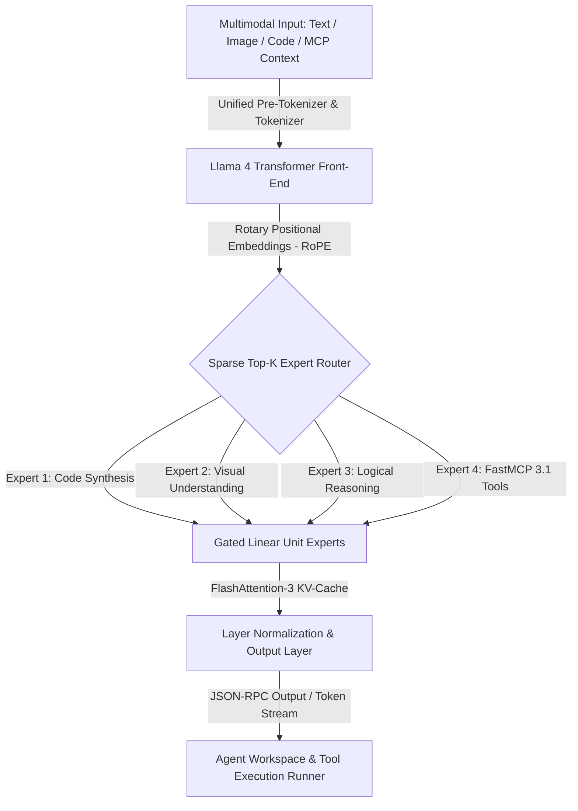

# Llama 4

## What it is
**Llama 4** is Meta's next-generation open-weights foundation model family, introducing a sparse Mixture-of-Experts (MoE) architecture, joint multimodal comprehension (text, vision, document OCR, and structured data), extended context windows reaching 128k+ tokens, and native FastMCP 3.1 tool integration.



## What problem it solves
Legacy dense foundation models activate every parameter for every generated token, scaling computational cost, inference latency, and memory bandwidth linearly with model scale. Llama 4's sparse Mixture-of-Experts architecture solves this efficiency challenge by activating only a subset of specialized expert sub-networks per token. This design delivers frontier-class reasoning, multimodal understanding, and structured tool invocation while reducing per-token FLOPs and energy consumption.

## Where it fits in the stack
**AI & Knowledge / Open Foundation Models**. Llama 4 serves as the foundational open-weights reasoning engine at the **Model & Foundation Layer**. It powers local inference engines ([vLLM](../infrastructure/vllm.md), [llama.cpp](../infrastructure/llama-cpp.md), [Ollama](../../services/ollama.md)), orchestration backends, and fine-tuning frameworks ([Unsloth](../infrastructure/unsloth.md), [PEFT](../infrastructure/peft.md)).

## Typical use cases
- **Native Multimodal Document Analysis**: Comprehending technical blueprints, UI designs, financial tables, and handwritten documentation directly alongside multi-turn textual context.
- **Enterprise Agentic Workflows**: Executing complex multi-step agent actions via FastMCP 3.1 tool definitions with deterministic schema compliance.
- **On-Premise Developer Copilots**: Providing low-latency inline code autocompletion, multi-file code editing, and automated test generation inside private corporate networks.
- **Air-Gapped Knowledge & RAG Systems**: Processing confidential organizational documents in zero-egress, air-gapped server environments.

## Strengths
- **Sparse MoE Computational Efficiency**: High parameter capacity with sub-exponential active parameter compute costs per generation step.
- **Native FastMCP 3.1 Tool Primitives**: Pre-trained on MCP protocol structures, enabling direct JSON-RPC function calling without wrapper prompt overhead.
- **Unified Multimodal Architecture**: Joint vision-language pre-training eliminates alignment latency between external vision encoders and language backends.
- **Broad Ecosystem Compatibility**: Instant integration with Hugging Face, vLLM, TensorRT-LLM, Ollama, and LM Studio.

## Limitations
- **High Total VRAM Requirement**: While active parameter FLOPs are low, offloading all sparse MoE expert weights requires substantial total VRAM capacity.
- **Quantization Complexity**: MoE routing matrices demand specialized quantization strategies (such as AWQ or MoE-aware GGUF) to avoid routing accuracy degradation.
- **Licensing Governance**: Governed by the Meta Llama 4 Community License, requiring compliance tracking for massive commercial application deployments.

## When to use it
- When requiring a flagship open-weights foundation model for agentic workflows, software development, and multimodal document understanding.
- When deploying native multimodal reasoning alongside FastMCP 3.1 tool execution on private hardware.
- When self-hosting on modern GPU accelerators (e.g., NVIDIA H100, B200, or Apple Silicon Mac Studio clusters).

## When not to use it
- On resource-constrained edge hardware with under 12GB VRAM (consider smaller open models like Gemma 4 or Llama 3.2 3B).
- When fully managed cloud API services are preferred without infrastructure operational overhead.

## Getting started

### Installation via Ollama
Install Ollama to host Llama 4 locally across macOS, Linux, or Windows:

```bash
curl -fsSL https://ollama.com/install.sh | sh
```

### Hello-World Inference
Run Llama 4 in non-interactive mode:

```bash
ollama run llama4 "Explain Llama 4 sparse MoE routing and FastMCP 3.1 primitives in two concise sentences."
```

## CLI examples

### 1. Interactive CLI Session with System Prompt
Launch an interactive session configured with custom system instructions:

```bash
ollama run llama4 --system "You are an expert AI infrastructure architect specializing in FastMCP 3.1 homelab integration."
```

### 2. High-Throughput Serving via vLLM
Deploy an OpenAI-compatible API server on port 8000 using vLLM:

```bash
vllm serve meta-llama/Llama-4-70B-Instruct \
  --port 8000 \
  --max-model-len 32768 \
  --enable-auto-tool-choice
```

### 3. Direct GGUF Execution via llama.cpp
Execute quantized Llama 4 GGUF models directly via `llama-cli`:

```bash
llama-cli -m ./models/llama-4-70b-Q4_K_M.gguf \
  -p "Analyze sparse Mixture-of-Experts routing strategies for local inference." \
  -n 512
```

## API examples

### Python FastMCP 3.1 & Pydantic v2 Llama 4 Inference Integration
The following code snippet demonstrates hosting a FastMCP 3.1 tool server that communicates with a local Llama 4 endpoint and validates model specifications and outputs using Pydantic v2 schemas:

```python
import json
import urllib.request
from typing import List, Optional
from pydantic import BaseModel, Field, ConfigDict
from mcp.server.fastmcp import FastMCP

# Define Pydantic v2 models for Llama 4 model specs and structured outputs
class Llama4ModelSpec(BaseModel):
    model_config = ConfigDict(extra="forbid")

    model_id: str = Field(..., description="Model identifier string.")
    total_parameters_b: float = Field(..., gt=0, description="Total model parameter size in billions.")
    active_parameters_b: float = Field(..., gt=0, description="Active parameters per token in billions.")
    num_experts: int = Field(..., ge=1, description="Total sparse expert sub-networks.")
    supported_modalities: List[str] = Field(default_factory=list, description="Supported modalities.")

class InferenceRequest(BaseModel):
    prompt: str = Field(..., description="User query or instruction prompt.")
    temperature: float = Field(default=0.2, ge=0.0, le=1.0)
    max_tokens: int = Field(default=1024, ge=32, le=4096)

class InferenceResponse(BaseModel):
    model_spec: Llama4ModelSpec
    generated_content: str = Field(..., description="Generated text completion.")

# Initialize FastMCP 3.1 server
mcp = FastMCP("llama4-foundation-server")

LLAMA4_API_URL = "http://localhost:8000/v1/chat/completions"

@mcp.tool()
async def query_llama4_foundation(request: InferenceRequest) -> InferenceResponse:
    """Invokes local Llama 4 inference endpoint and returns validated completion and architecture specs."""
    payload = {
        "model": "meta-llama/Llama-4-70B-Instruct",
        "messages": [{"role": "user", "content": request.prompt}],
        "temperature": request.temperature,
        "max_tokens": request.max_tokens
    }

    req = urllib.request.Request(
        LLAMA4_API_URL,
        data=json.dumps(payload).encode("utf-8"),
        headers={"Content-Type": "application/json"}
    )

    with urllib.request.urlopen(req) as response:
        res_data = json.loads(response.read().decode("utf-8"))

    content = res_data["choices"][0]["message"]["content"]

    spec = Llama4ModelSpec(
        model_id="meta-llama/Llama-4-70B-Instruct",
        total_parameters_b=70.0,
        active_parameters_b=12.5,
        num_experts=16,
        supported_modalities=["Text", "Vision", "Document OCR", "FastMCP 3.1 Tools"]
    )

    return InferenceResponse(
        model_spec=spec,
        generated_content=content
    )

if __name__ == "__main__":
    mcp.run()
```

## Related tools / concepts
- [Llama](llama.md) — Broader Meta Llama open foundation model family overview.
- [Llama 4 Maverick](llama-4-maverick.md) — Agentic, tool-optimized variant of the Llama 4 architecture.
- [Model Context Protocol (FastMCP 3.1)](../../tools/automation_orchestration/mcp.md) — Standardized tool integration protocol.
- [Ollama](../../services/ollama.md) — Local LLM management runtime.
- [vLLM](../infrastructure/vllm.md) — High-throughput serving framework for LLMs.
- [llama.cpp](../infrastructure/llama-cpp.md) — Lightweight engine for local quantized model execution.

## Sources / references
- [Meta AI Llama 4 Foundation Models Portal](https://ai.meta.com/llama/)
- [Hugging Face Meta-Llama Organization](https://huggingface.co/meta-llama)

## Contribution Metadata
- Last reviewed: 2027-01-07
- Confidence: high
