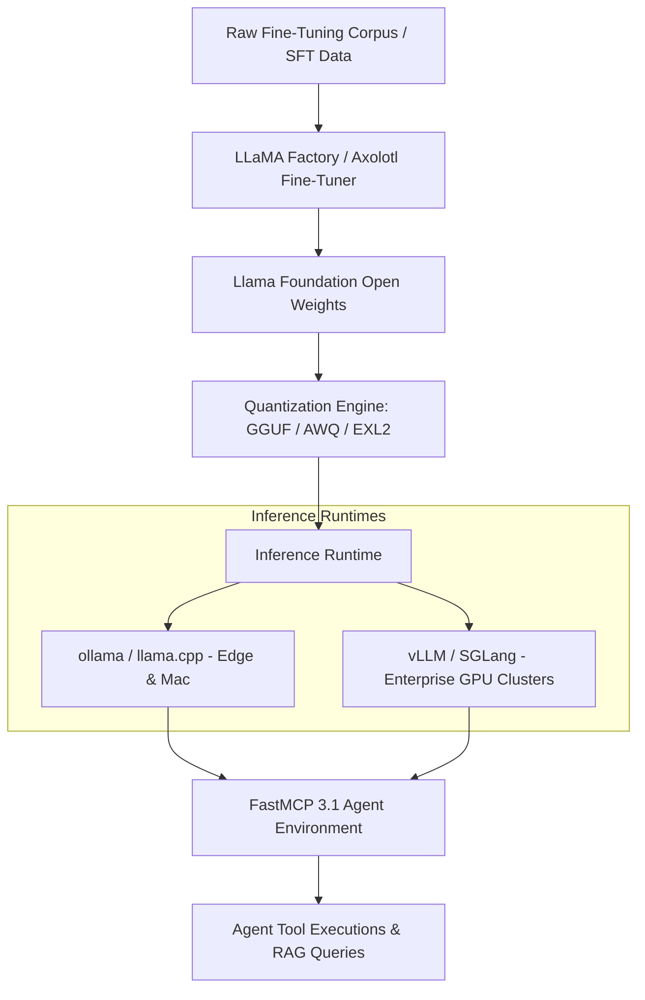

# Llama

## What it is
**Llama** (Large Language Model Meta AI) is Meta's family of open-weights foundation models, representing the foundational lineage for open-source large language model research and deployment. Spanning generations from original Llama to Llama 2, Llama 3/3.1/3.3, and [Llama 4](llama-4.md), Llama provides the global benchmark for open model architectures. In early 2027, Llama models serve as the backbone for self-hosted local inference, enterprise fine-tuning, and FastMCP 3.1 agent execution pipelines across Apple Silicon, NVIDIA Blackwell (B200/GB200), and AMD Instinct hardware.



## What problem it solves
Proprietary LLM APIs present continuous operational costs, latency overhead, vendor lock-in, and data privacy concerns for sensitive enterprise and developer workflows. The Llama model ecosystem resolves this by delivering state-of-the-art open weights, allowing organizations to fine-tune, quantize, inspect, and host enterprise-grade language models on self-managed infrastructure.

Key problems resolved:
- **Data Sovereignty & Security**: Executing reasoning workloads completely within air-gapped or private cloud environments without external data egress.
- **Cost Predictability at Scale**: Eliminating per-token billing for high-volume batch processing and continuous multi-agent tool loops.
- **Custom Domain Adaptation**: Fine-tuning specific adapter weights (LoRA/QLoRA) for specialized legal, medical, or code generation domain knowledge.

## Where it fits in the stack
**Category**: AI & Knowledge / Open Foundation Models. It sits at the **Model & Foundation Layer**, serving as the bedrock open model upon which inference engines ([ollama](../../services/ollama.md), [llama.cpp](../infrastructure/llama-cpp.md), [vLLM](../infrastructure/vllm.md)) and fine-tuning frameworks ([LLaMA Factory](../frameworks/llama-factory.md), [Unsloth](../infrastructure/unsloth.md)) are built.

## Typical use cases
- **Self-Hosted Generative AI**: Operating high-throughput text generation, summarization, and translation services on internal GPU clusters.
- **Domain-Specific Fine-Tuning**: Adapting open weights to specialized legal, medical, or technical domains using PEFT/LoRA adapters.
- **Embedded Agentic Inference**: Powering autonomous agents with low-latency structured output and tool execution capabilities.
- **Offline & Edge AI Copilots**: Running quantized Llama models on local developer workstations and edge server nodes.

## Strengths
- **Ecosystem Standard**: The universal baseline for open-weights research, quantization formats (GGUF, AWQ, EXL2), and hardware accelerators.
- **Permissive Community Licensing**: Enables commercial deployment and derivative works across small and large enterprises.
- **Broad Scale Range**: Available in parameter sizes spanning from 1B/3B compact edge models to 70B/405B frontier variants.
- **Extensive Tooling Integration**: Natively supported across virtually every major LLM runtime, framework, and vector database.

## Limitations
- **Hosting Maintenance Overhead**: Requires managing GPU infrastructure, quantization builds, and serverless endpoint scaling.
- **Hardware Capital Requirements**: Ultra-large variants (70B/405B) require multi-GPU nodes (A100/H100/B200) or high-memory unified workstations.
- **Commercial User Scale Thresholds**: Enterprise license clauses apply to services exceeding monthly active user thresholds defined in Meta's terms.

## When to use it
- When requiring an open-weights foundation for on-premise, cloud, or edge deployment.
- When customizing LLMs using proprietary datasets without sharing sensitive weights or data with closed API vendors.
- When building cost-effective, high-throughput LLM pipelines free from third-party rate limits.

## When not to use it
- For instant serverless prototyping where hosted APIs ([Claude 5.1](../providers/anthropic.md) or [GPT-5.5](openai.md)) eliminate hardware setup entirely.
- When sub-100M parameter micro-models are required for ultra-low-power microcontrollers.

## Getting started

### Installation via Hugging Face Transformers
Install standard Python dependencies:
```bash
pip install transformers torch accelerate pydantic
```

### Basic Inference with Hugging Face Transformers
Run Llama inference in Python:
```python
from transformers import AutoTokenizer, AutoModelForCausalLM
import torch

model_id = "meta-llama/Llama-3.3-70B-Instruct"
tokenizer = AutoTokenizer.from_pretrained(model_id)
model = AutoModelForCausalLM.from_pretrained(
    model_id,
    torch_dtype=torch.bfloat16,
    device_map="auto"
)

prompt = "Summarize the architectural evolution of Meta Llama open weights models."
inputs = tokenizer(prompt, return_tensors="pt").to("cuda")
outputs = model.generate(**inputs, max_new_tokens=256)
print(tokenizer.decode(outputs[0], skip_special_tokens=True))
```

## CLI examples

### Running Quantized Llama via Ollama
Spin up interactive Llama inference on local workstation:
```bash
ollama run llama3.3
```

### High-Throughput Serving via vLLM
Serve Llama with OpenAI-compatible endpoint on port 8000:
```bash
vllm serve meta-llama/Llama-3.1-8B-Instruct --port 8000 --gpu-memory-utilization 0.90
```

## API examples

### FastMCP 3.1 Tool Invocation via Llama OpenAI-Compatible Server
This Python example demonstrates querying a self-hosted Llama endpoint, requesting structured JSON output for FastMCP 3.1 tool execution, and validating the output using Pydantic v2:

```python
import json
import requests
from pydantic import BaseModel, Field, field_validator
from typing import List, Dict, Any, Optional

class MCPToolCallArguments(BaseModel):
    query: str = Field(..., description="Search query string")
    max_results: int = Field(default=5, ge=1, le=20)
    search_depth: str = Field(default="deep", description="Search depth mode")

    @field_validator('search_depth')
    @classmethod
    def validate_search_depth(cls, v: str) -> str:
        allowed = {'basic', 'deep', 'academic'}
        if v not in allowed:
            raise ValueError(f"Search depth '{v}' invalid. Must be in {allowed}")
        return v

class LlamaAgentResponse(BaseModel):
    reasoning_steps: List[str] = Field(..., description="Chain-of-thought steps")
    selected_tool: str = Field(..., description="Target FastMCP tool name")
    tool_arguments: MCPToolCallArguments
    confidence_score: float = Field(..., ge=0.0, le=1.0)

def query_llama_agent_endpoint(prompt_text: str) -> LlamaAgentResponse:
    # Simulated OpenAI-compatible request payload to local vLLM or Ollama Llama instance
    raw_mock_llama_json = """{
        "reasoning_steps": [
            "User asked for recent benchmark results of Llama 4.",
            "Formulating search query for vector store database."
        ],
        "selected_tool": "vector_search",
        "tool_arguments": {
            "query": "Llama 4 benchmark evaluation performance 2027",
            "max_results": 10,
            "search_depth": "deep"
        },
        "confidence_score": 0.96
    }"""

    parsed_json = json.loads(raw_mock_llama_json)
    validated_response = LlamaAgentResponse.model_validate(parsed_json)
    return validated_response

if __name__ == "__main__":
    prompt = "Find latest evaluation scores for Llama 4 models."
    result = query_llama_agent_endpoint(prompt)
    print("Llama Agent Execution Validated:")
    print(f"  Tool: {result.selected_tool}")
    print(f"  Query: {result.tool_arguments.query}")
    print(f"  Confidence: {result.confidence_score}")
```

## Related tools / concepts
- [Llama 4](llama-4.md)
- [Llama 4 Maverick](llama-4-maverick.md)
- [llama.cpp](../infrastructure/llama-cpp.md)
- [LLaMA Factory](../frameworks/llama-factory.md)
- [Unsloth](../infrastructure/unsloth.md)
- [ollama](../../services/ollama.md)

## Sources / references
- [Meta Llama Official Developer Portal](https://llama.meta.com/)
- [Hugging Face Llama Organization](https://huggingface.co/meta-llama)
- [Meta AI Research Llama Papers](https://ai.meta.com/research/publications/)

## Contribution Metadata
- Last reviewed: 2027-01-07
- Confidence: high
