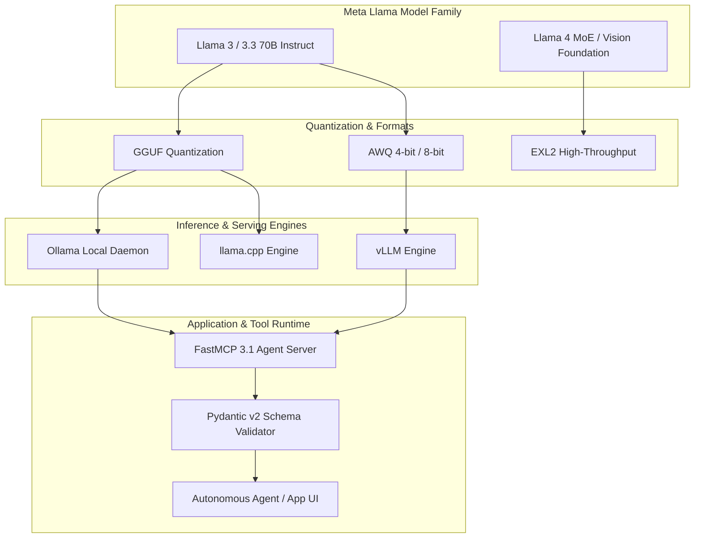

# Llama

## What it is
**Llama** (Large Language Model Meta AI) is Meta's family of open-weights foundation models, representing the foundational lineage and global standard for open-source AI research and deployment. Spanning generations from original Llama to Llama 2, Llama 3/3.1/3.3, and [Llama 4](llama-4.md), Llama provides open architectures, Mixture-of-Experts (MoE) routing, multimodal vision capabilities, and native tool execution for the global AI community.

Meta's open-weights strategy enables developers, enterprise platforms, and academic institutions to self-host, fine-tune, quantize, inspect, and deploy frontier models on cloud infrastructure, local servers, or edge devices without proprietary API lock-in.

## What problem it solves
Proprietary LLM APIs present continuous operational costs, latency overhead, vendor lock-in, data privacy concerns, and unexpected model depreciation for sensitive enterprise workflows:
- **Data Privacy & Compliance**: Organizations handling healthcare (HIPAA), financial, or legal data cannot transmit raw payloads to closed third-party cloud APIs. Llama models allow complete local data sovereignty inside private VPCs or on-premise clusters.
- **Cost Efficiency at Scale**: High-volume, continuous inference workloads incur exorbitant token billing on proprietary endpoints. Self-hosting quantized Llama models dramatically reduces marginal inference costs per token.
- **Custom Domain Specialization**: Generic foundation models lack hyper-specific domain knowledge or structured protocol alignment. Open Llama weights permit deep parameter-efficient fine-tuning (PEFT/LoRA) and post-training alignment.
- **Embedded Edge & Workstation Autonomy**: Offline, air-gapped, or low-latency developer environments require localized intelligence without active internet connectivity.

## Architecture & Ecosystem Data Flow



## Where it fits in the stack
**Category**: AI Knowledge / Open Foundation Models. Operating at the **Model & Foundation Layer**, Llama serves as the baseline open model upon which inference engines ([ollama](../../services/ollama.md), [llama.cpp](../infrastructure/llama-cpp.md), [vLLM](../infrastructure/vllm.md)), fine-tuning suites ([LLaMA Factory](../frameworks/llama-factory.md), [Unsloth](../infrastructure/unsloth.md)), and agent runtimes ([Pydantic AI](../frameworks/pydantic-ai.md)) are built.

## Key Features & Functional Modules
- **Broad Scale Spectrum**: Parameter variations spanning from compact 1B/3B edge variants to 8B, 70B, and 405B frontier models.
- **Multimodal & Mixture-of-Experts (MoE)**: Advanced vision-language alignment and MoE sparse routing architectures introduced in recent generations.
- **Extended Context Windows**: Native support for 128k token context windows using Grouped-Query Attention (GQA) and RoPE positional embeddings.
- **Native Tool Calling Alignment**: Pre-trained and instruction-tuned specifically for structured JSON outputs, function calling, and FastMCP 3.1 protocols.
- **Universal Quantization Support**: Universal compatibility with GGUF, AWQ, GPTQ, and EXL2 formats across x86, ARM, Apple Silicon, and CUDA.

## Typical use cases
- **Self-Hosted Generative AI**: Operating high-throughput text generation, summarization, and translation microservices on private GPU nodes.
- **Domain-Specific Fine-Tuning**: Adapting open weights to specialized legal, medical, or technical domains using PEFT/LoRA adapters.
- **Autonomous Agentic Inference**: Powering agentic loops with low-latency structured output and tool execution capabilities.
- **Offline & Edge Copilots**: Running quantized Llama models on developer workstations, edge servers, and air-gapped systems.

## Strengths
- **Ecosystem Baseline**: The universal benchmark for open-weights research, quantization formats, and hardware accelerator optimizations.
- **Permissive Community Licensing**: Commercial deployment allowed for organizations across small, medium, and large enterprise tiers.
- **Unrivaled Tooling Integration**: Natively supported across virtually every open-source AI framework, library, and vector database.
- **Parameter Efficiency**: Highly optimized architecture delivering frontier-grade performance per parameter size.

## Limitations
- **Infrastructure Management Overhead**: Requires hosting, scaling, and managing GPU hardware, serverless endpoints, or local daemons.
- **Hardware Capital Requirements**: Large 70B and 405B variants demand multi-GPU nodes (A100/H100/B200) or high-memory unified workstations.
- **Enterprise Usage Thresholds**: Custom license clauses apply to commercial applications serving huge monthly active user volumes as defined in Meta's terms.

## When to use it
- When requiring an open-weights foundation for on-premise, private VPC, or edge deployment.
- When customizing LLMs using proprietary datasets without sharing sensitive weights or data with closed API vendors.
- When building cost-effective, high-throughput LLM pipelines free from third-party rate limits.

## When not to use it
- For rapid serverless prototyping where managed APIs ([Claude 5.1](../providers/anthropic.md) or [GPT-5.5](openai.md)) eliminate hardware setup completely.
- When embedded micro-models under 50MB are required for ultra-low-power microcontrollers.

## Model Family Overview & Specifications

| Model Generation | Key Architecture Highlights | Context Window | Native Capabilities | Primary Serving Engine |
| :--- | :--- | :--- | :--- | :--- |
| Llama 3.1 8B | Dense Transformer, GQA | 128,000 tokens | Function Calling, JSON | Ollama, vLLM, llama.cpp |
| Llama 3.3 70B | Dense Transformer, GQA | 128,000 tokens | Frontier Reasoning, Tool Use | vLLM, TGI, SGLang |
| Llama 3.1 405B | Dense Transformer, Multi-Node | 128,000 tokens | Frontier Benchmark, Synthetic Data | Multi-GPU vLLM, TensorRT-LLM |
| Llama 4 | MoE Architecture, Multimodal | 128,000+ tokens | Native Vision, FastMCP 3.1 Protocols | vLLM, SGLang, Ollama |

## Getting started

### Installation via Hugging Face Transformers
Install standard Python dependencies:
```bash
pip install "transformers>=4.45.0" torch accelerate pydantic
```

### Basic Inference in Python
Run Llama inference using Hugging Face Transformers:
```python
from transformers import AutoTokenizer, AutoModelForCausalLM
import torch

model_id = "meta-llama/Llama-3.1-8B-Instruct"
tokenizer = AutoTokenizer.from_pretrained(model_id)
model = AutoModelForCausalLM.from_pretrained(
    model_id,
    torch_dtype=torch.bfloat16,
    device_map="auto"
)

prompt = "Explain the advantage of open-weights models for enterprise AI safety."
inputs = tokenizer(prompt, return_tensors="pt").to("cuda")
outputs = model.generate(**inputs, max_new_tokens=256)
print(tokenizer.decode(outputs[0], skip_special_tokens=True))
```

## CLI examples

### 1. Local Quantized Execution via Ollama CLI
```bash
ollama run llama3.3
```

### 2. High-Throughput Production Serving via vLLM
```bash
vllm serve meta-llama/Llama-3.3-70B-Instruct --tensor-parallel-size 4 --port 8000
```

### 3. Serving GGUF Quantized Weights via llama.cpp
```bash
llama-server -m ./models/llama-3.3-70b-instruct-q4_k_m.gguf -c 8192 --port 8080
```

## API examples

### 1. OpenAI-Compatible vLLM Endpoint Querying & Pydantic v2 Output Enforcement
This example queries a locally hosted vLLM server serving Llama 3.3 and enforces structured response validation using Pydantic v2:

```python
import json
from pydantic import BaseModel, Field, ValidationError
from typing import List

class ModelCapability(BaseModel):
    feature_name: str = Field(..., description="Name of the model capability")
    status: str = Field(..., description="Support status (e.g. supported, preview)")
    notes: str = Field(..., description="Technical notes")

class LlamaEvaluationReport(BaseModel):
    model_name: str = Field(..., description="Exact model name evaluated")
    context_length: int = Field(..., ge=2048)
    capabilities: List[ModelCapability]
    overall_score: float = Field(..., ge=0.0, le=100.0)

def validate_llama_response(raw_json: str) -> LlamaEvaluationReport:
    try:
        data = json.loads(raw_json)
        report = LlamaEvaluationReport.model_validate(data)
        print(f"Validation successful for {report.model_name}. Score: {report.overall_score}")
        return report
    except ValidationError as e:
        print("Pydantic validation error:", e)
        raise

if __name__ == "__main__":
    sample_response = """{
        "model_name": "Llama-3.3-70B-Instruct",
        "context_length": 131072,
        "capabilities": [
            {"feature_name": "Native Tool Calling", "status": "supported", "notes": "GQA optimized"},
            {"feature_name": "Structured JSON", "status": "supported", "notes": "Guaranteed via Pydantic"}
        ],
        "overall_score": 94.5
    }"""
    validate_llama_response(sample_response)
```

### 2. FastMCP 3.1 Local Tool Execution with Ollama Llama Endpoint
This script implements a FastMCP 3.1 tool server powered by a local quantized Llama 3.1 model:

```python
import asyncio
import httpx
from pydantic import BaseModel, Field

class SummarizeRequest(BaseModel):
    document_text: str = Field(..., min_length=20, description="Raw text payload to summarize")
    max_summary_words: int = Field(default=50, ge=10, le=200)

class SummarizeResponse(BaseModel):
    summary: str
    word_count: int
    model_used: str

async def generate_llama_summary(payload: SummarizeRequest) -> SummarizeResponse:
    ollama_url = "http://localhost:11434/api/generate"
    prompt = f"Summarize the following text in under {payload.max_summary_words} words:\n\n{payload.document_text}"

    async with httpx.AsyncClient(timeout=30.0) as client:
        # Request generation from local Ollama daemon
        response = await client.post(
            ollama_url,
            json={
                "model": "llama3.1:8b",
                "prompt": prompt,
                "stream": False
            }
        )
        response.raise_for_status()
        data = response.json()
        summary_text = data.get("response", "").strip()

        return SummarizeResponse(
            summary=summary_text,
            word_count=len(summary_text.split()),
            model_used="llama3.1:8b"
        )

async def main():
    req = SummarizeRequest(
        document_text="Meta Llama foundation models represent the cornerstone of open source AI research, providing state-of-the-art open weights for developers globally.",
        max_summary_words=25
    )
    result = await generate_llama_summary(req)
    print("Summary Result:", result.model_dump_json(indent=2))

if __name__ == "__main__":
    asyncio.run(main())
```

## Related tools / concepts
- [Llama 4](llama-4.md) — Next-generation Mixture-of-Experts Llama architecture.
- [Llama 4 Maverick](llama-4-maverick.md) — Specialized agentic reasoning Llama variant.
- [llama.cpp](../infrastructure/llama-cpp.md) — High-performance C/C++ LLM inference engine.
- [LLaMA Factory](../frameworks/llama-factory.md) — Unified open-weights fine-tuning framework.
- [Unsloth](../infrastructure/unsloth.md) — Ultra-fast memory-efficient fine-tuning framework.
- [ollama](../../services/ollama.md) — Lightweight local daemon for running quantized GGUF models.
- [vLLM](../infrastructure/vllm.md) — High-throughput production LLM serving framework.

## Sources / references
- [Meta Llama Official Developer Portal](https://llama.meta.com/)
- [Hugging Face Meta Llama Repository](https://huggingface.co/meta-llama)
- [Meta AI Research Llama 3 Technical Report](https://ai.meta.com/research/publications/llama-3-technical-report/)
- [Ollama Model Library — Llama Collection](https://ollama.com/library/llama3.3)

---
## Contribution Metadata
- Last reviewed: 2027-01-07
- Confidence: high
