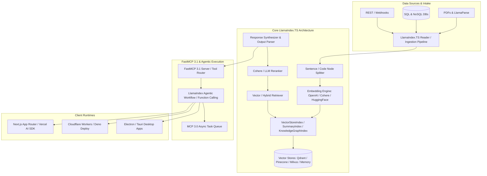

# LlamaIndex.TS

## What it is
LlamaIndex.TS is the native TypeScript implementation of the LlamaIndex data framework for building context-augmented Large Language Model (LLM) applications. Designed specifically for modern JavaScript/TypeScript runtimes including Node.js (v20+), Bun, Deno, Edge runtimes (Vercel Edge, Cloudflare Workers), and browser environments, LlamaIndex.TS brings production-grade Retrieval-Augmented Generation (RAG), structured data indexing, and agentic task execution to the JavaScript ecosystem.

By early January 2027, LlamaIndex.TS has fully integrated the **FastMCP 3.1** specification and **MCP 3.0 Task Protocol**, providing a unified framework for streaming context ingestion, multi-modal vector search, graph-based knowledge indexing, and autonomous tool routing. It natively bridges frontend web applications and backend serverless infrastructure with frontier intelligence models such as [Claude 5.6](../ai_knowledge/claude.md), [GPT-5.6](../ai_knowledge/openai.md), [Gemini 4.0 Ultra](../ai_knowledge/gemini.md), DeepSeek-V4, Qwen 3.6 VL, and local engines running via [Ollama](../../services/ollama.md) or [vLLM](../infrastructure/vllm.md).



## What problem it solves
LlamaIndex.TS solves critical architectural and operational challenges faced by web developers and full-stack engineers when building intelligent applications:

1. **Context Window Optimization & Fragmentation**: Manages chunking, semantic node splitting, metadata enrichment, and vector embedding generation to prevent prompt saturation and reduce token consumption costs across long context windows.
2. **Runtime Context Isolation**: Eliminates the need to spawn expensive Python sub-processes or sidecar microservices just to handle data retrieval in Node.js or edge environments.
3. **Multi-Modal Data Integration**: Unifies heterogeneous data structures—unstructured text, tabular data, JSON documents, codebases, and media—into queryable vector and knowledge graph indices.
4. **Type-Safe Agentic Tool Calling**: Replaces untyped prompt engineering with end-to-end type safety using Zod and Pydantic v2 schemas, ensuring that tool arguments and LLM responses conform strictly to application data contracts.
5. **Low-Latency Streaming**: Provides first-class support for Server-Sent Events (SSE) and web streams, enabling real-time token rendering and step-by-step agent trajectory visualization in web UIs.

## Where it fits in the stack
LlamaIndex.TS operates at the **Application & Orchestration Layer** of the modern AI engineering stack:

- **Data Ingestion Layer**: Connects above document loaders, web scrapers (e.g., [Firecrawl](../process_understanding/firecrawl.md)), and document parsers ([LlamaParse](../intake_storage/llamaparse.md)).
- **Storage Layer Integration**: Interfaces directly with vector databases (Qdrant, Pinecone, Weaviate, Milvus, pgvector) and local memory buffers.
- **Model Orchestration Layer**: Coordinates prompt construction, model invocation, and output schema validation across multiple LLM providers.
- **Protocol Interface Layer**: Exposes index capabilities and agent tools to external orchestrators via [Model Context Protocol (FastMCP 3.1)](../automation_orchestration/mcp.md).
- **Client Presentation Layer**: Integrates smoothly with frontend state frameworks (React, Vue, Svelte) and edge deployment networks via [Vercel AI SDK](../development_ops/vercel-ai-sdk.md).

## Typical use cases
- **Full-Stack Enterprise RAG**: Building secure internal search engines and document QA systems inside Next.js or Nuxt applications with enterprise SSO (OAuth 2.0 / OIDC).
- **Edge AI Microservices**: Deploying ultra-fast, cold-start-free retrieval endpoints on Cloudflare Workers or Vercel Edge Runtimes using lightweight embedding drivers.
- **Developer Documentation Agents**: Contextual code understanding tools that parse TypeScript/JavaScript abstract syntax trees (ASTs) and answer architectural questions.
- **Multi-Tenant Knowledge Portals**: Dynamic multi-tenant indices that filter vector retrieval by tenant ID, access control lists (ACLs), and user roles in real time.
- **FastMCP 3.1 Enterprise Tools**: Authoring TypeScript MCP servers that expose complex data retrieval pipelines as standardized agent tools for [Claude Code](../development_ops/claude-code-setup.md), Cursor, or Windsurf.

## Strengths
- **Native JavaScript/TypeScript Performance**: Zero inter-process communication overhead in JS runtimes; blazing-fast execution under Bun and Vercel V8 engines.
- **Strict End-to-End Type Safety**: Complete TypeScript type definitions across indices, retrievers, query engines, node parsers, and tool interfaces.
- **Full FastMCP 3.1 Specification Support**: Native support for Model Context Protocol version 3.1, including task management, resource updates, and asynchronous tool calls.
- **Versatile Node Parsing Strategies**: Includes specialized splitters for Markdown, HTML, JSON, code ASTs, and semantic sentence boundaries.
- **Seamless Frontend Integration**: Plug-and-play compatibility with UI streaming primitives, React Server Components (RSC), and Vercel AI SDK streams.

## Limitations
- **Feature Gap Relative to Python**: Advanced niche research modules (e.g., experimental RLHF pipelines or highly complex multi-graph algorithms) may appear in Python LlamaIndex prior to TypeScript porting.
- **Heavy Document Parsing Dependencies**: Parsing complex legacy PDFs or scanned images locally in Node.js can be resource-heavy; requires offloading to [LlamaParse](../intake_storage/llamaparse.md) or remote vision APIs.
- **Vector Store Ecosystem Variance**: While major vector databases are supported, niche or specialized vector stores might have community-maintained rather than first-party drivers.

## When to use it
- When developing primary application backend or edge logic in TypeScript, Node.js, Next.js, Bun, or Deno.
- When requiring low cold-start latencies for serverless AI functions and web API endpoints.
- When building FastMCP 3.1 compliant tool servers within the Node.js package ecosystem.
- When full static typing across data loaders, retrieval pipelines, and LLM output parsers is non-negotiable.

## When not to use it
- If your engineering team and infrastructure are completely built around Python data science libraries (NumPy, Pandas, PyTorch) — use [LlamaIndex (Python)](llamaindex.md).
- When performing heavy offline batch model training or custom model weight fine-tuning.
- For trivial, single-call LLM completions where direct SDK usage without indexing abstractions is sufficient.

## Getting started
### 1. Installation
Install LlamaIndex.TS alongside required dependencies in your TypeScript project:

```bash
# Using npm
npm install llamaindex @llamaindex/env zod

# Using Bun
bun add llamaindex @llamaindex/env zod

# Using pnpm
pnpm add llamaindex @llamaindex/env zod
```

### 2. Environment Configuration
Create a `.env` file in your root directory containing your LLM provider credentials:

```ini
OPENAI_API_KEY=sk-proj-YOUR_OPENAI_KEY
ANTHROPIC_API_KEY=sk-ant-YOUR_ANTHROPIC_KEY
QDRANT_URL=https://your-qdrant-cluster.cloud.qdrant.io:6333
QDRANT_API_KEY=your-qdrant-key
```

### 3. Basic Indexing & Querying Script (`index.ts`)
```typescript
import { Document, VectorStoreIndex, Settings, OpenAI } from "llamaindex";

// Configure global settings
Settings.llm = new OpenAI({ model: "gpt-5.6", temperature: 0.1 });

async function main() {
  // Create sample document
  const doc = new Document({
    text: "LlamaIndex.TS brings native FastMCP 3.1 protocol capabilities and multi-agent RAG to modern TypeScript runtimes.",
    metadata: { category: "architecture", author: "AI KnowledgeOps Team" }
  });

  // Build index in memory
  console.log("Building VectorStoreIndex...");
  const index = await VectorStoreIndex.fromDocuments([doc]);

  // Create query engine with top-k retrieval
  const queryEngine = index.asQueryEngine({ similarityTopK: 3 });

  // Execute query
  const response = await queryEngine.query({
    query: "What protocol and capabilities does LlamaIndex.TS support?"
  });

  console.log("\n--- Query Response ---");
  console.log(response.toString());
}

main().catch(console.error);
```

## CLI examples
LlamaIndex.TS provides an official CLI for document management, index creation, local chat debugging, and MCP tool discovery.

```bash
# Ingest local Markdown and PDF files into a local vector store
npx llamaindex-ts ingest --dir ./docs --output ./vector_store --chunk-size 512

# Launch an interactive local chat session over the ingested documents
npx llamaindex-ts chat --vector-store ./vector_store --model gpt-5.6

# Start a local FastMCP 3.1 server exposing the index as an agent tool
npx llamaindex-ts mcp serve --port 3001 --index ./vector_store

# Inspect active vector indices and chunk counts
npx llamaindex-ts inspect --store ./vector_store --summary
```

## API examples

### 1. Production TypeScript RAG Pipeline with Qdrant and Streaming
The following example demonstrates building an advanced RAG query engine with a Qdrant vector store, custom node splitters, reranking, and response streaming.

```typescript
import {
  Document,
  VectorStoreIndex,
  QdrantVectorStore,
  SentenceSplitter,
  Settings,
  OpenAI,
  OpenAIEmbedding,
  type NodeWithScore
} from "llamaindex";

// Configure global embedding and LLM models
Settings.llm = new OpenAI({ model: "gpt-5.6", temperature: 0.2 });
Settings.embedModel = new OpenAIEmbedding({ model: "text-embedding-3-large" });

export async function runProductionRAGPipeline(
  rawTexts: Array<{ id: string; content: string; source: string }>,
  userQuery: string
) {
  // Initialize Qdrant Vector Store
  const vectorStore = new QdrantVectorStore({
    url: process.env.QDRANT_URL,
    apiKey: process.env.QDRANT_API_KEY,
    collectionName: "enterprise_knowledge_v1"
  });

  // Transform raw inputs into LlamaIndex Documents
  const documents = rawTexts.map(item => new Document({
    text: item.content,
    id_: item.id,
    metadata: { source: item.source, timestamp: new Date().toISOString() }
  }));

  // Configure sentence-based node splitting
  const splitter = new SentenceSplitter({ chunkSize: 512, chunkOverlap: 64 });

  // Construct Vector Index using storage context
  const index = await VectorStoreIndex.fromDocuments(documents, {
    vectorStore,
    nodeParser: splitter
  });

  // Create streaming query engine
  const queryEngine = index.asQueryEngine({
    similarityTopK: 5,
    stream: true
  });

  // Execute streaming query
  const streamResult = await queryEngine.query({ query: userQuery });

  return streamResult;
}
```

### 2. FastMCP 3.1 Server Definition (TypeScript)
The following script exposes a LlamaIndex.TS query engine as a FastMCP 3.1 server over SSE/HTTP for AI agent interoperability:

```typescript
import { FastMCP } from "fastmcp";
import { VectorStoreIndex, SimpleDocumentStore, storageContextFromDefaults } from "llamaindex";
import { z } from "zod";

const mcpServer = new FastMCP({
  name: "LlamaIndex-TS-MCP-Server",
  version: "3.1.0"
});

// Define tool for contextual knowledge retrieval
mcpServer.addTool({
  name: "search_knowledge_base",
  description: "Queries the enterprise knowledge index using LlamaIndex.TS RAG retrieval.",
  parameters: z.object({
    query: z.string().min(3).describe("Search query or question"),
    topK: z.number().int().min(1).max(10).default(5).describe("Number of relevant chunks to retrieve")
  }),
  execute: async (args, context) => {
    context.log.info(`Executing RAG search for query: "${args.query}"`);

    // Retrieve index from storage
    const storageContext = await storageContextFromDefaults({ persistDir: "./storage" });
    const index = await VectorStoreIndex.init({ storageContext });

    const queryEngine = index.asQueryEngine({ similarityTopK: args.topK });
    const response = await queryEngine.query({ query: args.query });

    return {
      content: [
        {
          type: "text",
          text: response.toString()
        }
      ],
      metadata: {
        sourcesCount: response.sourceNodes?.length || 0
      }
    };
  }
});

// Start MCP Server on HTTP/SSE transport
mcpServer.start({
  transportType: "sse",
  sse: { endpoint: "/sse", port: 3001 }
});
console.log("FastMCP 3.1 Server listening on http://localhost:3001/sse");
```

### 3. Python FastMCP 3.1 Client Schema Validation (Pydantic v2)
To ensure seamless multi-language interoperability, here is a Python client script validating the LlamaIndex.TS MCP tool responses using strict Pydantic v2 schemas:

```python
import asyncio
from typing import List, Optional
from pydantic import BaseModel, Field, HttpUrl, ValidationError

class SourceNodeMetadata(BaseModel):
    source: str = Field(..., description="Origin document or URI")
    timestamp: str = Field(..., description="ISO 8601 timestamp of indexing")
    category: Optional[str] = Field(default="general", description="Document category")

class RetrievedNode(BaseModel):
    node_id: str = Field(..., description="Unique node hash identifier")
    score: float = Field(..., ge=0.0, le=1.0, description="Similarity score")
    text_content: str = Field(..., min_length=10, description="Extracted text chunk")
    metadata: SourceNodeMetadata

class FastMCPQueryResponse(BaseModel):
    query: str = Field(..., description="Original search prompt")
    synthesized_answer: str = Field(..., description="LLM generated summary response")
    source_nodes: List[RetrievedNode] = Field(default_factory=list, description="List of backing source chunks")
    execution_time_ms: float = Field(..., ge=0.0, description="Query execution latency in milliseconds")

def validate_ts_mcp_output(payload: dict) -> FastMCPQueryResponse:
    """Validates raw JSON payload returned from LlamaIndex.TS MCP server."""
    try:
        validated_response = FastMCPQueryResponse.model_validate(payload)
        print(f"Pydantic v2 Validation Passed: Query='{validated_response.query}'")
        print(f"Retrieved {len(validated_response.source_nodes)} backing chunks in {validated_response.execution_time_ms}ms")
        return validated_response
    except ValidationError as err:
        print(f"Pydantic v2 Validation Failed:\n{err}")
        raise

if __name__ == "__main__":
    sample_payload = {
        "query": "Explain LlamaIndex.TS FastMCP integration",
        "synthesized_answer": "LlamaIndex.TS exposes indexing workflows as native FastMCP 3.1 tools.",
        "source_nodes": [
            {
                "node_id": "node-883912",
                "score": 0.942,
                "text_content": "FastMCP 3.1 enables low-latency agentic tool registration in TypeScript.",
                "metadata": {
                    "source": "docs/tools/ai_knowledge/llamaindex-ts.md",
                    "timestamp": "2027-01-07T12:00:00Z",
                    "category": "architecture"
                }
            }
        ],
        "execution_time_ms": 142.5
    }

    res = validate_ts_mcp_output(sample_payload)
    print(f"Validated Model Object: {res.model_dump_json(indent=2)}")
```

## Related tools / concepts
- [LlamaIndex (Python)](llamaindex.md) — Primary Python framework counterpart.
- [Vercel AI SDK](../development_ops/vercel-ai-sdk.md) — Framework for building AI streaming UIs in Next.js/React.
- [FastMCP 3.1](../automation_orchestration/mcp.md) — Protocol for agentic tool and context discovery.
- [LlamaParse](../intake_storage/llamaparse.md) — Cloud-native vision parsing service for complex documents.
- [LangChain](langchain.md) — Multi-language AI orchestration engine.
- [Qdrant](../infrastructure/localai.md) — High-performance vector database for enterprise embeddings.
- [Claude](../ai_knowledge/claude.md) — Frontier reasoning model family by Anthropic.
- [OpenAI](openai.md) — Frontier reasoning models (GPT-5.6, text-embedding-3-large).

## Sources / references
- [LlamaIndex.TS Official Documentation](https://ts.llamaindex.ai/)
- [LlamaIndex.TS GitHub Repository](https://github.com/run-llama/LlamaIndexTS)
- [Model Context Protocol Specification v3.1](https://modelcontextprotocol.io/)
- [Vercel AI SDK & LlamaIndex Integration Guide](https://sdk.vercel.ai/docs)
- [Qdrant TypeScript Vector Store Driver](https://qdrant.tech/documentation/frameworks/llamaindex-ts/)

## Contribution Metadata
- Last reviewed: 2027-01-07
- Confidence: high
