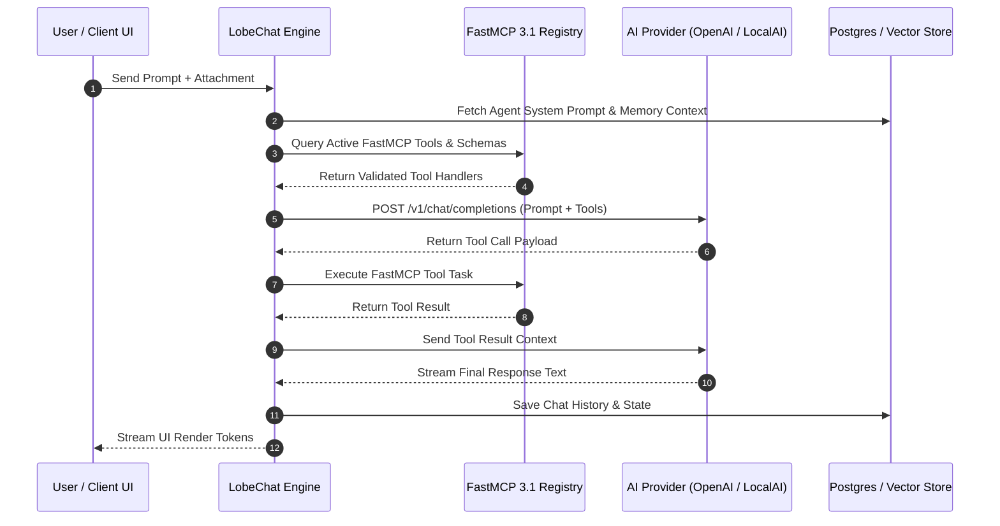

# LobeHub

## What it is
LobeHub (primarily known for LobeChat) is an open-source, high-performance multi-agent framework, plugin runtime, and UI platform designed for the early 2027 agentic ecosystem. It provides an intuitive interface for interacting with various AI models (Claude 5.6, GPT-5.6, Llama 4, Gemma 4, Qwen 3.6 VL, DeepSeek-V4, and Gemini 4.0 Ultra) and serves as a centralized hub for **FastMCP 3.1** and **MCP 3.0 Task Protocol** integration.

## What problem it solves
Managing multiple disparate AI tools, API keys, local LLM endpoints (Ollama, LocalAI, ExLlamaV3), vector stores, and custom MCP tool servers quickly leads to a fragmented developer experience. Users are forced to switch between isolated web UIs, terminal interfaces, and desktop applications.

LobeHub eliminates interface fragmentation by serving as a unified "Agentic Workbench." It consolidates local and cloud inference, provides dynamic RAG document vector search, supports full-duplex WebRTC voice interaction, and simplifies tool orchestration through a built-in FastMCP 3.1 server manager.

## Where it fits in the stack
**Category**: AI Assistants & Knowledge / Multi-Agent Platform & Workbench UI.

```
+-----------------------------------------------------------------------+
|                         User / Developer                              |
|          (Web Client, Mobile PWA, Desktop App, Voice UI)              |
+-----------------------------------------------------------------------+
                                   |
                                   v
+-----------------------------------------------------------------------+
|                          LobeHub / LobeChat                           |
|  +---------------------------+     +-------------------------------+  |
|  | Multi-Agent Orchestrator  |     | FastMCP 3.1 Server Manager    |  |
|  +---------------------------+     +-------------------------------+  |
|                |                                   |                  |
|                v                                   v                  |
|  +-----------------------------------------------------------------+  |
|  |     Unified Provider Gateway (OpenAI, Anthropic, Ollama)       |  |
|  +-----------------------------------------------------------------+  |
+-----------------------------------------------------------------------+
        |                  |                   |                  |
        v                  v                   v                  v
+---------------+  +---------------+  +----------------+  +-------------+
|   Claude 5.6  |  |    GPT-5.6    |  | Gemini 4.0 Ultra|  |  LocalAI/   |
|  (Anthropic)  |  |   (OpenAI)    |  |    (Google)    |  |   Ollama    |
+---------------+  +---------------+  +----------------+  +-------------+
```

Sitting at the top of the software stack as the primary interaction gateway, LobeHub coordinates user sessions, agent execution loops, MCP tool calls, and local database state.

## System Architecture & Sequence Flow
The diagram below illustrates how LobeChat handles a multi-agent user prompt, routes tool discovery through FastMCP 3.1, calls an LLM backend, and returns structured results.



## Typical use cases
- **Multi-Agent Coding Teams**: Configuring specialized sub-agents (e.g. Frontend Specialist, Security Auditor, DB Architect) to collaborate on repository refactoring.
- **Enterprise RAG Knowledge Gateways**: Deploying a self-hosted corporate portal with document uploads, semantic vector search, and role-based access control.
- **Local-First AI Testing**: Evaluating local open-weights models (Gemma 4, DeepSeek-V4) via Ollama or LocalAI before deploying to public production APIs.
- **FastMCP Tool Ecosystem Management**: Using LobeChat as a graphical testing environment for newly authored FastMCP 3.1 tool servers.

## Strengths
- **Native FastMCP 3.1 Integration**: Seamlessly registers, manages, and executes tool calls against any MCP-compliant server.
- **Multi-Modal WebRTC Voice & Vision**: Supports continuous full-duplex speech and vision streaming.
- **Extensive Plugin Marketplace**: Instant access to thousands of pre-configured community agents, prompts, and tool sets.
- **Flexible Self-Hosting**: Supports simple client-only local storage deployments as well as enterprise database-backed (Postgres + Redis + S3) deployments.

## Limitations
- **Deployment Complexity**: Setting up the full database-backed enterprise instance (LobeChat DB) requires configuring PostgreSQL, Redis, and S3-compatible storage.
- **Resource Usage**: Hosting multiple real-time agents with active vector stores and voice streaming requires adequate host memory and bandwidth.

## When to use it
- When seeking a modern, open-source workbench supporting frontier models and FastMCP 3.1.
- When organizing team workflows into specialized agent personas.
- When self-hosting requirements mandate that chat data and documents remain entirely on private servers.

## When not to use it
- When a lightweight terminal CLI is preferred over a full graphical workbench (use [Claude Code](../development_ops/claude-code.md)).
- When building visual drag-and-drop node workflows (use [Langflow](../frameworks/langflow.md)).

## Getting started

### Docker Setup (Client Mode)
Run LobeChat locally using Docker:

```bash
docker run -d -p 3210:3210 \
  -e OPENAI_API_KEY="sk-proj-xxxx" \
  -e ACCESS_CODE="lobe66" \
  --name lobe-chat \
  lobehub/lobe-chat
```

### Verification
Verify that the service is running and healthy:
```bash
curl -I http://localhost:3210/
```

## CLI examples

```bash
# Update LobeChat Docker image to latest version
docker pull lobehub/lobe-chat:latest && docker restart lobe-chat

# Inspect PostgreSQL database migrations (for DB-backed deployments)
docker exec -it lobe-chat-db psql -U lobe -d lobe_chat -c "SELECT version();"

# Launch local MCP Inspector for testing custom FastMCP 3.1 tools
npx @modelcontextprotocol/inspector lobe-mcp-config.json
```

## API examples

### FastMCP 3.1 Provider Configuration & Validation
The following Python script implements a **FastMCP 3.1** configuration tool that validates provider setup and dynamic model limits for LobeChat using **Pydantic v2**.

```python
from typing import Optional, List, Dict, Any
from pydantic import BaseModel, Field, field_validator
from fastmcp import FastMCP

# Initialize FastMCP 3.1 Server
mcp = FastMCP(
    name="LobeHub Config Engine",
    version="3.1.0",
    description="FastMCP server managing LobeHub agent and provider registration schemas"
)

class ModelParams(BaseModel):
    temperature: float = Field(default=0.7, ge=0.0, le=2.0)
    top_p: float = Field(default=1.0, ge=0.0, le=1.0)
    context_window: int = Field(default=128000, alias="contextWindow", ge=2048)
    use_mcp: bool = Field(default=True, alias="useMcp")

class ProviderRegistration(BaseModel):
    provider_id: str = Field(..., alias="providerId")
    model_name: str = Field(..., alias="modelName")
    api_base_url: Optional[str] = Field(None, alias="apiBaseUrl")
    params: ModelParams = Field(default_factory=ModelParams)

    @field_validator("provider_id")
    @classmethod
    def validate_provider(cls, v: str) -> str:
        allowed = {"openai", "anthropic", "google", "ollama", "localai", "deepseek"}
        if v.lower() not in allowed:
            raise ValueError(f"Provider '{v}' is not supported. Choose from {allowed}")
        return v.lower()

@mcp.tool(name="register_lobehub_provider", description="Validates and registers a new model provider configuration for LobeHub")
async def register_lobehub_provider(config_payload: Dict[str, Any]) -> Dict[str, Any]:
    # Validate payload using Pydantic v2
    reg = ProviderRegistration.model_validate(config_payload)

    return {
        "status": "registered",
        "provider": reg.provider_id,
        "model": reg.model_name,
        "config": reg.model_dump(by_alias=True)
    }

if __name__ == "__main__":
    mcp.run()
```

## Related tools / concepts
- [AnythingLLM](anythingllm.md) — RAG workspace and agent platform.
- [Open WebUI](../../services/open-webui.md) — Open-source LLM UI alternative.
- [LibreChat](librechat.md) — Enterprise multi-model chat UI.
- [Ollama](../../services/ollama.md) — Local model serving engine.
- [FastMCP 3.1](../automation_orchestration/mcp.md) — Agent tool integration standard.

## Sources / references
- [LobeHub Official Site](https://lobehub.com/)
- [LobeChat GitHub Repository](https://github.com/lobehub/lobe-chat)
- [FastMCP 3.1 Protocol Specification](https://modelcontextprotocol.io)

---
## Contribution Metadata
- Last reviewed: 2027-01-07
- Confidence: high
