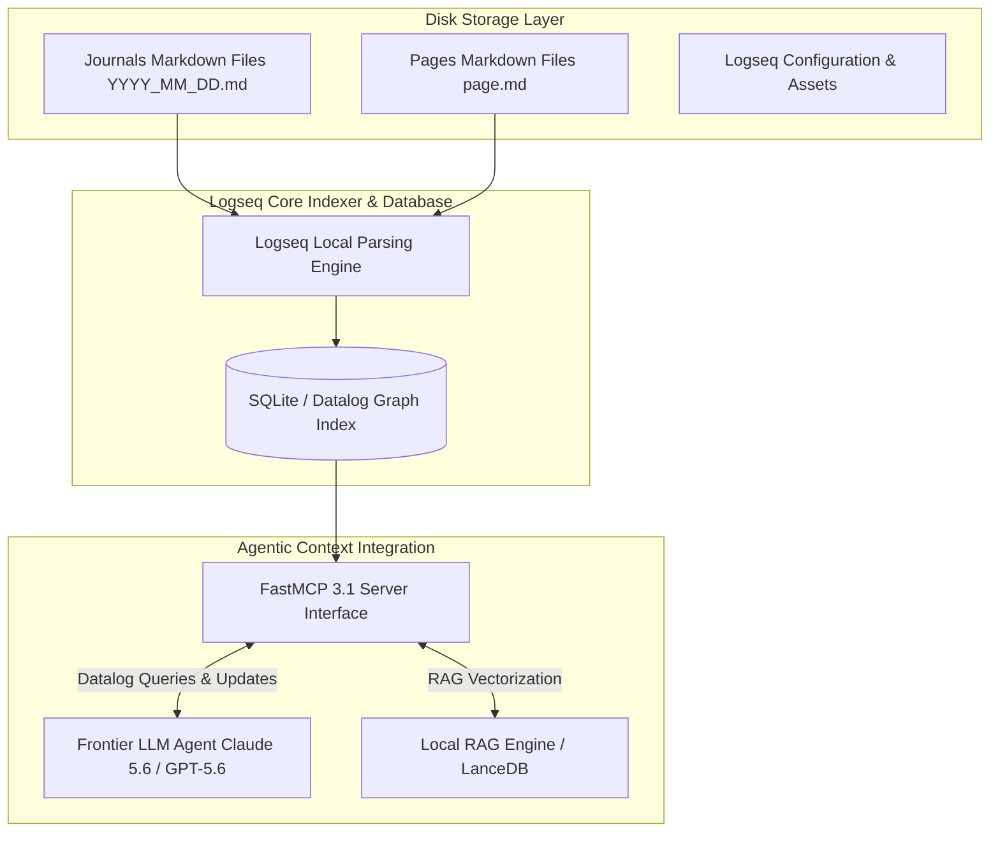

# Logseq

## What it is
Logseq is a privacy-first, open-source knowledge management and collaboration platform. It is a local-first application that treats information as a "knowledge graph" rather than a set of files, utilizing an outliner-based approach to capture and organize thoughts. As of early January 2027, Logseq is a cornerstone of privacy-first Personal Knowledge Management (PKM), offering high-performance SQLite database storage alongside local Markdown/Org-mode files, fully compatible with **FastMCP 3.1** (Model Context Protocol) for autonomous agent graph interaction.

## What problem it solves
Traditional note-taking apps force users into rigid, hierarchy-bound file systems. Logseq solves this by using bidirectional linking and block-level references, allowing users to build a non-linear network of ideas while retaining 100% data ownership via local plain-text files and high-speed local database indexes. This architecture prevents vendor lock-in and ensures private knowledge graphs remain accessible offline and to local or cloud-hosted AI agents.

## Where it fits in the stack
**AI & Knowledge** — serves as a privacy-focused knowledge intake and storage engine. Its block-level granularity makes it exceptionally well-suited for RAG (Retrieval-Augmented Generation) applications using models like **Claude 5.1**, **Claude 5.6**, **GPT-5.5**, **GPT-5.6**, or **Llama 4**, as agents can retrieve and cite precise bullet points rather than entire documents, minimizing context noise.

## Typical use cases
- **Daily Journaling**: Using the "Journals" page as the primary entry point for daily tasks, meeting records, and thoughts.
- **Agentic PKM**: Connecting Logseq to a [FastMCP 3.1](../automation_orchestration/mcp.md) server to allow **Claude 5.6** and **GPT-5.6** to query, index, and update notes securely.
- **Project Management**: Linking blocks to project master pages to build dynamic views across multi-date journal entries.
- **Academic & Technical Research**: Annotating PDFs and structuring block references into synthesis graphs.

## Key Features & Capabilities
- **Local-First & Offline Native**: All notes and graph relationships are stored directly on the local file system in standard Markdown or Org-mode formats.
- **Atomic Block-Level Granularity**: Every single bullet point is an atomic block with a unique UUID, allowing micro-referencing, block embed, and targeted context retrieval.
- **Bidirectional Page & Block Linking**: Automatic backlink tracking via `[[Page Name]]` tags and `((block-uuid))` references creates a dense semantic knowledge mesh.
- **FastMCP 3.1 Protocol Server**: Direct integration with Model Context Protocol servers enables autonomous multi-agent graph navigation and Datalog queries.
- **In-App PDF & Document Annotation**: Built-in PDF reader that supports highlight extraction directly into block-level citations.

## Architecture & Internal Mechanics

Logseq employs a hybrid architecture where flat Markdown files serve as the persistent source of truth on disk, while an embedded SQLite/Datalog database indexes the graph in memory for real-time querying.



### Retrieval & Query Flow
1. **Agent Request**: An AI agent requests relevant blocks for a topic using FastMCP 3.1.
2. **Datalog Query Execution**: The FastMCP server queries Logseq's local Datalog engine for blocks linked to target pages or keywords.
3. **Block Extraction**: Matches are returned with full UUID references and breadcrumb hierarchies.
4. **Context Injection**: The precise blocks are injected into the agent's prompt window without needing to pull the entire document.

## Strengths
- **Open Source**: Fully transparent codebase with an active developer community.
- **Privacy-First**: No mandatory cloud sync; all data resides locally on disk by default.
- **Atomic Granularity**: Block-level references allow micro-citations, making it ideal for LLM context retrieval.
- **FastMCP 3.1 Native**: Native integration with Model Context Protocol servers enables autonomous multi-agent graph navigation.
- **Version Control**: Built-in Git integration for local revision history and cross-machine syncing.

## Limitations
- **Learning Curve**: The outliner-only paradigm and Datalog query syntax require an initial adjustment period.
- **Performance at Scale**: Very large graphs (100k+ blocks) require high-speed NVMe storage when running complex Datalog queries.
- **Mobile Sync Overhead**: Syncing across mobile devices without Logseq Sync requires third-party mechanisms like Syncthing or Git.

## When to use it
- When you require a local-first knowledge graph that prioritizes semantic relationships over strict folder trees.
- When you need native Git integration for versioning and collaborative graph building.
- For atomic note-taking where every bullet point can serve as an indexed RAG chunk for frontier models like Gemini 4.0 Pro or Llama 4.

## When not to use it
- When you prefer traditional long-form document layout editors (consider [Obsidian](obsidian.md)).
- When real-time multi-user web-based document editing is mandatory (consider Google Docs or Microsoft Loop).
- For canvas-centric visual whiteboarding as the primary interface.

## Getting started

### Installation
Download Logseq for macOS, Linux, or Windows from the official site or package manager:
```bash
# macOS (Homebrew)
brew install --cask logseq
```

### Basic Workflow
1. Open Logseq and initialize a local folder as your "Graph."
2. Write daily notes in the **Journals** section (`YYYY_MM_DD.md`).
3. Link concepts using `[[Page Name]]`.
4. Reference specific blocks using `((block-uuid))`.

## CLI examples

### 1. Version Control with Git
If Git tracking is enabled, manage graph commits via CLI:
```bash
cd ~/my-logseq-graph
git status
git commit -m "Daily update $(date +%Y-%m-%d) via Home Admin Agent"
```

### 2. Batch Task Filtering
Query open tasks across journal files using standard utilities:
```bash
# Find all blocks containing "TODO" across journals
grep -r "TODO" ~/my-logseq-graph/journals/*.md
```

### 3. Querying Logseq FastMCP 3.1 Server
Invoke Logseq FastMCP tools via `mcp-cli`:
```bash
mcp call logseq-server search_blocks --query "Project Alpha" --mcp-version 3.1
```

### 4. Direct Datalog Graph Inspection
Execute Datalog queries against Logseq SQLite index:
```bash
sqlite3 ~/.logseq/graphs/default/db.sqlite "SELECT content FROM blocks WHERE content LIKE '%FastMCP%';"
```

## API examples

### FastMCP 3.1 Logseq Bridge Implementation (Python)
Expose Logseq graph querying as a FastMCP 3.1 tool for agentic workflows:

```python
import pathlib
import sqlite3
from fastmcp import FastMCP, Context

mcp = FastMCP("logseq-knowledge-graph", version="3.1.0")
GRAPH_DB_PATH = pathlib.Path.home() / ".logseq/graphs/default/db.sqlite"

@mcp.tool(description="Search Logseq blocks matching keyword query via Datalog SQLite index")
async def search_logseq_blocks(query_term: str, ctx: Context) -> list[dict]:
    """Retrieves Logseq atomic blocks matching the search term."""
    if not GRAPH_DB_PATH.exists():
        return [{"error": f"Logseq DB not found at {GRAPH_DB_PATH}"}]

    conn = sqlite3.connect(GRAPH_DB_PATH)
    cursor = conn.cursor()
    cursor.execute("SELECT uuid, content FROM blocks WHERE content LIKE ? LIMIT 20", (f"%{query_term}%",))
    rows = cursor.fetchall()
    conn.close()

    return [{"uuid": r[0], "content": r[1]} for r in rows]

if __name__ == "__main__":
    mcp.run()
```

### Python: Validating and Extracting Journal Blocks (Pydantic v2)
The following example demonstrates using **Pydantic v2** to parse and validate Logseq block data extracted from Markdown files:

```python
import pathlib
from typing import List, Optional
from pydantic import BaseModel, Field, field_validator, ConfigDict

class LogseqBlock(BaseModel):
    model_config = ConfigDict(extra="forbid", populate_by_name=True)

    block_id: Optional[str] = Field(default=None, description="UUID of the block if present")
    content: str = Field(..., description="Raw Markdown content of the block")
    is_todo: bool = Field(default=False)

    @field_validator("is_todo", mode="before")
    @classmethod
    def check_todo(cls, v: bool, info) -> bool:
        if isinstance(v, bool):
            return v
        return False

class JournalEntry(BaseModel):
    model_config = ConfigDict(extra="forbid", populate_by_name=True)

    date_str: str = Field(..., pattern=r"^\d{4}_\d{2}_\d{2}$")
    blocks: List[LogseqBlock] = Field(default_factory=list)

def parse_journal_file(file_path: pathlib.Path) -> JournalEntry:
    content = file_path.read_text(encoding="utf-8")
    lines = content.splitlines()
    blocks = []
    for line in lines:
        cleaned = line.strip()
        if cleaned:
            blocks.append(LogseqBlock(
                content=cleaned,
                is_todo="TODO" in cleaned
            ))

    date_part = file_path.stem
    return JournalEntry(date_str=date_part, blocks=blocks)

# Example execution
journal_path = pathlib.Path.home() / "Documents/logseq/journals/2027_01_07.md"
if journal_path.exists():
    entry = parse_journal_file(journal_path)
    print(f"Parsed journal {entry.date_str} with {len(entry.blocks)} blocks.")
    print(entry.model_dump())
```

## Production & Knowledge Management Best Practices
- **Atomic Block Writing**: Keep individual bullet points self-contained with minimal context dependencies to ensure high-precision vector embeddings for RAG retrieval.
- **Consistent Namespace Hierarchies**: Use namespaces like `[[Projects/Alpha]]` and `[[Meeting/2027-01-07]]` to build implicit taxonomy trees across unstructured journal notes.
- **Git Backup Hooks**: Implement automated `post-commit` Git hooks that push local graph changes to a private remote repository or encrypted NAS volume at regular intervals.
- **Read-Only Agent Permissions**: Grant FastMCP servers read-only access to master knowledge graphs, directing agent write operations to an isolated `[[Inbox/Agent-Staging]]` page for human review.

## Related tools / concepts
- [Obsidian](obsidian.md) - Non-outliner local Markdown knowledge base alternative.
- [Anytype](../intake_storage/anytype.md) - Local-first, object-oriented personal knowledge base.
- [SilverBullet](../intake_storage/silverbullet.md) - Extensible Markdown wiki system.
- [Ollama](../../services/ollama.md) - Host local LLMs for private Logseq AI plugins.
- [Model Context Protocol (MCP)](../automation_orchestration/mcp.md) - Protocol for AI-Logseq graph integration (FastMCP 3.1).
- [RAG Pattern](../../knowledge_base/patterns/rag-pattern.md) - Using Logseq blocks as precise retrieval sources.
- [Syncthing](../../services/syncthing.md) - Recommended open-source cross-device file synchronization.

## Sources / references
- [Logseq Official Site](https://logseq.com/)
- [Logseq GitHub Repository](https://github.com/logseq/logseq)
- [FastMCP Logseq Bridge Spec](https://github.com/logseq/mcp-server-logseq)

## Contribution Metadata
- Last reviewed: 2027-01-07
- Confidence: high
