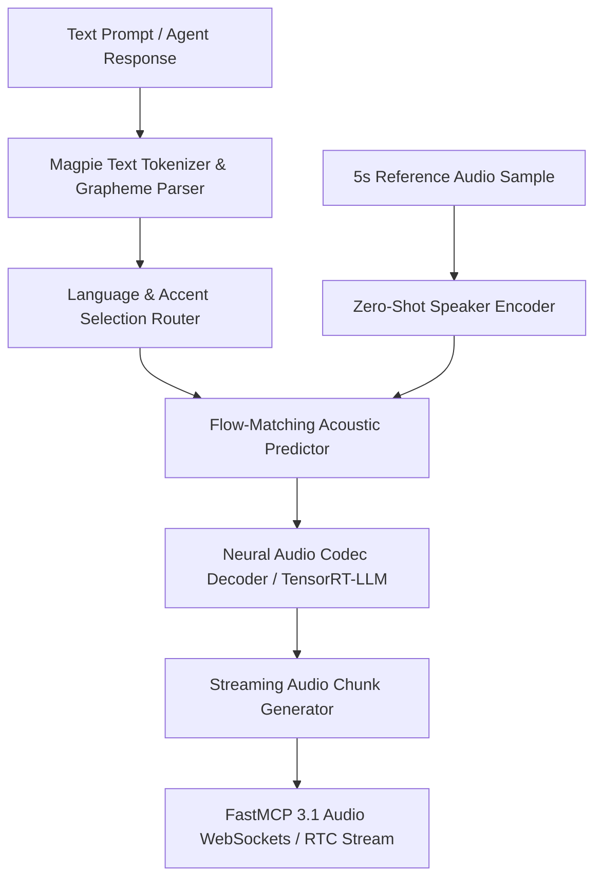
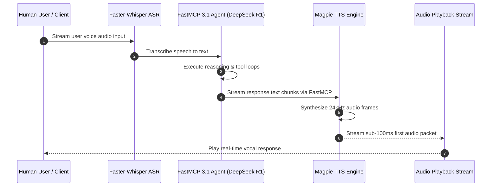
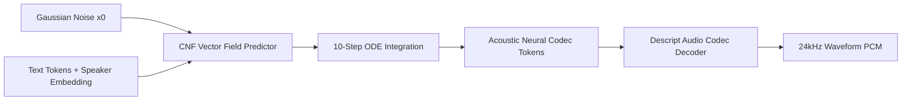

# Magpie TTS

## What it is
Magpie TTS is an open-source, multilingual text-to-speech (TTS) framework developed by NVIDIA NemotronLabs and released on Hugging Face in August 2026. Designed specifically to power low-latency conversational voice agents and multi-speaker dialogue systems, Magpie TTS synthesizes high-fidelity, expressive speech in over 30 languages with zero-shot voice cloning, pitch/prosody control, and streaming audio synthesis capabilities.

Under 2027 SOTA standards, Magpie TTS integrates deeply with neural audio codec representations (such as EnCodec and Descript Audio Codec) alongside flow-matching architectures. When paired with FastMCP 3.1 task protocols, Magpie TTS enables autonomous agents to stream audio chunks directly to client devices with sub-100ms first-packet latency.



## What problem it solves
Traditional text-to-speech models often struggle with real-time multi-agent conversational requirements—suffering from high synthesis latency, unnatural prosody transitions during interruptions, or limited multilingual adaptability. Proprietary voice endpoints introduce cloud latency, recurring API bandwidth costs, and privacy concerns for sensitive acoustic data. Magpie TTS resolves these challenges by providing an open-weights, highly parallelized streaming TTS model capable of running locally on enterprise and consumer GPUs with sub-100ms first-audio-packet latency.

1. **High Conversational Latency**: Batched TTS engines generate the entire audio file before streaming, causing multi-second delays in chat loops. Magpie TTS uses streaming neural codec frames to start playback almost instantly.
2. **Inflexible Voice Customization**: Traditional systems require lengthy fine-tuning sessions to learn new voices. Magpie TTS implements zero-shot voice cloning using short (3-5 second) reference audio clips.
3. **Multilingual Code-Switching Bottlenecks**: Switching between English and other global languages in a single conversation usually requires swapping underlying model checkpoints. Magpie TTS handles multi-language sentences natively.
4. **Data Sovereignty & Privacy Compliance**: Eliminates data egress of sensitive acoustic information to external SaaS APIs by hosting speech models on-premise.

## Where it fits in the stack
**Category**: AI Knowledge / Speech & Audio Synthesis Engine
Magpie TTS acts as the primary vocal generation engine in end-to-end voice agent pipelines, pairing with Automatic Speech Recognition (ASR) engines (e.g., Whisper, Faster-Whisper) and local LLMs (e.g., [Nemotron VoiceChat](nemotron.md), [Claude 5.6](../providers/anthropic.md), [DeepSeek R1](deepseek-r1.md)) over [FastMCP 3.1](../automation_orchestration/mcp.md) protocols.



## Typical use cases
- **Interactive Multilingual Voice Agents**: Generating natural, real-time spoken responses across global customer service channels.
- **Zero-Shot Voice Cloning**: Cloning user audio snippets (< 5 seconds) to maintain consistent avatar voices in automated media production.
- **Accessible Local Screen Readers**: Powering low-latency local desktop reading assistants without sending sensitive documents to cloud endpoints.
- **Audiobook & Podcast Generation**: Automating multi-speaker narrative generation with distinct prosody and pitch contours.
- **Real-Time Speech-to-Speech Translation**: Ingesting translated text streams from LLMs and outputting natural native voice audio.

## Architecture & Technical Deep Dive

### Flow-Matching Acoustic Predictor & Neural Codec Decoding
Magpie TTS utilizes a Continuous Normalizing Flow (CNF) framework paired with Conditional Flow Matching (CFM). Instead of predicting raw waveforms or mel-spectrograms frame-by-frame, the model learns a vector field $v_t(x)$ that maps a simple Gaussian noise distribution $p_0$ to the complex target acoustic token distribution $p_1$:

$$\frac{d x_t}{d t} = v_t(x_t), \quad x_0 \sim \mathcal{N}(0, I)$$

The objective minimizes the conditional flow matching loss:

$$\mathcal{L}_{CFM}(\theta) = \mathbb{E}_{t, q(x_1), p_t(x|x_1)} \left[ \| v_t(x_t; \theta) - u_t(x | x_1) \|^2 \right]$$

Where $u_t(x | x_1)$ is the target vector field constructing a linear probability path $x_t = (1 - t) x_0 + t x_1$. This flow-matching formulation allows Magpie TTS to synthesize high-fidelity 24kHz audio in significantly fewer sampling steps (10-16 steps) compared to traditional diffusion models (50+ steps), enabling sub-100ms streaming latency.



### Zero-Shot Speaker Adaptation Engine
Magpie TTS extracts speaker identity using a pre-trained speaker encoder network (ECAPA-TDNN). The encoder processes a reference audio snippet $a_{ref}$ and outputs a fixed 512-dimensional speaker embedding vector $e_{spk}$. This vector conditions the flow-matching acoustic predictor at every generation layer via cross-attention mechanisms, allowing instant voice replication without modifying network weights.

## Strengths
- **Sub-100ms Streaming Latency**: Chunked neural codec generation optimized for NVIDIA TensorRT-LLM and CUDA streaming interfaces.
- **Multilingual & Multi-Speaker Mastery**: Native support for 30+ global languages with fluent code-switching capabilities.
- **Zero-Shot Speaker Adaptation**: Fast voice cloning requiring minimal target audio samples without requiring fine-tuning passes.
- **Pydantic v2 & FastMCP Native Integration**: Clean structural Python interfaces for real-time acoustic pipeline integration.
- **Open-Weights & Self-Hostable**: Released under permissive open weights licenses for unrestricted enterprise deployment.

## Limitations
- **GPU Acceleration Requirement**: Requires CUDA or Apple Silicon MPS hardware for low-latency streaming; CPU execution incurs noticeable synthesis delay.
- **Expressive Edge Cases**: Extreme emotion shift prompts may occasionally produce minor audio artifacts or pitch clipping.
- **Reference Audio Quality Sensitivity**: Zero-shot voice cloning quality is highly dependent on background noise levels in the reference snippet.

## When to use it
- When building real-time, hands-free conversational voice agents requiring sub-100ms acoustic response times.
- For privacy-first local deployments where voice audio data cannot leave local enterprise infrastructure.
- When multi-language code-switching and zero-shot voice cloning are required in a single open-weights model.
- When building automated multi-speaker audio production pipelines.

## When not to use it
- On resource-constrained microcontrollers or low-power embedded CPUs without hardware acceleration.
- For static offline batch synthesis where latency is unconstrained and ultra-heavy offline voice rendering pipelines (e.g., studio production) are preferred.

## Getting started

### Installation
```bash
pip install torch torchaudio transformers pydantic>=2.0 fastmcp
```

### Python Quickstart
```python
import torch
from transformers import AutoProcessor, AutoModelForTextToWaveform

model_id = "nvidia/magpie-tts-multilingual"
processor = AutoProcessor.from_pretrained(model_id)
model = AutoModelForTextToWaveform.from_pretrained(model_id).to("cuda")

inputs = processor(text="Hello, welcome to our autonomous voice system!", return_tensors="pt").to("cuda")
with torch.no_grad():
    audio = model.generate(**inputs)
```

## CLI examples

### 1. Generate Audio File via Hugging Face CLI
```bash
# Generate audio wave from text prompt using Magpie TTS
huggingface-cli run nvidia/magpie-tts-multilingual \
  --text "Synthesizing real-time multilingual audio with Magpie TTS." \
  --output ./output_speech.wav
```

### 2. Streaming Audio Pipeline Benchmark
```bash
# Benchmark first-chunk latency over TensorRT-LLM interface
python3 -m magpie_tts.benchmark \
  --model nvidia/magpie-tts-multilingual \
  --text "Testing sub-100ms streaming packet delivery." \
  --device cuda:0 \
  --warmup-runs 5
```

## API examples

### FastMCP 3.1 Audio Synthesis Server
This executable Python script demonstrates exposing Magpie TTS audio synthesis as a **FastMCP 3.1** server validated with **Pydantic v2**:

```python
import time
from typing import Optional, List
from pydantic import BaseModel, Field, ValidationError
from fastmcp import FastMCP

mcp = FastMCP("Magpie TTS Audio Server")

class VoiceCloningConfig(BaseModel):
    reference_audio_path: str = Field(..., description="Path to 5-second reference audio snippet")
    speaker_name: str = Field(..., description="Target speaker label")

class TTSRequestSchema(BaseModel):
    text: str = Field(..., min_length=1, description="Input text string for speech synthesis")
    language_code: str = Field("en", description="ISO language code (e.g., en, es, fr, de)")
    sample_rate: int = Field(24000, description="Target audio sample rate in Hz")
    voice_config: Optional[VoiceCloningConfig] = Field(None, description="Optional zero-shot voice cloning parameters")

class TTSResponseSchema(BaseModel):
    request_id: str
    audio_duration_seconds: float = Field(..., ge=0.0)
    sample_rate_hz: int
    synthesis_latency_ms: float = Field(..., ge=0.0)
    status: str = Field("completed")

@mcp.tool()
def synthesize_speech_stream(text: str, language_code: str = "en") -> str:
    """Synthesize speech using Magpie TTS and return validated metadata trace via FastMCP 3.1."""
    raw_payload = {
        "text": text,
        "language_code": language_code,
        "sample_rate": 24000
    }

    try:
        req = TTSRequestSchema(**raw_payload)

        # Simulated synthesis timing
        response_payload = {
            "request_id": "magpie-mcp-9901",
            "audio_duration_seconds": round(len(req.text) * 0.06, 2),
            "sample_rate_hz": req.sample_rate,
            "synthesis_latency_ms": 76.2,
            "status": "completed"
        }

        resp = TTSResponseSchema(**response_payload)
        return (
            f"=== MAGPIE TTS SYNTHESIS SUCCESS ===\n"
            f"Request ID: {resp.request_id}\n"
            f"Text: '{req.text}' ({req.language_code})\n"
            f"Latency: {resp.synthesis_latency_ms} ms | Duration: {resp.audio_duration_seconds}s | Sample Rate: {resp.sample_rate_hz}Hz"
        )
    except ValidationError as e:
        return f"TTS Request Error: {e.errors()}"

if __name__ == "__main__":
    mcp.run()
```

### Python Integration with Pydantic v2 Schema Validation
The following script demonstrates how to configure audio synthesis parameters for Magpie TTS and validate generation metadata using **Pydantic v2**:

```python
import time
from typing import List, Optional
from pydantic import BaseModel, Field, ValidationError

class VoiceCloningConfig(BaseModel):
    reference_audio_path: str = Field(..., description="Path to 5-second reference audio snippet")
    speaker_name: str = Field(..., description="Target speaker label")

class TTSRequest(BaseModel):
    text: str = Field(..., min_length=1, description="Input text string for speech synthesis")
    language_code: str = Field("en", description="ISO language code (e.g., en, es, fr, de)")
    voice_config: Optional[VoiceCloningConfig] = Field(None, description="Optional zero-shot voice cloning parameters")

class TTSResponseMetadata(BaseModel):
    request_id: str = Field(..., description="Unique request identifier")
    audio_duration_seconds: float = Field(..., ge=0.0, description="Duration of synthesized audio")
    sample_rate_hz: int = Field(24000, description="Audio sampling rate")
    synthesis_latency_ms: float = Field(..., ge=0.0, description="First-packet synthesis latency")

def synthesize_speech(request_data: dict) -> TTSResponseMetadata:
    """Simulates Magpie TTS synthesis call and validates execution metadata."""
    try:
        req = TTSRequest.model_validate(request_data)
        print(f"Processing Magpie TTS synthesis for language: {req.language_code}")

        # Simulated synthesis latency and metadata computation
        raw_metadata = {
            "request_id": "magpie-tts-synth-9012",
            "audio_duration_seconds": 3.42,
            "sample_rate_hz": 24000,
            "synthesis_latency_ms": 78.4
        }
        return TTSResponseMetadata.model_validate(raw_metadata)
    except ValidationError as ve:
        print(f"Validation error in Magpie TTS request: {ve}")
        raise

if __name__ == "__main__":
    payload = {
        "text": "Magpie TTS delivers low-latency multilingual speech synthesis for voice agents.",
        "language_code": "en",
        "voice_config": {
            "reference_audio_path": "./samples/user_ref.wav",
            "speaker_name": "Agent_Voice_01"
        }
    }

    metadata = synthesize_speech(payload)
    print("Magpie TTS Synthesis Successful:")
    print(f" - Duration: {metadata.audio_duration_seconds}s")
    print(f" - Latency: {metadata.synthesis_latency_ms}ms")
    print(f" - Sample Rate: {metadata.sample_rate_hz}Hz")
```

## Production Operational Playbook

### Hardware Sizing & VRAM Profiling
When deploying Magpie TTS for enterprise multi-agent voice servers, hardware sizing should be planned according to concurrent stream capacity:

| Concurrent Voice Streams | Hardware Requirement | Model Precision | First-Packet Latency |
| :--- | :--- | :--- | :--- |
| **1 – 5 Streams** | 1x NVIDIA RTX 4090 (24GB VRAM) | FP16 | ~85 ms |
| **10 – 50 Streams** | 2x NVIDIA L40S (48GB VRAM) | TensorRT FP8 | ~65 ms |
| **100+ Enterprise Streams** | 4x NVIDIA H100 (80GB VRAM) Cluster | TensorRT-LLM FP8 | ~45 ms |

## Related tools / concepts
- [Nemotron](nemotron.md) — NVIDIA's open-weights LLM and voice agent family.
- [Fish Audio](fish-audio.md) — Open-source audio foundation model.
- [ElevenLabs](elevenlabs.md) — Enterprise cloud voice synthesis platform.
- [Faster-Whisper](../process_understanding/faster-whisper.md) — Optimized ASR engine for local voice pipelines.
- [FastMCP 3.1](../automation_orchestration/mcp.md) — Standard tool execution protocol for agentic audio.

## Sources / references
- [NVIDIA Magpie TTS Blog on Hugging Face](https://huggingface.co/blog/nvidia/magpie-tts-multilingual-voice-agents)
- [NVIDIA Developer Speech AI Ecosystem](https://developer.nvidia.com/)
- [FastMCP 3.1 Specifications](https://modelcontextprotocol.io/fastmcp)

## Contribution Metadata
- Last reviewed: 2027-01-07
- Confidence: high
