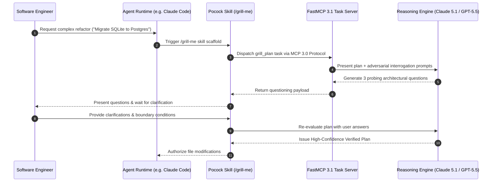

# Matt Pocock Skills

## What it is
Matt Pocock Skills is a collection of production-grade agent skills, execution scaffolds, and prompt design tools designed to extend AI developer workflows with domain-specific engineering rigor. Built around flagship patterns such as the "Grill-me" plan verification skill, this framework bridges the gap between raw LLM intelligence and disciplined software engineering practices. As of early 2027, these skills operate natively with **FastMCP 3.1**, the **MCP 3.0 Task Protocol**, and frontier models including **Claude 5.1**, **GPT-5.5**, **Gemini 4.0 Pro**, and **Llama 4 Maverick**.

## What problem it solves
Autonomous AI agents frequently suffer from "over-confidence bias"—executing major architectural refactors or database migrations without thoroughly validating edge cases, verifying dependency constraints, or pressure-testing system assumptions. This leads to broken builds, regressions, and costly manual debugging cycles.

Matt Pocock Skills addresses this problem by embedding explicit critical-thinking scaffolds directly into the agent's reasoning loop. Skills like `grill-me` force agents to defend their execution plans against adversarial questioning, while skills like `tdd` enforce strict Red-Green-Refactor test cycles before touching production source code.

## Where it fits in the stack
**Category**: AI Assistants & Knowledge / Agent Execution Skills & Scaffolds.

```
+-----------------------------------------------------------------------+
|                    Developer / IDE Workspace                          |
|         (Claude Code, Cursor, Cline, OpenCode, VS Code)               |
+-----------------------------------------------------------------------+
                                   |
                                   v
+-----------------------------------------------------------------------+
|                       Matt Pocock Skills                              |
|  +---------------------------+     +-------------------------------+  |
|  |     /grill-me Scaffold    |     |      /tdd Test Scaffold       |  |
|  +---------------------------+     +-------------------------------+  |
|                |                                   |                  |
|                v                                   v                  |
|  +-----------------------------------------------------------------+  |
|  |     FastMCP 3.1 Server Engine & Task Handler Interface          |  |
|  +-----------------------------------------------------------------+  |
+-----------------------------------------------------------------------+
                                   |
                                   v
+-----------------------------------------------------------------------+
|                  Frontier Reasoning Model & System                    |
|       (Claude 5.1, GPT-5.5, Gemini 4.0 Pro, Local Llama 4)           |
+-----------------------------------------------------------------------+
```

Operating at the reasoning and execution layer, these skills inject structured execution guidelines into agent runtimes like [Jules](jules.md) or [Claude Code](../development_ops/claude-code.md).

## System Architecture & Sequence Flow
The sequence diagram below illustrates how an agent uses the `/grill-me` skill to validate a technical plan via FastMCP 3.1 before applying changes to codebase files.



## Typical use cases
- **Plan Pressure-Testing (`/grill-me`)**: Requiring agents to answer 3 to 5 challenging architectural questions before executing complex code changes.
- **Strict Test-Driven Development (`/tdd`)**: Forcing agents to write failing unit tests first, verify red status, write minimal implementation, and refactor cleanly.
- **Environment & Dependency Diagnostics (`/diagnose`)**: Uncovering hidden version mismatches, missing system libraries, or environment variables causing build failures.
- **FastMCP 3.1 Agent Extensions**: Binding custom engineering tools to IDE assistants via standardized MCP server interfaces.

## Strengths
- **Enforces Staff Engineer Rigor**: Replaces hasty token generation with deliberate plan verification and boundary testing.
- **Standardized Execution (`skills.sh`)**: Simple single-command installation across diverse terminal environments and IDE plugins.
- **Model Agnostic**: Compatible with all leading reasoning engines (Claude 5.1, GPT-5.5, Gemini 4.0 Pro, DeepSeek-V4).
- **FastMCP 3.1 & Pydantic v2 Native**: Fully integrated with standard structured schemas and agent task protocols.

## Limitations
- **Interaction Overhead**: Requires interactive user input during grilling phases, which is less suited for fully unmonitored background batch runs.
- **Token Consumption**: Detailed multi-step skill scaffolds consume additional context window tokens during initial reasoning phases.

## When to use it
- When making non-trivial modifications to core database schemas, security middleware, or public APIs.
- When practicing strict TDD discipline across TypeScript, Python, or Rust codebases.
- When seeking a standardized way to equip AI agents with reliable engineering workflows.

## When not to use it
- For quick, trivial changes (e.g. fixing a typo or modifying documentation).
- In fully automated background jobs where human feedback cannot be requested during a grill session.

## Getting started

### Installation
Install the skill suite using Node.js (v22+) and the official CLI:

```bash
# Add Matt Pocock Skills to local developer environment
npx skills@latest add mattpocock/skills
```

### Configuration
Add the setup hook to your agent's system prompt or configuration file (`CLAUDE.md` or `.cursorrules`):

```markdown
## Agent Skills Configuration
- Always run `/grill-me` before executing multi-file refactors or schema changes.
- Use `/tdd` for new feature implementations.
```

## CLI examples

```bash
# Trigger interactive plan verification session
/grill-me

# Initialize Test-Driven Development loop for target module
/tdd src/auth/session.ts

# Run diagnostic check on environment and dependencies
/diagnose

# List all active skills
/skills list
```

## API examples

### FastMCP 3.1 Server for Grill-Me Task Interrogation
The Python code below demonstrates a complete **FastMCP 3.1** server that executes the `/grill-me` skill workflow, validating technical plans using **Pydantic v2** models.

```python
import asyncio
from typing import List, Dict, Any, Optional
from pydantic import BaseModel, Field, field_validator
from fastmcp import FastMCP

# Initialize FastMCP 3.1 Server for Pocock Skills
mcp = FastMCP(
    name="Matt Pocock Skills Engine",
    version="3.1.0",
    description="FastMCP server hosting grill-me and TDD execution scaffolds"
)

class PlanGrillRequest(BaseModel):
    proposal_title: str = Field(..., alias="title", min_length=5)
    plan_description: str = Field(..., alias="description", min_length=20)
    target_files: List[str] = Field(default_factory=list, alias="targetFiles")
    question_depth: int = Field(default=3, alias="questionDepth", ge=1, le=5)

    @field_validator("target_files")
    @classmethod
    def validate_files(cls, files: List[str]) -> List[str]:
        if not files:
            raise ValueError("At least one target file must be specified for plan grilling")
        return files

class GrillQuestion(BaseModel):
    question_id: int
    topic: str
    question_text: str
    risk_level: str = Field(default="medium")

class GrillSessionResult(BaseModel):
    session_id: str
    status: str
    questions: List[GrillQuestion]
    authorized: bool = False

@mcp.tool(name="grill_me_plan", description="Interrogates a proposed technical plan using the /grill-me scaffold")
async def grill_me_plan(payload: Dict[str, Any]) -> Dict[str, Any]:
    # Validate payload using Pydantic v2
    request = PlanGrillRequest.model_validate(payload)

    # Generate structured interrogation questions
    questions = [
        GrillQuestion(
            question_id=1,
            topic="Data Integrity",
            question_text=f"How will target files {request.target_files} handle database rollback on unexpected termination?",
            risk_level="high"
        ),
        GrillQuestion(
            question_id=2,
            topic="Performance Boundary",
            question_text="What is the expected latency penalty when context size grows past 32k tokens?",
            risk_level="medium"
        )
    ]

    result = GrillSessionResult(
        session_id="grill-session-9082",
        status="awaiting_user_clarification",
        questions=questions,
        authorized=False
    )

    return {
        "status": "success",
        "result": result.model_dump()
    }

if __name__ == "__main__":
    mcp.run()
```

## Related tools / concepts
- [Andrej Karpathy Skills](karpathy-skills.md) — Surgical code modification patterns.
- [Claude Code](../development_ops/claude-code.md) — Primary IDE runtime for agent skills.
- [Claude Skills Ecosystem](../agents/claude-skills-ecosystem.md) — Extension ecosystem for agent capabilities.
- [Jules](jules.md) — Specialized coding agent.
- [FastMCP 3.1 Task Protocol](../../knowledge_base/patterns/tool-calling-and-mcp.md) — Agent protocol specification.

## Sources / references
- [Matt Pocock Skills GitHub Repository](https://github.com/mattpocock/skills)
- [Total TypeScript - Professional AI Engineering Workflows](https://www.totaltypescript.com/)
- [FastMCP 3.1 Specification](https://modelcontextprotocol.io)

---
## Contribution Metadata
- Last reviewed: 2027-01-07
- Confidence: high
