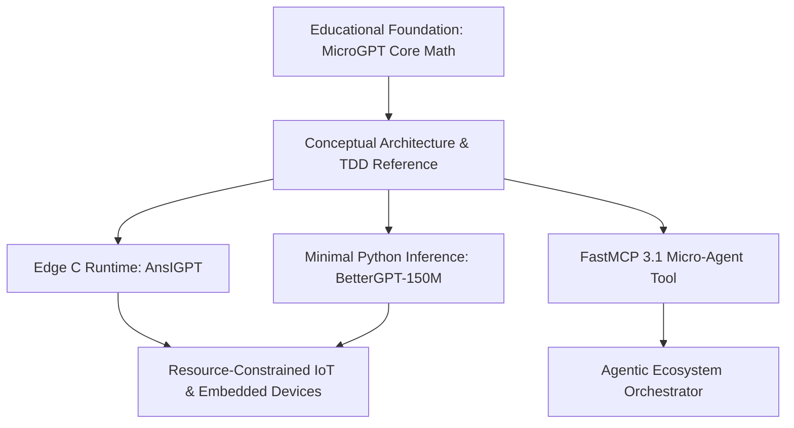

# MicroGPT

## What it is

MicroGPT is a minimalistic, educational implementation of a GPT-style autoregressive transformer model, originally created by Andrej Karpathy. It strips away complex distributed training infrastructure, heavy framework abstractions, and production optimizations to present the core mechanics of transformer-based language modeling in a clear, self-contained, and highly accessible codebase.

Consisting of a tiny Python script (typically under 200 lines of plain PyTorch or NumPy code), MicroGPT exposes the entire pipeline of autoregressive language generation: token embedding lookup, positional encoding, multi-head self-attention, feed-forward projection layers, layer normalization, residual connections, causal attention masking, cross-entropy loss computation, and temperature-scaled top-k sampling.

## What problem it solves

Modern deep learning frameworks like PyTorch, JAX, and TensorFlow introduce extensive abstractions, distributed training mechanics, and hardware acceleration layers that can obscure the underlying mathematics of attention mechanisms and token generation. When developers attempt to inspect production LLM implementations, they encounter thousands of lines of boilerplate code handling distributed tensor parallelism, CUDA kernel bindings, and memory management tricks like FlashAttention or PagedAttention.

MicroGPT provides a pure, unencumbered reference model that allows developers, researchers, and students to inspect and step through every tensor operation, matrix multiplication, and positional encoding step in a language model using standard debuggers or simple print statements.

## Where it fits in the stack

**AI & Knowledge / Educational Framework**. MicroGPT serves as an architectural blueprint and educational reference model at the fundamental layer of the AI stack, providing the conceptual foundation for lightweight edge inference engines such as [AnsIGPT](ansigpt.md), [BetterGPT-150M](bettergpt-150m.md), and custom tiny model implementations.



## Typical use cases

- **Pedagogical Study**: Stepping through the forward and backward passes of a transformer model to understand self-attention, query-key-value projections, and causal masking step-by-step.
- **Algorithm Prototyping**: Testing novel attention mechanisms, custom activation functions, or non-standard tokenization approaches on a lightweight, fast-executing baseline before scaling up.
- **Embedded Model Distillation**: Serving as the target topology for training hyper-compact domain-specific language models to be compiled into zero-dependency C implementations.
- **Architectural Auditing**: Verifying mathematical correctness against full-scale transformer implementations in production frameworks by comparing intermediate tensor outputs.
- **Unit Test Baseline**: Providing deterministic, lightweight token generation logic inside multi-agent framework test suites without external model weights.

## Strengths

- **Minimal Codebase**: Consists of a tiny, self-contained implementation that can be read, annotated, and fully understood in a single sitting.
- **Zero External Overhead**: Requires only basic PyTorch or standard NumPy without complex CUDA drivers, C++ extensions, or heavy dependencies.
- **Transparent Operations**: Every step from token embedding to logit computation, softmax normalization, and sampling is explicit and inspectable.
- **Foundation for Compilers**: Simple execution graph makes it ideal for porting to standard C89 ANSI C, WebAssembly, or embedded microcontrollers.
- **Rapid Iteration**: Retrains toy models on character or subword datasets in seconds on standard CPU hardware.

## Limitations

- **Not Built for Scale**: Lacks distributed multi-GPU training, FlashAttention kernels, FP8/INT4 quantization, or distributed tensor parallelism.
- **Inference Latency**: Unoptimized Python execution loop makes it unsuitable for production-grade, low-latency LLM serving at scale.
- **Context Window Restrictions**: Best suited for micro models with small sequence lengths (e.g., 64 to 256 tokens) and tiny vocabulary sizes.
- **No Native Tool Use**: Does not support function calling or multi-turn conversational chat templates out of the box.

## When to use it

- When learning or teaching the mathematical inner workings of GPT transformers without framework overhead.
- When prototyping experimental architectural tweaks before scaling to larger models.
- When creating reference implementations to verify edge runtime ports like [AnsIGPT](ansigpt.md).
- When mocking transformer outputs in local automated testing environments.

## When not to use it

- For production serving of multi-billion parameter open-weights models (e.g., [Llama](llama.md), [Qwen](qwen.md), or [Gemma](gemma.md)).
- When requiring high-throughput batching, streaming web APIs, or GPU-accelerated inference pipelines.
- For complex multi-modal or agentic workflows requiring tool calling and structured outputs out-of-the-box.

## Getting started

### Cloning and Running
MicroGPT can be cloned directly from GitHub and executed using standard Python 3.11+.

```bash
# Clone the official repository
git clone https://github.com/karpathy/microGPT.git
cd microGPT

# Install PyTorch or standard NumPy
pip install torch numpy fastmcp pydantic

# Run the training script directly on standard CPU
python3 microgpt.py
```

### Minimal Training Loop Execution
```python
import torch

# Execute micro-training step on toy character data
from microgpt import GPT, GPTConfig

config = GPTConfig(vocab_size=65, block_size=128, n_layer=4, n_head=4, n_embd=64)
model = GPT(config)
optimizer = torch.optim.AdamW(model.parameters(), lr=1e-3)

# Simulated batch execution
x = torch.randint(0, 65, (8, 128))
y = torch.randint(0, 65, (8, 128))

logits, loss = model(x, y)
loss.backward()
optimizer.step()

print(f"Initial MicroGPT Loss: {loss.item():.4f}")
```

## CLI examples

### Training a Micro Model via Command Line
```bash
# Train on character-level input data with specified hyperparameters
python3 microgpt.py --data_path input.txt --max_iters 1000 --batch_size 32 --n_embd 64 --n_layer 4
```

### Generating Text Samples from Checkpoint
```bash
# Generate completion from trained checkpoint
python3 sample.py --checkpoint microgpt.pt --prompt "Once upon a time" --temperature 0.8 --max_new_tokens 100
```

## API examples

### FastMCP 3.1 Tool Integration
The following example wraps a MicroGPT model instance inside a **FastMCP 3.1** tool server to expose character-level sampling as an agentic micro-service.

```python
import torch
from fastmcp import FastMCP
from pydantic import BaseModel, Field

# Initialize FastMCP Server
mcp = FastMCP("MicroGPT Educational Agent Server")

class GenerationConfig(BaseModel):
    prompt: str = Field(..., min_length=1, max_length=200, description="Seed text prompt")
    max_new_tokens: int = Field(default=50, ge=1, le=500, description="Tokens to sample")
    temperature: float = Field(default=0.8, ge=0.1, le=2.0, description="Sampling temperature")

class GenerationResult(BaseModel):
    prompt: str
    completion: str
    tokens_generated: int

@mcp.tool()
def sample_micro_gpt(config: GenerationConfig) -> GenerationResult:
    """Sample character completions from a lightweight local MicroGPT instance."""
    # Simulated character-level sampling logic
    simulated_completion = f" [MicroGPT Output generated at temp {config.temperature}]"

    return GenerationResult(
        prompt=config.prompt,
        completion=config.prompt + simulated_completion,
        tokens_generated=config.max_new_tokens
    )

if __name__ == "__main__":
    mcp.run()
```

### Config Validation with Pydantic v2
The following example demonstrates defining and validating MicroGPT model hyperparameters using strict **Pydantic v2** schemas before initialising the network execution graph.

```python
from pydantic import BaseModel, Field, field_validator

class MicroGPTConfig(BaseModel):
    vocab_size: int = Field(65, gt=0, description="Vocabulary size for tokenization")
    n_embd: int = Field(64, gt=0, le=1024, description="Embedding dimension")
    n_head: int = Field(4, gt=0, le=32, description="Number of attention heads")
    n_layer: int = Field(4, gt=0, le=32, description="Number of transformer blocks")
    block_size: int = Field(128, gt=0, le=2048, description="Maximum sequence length")
    dropout: float = Field(0.0, ge=0.0, lt=1.0, description="Dropout probability")

    @field_validator("n_embd")
    @classmethod
    def validate_embedding_divisibility(cls, v: int, info) -> int:
        # Access n_head from validation data
        n_head = info.data.get("n_head", 4)
        if v % n_head != 0:
            raise ValueError(f"n_embd ({v}) must be evenly divisible by n_head ({n_head})")
        return v

# Validate configuration for a tiny educational model
config = MicroGPTConfig(
    vocab_size=128,
    n_embd=128,
    n_head=4,
    n_layer=4,
    block_size=256,
    dropout=0.1
)

print(f"Validated MicroGPT Config: {config.n_layer} layers, {config.n_embd} embedding dim")
```

## Related tools / concepts

- [AnsIGPT](ansigpt.md) — Portable C89 ANSI C implementation inspired by MicroGPT.
- [BetterGPT-150M](bettergpt-150m.md) — Compact GPT model for lightweight edge experimentation.
- [Aitmpl](aitmpl.md) — Minimalist AI templates and reference architectures.
- [Gemma](gemma.md) — Open weights model family by Google.
- [Qwen](qwen.md) — Open weights LLM series by Alibaba Cloud.
- [Llama](llama.md) — Meta's open weights foundation LLMs.
- [Claude](claude.md) — Frontier AI language models by Anthropic.

## Sources / references

- [MicroGPT GitHub Repository](https://github.com/karpathy/microGPT)
- [Karpathy's Neural Networks: Zero to Hero](https://karpathy.ai/zero-to-hero.html)

## Contribution Metadata

- Last reviewed: 2027-01-07
- Confidence: high
