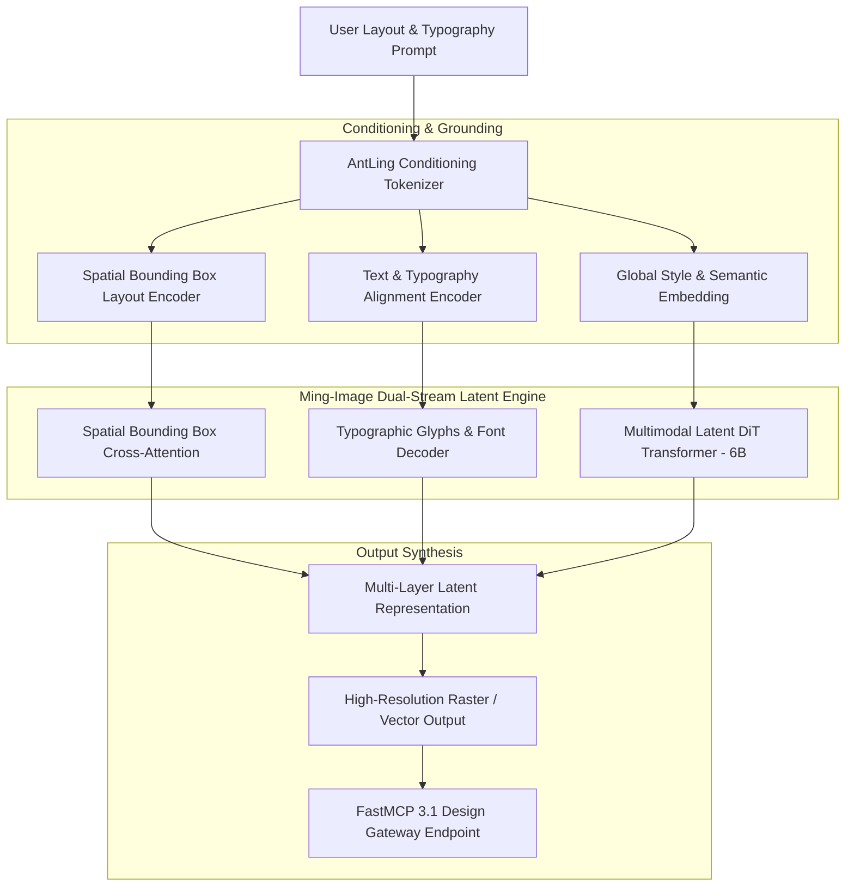
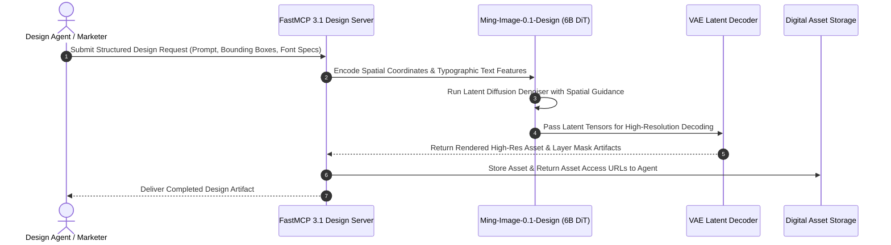

# Ming-Image-0.1-Design

## What it is
Ming-Image-0.1-Design is an open-sourced 6-billion parameter multimodal generative image architecture developed by AntLing. Designed specifically for design synthesis, structured graphic generation, typographic rendering, and multi-layer vector/raster compositing, Ming-Image bridges the gap between raw diffusion-based image generation and professional digital design workflows.

Operating in 2027, Ming-Image-0.1-Design utilizes a decoupled dual-stream latent architecture with explicit text-layout spatial grounding. Unlike traditional text-to-image models that treat image generation as an unconstrained pixel diffusion process, Ming-Image separates text typography, vector layout bounding boxes, and visual texture rendering into distinct conditioning layers. This allows engineers and designers to programmatically supply exact coordinate bounding boxes for UI components, posters, banners, and typographic elements while ensuring pristine visual coherence and photorealistic background blending.



## What problem it solves
- **Text & Typographic Garbling**: Standard diffusion models frequently fail at rendering long textual phrases, logos, or localized typography in graphic designs.
- **Lack of Spatial Bounding Box Control**: Prompt engineering alone cannot guarantee exact pixel placement of titles, subheadings, branding elements, and call-to-action buttons.
- **Monolithic Flattened Outputs**: Graphic designers require separate visual layers or structured component placement rather than flat, non-editable JPEG images.
- **High Compute Footprint for Fine-Tuning**: Heavy 30B+ image models are costly to deploy on local or edge infrastructure. Ming-Image's 6B parameter footprint delivers state-of-the-art layout quality while fitting comfortably within consumer and mid-tier enterprise GPU memory limits.

Ming-Image-0.1-Design addresses these challenges by incorporating explicit bounding-box coordinate embeddings, fine-grained text-glyph conditioning, and optimized FP8/INT8 quantized inference pipelines.

## Where it fits in the stack
**Category**: [AI Assistants & Knowledge](index.md) / Generative Image & Graphic Design Models.

Ming-Image-0.1-Design fits into automated creative asset pipelines, web-building agents, and automated marketing workflows:
- **Design Automation Layer**: Converts structured UI/UX component specs or JSON banner specifications into fully rendered graphic design layouts.
- **Agentic Generation Endpoint**: Serves as a generative asset tool for multi-agent workflows built on FastMCP 3.1.
- **Compositing & Asset Pipeline**: Feeds high-resolution banners, typography, and promotional assets directly into front-end design systems or digital asset management (DAM) platforms.



## Typical use cases
- **Automated Marketing Banner Generation**: Programmatically creating promotional banners for e-commerce catalog items with localized text and product placement.
- **UI/UX Mockup Generation**: Generating realistic app wireframes and website visual sections based on JSON structural layouts.
- **Localized Poster & Flyer Design**: Rendering multi-lingual promotional flyers where text layout and alignment are strictly constrained.
- **Brand Identity & Social Media Publishing**: Automatically generating social media post graphics conforming to strict brand color guidelines and component layouts.

## Strengths
- **Native Spatial Bounding Box Grounding**: Direct support for normalized bounding box coordinates `[x_min, y_min, x_max, y_max]` attached to specific text strings.
- **Compact 6B Parameter Size**: Highly efficient inference with low memory requirements; easily deployable on single GPUs with FP8/INT8 acceleration.
- **Superior Typographic Precision**: Renders clean, readable typography without character distortion or artifacting.
- **Open-Weight Availability**: Full open-weights access for self-hosting, fine-tuning, and enterprise local integration.

## Limitations
- **Not Designed for Photorealistic Portrayal of Complex 3D Anatomy**: Optimized for design synthesis, graphics, and layout rather than hyper-detailed anatomical photo generation.
- **Dataset Focus**: Initial pre-training weights favor modern digital graphic design, poster layouts, and UI/UX web styling.
- **Layout Overlap Conflicts**: Supplying conflicting or overlapping bounding boxes can sometimes result in text-clipping artifacts.

## When to use it
- When generating graphic designs, marketing banners, or web mockups requiring precise text placement.
- When building automated design agents that manipulate JSON layout payloads and require exact spatial rendering.
- When deploying local, open-weight image generation models on standard hardware without relying on closed proprietary APIs.

## When not to use it
- When requiring photorealistic human portraits or complex biological macro photography (use models like Flux or Midjourney).
- When generating complex 3D CAD models or architectural blueprints (use specialized CAD generation tools).

## Getting started

### 1. Installation
Install the Ming-Image python package along with torch and FastMCP 3.1:

```bash
pip install torch torchvision diffusers fastmcp pydantic
```

### 2. Environment Setup
Configure Hugging Face and GPU execution settings:

```bash
export MING_MODEL_PATH="antling/ming-image-0.1-design"
export CUDA_VISIBLE_DEVICES=0
```

### 3. Basic Python Inference
```python
from diffusers import DiffusionPipeline
import torch

pipe = DiffusionPipeline.from_pretrained(
    "antling/ming-image-0.1-design",
    torch_dtype=torch.float16
).to("cuda")

prompt = "A sleek modern tech poster for AI Summit 2027"
image = pipe(
    prompt,
    num_inference_steps=30,
    guidance_scale=7.5
).images[0]

image.save("ai_summit_2027.png")
```

## CLI examples

### Generating a Design with Bounding Boxes
Pass a JSON layout specification with explicit text coordinates:

```bash
ming-image-cli generate \
  --prompt "E-commerce summer sale banner with 50% OFF callout" \
  --layout-spec layout.json \
  --output-dir ./output_assets \
  --device cuda \
  --precision fp16
```

### Quantized Local Model Export
Export the 6B model to FP8 precision for minimal VRAM memory consumption:

```bash
ming-image-cli export-quantized \
  --model antling/ming-image-0.1-design \
  --format fp8 \
  --output ./ming_image_fp8.safetensors
```

## API examples

### FastMCP 3.1 Interactive Design Server
The following complete Python script establishes a **FastMCP 3.1** server that exposes Ming-Image-0.1-Design generation capabilities to AI agent orchestrators:

```python
import os
from typing import List, Dict, Any, Optional
from pydantic import BaseModel, Field
from fastmcp import FastMCP

mcp = FastMCP(
    "ming-image-design-server",
    instructions="FastMCP 3.1 server providing programmatic graphic design and image generation via Ming-Image-0.1-Design."
)

class BoundingBox(BaseModel):
    x_min: float = Field(..., ge=0.0, le=1.0, description="Normalized minimum X coordinate")
    y_min: float = Field(..., ge=0.0, le=1.0, description="Normalized minimum Y coordinate")
    x_max: float = Field(..., ge=0.0, le=1.0, description="Normalized maximum X coordinate")
    y_max: float = Field(..., ge=0.0, le=1.0, description="Normalized maximum Y coordinate")

class TextElement(BaseModel):
    content: str = Field(..., description="Text content to render in the graphic")
    bounding_box: BoundingBox
    font_style: Optional[str] = Field(default="sans-serif", description="Font family or style")

class DesignGenerationRequest(BaseModel):
    main_prompt: str = Field(..., description="Global visual prompt describing theme, color scheme, and mood")
    text_elements: List[TextElement] = Field(default_factory=list, description="List of spatially grounded text elements")
    aspect_ratio: str = Field(default="16:9", description="Target aspect ratio (16:9, 1:1, 9:16)")
    steps: int = Field(default=30, ge=10, le=100, description="Inference denoising steps")

class DesignGenerationResponse(BaseModel):
    status: str
    asset_id: str
    image_url: str
    dimensions: List[int]
    elements_rendered: int

@mcp.tool()
def generate_graphic_design(request: DesignGenerationRequest) -> Dict[str, Any]:
    """
    Generate a structured graphic design using Ming-Image-0.1-Design with spatial text grounding.
    """
    try:
        # Mock execution of Ming-Image 6B inference pipeline
        asset_id = f"ming-{hash(request.main_prompt) & 0xffffffff:08x}"
        width, height = (1920, 1080) if request.aspect_ratio == "16:9" else (1080, 1080)

        response = DesignGenerationResponse(
            status="success",
            asset_id=asset_id,
            image_url=f"https://cdn.internal.design/assets/{asset_id}.png",
            dimensions=[width, height],
            elements_rendered=len(request.text_elements)
        )
        return response.model_dump()
    except Exception as e:
        return {
            "status": "error",
            "message": str(e)
        }

if __name__ == "__main__":
    mcp.run()
```

### Pydantic v2 Layout & Render Schema
Validation schema for design generation requests:

```python
from typing import List, Optional
from pydantic import BaseModel, Field, ValidationError

class BrandPalette(BaseModel):
    primary_color: str = Field(..., pattern=r"^#[0-9a-fA-F]{6}$")
    secondary_color: str = Field(..., pattern=r"^#[0-9a-fA-F]{6}$")
    accent_color: Optional[str] = Field(default="#FF5733", pattern=r"^#[0-9a-fA-F]{6}$")

class DesignCanvasSpec(BaseModel):
    canvas_id: str = Field(..., description="Unique canvas identifier")
    project_title: str
    palette: BrandPalette
    width_px: int = Field(default=1920, ge=128, le=4096)
    height_px: int = Field(default=1080, ge=128, le=4096)

def validate_canvas_spec(payload: dict) -> DesignCanvasSpec:
    """
    Enforces strict Pydantic v2 validation over inbound layout payloads.
    """
    return DesignCanvasSpec.model_validate(payload)

if __name__ == "__main__":
    sample_data = {
        "canvas_id": "canvas-7890",
        "project_title": "Summer Tech Launch",
        "palette": {
            "primary_color": "#0F172A",
            "secondary_color": "#38BDF8",
            "accent_color": "#F43F5E"
        },
        "width_px": 1920,
        "height_px": 1080
    }
    spec = validate_canvas_spec(sample_data)
    print(f"Validated Spec: {spec.project_title} ({spec.width_px}x{spec.height_px})")
```

## Related tools / concepts
- [Unsloth Studio](../development_ops/unsloth-studio.md) — Fine-tuning studio for open LLMs and diffusion models.
- [Qwen Image](qwen-image.md) — High-performance image generation model family.
- [Stable Audio](../ai_knowledge/stable-audio.md) — Audio and media generation model architecture.
- [Model Context Protocol](https://modelcontextprotocol.io) — Open protocol for agentic integration.

## Sources / References
- [AntLing Ming-Image Announcement on Reddit](https://www.reddit.com/r/LocalLLaMA/comments/1wnipcz/new_6b_image_model_coming_antling_just_open/)
- [Diffusers Library Documentation](https://huggingface.co/docs/diffusers)
- [FastMCP Framework](https://github.com/jlowin/fastmcp)

---
## Contribution Metadata
- Last reviewed: 2027-01-07
- Confidence: high
