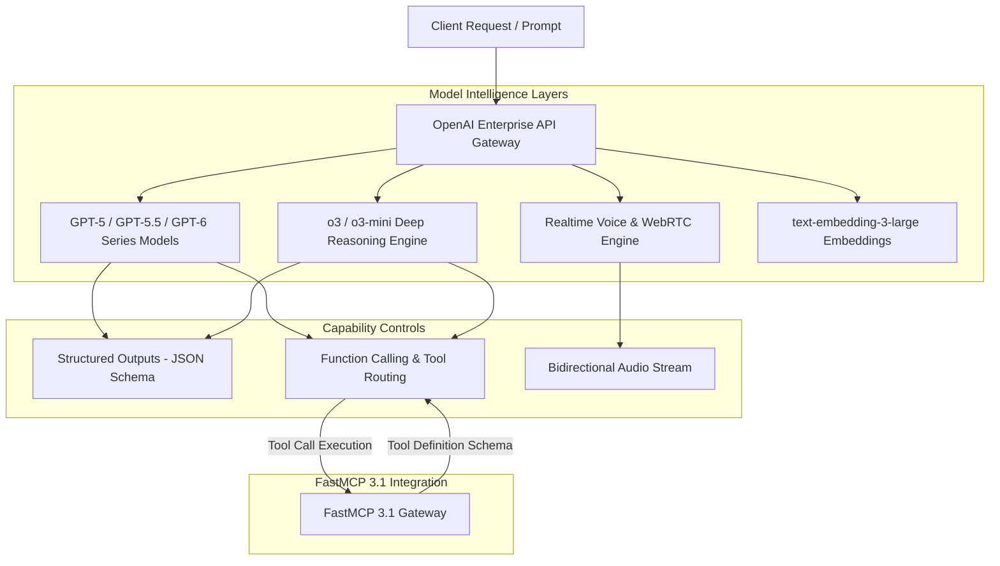
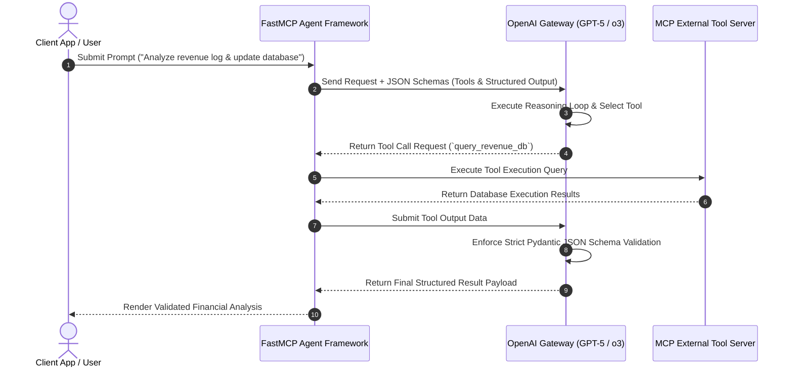

# OpenAI Platform & Models

## What it is
OpenAI is an artificial intelligence research deployment organization and platform provider powering frontier AI capabilities across multimodal text, vision, speech, code, and reasoning. Operating in early 2027, the platform offers model families including **GPT-5**, **GPT-5.5**, **GPT-6 Sol**, **GPT-6 Luna**, **GPT-6 Astra**, **o3**, **o3-mini**, and **o4**, alongside specialized speech models (Whisper-large-v3, tts-1-hd) and embeddings (text-embedding-3-large).

Through the OpenAI API, Enterprise endpoints, and Microsoft Azure OpenAI Service, developers access advanced features such as Structured Outputs (guaranteed JSON schema compliance), Realtime WebRTC voice streaming, automated Function Calling / Tool Use, Fine-Tuning, Batch Processing, and Assistants API primitives. OpenAI serves as a primary intelligence provider for enterprise automation, multi-agent frameworks, and FastMCP 3.1 ecosystems.



## What problem it solves
Developing sophisticated enterprise applications requires AI capabilities that go beyond raw text completions:
- **Unstructured Output Drift**: Legacy LLMs often return non-conforming JSON, causing runtime exceptions in downstream parsers.
- **Complex Step-by-Step Reasoning**: Standard auto-regressive models struggle with advanced mathematics, multi-file code refactoring, logic puzzles, and formal verification.
- **Latency & Cost Scalability**: Real-time voice agents require sub-300ms bidirectional latency, while offline batch analytics require cost-effective async processing.
- **Agentic Tool Coordination**: Multi-step agent workflows require robust, deterministic function execution and state tracking.

OpenAI addresses these requirements through native model-level reasoning controls (o3 search trees), strict schema enforcers (Structured Outputs using Pydantic v2 / JSON Schema), high-throughput Batch APIs (50% cost discount), and native WebRTC audio integration.

## Where it fits in the stack
**Category**: [AI Knowledge & Frontier Providers](index.md) / Model API & Reasoning Infrastructure.

OpenAI functions as the central cognitive foundation within enterprise software systems:
- **Reasoning Engine Layer**: Powers multi-agent software engineering frameworks (e.g. Claude Code, AgentKit), business intelligence pipelines, and automated coding agents.
- **Protocol & Integration Layer**: Exposes standardized APIs that connect with FastMCP 3.1 tool servers, vector databases (Qdrant, Pinecone, Pgvector), and orchestration frameworks (LangGraph, LlamaIndex).
- **Voice & Perception Layer**: Converts audio streams into structured semantic tool calls and back to natural speech using the Realtime API.



## Typical use cases
- **Complex Software Engineering & Logic**: Utilizing **o3** and **o3-mini** for deep repository-wide refactoring, formal verification, algorithm design, and automated debugging.
- **Enterprise Agentic Workflows**: Deploying **GPT-5** with FastMCP 3.1 tools to automate multi-system business tasks, CRM updates, and cloud infrastructure management.
- **Strict Data Extraction & RAG**: Extracting structured tables, entities, and JSON documents from unstructured PDFs using Structured Outputs with Pydantic v2 schemas.
- **Real-Time Interactive Voice Agents**: Building low-latency voice assistants for healthcare, support, and education using the Realtime WebRTC API.

## Strengths
- **Guaranteed Schema Enforcement**: Structured Outputs mode guarantees 100% adherence to supplied JSON Schemas, eliminating parsing failures.
- **Frontier Deep Reasoning**: The o3 model family sets state-of-the-art benchmarks in mathematics, competitive programming, and multi-step agent planning.
- **Comprehensive Multimodal API**: Single unified platform supporting vision, text, structured JSON, embeddings, and low-latency audio.
- **Enterprise Security & Scale**: Microsoft Azure OpenAI parity, SOC2 compliance, Zero Data Retention (ZDR) options, and dedicated throughput options (PTUs).

## Limitations
- **Closed Weights Architecture**: Models are accessible only via proprietary API endpoints; local self-hosting is not available (unlike Llama 3/Gemma).
- **Rate Limits & API Costs**: Frontier models (GPT-5, o3) incur premium per-token pricing compared to open-weight models hosted on local infrastructure.
- **Reasoning Latency Trade-Off**: Deep reasoning models (o3) consume additional reasoning tokens during processing, increasing time-to-first-token (TTFT).

## When to use it
- When your application requires state-of-the-art reasoning, coding, and mathematical capabilities.
- When 100% reliable, typed JSON response formatting is mandatory for production API pipelines.
- When building real-time voice agents over WebRTC requiring unified speech-to-speech processing.

## When not to use it
- When data privacy or air-gapped compliance mandates complete local processing without outbound internet access (use [Local LLMs](local_llms.md) or vLLM).
- For simple, low-complexity text classification tasks where lightweight open models (e.g. Gemma 3 / Qwen) are more cost-effective.
- When full model weight inspection or custom CUDA kernel modifications are required.

## Getting started

### 1. SDK Installation
Install the official OpenAI Python SDK alongside Pydantic v2 for structured data modeling:

```bash
pip install openai pydantic fastmcp
```

### 2. Setting API Credentials
Configure your environment variables with your OpenAI API key:

```bash
export OPENAI_API_KEY="sk-proj-109283019823019283019283019283"
export OPENAI_ORG_ID="org-enterprise9021"  # Optional
```

### 3. Basic Client Initialization
```python
from openai import OpenAI

client = OpenAI()

response = client.chat.completions.create(
    model="gpt-5",
    messages=[
        {"role": "system", "content": "You are an expert enterprise knowledge engineer."},
        {"role": "user", "content": "Explain the role of FastMCP 3.1 in modern agent stacks."}
    ]
)
print(response.choices[0].message.content)
```

## CLI examples

### Inspecting API Health and Models
List available models and inspect platform access:

```bash
# Query active models list via curl
curl https://api.openai.com/v1/models \
  -H "Authorization: Bearer $OPENAI_API_KEY"
```

### Submitting Batch Jobs via CLI
Submit asynchronous batch jobs for high-throughput, non-latency-sensitive workloads at a 50% discount:

```bash
# Create batch processing job from JSONL input file
curl https://api.openai.com/v1/batches \
  -H "Authorization: Bearer $OPENAI_API_KEY" \
  -H "Content-Type: application/json" \
  -d '{
    "input_file_id": "file-xyz123abc",
    "endpoint": "/v1/chat/completions",
    "completion_window": "24h"
  }'
```

## API examples

### FastMCP 3.1 Tool Gateway Integration
The following Python script implements a **FastMCP 3.1** server that uses OpenAI's reasoning and Structured Outputs capabilities to process enterprise data:

```python
import os
import json
from typing import List, Optional, Dict, Any
from pydantic import BaseModel, Field
from openai import OpenAI
from fastmcp import FastMCP

mcp = FastMCP(
    "openai-reasoning-server",
    instructions="FastMCP 3.1 server leveraging OpenAI GPT-5 and o3 for structured intelligence."
)

client = OpenAI(api_key=os.environ.get("OPENAI_API_KEY", "mock-key"))

class AnalysisRequestSpec(BaseModel):
    query: str = Field(..., description="User prompt or analytical request")
    reasoning_effort: str = Field(default="medium", description="Reasoning effort level: low, medium, high")
    max_tokens: int = Field(default=2000, description="Token budget cap")

class AnalysisResponseSpec(BaseModel):
    summary: str = Field(..., description="High-level answer summary")
    action_items: List[str] = Field(default_factory=list, description="Extracted actionable steps")
    confidence_score: float = Field(..., ge=0.0, le=1.0, description="Model confidence score")

@mcp.tool()
def analyze_with_o3(request: AnalysisRequestSpec) -> Dict[str, Any]:
    """
    Execute deep reasoning using the o3 model family and return structured analysis.
    """
    try:
        # Utilizing Structured Outputs parsing via beta parse API
        completion = client.beta.chat.completions.parse(
            model="o3-mini",
            messages=[
                {"role": "system", "content": "Perform rigorous logical analysis and return structured results."},
                {"role": "user", "content": request.query}
            ],
            response_format=AnalysisResponseSpec
        )

        parsed_result: AnalysisResponseSpec = completion.choices[0].message.parsed
        return {
            "status": "success",
            "data": parsed_result.model_dump()
        }
    except Exception as e:
        return {
            "status": "error",
            "message": str(e)
        }

if __name__ == "__main__":
    mcp.run()
```

### Production Structured Outputs with Pydantic v2
Enforce strict schema validation using **Pydantic v2** and OpenAI's `response_format` configuration:

```python
import json
from typing import List, Optional
from pydantic import BaseModel, Field, ValidationError
from openai import OpenAI

class SoftwareVulnerability(BaseModel):
    cve_id: str = Field(..., pattern=r"^CVE-\d{4}-\d{4,7}$", description="Valid CVE Identifier")
    severity: str = Field(..., description="Critical, High, Medium, or Low")
    description: str = Field(..., description="Technical summary of vulnerability")
    remediation: str = Field(..., description="Recommended fix or patch version")

class CodeSecurityAuditReport(BaseModel):
    repository_name: str = Field(..., description="Target repository name")
    audit_timestamp: str = Field(..., description="ISO 8601 audit timestamp")
    total_files_scanned: int = Field(..., ge=1)
    vulnerabilities: List[SoftwareVulnerability] = Field(default_factory=list)
    compliance_passed: bool = Field(..., description="True if no Critical/High vulnerabilities exist")

def run_code_security_audit(repo_name: str, code_diff: str) -> CodeSecurityAuditReport:
    """
    Analyzes code diffs using GPT-5 with guaranteed Pydantic v2 schema adherence.
    """
    client = OpenAI()

    completion = client.beta.chat.completions.parse(
        model="gpt-5",
        messages=[
            {
                "role": "system",
                "content": "You are an automated security auditor. Analyze code diffs and report vulnerabilities strictly adhering to the schema."
            },
            {
                "role": "user",
                "content": f"Repository: {repo_name}\n\nCode Diff:\n{code_diff}"
            }
        ],
        response_format=CodeSecurityAuditReport
    )

    return completion.choices[0].message.parsed

if __name__ == "__main__":
    sample_diff = """
    --- a/auth/login.py
    +++ b/auth/login.py
    @@ -10,3 +10,3 @@ def authenticate_user(username, password):
    -   query = f"SELECT * FROM users WHERE user='{username}' AND pass='{password}'"
    +   query = "SELECT * FROM users WHERE user=%s AND pass=%s"
    """

    try:
        # Mock execution demonstration
        print("Executing OpenAI Pydantic v2 Structured Audit pipeline...")
        # report = run_code_security_audit("enterprise-auth", sample_diff)
        # print(f"Audit Status: Passed={report.compliance_passed}")
    except ValidationError as e:
        print(f"Validation Failure:\n{e.json(indent=2)}")
```

## Model Matrix & Capability Comparison

| Model | Target Workloads | Context Window | Max Output Tokens | Key Capabilities |
| :--- | :--- | :--- | :--- | :--- |
| **GPT-5 / GPT-5.5** | Multimodal reasoning, enterprise agents, complex instruction following | 256,000 tokens | 16,384 tokens | Advanced vision, audio processing, Structured Outputs, Function Calling |
| **GPT-6 Sol** | High-efficiency enterprise LLM with alignment optimizations | 512,000 tokens | 32,768 tokens | Cost-optimized throughput, enhanced safety alignment, FastMCP 3.1 tool execution |
| **GPT-6 Luna** | Low-latency rapid inference and Edge-to-Cloud dispatch | 256,000 tokens | 16,384 tokens | Sub-100ms time-to-first-token, streaming tool execution, lightweight footprint |
| **GPT-6 Astra** | High-throughput parallel execution & async batch pipelines | 1,000,000 tokens | 65,536 tokens | Parallel execution, 70% time and cost reduction on batch jobs, deep multi-context window |
| **o3** | Deep reasoning, formal logic, competitive coding, math verification | 200,000 tokens | 100,000 tokens | Search-tree reasoning tokens, multi-step problem solving |
| **o3-mini** | Low-latency technical reasoning, fast coding, math, science | 128,000 tokens | 65,536 tokens | Cost-efficient deep reasoning, developer tool integration |
| **Realtime API (gpt-4o-realtime)** | Speech-to-speech interactive voice agents | WebSocket / WebRTC | Streaming | Sub-300ms latency, native audio input/output, tool calling |
| **text-embedding-3-large** | Vector embeddings, RAG retrieval, semantic search | 8,191 tokens | 3,072 dims | Native dimension truncation (matryoshka embeddings) |

## Troubleshooting & Common Failure Modes

| Issue / Failure Mode | Root Cause | Resolution Strategy |
| :--- | :--- | :--- |
| **`429 RateLimitError`** | Exceeded Requests Per Minute (RPM) or Tokens Per Minute (TPM) tier limits. | Implement exponential backoff, request tier upgrades, or utilize the Batch API for non-urgent tasks. |
| **`RefusalError` / Safety Trigger** | Prompt violates system usage policies or triggers safety guardrails. | Inspect `message.refusal` field in response; rephrase prompts to avoid false positives. |
| **Structured Output Schema Rejection** | Pydantic model contains unsupported JSON schema features (e.g., custom regex pattern constraints). | Simplify Pydantic schema types to standard primitives, enums, optional fields, and nested models. |
| **o3 TTFT Latency Delay** | Model spending significant time generating internal reasoning tokens before outputting response. | Adjust `reasoning_effort` parameter ("low", "medium", "high") or switch to `o3-mini` for faster response times. |
| **Realtime WebRTC Connection Drop** | Network NAT traversal failure or expired ephemeral session token. | Ensure TURN server configuration is active and refresh ephemeral tokens before initialization. |

## Related tools / concepts
- [Model Context Protocol (MCP)](../automation_orchestration/mcp.md) — Standard protocol for connecting OpenAI models to local tools.
- [Whisper](../../services/whisper.md) — OpenAI open-weights speech recognition model.
- [Azure OpenAI Service](../providers/azure-ai-search.md) — Enterprise cloud hosting platform for OpenAI models.
- [Local LLMs](local_llms.md) — Open-source alternatives (Llama 3, Gemma 3, Qwen) for local deployments.
- [LangChain / LangGraph](../frameworks/langflow.md) — Orchestration frameworks supporting OpenAI APIs.

## Sources / References
- [OpenAI Platform Documentation](https://platform.openai.com/docs)
- [OpenAI API Reference](https://platform.openai.com/docs/api-reference)
- [OpenAI Structured Outputs Guide](https://platform.openai.com/docs/guides/structured-outputs)
- [FastMCP 3.1 Protocol Specification](https://modelcontextprotocol.io)

---
## Contribution Metadata
- Last reviewed: 2027-01-07
- Confidence: high
