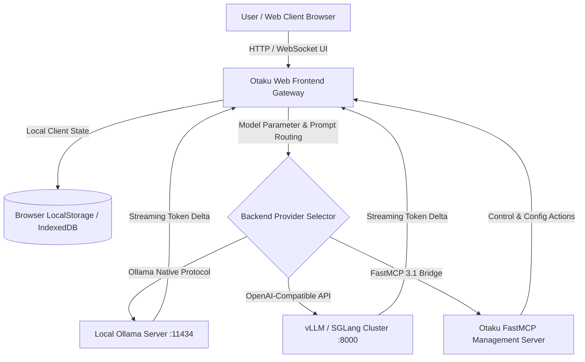

# Otaku

## What it is
Otaku is an open-source, ultra-lightweight web interface and client management environment designed specifically for local and self-hosted Large Language Model (LLM) interaction. Built with modern web frameworks and optimized for zero-latency UI reactivity, Otaku provides an intuitive workspace for real-time chat sessions, token streaming visualization, model parameter tuning, context inspection, and multi-backend connection routing across distributed homelab inference runtimes (including Ollama, vLLM, llama.cpp, SGLang, and LiteLLM).



## What problem it solves
Managing multiple local AI models distributed across heterogenous hardware endpoints (such as dedicated GPU servers, Mac Studio Unified Memory nodes, or edge ARM clusters) frequently requires navigating fragmented web portals, CLI terminals, or single-backend UIs. Standard monolithic chat frontends often enforce rigid database dependencies, external telemetry, or complex multi-container orchestration. Otaku addresses these pain points by offering a client-side execution workspace that connects directly to multiple local inference provider endpoints while retaining all session history, system prompts, and configuration parameters strictly within local client storage.

## Where it fits in the stack
**AI & Knowledge / Model Frontends & Client Interfaces**. Otaku serves as the primary user-facing workspace and interactive control plane bridging end users, autonomous agent operators, and local inference runtimes deployed within private networks and homelab environments.

## Typical use cases
- **Self-Hosted AI Chat Workspace**: Providing a fast, responsive chat interface across desktop and mobile browsers within private local area networks (LAN).
- **Multi-Backend Benchmarking & Model Evaluation**: Seamlessly switching between local inference backends (e.g., comparing Ollama Llama 3.3 vs. vLLM DeepSeek-R1) to evaluate latency, throughput, and context retention.
- **System Prompt Library Management**: Organizing, categorizing, and injecting custom system prompts for specialized tasks such as code refactoring, technical documentation synthesis, and data translation.
- **FastMCP 3.1 Agent UI Control**: Serving as a client interface where agentic workflows surface interactive chat state and tool execution logs.

## Strengths
- **100% Local Privacy & Zero Telemetry**: Chat histories, prompt templates, and API tokens remain stored exclusively inside client browser storage without remote tracking or telemetry.
- **Flexible Multi-Provider Gateway**: Native support for connecting multiple concurrent backends (Ollama APIs, vLLM OpenAI-compatible endpoints, LiteLLM routers) simultaneously.
- **Ultra-Lightweight Resource Footprint**: Negligible CPU and memory overhead compared to heavier monolithic multi-tenant web platforms.
- **Responsive Markdown & Code Highlighting**: Rich rendering of code blocks, LaTeX mathematical expressions, and inline Markdown tables.

## Limitations
- **Multi-User Permission Model**: Focused primarily on single-user or family homelab environments without enterprise multi-tenant Role-Based Access Control (RBAC).
- **Built-in Vector RAG Ingestion**: Does not package an embedded vector database pipeline; relies on external API backends or MCP servers for vector retrieval.
- **Ecosystem Maturity**: Newer frontend tool relative to long-standing projects like Open WebUI or LibreChat.

## When to use it
- When requiring a clean, instant-loading web interface for self-hosted LLM endpoints with minimal deployment complexity.
- When managing multiple local inference runtimes (Ollama, vLLM, llama.cpp) from a single unified UI.
- When privacy and zero-telemetry client-side storage are paramount requirements.

## When not to use it
- When requiring enterprise SSO, strict multi-tenant access control, or built-in complex document indexing pipelines (consider Open WebUI or LibreChat).
- When requiring an all-in-one desktop binary that packages local model execution and GPU management inside the application installer (consider LM Studio or Jan.ai).

## Getting started

### Installation & Docker Deployment
Deploy Otaku locally using Node.js or run as a lightweight container:

```bash
# Clone the repository
git clone https://github.com/otaku-ui/otaku.git
cd otaku

# Install dependencies and start development server
npm install
npm run dev
```

Deploying via Docker with environment variables pre-configured for local Ollama endpoints:

```bash
docker run -d \
  --name otaku-ui \
  -p 3000:3000 \
  -e OLLAMA_BASE_URL=http://host.docker.internal:11434 \
  -e DEFAULT_MODEL=llama3.3 \
  otaku/otaku-ui:latest
```

## CLI examples

### 1. Pre-Flight Connectivity Check for Local Backends
Verify API responsiveness of local Ollama and vLLM endpoints prior to registering in Otaku:

```bash
# Check local Ollama model inventory
curl -s http://localhost:11434/api/tags | jq '.models[].name'

# Check local vLLM OpenAI-compatible endpoint health
curl -s http://localhost:8000/v1/models | jq .
```

### 2. Launch Otaku Production Build on Custom Port
Run the compiled Node.js server bound to host network interfaces:

```bash
HOST=0.0.0.0 PORT=3000 NEXT_PUBLIC_API_URL=http://192.168.1.100:11434 node server.js
```

## API examples

### Python FastMCP 3.1 & Pydantic v2 Otaku Management Integration
The following snippet demonstrates building a FastMCP 3.1 server that manages Otaku client configurations and validates multi-provider endpoints with Pydantic v2:

```python
import json
from typing import List, Optional
from pydantic import BaseModel, ConfigDict, Field, HttpUrl
from mcp.server.fastmcp import FastMCP

# Define Pydantic v2 models for Otaku workspace configuration
class ProviderEndpoint(BaseModel):
    model_config = ConfigDict(extra="forbid")

    name: str = Field(..., description="Display label for the inference provider.")
    base_url: HttpUrl = Field(..., description="HTTP endpoint URL for Ollama or vLLM server.")
    api_key: Optional[str] = Field(default=None, description="Optional bearer token for authenticated endpoints.")
    provider_type: str = Field(default="ollama", description="Provider protocol type ('ollama' or 'openai').")

class OtakuWorkspaceConfig(BaseModel):
    model_config = ConfigDict(extra="forbid")

    workspace_name: str = Field(..., description="Name of the Otaku user workspace.")
    active_model: str = Field(..., description="Default selected model identifier.")
    temperature: float = Field(default=0.7, ge=0.0, le=2.0, description="Sampling temperature.")
    max_tokens: int = Field(default=4096, ge=128, le=32768, description="Maximum token completion limit.")
    system_prompt: Optional[str] = Field(default=None, description="Global system prompt override.")
    endpoints: List[ProviderEndpoint] = Field(default_factory=list, description="Configured inference backends.")

class UpdateWorkspaceResponse(BaseModel):
    status: str = Field(..., description="Operation status indicator.")
    active_model: str = Field(..., description="Updated active model ID.")
    endpoint_count: int = Field(..., description="Total active provider endpoints.")

# Initialize FastMCP 3.1 server
mcp = FastMCP("otaku-workspace-manager")

@mcp.tool()
async def configure_otaku_workspace(config: OtakuWorkspaceConfig) -> UpdateWorkspaceResponse:
    """Configures Otaku workspace provider endpoints and model defaults using validated Pydantic v2 schemas."""
    # Write configuration payload to local workspace state file
    with open("/tmp/otaku_workspace_config.json", "w") as f:
        f.write(config.model_dump_json(indent=2))

    return UpdateWorkspaceResponse(
        status="configured",
        active_model=config.active_model,
        endpoint_count=len(config.endpoints)
    )

if __name__ == "__main__":
    mcp.run()
```

## Related tools / concepts
- [Open WebUI](../../services/open-webui.md) — Feature-rich multi-tenant web interface for Ollama and local LLMs.
- [LibreChat](../ai_knowledge/librechat.md) — Open-source web workspace supporting multimodal models and assistants.
- [Ollama](../../services/ollama.md) — Lightweight local LLM inference runner.
- [vLLM](../infrastructure/vllm.md) — High-throughput distributed LLM serving engine.
- [LM Studio](../infrastructure/lm-studio.md) — Desktop application for local LLM discovery and inference.

## Sources / references
- [Otaku UI GitHub Repository](https://github.com/otaku-ui/otaku)
- [Otaku LLM Frontend Community Discussion](https://www.reddit.com/r/LocalLLaMA/comments/1w85blf/otaku_an_llm_frontend/)

## Contribution Metadata
- Last reviewed: 2027-01-07
- Confidence: high
