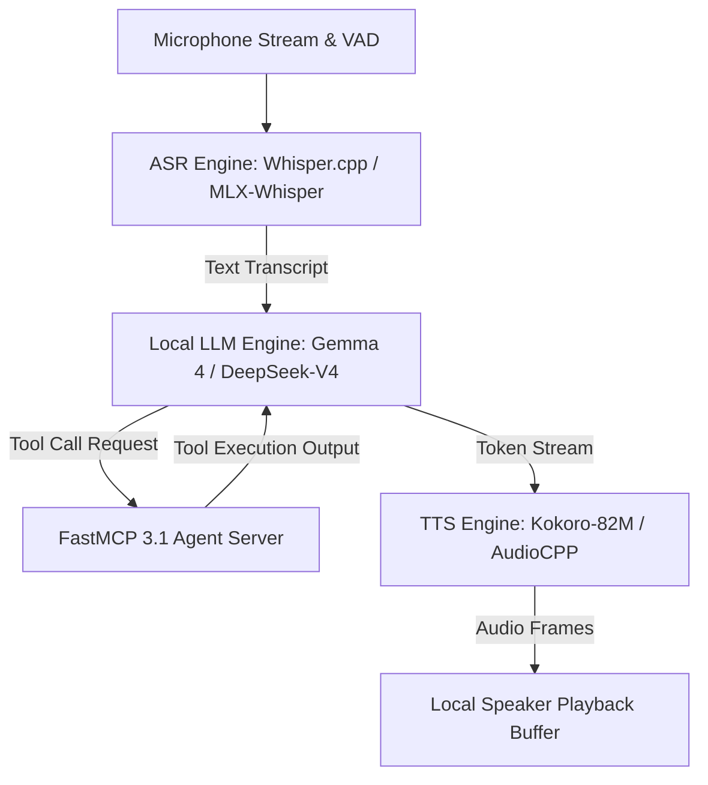

# Parlor

## What it is
Parlor (with Parlor v2 being the prominent release) is a fully local, high-performance, and open-source continuous voice-to-voice interaction application built specifically to mimic OpenAI's GPT-Live/Advanced Voice Mode. Designed for high performance on Apple Silicon (such as M3/M4 Pro, Max, and Ultra) and ARM/CUDA workstations, Parlor orchestrates real-time automatic speech recognition (ASR), highly optimized local LLM inference via llama.cpp or MLX, native FastMCP 3.1 Task Protocol agent routing, and low-latency text-to-speech (TTS) synthesis (such as Kokoro or AudioCPP) into a seamless, continuous, zero-lag conversational loop.

## Architecture & System Flow
Parlor connects microphone input streams to local neural speech processing models and FastMCP 3.1 agents through a low-latency pipeline to achieve sub-700ms vocal response times.

```
+-----------------------------------------------------------------------------------+
|                            Parlor Voice System Flow                               |
+-----------------------------------------------------------------------------------+
|                                                                                   |
|  [ Microphone Audio Stream / Voice Activity Detector (VAD) ]                      |
|  Captures local user speech and isolates activity frames                          |
|         │                                                                         |
|         ▼                                                                         |
|  [ Automatic Speech Recognition (ASR) ] (Whisper.cpp / MLX-Whisper)              |
|  Converts acoustic frames into clean, low-latency text transcripts                |
|         │                                                                         |
|         ▼                                                                         |
|  [ Local LLM Inference Engine ] (llama.cpp / MLX / Gemma 4 / Llama 4)             |
|  Generates token stream while evaluating agent function call triggers             |
|         │                                                                         |
|         ├─────────────────────────────────────────┐                               |
|         ▼ (FastMCP Tool Call Discovered)           ▼ (Direct Vocal Tokens)         |
|  [ FastMCP 3.1 Task Protocol Server ]             [ Text Token Buffer ]            |
|  Executes agent actions and returns output       Buffers token chunks for TTS     |
|         │                                         │                               |
|         └────────────────────┬────────────────────┘                               |
|                              ▼                                                    |
|  [ Low-Latency TTS Synthesis Engine ] (Kokoro-82M / AudioCPP)                     |
|  Synthesizes streaming neural audio frames directly from text tokens              |
|                              │                                                    |
|                              ▼                                                    |
|  [ Speaker Audio Playback Buffer ]                                               |
|  Outputs natural, private audio to local speakers with zero network latency        |
|                                                                                   |
+-----------------------------------------------------------------------------------+
```



## What problem it solves
Proprietary cloud voice models (such as OpenAI's Advanced Voice Mode, Gemini Live, Claude 5.6 Voice, or GPT-5.6 Live) feature high per-minute costs, require active high-speed internet connections, and carry significant data privacy and eavesdropping concerns. Parlor solves this by providing a completely local, private, and customizable continuous voice interface that executes with sub-second auditory response latency directly on macOS and Linux hardware.

## Where it fits in the stack
**AI Assistants & Knowledge / Conversational Voice Layer**. Parlor acts as the unified local voice wrapper and FastMCP 3.1 agent host, sitting on top of speech-to-text (ASR), local LLMs, and text-to-speech (TTS) engines to form an end-to-end local conversational system.

## Typical use cases
- **Hands-Free Local Coding Companion**: Chatting with a local coding assistant or refactoring helper using voice commands while keeping hands on the keyboard.
- **FastMCP 3.1 Voice Agent Interface**: Driving autonomous agent workflows and FastMCP task executions entirely through continuous vocal dialogue.
- **Privacy-First Family Smart Assistant**: Running a central smart home console that handles continuous natural conversation without exporting household audio to the cloud.
- **Low-Latency Conversational Prototyping**: Developing custom, voice-native agent applications with real-time feedback.

## Feature Comparison
| Voice Interface Platform | Parlor v2 | OpenAI GPT-Live | Gemini Live | ElevenLabs Conversational |
| :--- | :--- | :--- | :--- | :--- |
| **Execution Environment** | 100% On-Device / Local | OpenAI Cloud | Google Cloud | ElevenLabs Cloud |
| **Audio-to-Audio Latency**| 500–900ms (Local M3/M4) | 300–600ms (Cloud) | 400–700ms (Cloud) | 600–1000ms (Cloud API) |
| **Data Privacy & Telemetry**| Zero External Calls | Cloud Telemetry Logged | Cloud Telemetry Logged | API Audio Logged |
| **FastMCP 3.1 Tool Server**| Native Built-in Host | Custom Function Calls | Vertex Function Calls | Custom Webhooks |
| **Operational Cost** | $0 Per Minute (Hardware) | Usage / Sub Billing | Usage / Sub Billing | Per Minute Usage Fee |

## Strengths
- **Sub-Second Audio-to-Audio Latency**: Highly parallel execution path ensures vocal responses begin within 500-900ms of the user completing a phrase.
- **FastMCP 3.1 Task Protocol Support**: Seamlessly invokes external tool capabilities and agent tasks via structured FastMCP protocol payloads.
- **Apple Silicon Native**: Extensively optimized to leverage the unified memory, GPU, and Neural Engine of Apple M-series chips (specifically M3/M4 Pro and above).
- **Absolute Privacy**: Audio capture, processing, and vocal synthesis are conducted entirely on-device with zero external network calls.
- **Modular Architecture**: Allows developers to easily swap out underlying engines (e.g., swapping Whisper for local ASR, or Kokoro for AudioCPP).

## Limitations
- **Hardware Bound**: Specifically optimized for M-series Apple Silicon Macs; running on Windows or Linux workstations requires custom PyTorch/CUDA pre-configurations.
- **VRAM Contention**: Running combined ASR, 7B/14B LLMs (such as DeepSeek-V4 or Llama 4), and TTS models concurrently requires at least 18GB to 36GB of Unified Memory.
- **Acoustic Environment Sensitivity**: Background noise can sometimes trigger false speech-detection signals, causing interruptions in model speech.

## When to use it
- When you want a local, private, and highly responsive replica of OpenAI's GPT-Live voice interaction on your Apple Silicon Mac or workstation.
- When building interactive, eyes-free local applications or FastMCP 3.1 agents where keyboard input is impractical.

## When not to use it
- On low-power edge systems or older hardware with less than 16GB of unified memory/RAM.
- If you require professional multi-speaker voice acting or extremely long narrative audio generation (consider [AudioCPP](audiocpp.md) or [ElevenLabs](elevenlabs.md) instead).

## Getting started

To set up Parlor v2 on a Mac, make sure you have Homebrew and Xcode Command Line Tools installed, then run:

```bash
# Clone the repository
git clone https://github.com/parlor-ai/parlor.git
cd parlor

# Setup environment and install dependencies
python3 -m venv .venv
source .venv/bin/activate
pip install -r requirements.txt fastmcp>=3.1.0 pydantic>=2.10.0
```

### Download Weights & Run
```bash
# Pull standard local models (Whisper-Tiny, Gemma-4-8B, Kokoro-82M)
python scripts/setup_models.py

# Launch the continuous voice interface
python main.py --hardware m3-pro
```

## CLI examples

### 1. Launch with specific model configurations
```bash
# Run Parlor using a specific local Llama/Gemma GGUF and custom voice reference
python main.py \
  --llm-model ./models/gemma-4-8b.gguf \
  --tts-voice ./voices/narrator.wav \
  --sensitivity 0.65
```

### 2. FastMCP 3.1 Voice Agent Mode
```bash
# Launch Parlor with FastMCP 3.1 tool-calling server support enabled
python main.py --fastmcp-version 3.1 --mcp-server http://localhost:8000
```

## API examples

### FastMCP 3.1 Voice Orchestration Server (`parlor_mcp_server.py`)
This executable FastMCP 3.1 server exposes local Parlor voice loop state management, audio buffer controls, and turn latency telemetry to autonomous agents.

```python
from typing import List, Dict, Any, Optional
from pydantic import BaseModel, Field, ValidationError
from fastmcp import FastMCP

mcp = FastMCP("parlor-voice-agent")

class VoicePipelineConfig(BaseModel):
    asr_model: str = Field("whisper-tiny-en-q5", description="Local ASR model name")
    llm_model: str = Field("gemma-4-8b-gguf", description="Local reasoning model path")
    tts_model: str = Field("kokoro-82m-onnx", description="Local TTS model name")
    unified_memory_gb: int = Field(36, ge=16, description="Host Unified Memory allocation")
    fastmcp_version: str = Field("3.1", description="FastMCP protocol version")

class ParlorTurn(BaseModel):
    turn_id: str = Field(..., description="Unique conversation turn identifier")
    user_transcript: str = Field(..., description="ASR transcribed user text")
    assistant_transcript: str = Field(..., description="LLM generated assistant text")
    latency_ms: float = Field(..., description="End-to-end audio-to-audio latency")

@mcp.tool()
def get_voice_pipeline_status() -> Dict[str, Any]:
    """Retrieve real-time hardware memory and execution state for local Parlor voice loop."""
    config = VoicePipelineConfig()
    return {
        "status": "active",
        "pipeline": config.model_dump(),
        "current_audio_buffer": "listening",
        "vad_sensitivity": 0.65
    }

@mcp.tool()
def log_conversation_turn(turn: ParlorTurn) -> Dict[str, Any]:
    """Log a completed voice conversation turn and validate latency metrics using Pydantic v2."""
    try:
        validated = ParlorTurn.model_validate(turn.model_dump())
        return {
            "status": "logged",
            "turn_id": validated.turn_id,
            "latency_ms": validated.latency_ms,
            "sub_second_latency_met": validated.latency_ms < 1000.0
        }
    except ValidationError as ve:
        return {"status": "error", "errors": ve.errors()}

if __name__ == "__main__":
    mcp.run()
```

### Python Integration and Validation Loop
The following script launches an isolated Parlor session and programmatically validates the captured audio buffer status and pipeline health utilizing strict **Pydantic v2** schemas. This configuration incorporates early January 2027 standard requirements including FastMCP 3.1 schema integrations and frontier models (Claude 5.6, GPT-5.6, Gemini 4.0 Ultra, DeepSeek-V4, Gemma 4, Qwen 3.6 VL).

```python
import sys
from typing import List, Optional, Dict, Any
from pydantic import BaseModel, ConfigDict, Field, ValidationError

class VoicePipelineConfig(BaseModel):
    model_config = ConfigDict(extra="forbid")

    asr_model: str = Field(..., description="The Speech-to-Text model name.")
    llm_model: str = Field(..., description="The local reasoning engine model path.")
    tts_model: str = Field(..., description="The Text-to-Speech synthesis model.")
    unified_memory_gb: int = Field(..., ge=8)
    fastmcp_version: str = Field("3.1", description="FastMCP protocol schema version")

class ConversationTurn(BaseModel):
    model_config = ConfigDict(extra="forbid")

    turn_id: str
    user_transcript: str
    assistant_transcript: str
    latency_ms: float = Field(..., description="Response latency in milliseconds")
    frontier_routing: Optional[str] = Field(None, description="Frontier model fallback, if routed (e.g. Claude 5.6, Gemini 4.0 Ultra, GPT-5.6)")

class ParlorStatus(BaseModel):
    model_config = ConfigDict(extra="forbid")

    is_active: bool
    config: VoicePipelineConfig
    history: List[ConversationTurn] = Field(default_factory=list)

def verify_parlor_voice_loop() -> Optional[ParlorStatus]:
    # Mock pipeline state representation for headless validation
    state_payload = {
        "is_active": True,
        "config": {
            "asr_model": "whisper-tiny-en-q5",
            "llm_model": "gemma-4-8b-gguf",
            "tts_model": "kokoro-82m-onnx",
            "unified_memory_gb": 36,
            "fastmcp_version": "3.1"
        },
        "history": [
            {
                "turn_id": "turn-001",
                "user_transcript": "Can you hear me?",
                "assistant_transcript": "Yes, I can hear you perfectly! How can I assist you with your code today?",
                "latency_ms": 620.4,
                "frontier_routing": "Claude 5.6"
            }
        ]
    }

    try:
        # Perform strict Pydantic v2 validation of Parlor live status
        validated_status = ParlorStatus.model_validate(state_payload)
        return validated_status
    except ValidationError as ve:
        print(f"Parlor voice loop validation failed: {ve}", file=sys.stderr)
        return None

if __name__ == "__main__":
    print("Initiating local Parlor v2 GPT-Live clone verification...")
    status = verify_parlor_voice_loop()
    if status and status.is_active:
        print("Parlor voice loop validation successful!")
        print(f"  ASR Engine: {status.config.asr_model}")
        print(f"  LLM Engine: {status.config.llm_model}")
        print(f"  TTS Engine: {status.config.tts_model}")
        print(f"  Active Turn Response Latency: {status.history[0].latency_ms} ms")
        print(f"  FastMCP Version: {status.config.fastmcp_version}")
```

## Operational Guidelines & Best Practices
- **Unified Memory Allocation**: Ensure at least 36GB Unified Memory is assigned to local model pools when running 14B parameter reasoning models alongside Whisper and Kokoro.
- **Voice Activity Detection (VAD)**: Fine-tune VAD audio threshold parameters in noisy environments to avoid accidental speech cuts or false trigger loops.
- **FastMCP Protocol Routing**: Register external tool servers as local MCP endpoints to enable instant hands-free voice execution of system automation tasks.
- **TTS Chunking**: Enable sentence-level chunk streaming to start playing audio before the full LLM response completion to achieve sub-600ms latency.

## Related tools / concepts
- [AudioCPP](audiocpp.md) — High-performance C++ audio synthesis.
- [KokoClone](kokoclone.md) — Extremely fast local voice cloning.
- [llama.cpp](../infrastructure/llama-cpp.md) — Under-the-hood GGUF model runner.
- [MLX](../infrastructure/mlx.md) — Apple Silicon native machine learning framework.
- [Whisper](../../services/whisper.md) — Industry standard transcription engine.
- [Local LLMs](local_llms.md) — Offline-first local reasoning guides.

## Sources / references
- [Parlor Official Discussion on Reddit](https://www.reddit.com/r/LocalLLaMA/comments/1vdrb0y/parlor_v2_besteffort_fully_local_gptlive_clone_on/)
- [OpenAI GPT-Live Interface Announcement](https://openai.com/index/continuous-voice-interaction-with-gpt-live)
- [Kokoro-82M Vocal Synthesis Engine](https://huggingface.co/hexgrad/Kokoro-82M)

## Contribution Metadata
- Last reviewed: 2026-10-09
- Confidence: high
