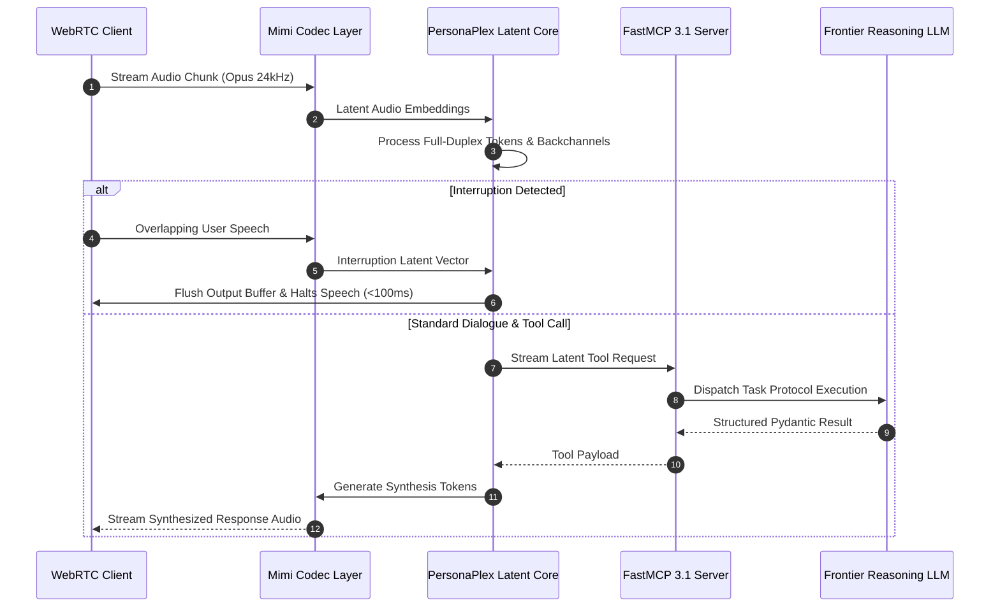

# NVIDIA PersonaPlex

## What it is
NVIDIA PersonaPlex is a state-of-the-art, real-time, full-duplex speech-to-speech conversational framework designed for low-latency, highly interactive conversational AI applications. As of early 2027, PersonaPlex serves as the enterprise standard for full-duplex spoken interfaces, operating natively alongside **FastMCP 3.1** and the **MCP 3.0 Task Protocol**. It enables human-like conversations where both the agent and user can speak simultaneously, manage mid-sentence interruptions, transmit subtle vocal backchannels, and preserve complex brand personas without relying on cascaded text-based intermediate pipeline hops.

## What problem it solves
Traditional voice AI systems rely on cascading multiple independent subsystems: Speech-to-Text (STT) transcription (e.g., Whisper), text processing via Large Language Models (LLMs), and Text-to-Speech (TTS) synthesis (e.g., ElevenLabs or Coqui). This serialized architecture introduces significant latency penalties (often 1,500ms to 3,000ms), destroys vocal inflection and paralinguistic nuance, and prevents natural conversational dynamics such as spontaneous interruptions or empathetic backchanneling ("mhm", "I see", "go on").

PersonaPlex eliminates the robotic delay of serialized pipelines by processing direct continuous streaming audio frames through an end-to-end multimodal latent transformer architecture. Achieving sub-150ms round-trip latency on NVIDIA Blackwell infrastructure, PersonaPlex provides fluid full-duplex interaction connected directly to frontier models including [Claude 5.6](../ai_knowledge/claude.md), [GPT-5.6](../ai_knowledge/openai.md), [Gemini 4.0 Ultra](../ai_knowledge/gemini.md), DeepSeek-V4, Qwen 3.6 VL, and [Gemma 4](local_llms.md).

## Where it fits in the stack
**Category**: AI Assistants & Knowledge / Voice AI & Full-Duplex Multimodal Infrastructure.

```
+-----------------------------------------------------------------------+
|                         User Audio Client                             |
|               (WebRTC / WebSockets / Opus Streams)                    |
+-----------------------------------------------------------------------+
                                   |
                                   v
+-----------------------------------------------------------------------+
|                       NVIDIA PersonaPlex                              |
|  +---------------------------+     +-------------------------------+  |
|  |   Mimi 24kHz Codec        |     |   Full-Duplex Latent Core     |  |
|  |   (Continuous Encoder)    | <-> |   (Audio Token Transformer)   |  |
|  +---------------------------+     +-------------------------------+  |
|                |                                   |                  |
|                v                                   v                  |
|  +---------------------------+     +-------------------------------+  |
|  |   Persona Conditioning    |     |   Interruption & Reflex Core  |  |
|  |   (128-dim Voice Vector)  |     |   (Sub-150ms Cancellation)    |  |
|  +---------------------------+     +-------------------------------+  |
+-----------------------------------------------------------------------+
                                   |
                                   v
+-----------------------------------------------------------------------+
|                   FastMCP 3.1 / Agentic Core                          |
|         (Tool Calling, RAG, Structured Pydantic V2 Execution)        |
+-----------------------------------------------------------------------+
```

Sitting between the incoming raw WebRTC audio stream and the semantic agentic core, PersonaPlex acts as the continuous vocal interface layer, converting latent audio tokens directly into actionable tool invocations and backchannel responses.

## System Architecture & Sequence Flow
The following sequence diagram illustrates the full-duplex audio pipeline in PersonaPlex, showcasing continuous audio frame tokenization, latent interruption detection, FastMCP 3.1 tool execution, and synchronous audio frame generation.



## Typical use cases
- **Crisis Response & Emergency Services**: High-stress voice interfaces where callers speak rapidly, overlap speech, or cut off guidance to provide urgent location updates.
- **Interactive Educational Avatars**: Real-time voice tutors capable of being interrupted mid-explanation when a student asks for immediate clarification or math step re-evaluation.
- **Enterprise Brand Ambassadors**: Customer support and sales voice avatars configured with custom 128-dimensional acoustic embeddings matching corporate vocal guidelines.
- **Multi-Agent Conversational Simulation**: Multi-agent environments where multiple synthetic voice personas converse naturally in virtual audio spaces using FastMCP 3.1 coordination.

## Strengths
- **Native Full-Duplex Processing**: Simultaneously ingests input audio tokens while emitting output audio tokens, enabling real-time zero-shot interruption handling.
- **Fine-Grained Hybrid Persona Control**: System state is steered simultaneously through structural text system prompts and 128-dimensional voice embeddings extracted from 5-second acoustic reference files.
- **Sub-150ms Reflexive Latency**: Deeply optimized for NVIDIA Blackwell architectures (B200, GB200 NVL72), generating immediate reflexive backchannels ("mm-hmm", "oh", "right") during user pauses.
- **Mimi 24kHz Neural Codec**: Uses the high-efficiency Mimi neural codec to encode and decode multi-band audio at low bandwidth with minimal compression artifacts.
- **Model-Agnostic Integration**: Natively interfaces with FastMCP 3.1 servers and reasoning engines including Claude 5.6, GPT-5.6, Gemini 4.0 Ultra, DeepSeek-V4, and Gemma 4.

## Limitations
- **High Compute Demands**: Requires modern NVIDIA GPUs (H100, H200, B200) with sufficient VRAM to maintain full-duplex continuous frame buffers in real time.
- **Network Sensitivity**: Demands stable WebRTC or WebSocket connections; severe packet jitter can degrade full-duplex synchronization.
- **Complex Telemetry Debugging**: Debugging full-duplex latent token flows is significantly more complex than inspecting raw text logs in standard text pipelines.

## When to use it
- When low latency, fluid conversational timing, and natural interruption handling are paramount.
- When creating branded digital twins requiring exact voice identity preservation across long interactive sessions.
- When building voice agents that must perform live tool execution without breaking conversational rhythm.

## When not to use it
- For asynchronous batch processing or offline audio transcription where latency is irrelevant.
- In low-bandwidth text-only environments or on client hardware lacking dedicated GPU acceleration.
- For simple voice query systems where basic push-to-talk turn-taking is acceptable.

## Getting started

### Environment Requirements
PersonaPlex requires system-level audio dependencies (`libopus`), Python 3.11+, and CUDA 12.8 running on NVIDIA GPU hardware.

```bash
# Install Ubuntu/Debian system dependencies
sudo apt-get update && sudo apt-get install -y libopus-dev ffmpeg

# Clone the repository and setup Python environment
git clone https://github.com/NVIDIA/personaplex.git
cd personaplex
pip install -r requirements.txt pydantic>=2.10.0 fastmcp>=3.1.0
```

### Running the Full-Duplex WebUI Sandbox
```bash
# Launch the local WebRTC sandbox server on GPU 0
python -m personaplex.web_ui \
  --model-path nvidia/personaplex-7b-v1 \
  --precision bf16 \
  --port 8080 \
  --device cuda:0
```

## CLI examples

```bash
# 1. Generate a 128-dimensional voice embedding vector from a short WAV reference
python -m personaplex.tools.encode_voice \
  --input reference_voice.wav \
  --output ./personas/executive_persona.pt

# 2. Start a continuous full-duplex audio stream CLI session connected to a local server
python -m personaplex.cli \
  --mic \
  --server-url ws://localhost:8080/stream \
  --voice ./personas/executive_persona.pt \
  --allow-interruptions

# 3. Execute latency and backchannel response benchmarks
python -m personaplex.benchmarks.full_duplex_latency \
  --iterations 100 \
  --sample-rate 24000 \
  --report-json latency_results.json
```

## API examples

### FastMCP 3.1 Full-Duplex Voice Server Implementation
The following code demonstrates a complete **FastMCP 3.1** server integrating NVIDIA PersonaPlex session lifecycle management, tool dispatch, and live vocal state telemetry using **Pydantic v2**.

```python
import asyncio
from typing import Dict, Any, List, Optional
from pydantic import BaseModel, Field, field_validator
from fastmcp import FastMCP

# Initialize FastMCP 3.1 Server
mcp = FastMCP(
    name="PersonaPlex Voice Bridge",
    version="3.1.0",
    description="FastMCP server managing PersonaPlex full-duplex session states and audio tool calls"
)

class VoiceSessionSpec(BaseModel):
    session_id: str = Field(..., alias="sessionId", description="Unique UUID for the voice session")
    system_prompt: str = Field(..., alias="systemPrompt", min_length=20, description="Base persona behavior definition")
    voice_embedding_path: str = Field(..., alias="voiceEmbedding", description="Path to .pt voice embedding file")
    sample_rate_hz: int = Field(default=24000, alias="sampleRate")
    latency_mode: str = Field(default="ultra_low", alias="latencyMode")
    enable_interruptions: bool = Field(default=True, alias="enableInterruptions")

    @field_validator("sample_rate_hz")
    @classmethod
    def check_sample_rate(cls, v: int) -> int:
        if v not in {16000, 24000, 48000}:
            raise ValueError("Sample rate must be 16000, 24000, or 48000 Hz")
        return v

    @field_validator("latency_mode")
    @classmethod
    def check_latency_mode(cls, v: str) -> str:
        allowed = {"ultra_low", "balanced", "high_fidelity"}
        if v not in allowed:
            raise ValueError(f"Latency mode must be one of {allowed}")
        return v

class AudioTelemetry(BaseModel):
    session_id: str
    roundtrip_latency_ms: float = Field(..., ge=0.0)
    interruption_count: int = Field(default=0, ge=0)
    backchannels_emitted: int = Field(default=0, ge=0)
    active_mcp_tool: Optional[str] = None

# In-memory session tracking store
ACTIVE_SESSIONS: Dict[str, Dict[str, Any]] = {}

@mcp.tool(name="initialize_voice_session", description="Initializes a new full-duplex PersonaPlex voice session")
async def initialize_voice_session(spec_payload: Dict[str, Any]) -> Dict[str, Any]:
    spec = VoiceSessionSpec.model_validate(spec_payload)

    ACTIVE_SESSIONS[spec.session_id] = {
        "spec": spec,
        "status": "active",
        "interruption_count": 0,
        "backchannels_emitted": 0,
    }

    return {
        "status": "success",
        "session_id": spec.session_id,
        "websocket_endpoint": f"ws://localhost:8080/stream/{spec.session_id}",
        "config": spec.model_dump(by_alias=True)
    }

@mcp.tool(name="record_interruption_event", description="Logs a user interruption event and updates stream state")
async def record_interruption_event(session_id: str, elapsed_ms: float) -> Dict[str, Any]:
    if session_id not in ACTIVE_SESSIONS:
        return {"status": "error", "message": f"Session {session_id} not found"}

    session = ACTIVE_SESSIONS[session_id]
    session["interruption_count"] += 1

    telemetry = AudioTelemetry(
        session_id=session_id,
        roundtrip_latency_ms=elapsed_ms,
        interruption_count=session["interruption_count"],
        backchannels_emitted=session["backchannels_emitted"],
        active_mcp_tool="record_interruption_event"
    )

    return {
        "status": "interruption_processed",
        "action": "flush_audio_queue",
        "telemetry": telemetry.model_dump()
    }

if __name__ == "__main__":
    mcp.run()
```

## Related tools / concepts
- [Synthesia](synthesia.md) — Video-based avatar generation platform.
- [FastMCP 3.1](../automation_orchestration/mcp.md) — Fast Model Context Protocol server framework.
- [Gemini](../ai_knowledge/gemini.md) — Google multimodal reasoning platform.
- [Local LLMs](local_llms.md) — On-device and self-hosted open model engines.
- [Claude](../ai_knowledge/claude.md) — Anthropic reasoning models powering conversational depth.

## Sources / references
- [NVIDIA PersonaPlex Technical Research Blog](https://research.nvidia.com/labs/adlr/personaplex/)
- [PersonaPlex: Full-Duplex Conversational AI (ArXiv 2602.06053)](https://arxiv.org/abs/2602.06053)
- [NVIDIA Official GitHub Repository](https://github.com/NVIDIA/personaplex)
- [FastMCP 3.1 Specification & MCP 3.0 Protocol](https://modelcontextprotocol.io)

---
## Contribution Metadata
- Last reviewed: 2027-01-07
- Confidence: high
