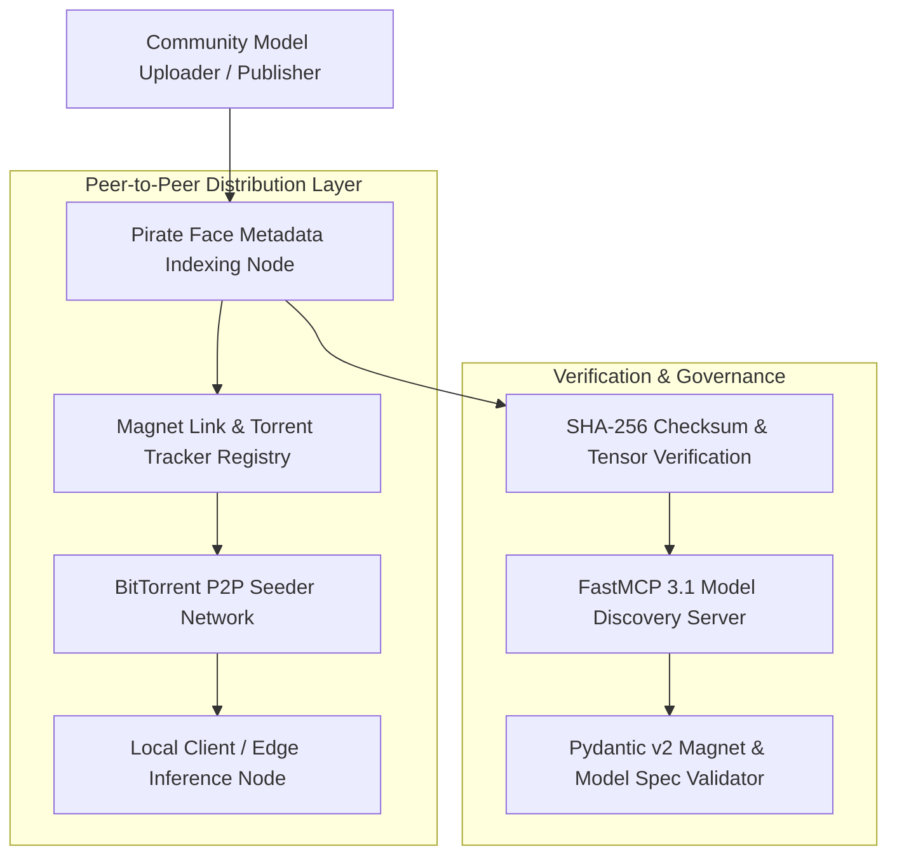
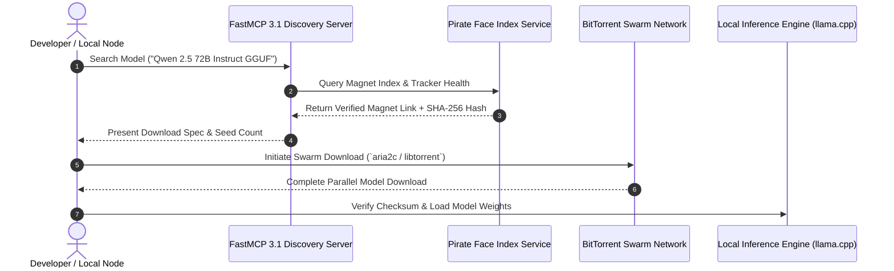

# Pirate Face

## What it is
**Pirate Face** (often referenced as the "Pirate Bay for LLMs") is an open community-driven model indexing and torrent-based distribution network designed for open-weights artificial intelligence models, datasets, and LoRA adapters. Operating within the decentralized AI ecosystem in early 2027, Pirate Face provides P2P (peer-to-peer) metadata indexing, Magnet link aggregation, and cryptographic checksum verification for open-weights AI artifacts.

By indexing GGUF, EXL2, Safetensors, and AWQ model quantizations alongside BitTorrent metadata trackers, Pirate Face offers a high-availability fallback distribution layer for large model releases, mitigating single-point-of-failure risks associated with centralized model hubs.



## What problem it solves
Distributing open-weights AI models at scale introduces infrastructure, cost, and availability bottlenecks:
- **Bandwidth Throttling & Downtime**: Centralized model repositories experience severe bandwidth throttling or outages during high-profile frontier model releases.
- **Model Censorship & Delisting**: Open-source models or uncensored fine-tunes risk accidental or forced removal from single-provider model platforms.
- **Large Artifact Transfer Latency**: Downloading multi-gigabyte (or terabyte) model weights over single-server HTTP streams is inefficient compared to multi-peer swarm protocols.
- **Tamper Risks**: Unverified P2P downloads can introduce compromised weights or arbitrary code execution vectors (e.g., non-Safetensors pickle files).

Pirate Face addresses these challenges by decentralizing artifact distribution via BitTorrent swarms, strictly validating SHA-256 checksums and Safetensors headers, and exposing standardized search APIs via FastMCP 3.1 tool interfaces.

## Where it fits in the stack
**Category**: [AI Assistants & Knowledge](../ai_knowledge/index.md) / Decentralized Model Distribution & Indexing.

Pirate Face functions as an open discovery and alternative download protocol in local AI deployment pipelines:
- **Repository & Discovery Layer**: Indexes BitTorrent magnet links, GGUF/EXL2 quantization tiers, model metadata, and architecture tags.
- **Inference Pipeline Integration**: Connects with local inference runners (e.g. llama.cpp, vLLM, LM Studio, Ollama) to enable direct P2P model fetching.
- **Validation & Safety Layer**: Enforces Pydantic v2 schemas for magnet links, peer health stats, and cryptographic weight hashes.



## Typical use cases
- **High-Speed Decentralized Model Fetching**: Downloading multi-file GGUF / EXL2 quantizations using multi-tracker BitTorrent acceleration.
- **Resilient AI Operations**: Maintaining access to essential open-weight foundation models during cloud repository outages or region locks.
- **Community Fine-Tune Discovery**: Indexing niche community LoRA adapters, specialized quantizations, and domain-specific merged checkpoints.
- **Automated Local Model Management**: Using FastMCP 3.1 tools to query Pirate Face for updated torrent seed counts and automated weight updates.

## Strengths
- **Decentralized Resiliency**: Eliminates single-point-of-failure dependencies on centralized web hosts via P2P swarm distribution.
- **High Transfer Throughput**: Aggregates seed bandwidth across hundreds of global peers, saturating high-gigabit connections.
- **Cryptographic Integrity Verification**: Enforces mandatory SHA-256 checksums and Safetensors format checks to prevent malicious payload execution.
- **FastMCP 3.1 & API Ready**: Structured metadata interfaces enable automated agentic model searching and torrent downloading.

## Limitations
- **Swarm Seed Dependency**: Download speeds for low-demand or legacy model quantizations depend entirely on active peer seeders.
- **Network NAT Configuration**: Optimal P2P peer connectivity requires proper UPnP / NAT-PMP port forwarding or VPN configurations.

## When to use it
- When fetching large open-weights foundation models during global release spikes when central servers are throttled.
- When automating air-gapped or localized model mirroring infrastructure across distributed node clusters.
- When searching for community-generated model quantizations or uncensored fine-tunes not hosted on mainstream platforms.

## When not to use it
- When fetching commercial closed-source API models (e.g., OpenAI, Anthropic) accessible only via cloud endpoints.
- When operating in enterprise corporate networks where P2P BitTorrent protocols are strictly prohibited by network policy.

## Getting started

### 1. Searching Pirate Face via CLI
Use standard BitTorrent utilities or custom CLI scripts to query Pirate Face magnet links:

```bash
# Query model magnet links using curl and json parsing
curl -s "https://pirateface.ai/api/v1/search?q=qwen-72b-gguf" | jq '.'
```

### 2. Downloading via BitTorrent Client
Pass retrieved magnet links to `aria2c` or `transmission-cli`:

```bash
aria2c --seed-time=0 "magnet:?xt=urn:btih:EXAMPLE_HASH_1234567890ABCDEF..."
```

## CLI examples

### Inspecting Model Swarm Health
Check seeders, leechers, and hash verification status for a specific model torrent:

```bash
# Query torrent tracker health
curl -s "https://pirateface.ai/api/v1/torrent/EXAMPLE_HASH_1234567890ABCDEF/health"
```

## API examples

### FastMCP 3.1 Pirate Face Model Search Server
The following Python server implements a **FastMCP 3.1** gateway tool to search Pirate Face model torrents and return structured Pydantic v2 payloads:

```python
import hashlib
from typing import List, Optional, Dict, Any
from pydantic import BaseModel, Field
from fastmcp import FastMCP

mcp = FastMCP(
    "pirate-face-server",
    instructions="FastMCP 3.1 server for searching and validating Pirate Face open-weights model torrents."
)

class ModelSearchQuery(BaseModel):
    query: str = Field(..., description="Model name or architecture keyword (e.g. Qwen, Llama, GGUF)")
    quantization: Optional[str] = Field(None, description="Quantization filter (e.g. Q4_K_M, EXL2, FP16)")
    min_seeders: int = Field(default=1, ge=0, description="Minimum active seeders required")

class TorrentResultSpec(BaseModel):
    title: str = Field(..., description="Torrent title / model file name")
    magnet_uri: str = Field(..., description="BitTorrent Magnet URI string")
    sha256_hash: str = Field(..., description="Cryptographic SHA-256 weight checksum")
    file_size_gb: float = Field(..., ge=0.0)
    seeders: int = Field(..., ge=0)
    leechers: int = Field(..., ge=0)

@mcp.tool()
def search_pirate_face(search: ModelSearchQuery) -> Dict[str, Any]:
    """
    Search Pirate Face index for open-weights model torrents matching query parameters.
    """
    # Mock search demonstration payload
    mock_hash = hashlib.sha256(f"{search.query}:{search.quantization}".encode()).hexdigest()
    mock_torrent = TorrentResultSpec(
        title=f"{search.query.upper()}-{"Q4_K_M" if not search.quantization else search.quantization}.gguf",
        magnet_uri=f"magnet:?xt=urn:btih:{mock_hash[:40]}&dn={search.query}",
        sha256_hash=mock_hash,
        file_size_gb=24.5,
        seeders=48,
        leechers=5
    )

    return {
        "status": "success",
        "results": [mock_torrent.model_dump()]
    }

if __name__ == "__main__":
    mcp.run()
```

### Pydantic v2 Magnet & Torrent Spec Validation
Validate incoming Pirate Face magnet links and torrent metadata:

```python
import re
from pydantic import BaseModel, Field, field_validator

class PirateFaceMagnetSpec(BaseModel):
    title: str = Field(..., description="Model name")
    magnet_uri: str = Field(..., description="Full magnet URI")
    info_hash: str = Field(..., min_length=40, max_length=64, description="Torrent InfoHash")

    @field_validator("magnet_uri")
    @classmethod
    def validate_magnet_scheme(cls, v: str) -> str:
        if not v.startswith("magnet:?xt=urn:btih:"):
            raise ValueError("Invalid Magnet URI scheme; must start with magnet:?xt=urn:btih:")
        return v

if __name__ == "__main__":
    magnet = PirateFaceMagnetSpec(
        title="Llama-3.3-70B-Instruct-Q4_K_M",
        magnet_uri="magnet:?xt=urn:btih:a1b2c3d4e5f678901234567890abcdef12345678",
        info_hash="a1b2c3d4e5f678901234567890abcdef12345678"
    )
    print("Pirate Face Magnet Link Validated:")
    print(magnet.model_dump_json(indent=2))
```

## Related tools / concepts
- [Hugging Face](../providers/huggingface.md) — Centralized repository for models and datasets.
- [llama.cpp](../infrastructure/llama-cpp.md) — High-performance CPU/GPU inference engine for GGUF models.
- [vLLM](../../services/ollama.md) — High-throughput local LLM serving engine.
- [Local LLMs](local_llms.md) — Comprehensive guide to open-weights local model runtimes.

## Sources / References
- [Pirate Face LocalLLaMA Discussion](https://www.reddit.com/r/LocalLLaMA/comments/1wnxhji/pirate_face_pirate_bay_for_llms/)
- [BitTorrent Protocol Specification](https://www.bittorrent.org/beps/bep_0000.html)

---
## Contribution Metadata
- Last reviewed: 2027-01-07
- Confidence: high
